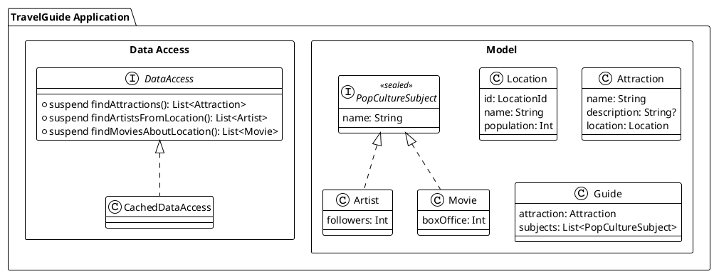
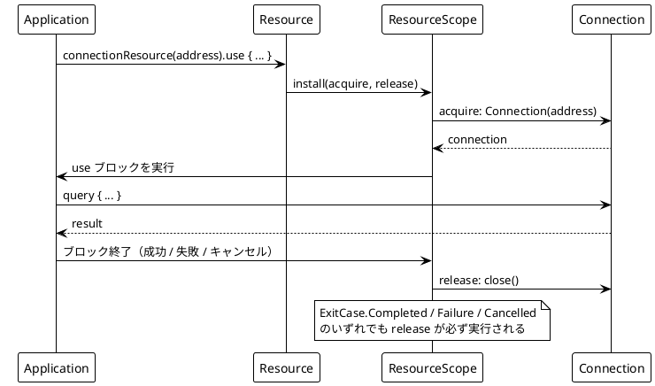
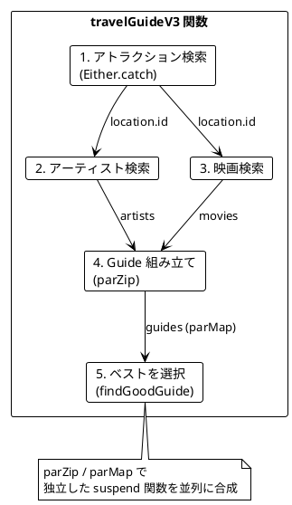
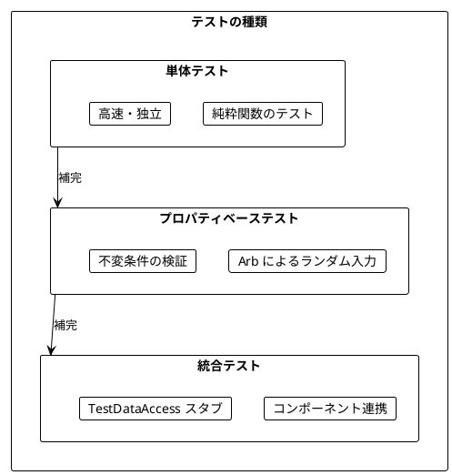
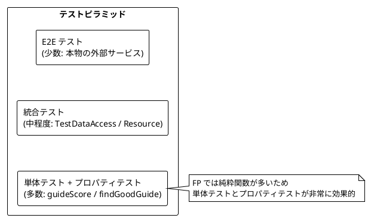
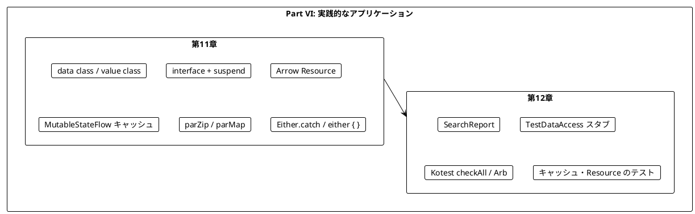
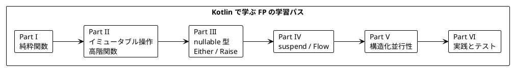

# Part VI: 実践的なアプリケーション構築とテスト

本章では、これまで学んだ関数型プログラミングの概念を統合し、実践的なアプリケーションを構築します。また、関数型プログラミングにおけるテスト戦略についても学びます。

Kotlin 版では、ドメインモデルを `data class` と `@JvmInline value class` で表現し、データアクセスを `suspend` 関数を持つ `interface` で抽象化します。リソース管理には Arrow の `Resource`、エラーハンドリングには `Either.catch` と `either { }` DSL、テストには Kotest の `checkAll` / `Arb` を使います。

---

## 第11章: 実践的なアプリケーション構築

### 11.1 TravelGuide アプリケーション

旅行ガイドアプリケーションを例に、実践的な FP アプリケーションの構築方法を学びます。アトラクション（観光地）の名前を受け取り、そのアトラクションがある場所にゆかりのあるアーティストや映画を集めて「旅行ガイド」を作ります。



### 11.2 ドメインモデルの定義

**ソースファイル**: `app/kotlin/src/main/kotlin/ch11/TravelGuide.kt`

```kotlin
/** ロケーション ID（実行時には String として扱われる value class） */
@JvmInline
value class LocationId(val value: String)

/** ロケーション（場所） */
data class Location(val id: LocationId, val name: String, val population: Int)

/** アトラクション（観光地）。説明は存在しないこともあるので nullable 型 */
data class Attraction(val name: String, val description: String?, val location: Location)

/** ポップカルチャーの題材 */
sealed interface PopCultureSubject {
    val name: String
}

/** アーティスト */
data class Artist(override val name: String, val followers: Int) : PopCultureSubject

/** 映画 */
data class Movie(override val name: String, val boxOffice: Int) : PopCultureSubject

/** 旅行ガイド */
data class Guide(val attraction: Attraction, val subjects: List<PopCultureSubject>)

/** 検索レポート（良いガイドが見つからなかった理由を報告する） */
data class SearchReport(val badGuides: List<Guide>, val problems: List<String>)

/** アトラクションの並び順 */
enum class AttractionOrdering { ByName, ByLocationPopulation }
```

Kotlin 固有のポイントは次の 3 つです。

- **`@JvmInline value class`**: `LocationId` は型としては `String` と区別されますが、実行時には多くの場合ボックス化されずに `String` のまま扱われます。Scala 3 の `opaque type` に近い役割で、「ID を人口や名前と取り違える」ミスをコンパイル時に防ぎます
- **nullable 型 `String?`**: Part III で学んだとおり、「説明がないかもしれない」ことを言語組み込みの null 安全で表現します。Java 版の `Option<String>` や Scala 版の `Option[String]` に相当します
- **`sealed interface` + `data class`**: `PopCultureSubject` は `Artist` か `Movie` のどちらかしかない代数的データ型（ADT）です。`when` 式で分岐すると、コンパイラが網羅性をチェックしてくれます

`data class` は `equals` / `hashCode` / `toString` / `copy` を自動生成します。`copy` を使うと、元の値を変えずに一部だけ異なる新しい値を作れます。

**ソースファイル**: `app/kotlin/src/test/kotlin/ch11/TravelGuideTest.kt`

```kotlin
test("PopCultureSubject は Artist と Movie のどちらかである") {
    val subjects: List<PopCultureSubject> = listOf(chrisLeDoux, hatefulEight)
    val kinds = subjects.map {
        when (it) {
            is Artist -> "artist"
            is Movie -> "movie"
        }
    }
    kinds shouldBe listOf("artist", "movie")
}
```

`when` に `else` がないことに注目してください。`PopCultureSubject` に新しいサブタイプを追加すると、この `when` はコンパイルエラーになり、対応漏れに気づけます。

### 11.3 データアクセス層の抽象化

外部データソース（原著では Wikidata の SPARQL エンドポイント）へのアクセスをインターフェースで抽象化します。

**ソースファイル**: `app/kotlin/src/main/kotlin/ch11/DataAccess.kt`

```kotlin
interface DataAccess {
    /** アトラクションを検索する */
    suspend fun findAttractions(name: String, ordering: AttractionOrdering, limit: Int): List<Attraction>

    /** 指定されたロケーション出身のアーティストを検索する */
    suspend fun findArtistsFromLocation(locationId: LocationId, limit: Int): List<Artist>

    /** 指定されたロケーションを舞台とする映画を検索する */
    suspend fun findMoviesAboutLocation(locationId: LocationId, limit: Int): List<Movie>
}
```

Scala 版では戻り値が `IO[List[Attraction]]` でしたが、Kotlin 版では `suspend fun ...: List<Attraction>` です。Part IV で見たように、Arrow 2.x は独自の `IO` 型を持たず、**`suspend` 修飾子を「副作用を伴う処理」のマーカー**として扱います。`suspend` 関数は通常の関数から直接呼べないため、副作用がどこで起きるかが型シグネチャに現れます。

インターフェースは `object` 式でその場で実装できます。テストでは、モックライブラリを使わずに次のようなスタブを書けます。

**ソースファイル**: `app/kotlin/src/test/kotlin/ch11/TravelGuideTest.kt`

```kotlin
val dataAccess = object : DataAccess {
    override suspend fun findAttractions(name: String, ordering: AttractionOrdering, limit: Int) =
        listOf(towerBridge, yellowstone).take(limit)

    override suspend fun findArtistsFromLocation(locationId: LocationId, limit: Int) =
        if (locationId == london.id) listOf(queen) else emptyList()

    override suspend fun findMoviesAboutLocation(locationId: LocationId, limit: Int) =
        if (locationId == wyoming.id) listOf(hatefulEight, heavensGate) else emptyList()
}
```

さらに Kotlin には**クラス委譲（`by`）**があるので、既存の実装の一部のメソッドだけを差し替えることも簡単です。

```kotlin
val failing = object : DataAccess by dataAccess {
    override suspend fun findAttractions(name: String, ordering: AttractionOrdering, limit: Int): List<Attraction> =
        throw RuntimeException("fetching failed")
}
```

### 11.4 Arrow Resource によるリソース管理

**ソースファイル**: `app/kotlin/src/main/kotlin/ch11/Resources.kt`

データベースやネットワークの接続は、使い終わったら必ず閉じなければなりません。Arrow Fx Coroutines の `Resource` は、リソースの取得（acquire）と解放（release）を組にして扱うための仕組みで、Scala の cats-effect `Resource` に相当します。

Arrow 2.x の `Resource<A>` は、次の型エイリアスです。

```kotlin
typealias Resource<A> = suspend ResourceScope.() -> A
```

つまり「`ResourceScope` の中で実行される `suspend` 関数」そのものです。`ResourceScope` の `install` で取得と解放の組を登録すると、スコープを抜けるときに（成功・失敗・キャンセルを問わず）登録と逆の順序で解放処理が実行されます。

本物の SPARQL 接続の代わりに、開閉状態を持つだけの `Connection` を用意します。

```kotlin
/** 外部データソースへの接続（本物の SPARQL 接続の代わり） */
class Connection(val address: String) : AutoCloseable {
    @Volatile
    var isOpen: Boolean = true
        private set

    /** 開いている接続でのみクエリを実行できる */
    suspend fun <A> query(run: suspend () -> A): A {
        check(isOpen) { "connection to $address is closed" }
        return run()
    }

    override fun close() {
        isOpen = false
    }
}

/** 接続を取得し、使い終わったら閉じる Resource */
fun connectionResource(address: String): Resource<Connection> = resource {
    install({ Connection(address) }) { connection, _ -> connection.close() }
}
```

`resource { }` ビルダーの中で `install(acquire, release)` を呼びます。`release` の 2 番目の引数は `ExitCase`（終了の理由）で、今回は使わないので `_` にしています。`AutoCloseable` を実装したクラスなら、`install` の代わりに `autoCloseable { ... }` を使うこともできます。

#### Resource の使用例

`Resource` は `use` で使います。`use` のブロックを抜けると、結果が成功でも例外でも解放処理が実行されます。

**ソースファイル**: `app/kotlin/src/test/kotlin/ch11/ResourcesTest.kt`

```kotlin
test("use の中では接続が開いていて、終了後に閉じられる") {
    lateinit var captured: Connection

    val result = connectionResource("https://example.org/sparql").use { connection ->
        captured = connection
        connection.isOpen shouldBe true
        connection.address
    }

    result shouldBe "https://example.org/sparql"
    captured.isOpen shouldBe false
}

test("処理が失敗しても接続は閉じられる") {
    lateinit var captured: Connection

    shouldThrow<IllegalStateException> {
        connectionResource("https://example.org/sparql").use { connection ->
            captured = connection
            error("query failed")
        }
    }

    captured.isOpen shouldBe false
}
```



#### ExitCase と resourceScope

`release` には終了の理由が `ExitCase` として渡されます。

```kotlin
test("解放処理には終了の理由（ExitCase）が渡される") {
    val exitCases = mutableListOf<ExitCase>()
    val tracked = resource {
        install({ "resource" }) { _, exitCase -> exitCases += exitCase }
    }

    tracked.use { it.length }
    runCatching { tracked.use { error("boom") } }

    exitCases[0] shouldBe ExitCase.Completed
    exitCases[1].shouldBeInstanceOf<ExitCase.Failure>()
}
```

`resourceScope { }` は、複数のリソースをまとめて扱うためのスコープです。スコープ内で `bind()` したリソースは、スコープを抜けるときに取得と逆の順序でまとめて解放されます（12.7 節でテストします）。Scala の `for` 内包表記で `Resource` を合成するのと同じことを、Kotlin では通常の逐次的なコードで書けます。

Java 版では `Resource` クラスを自作し、`guarantee` で `finally` 相当の処理を実装していました。Arrow では、キャンセルやコルーチンの構造化並行性と統合された実装がライブラリとして提供されています。

### 11.5 キャッシュの実装

**ソースファイル**: `app/kotlin/src/main/kotlin/ch11/CachedDataAccess.kt`

外部 API の呼び出しは遅いので、同じクエリの結果をキャッシュします。Scala 版では `Ref[IO, Map[K, V]]` を使いました。Kotlin 版では、Part V で学んだ `MutableStateFlow` にイミュータブルな `Map` を持たせ、`update` でアトミックに差し替えます。

まず、キーと値の型をパラメータに持つ小さな `Cache` を作ります。

```kotlin
/** キー K と値 V を型安全に保持する小さなキャッシュ */
class Cache<K, V> {
    private val entries = MutableStateFlow<Map<K, V>>(emptyMap())

    /** キャッシュにあればそれを返し、なければ fetch の結果を保存してから返す */
    suspend fun getOrFetch(key: K, fetch: suspend () -> V): V =
        entries.value[key] ?: fetch().also { value -> entries.update { it + (key to value) } }

    val size: Int get() = entries.value.size

    fun clear() {
        entries.value = emptyMap()
    }
}
```

`entries.update { it + (key to value) }` は、現在の `Map` に新しいエントリを加えた**新しい `Map`** を作り、compare-and-set で差し替えます。複数のコルーチンが同時に更新しても、更新が失われることはありません。

次に、`Cache` を使って `DataAccess` をラップします。

```kotlin
class CachedDataAccess private constructor(private val underlying: DataAccess) : DataAccess {

    private data class AttractionsQuery(val name: String, val ordering: AttractionOrdering, val limit: Int)
    private data class LocationQuery(val locationId: LocationId, val limit: Int)

    private val attractions = Cache<AttractionsQuery, List<Attraction>>()
    private val artists = Cache<LocationQuery, List<Artist>>()
    private val movies = Cache<LocationQuery, List<Movie>>()

    override suspend fun findAttractions(name: String, ordering: AttractionOrdering, limit: Int): List<Attraction> =
        attractions.getOrFetch(AttractionsQuery(name, ordering, limit)) {
            underlying.findAttractions(name, ordering, limit)
        }

    override suspend fun findArtistsFromLocation(locationId: LocationId, limit: Int): List<Artist> =
        artists.getOrFetch(LocationQuery(locationId, limit)) {
            underlying.findArtistsFromLocation(locationId, limit)
        }

    override suspend fun findMoviesAboutLocation(locationId: LocationId, limit: Int): List<Movie> =
        movies.getOrFetch(LocationQuery(locationId, limit)) {
            underlying.findMoviesAboutLocation(locationId, limit)
        }

    /** キャッシュされているエントリの総数 */
    fun cacheSize(): Int = attractions.size + artists.size + movies.size

    /** すべてのキャッシュを空にする */
    fun clearCache() {
        attractions.clear()
        artists.clear()
        movies.clear()
    }

    companion object {
        fun create(underlying: DataAccess): CachedDataAccess = CachedDataAccess(underlying)
    }
}
```

ポイントは次のとおりです。

- **型安全なキー**: キャッシュのキーを文字列連結ではなく `data class` にしています。`data class` は構造的な `equals` / `hashCode` を持つので、そのまま `Map` のキーに使えます
- **キャストが不要**: Java 版は 1 つの `Map<String, Object>` にすべてを入れてキャストしていましたが、Kotlin 版はメソッドごとに型の異なる `Cache` を持つので、`as` によるキャストが出てきません
- **デコレーター**: `CachedDataAccess` 自体も `DataAccess` なので、呼び出し側はキャッシュの有無を意識せずに使えます

なお、この実装では同じキーに対する「キャッシュミス」が同時に起きると、外部 API が複数回呼ばれることがあります（結果はどれも同じなので正しさは保たれます）。これは Scala 版の `Ref` を使った実装と同じ性質です。厳密に 1 回だけにしたい場合は、`Mutex` や `Deferred` を組み合わせます。

### 11.6 ガイドスコアの計算

**ソースファイル**: `app/kotlin/src/main/kotlin/ch11/TravelGuide.kt`

ガイドの良し悪しを純粋関数でスコア化します。

```kotlin
const val GOOD_GUIDE_MIN_SCORE = 55

/**
 * ガイドのスコアを計算する
 *
 * - 30 点: 説明がある場合
 * - 10 点/件: アーティストまたは映画（最大 40 点）
 * - 1 点/100,000 フォロワー: 全アーティスト合計（最大 15 点）
 * - 1 点/10,000,000 ドル: 全映画の興行収入合計（最大 15 点）
 */
fun guideScore(guide: Guide): Int {
    val descriptionScore = if (guide.attraction.description != null) 30 else 0
    val quantityScore = minOf(40, guide.subjects.size * 10)

    // Long で合計してオーバーフローを防ぐ
    val totalFollowers = guide.subjects.filterIsInstance<Artist>().sumOf { it.followers.toLong() }
    val totalBoxOffice = guide.subjects.filterIsInstance<Movie>().sumOf { it.boxOffice.toLong() }

    val followersScore = minOf(15L, totalFollowers / 100_000).toInt()
    val boxOfficeScore = minOf(15L, totalBoxOffice / 10_000_000).toInt()

    return descriptionScore + quantityScore + followersScore + boxOfficeScore
}

/** 最高スコアのガイドを選ぶ（空なら null） */
fun findBestGuide(guides: List<Guide>): Guide? = guides.maxByOrNull(::guideScore)
```

重要なポイント:

- **`filterIsInstance<Artist>()`**: `reified` 型パラメータにより、リストから特定のサブタイプだけを型安全に取り出せます。Java 版の `instanceof` とキャストの組み合わせが不要です
- **オーバーフロー防止**: `sumOf { it.followers.toLong() }` で `Long` として合計します。原著では、プロパティベーステストによって `Int` のオーバーフローが発見されます（12.5 節）
- **上限値の設定**: 各スコア成分に上限を設け、スコアを 0〜100 の範囲に収めます
- **nullable 型を返す `findBestGuide`**: 空のリストに対しては `null` を返します。Scala 版の `Option[TravelGuide]` に相当します

### 11.7 アプリケーションの組み立て

すべてのコンポーネントを組み合わせてアプリケーションを構築します。原著と同じく、段階的に改良していきます。

#### バージョン 1: 基本的な実装

```kotlin
/** バージョン 1: 最初のアトラクションだけでガイドを作る */
suspend fun travelGuideV1(dataAccess: DataAccess, attractionName: String): Guide? {
    val attraction = dataAccess
        .findAttractions(attractionName, AttractionOrdering.ByLocationPopulation, 1)
        .firstOrNull() ?: return null
    val artists = dataAccess.findArtistsFromLocation(attraction.location.id, 2)
    val movies = dataAccess.findMoviesAboutLocation(attraction.location.id, 2)
    return Guide(attraction, artists + movies)
}
```

Scala 版では `for` 内包表記で `IO` を連結していましたが、Kotlin では `suspend` 関数を**上から順に呼ぶだけ**です。アトラクションが見つからなければ `?: return null` で早期リターンします。`artists + movies` は `List<Artist>` と `List<Movie>` を連結した `List<PopCultureSubject>` になります（`List` が共変なため）。

#### バージョン 2: 複数候補からベストを選択

```kotlin
/** バージョン 2: 3 件の候補からガイドを作り、最高スコアのものを選ぶ */
suspend fun travelGuideV2(dataAccess: DataAccess, attractionName: String): Guide? {
    val attractions = dataAccess.findAttractions(attractionName, AttractionOrdering.ByLocationPopulation, 3)
    val guides = attractions.map { attraction ->
        val artists = dataAccess.findArtistsFromLocation(attraction.location.id, 2)
        val movies = dataAccess.findMoviesAboutLocation(attraction.location.id, 2)
        Guide(attraction, artists + movies)
    }
    return findBestGuide(guides)
}
```

`List.map` はインライン関数なので、ラムダの中から `suspend` 関数を呼べます。Scala 版の `traverse` / `sequence` に相当する処理が、通常の `map` で書けます。ただし、この時点では逐次実行です。

#### バージョン 3: 並列実行

アーティストと映画の取得は互いに独立しているので、Part V で学んだ `parZip` で並列に実行します。

```kotlin
/** アーティストと映画を並列に取得してガイドを作る */
suspend fun guideForAttraction(dataAccess: DataAccess, attraction: Attraction): Guide =
    parZip(
        { dataAccess.findArtistsFromLocation(attraction.location.id, 2) },
        { dataAccess.findMoviesAboutLocation(attraction.location.id, 2) },
    ) { artists, movies -> Guide(attraction, artists + movies) }
```

さらに、複数のアトラクションに対するガイド作成も `parMap` で並列化します（次節のバージョン 3 を参照）。



#### Resource と組み合わせる

最後に、接続の管理とキャッシュを組み合わせて、アプリケーション全体を組み立てます。

**ソースファイル**: `app/kotlin/src/main/kotlin/ch11/Resources.kt`

```kotlin
/**
 * 接続とキャッシュを組み合わせた DataAccess の Resource
 *
 * makeDataAccess で「接続から DataAccess を作る方法」を差し替えられるので、
 * 本番では SPARQL 実装、テストではスタブを渡せます。
 */
fun dataAccessResource(address: String, makeDataAccess: (Connection) -> DataAccess): Resource<DataAccess> =
    resource {
        val connection = connectionResource(address).bind()
        CachedDataAccess.create(makeDataAccess(connection))
    }

/** リソースの取得からガイドの検索、解放までを 1 つの suspend 関数にまとめる */
suspend fun runTravelGuide(
    address: String,
    makeDataAccess: (Connection) -> DataAccess,
    attractionName: String,
): Either<SearchReport, Guide> =
    dataAccessResource(address, makeDataAccess).use { dataAccess ->
        travelGuideV3(dataAccess, attractionName)
    }
```

`resource { }` の中で別の `Resource` を `bind()` すると、Resource 同士を合成できます。Scala 版の `connectionResource.map(connection => getSparqlDataAccess(...))` に相当します。

テストでは、`use` を抜けた後に接続が閉じていることを確認します。キャッシュ済みのクエリはキャッシュから返りますが、新しいクエリは閉じた接続に届くので失敗します。

**ソースファイル**: `app/kotlin/src/test/kotlin/ch11/ResourcesTest.kt`

```kotlin
test("dataAccessResource は接続を管理しながら DataAccess を提供する") {
    lateinit var captured: DataAccess

    val attractions = dataAccessResource("https://example.org/sparql", ::stubDataAccess).use { dataAccess ->
        captured = dataAccess
        dataAccess.findAttractions("Tower Bridge", AttractionOrdering.ByName, 1)
    }

    attractions shouldBe listOf(towerBridge)
    // キャッシュにないクエリは閉じた接続に届くので失敗する
    shouldThrow<IllegalStateException> {
        captured.findAttractions("Big Ben", AttractionOrdering.ByName, 1)
    }
}
```

この例は、Resource の値を `use` の外に持ち出してはいけない理由も示しています。

### 11.8 Either.catch によるエラーハンドリング

外部 API は失敗することがあります。原著では `IO.attempt` で例外を `Either` に変換しました。Arrow では `Either.catch` を使います。

```kotlin
/**
 * バージョン 3: 並列実行とエラーハンドリング
 *
 * - アトラクションの取得に失敗したら、その理由を SearchReport で返す
 * - 各アトラクションのガイド作成は並列に行い、個別の失敗は problems に集める
 */
suspend fun travelGuideV3(dataAccess: DataAccess, attractionName: String): Either<SearchReport, Guide> =
    either {
        val attractions = Either
            .catch { dataAccess.findAttractions(attractionName, AttractionOrdering.ByLocationPopulation, 3) }
            .mapLeft { SearchReport(emptyList(), listOf(it.message ?: it.toString())) }
            .bind()
        val results = attractions.parMap { Either.catch { guideForAttraction(dataAccess, it) } }
        findGoodGuide(results).bind()
    }
```

処理の流れは次のとおりです。

1. `Either.catch { ... }` で、アトラクション取得の例外を `Either<Throwable, List<Attraction>>` に変換する
2. `mapLeft` で `Throwable` を `SearchReport` に変換し、`bind()` で取り出す。`Left` ならここで `either { }` ブロック全体が `Left` で終わる
3. `parMap` で各アトラクションのガイドを並列に作る。個々の失敗も `Either.catch` で値に変換するので、1 つの失敗で全体が止まらない
4. `findGoodGuide` で成功と失敗を振り分け、良いガイドを選ぶ

`Either.catch` は `CancellationException` などの致命的な例外は捕捉せずに再スローします。そのため、`runCatching` と違ってコルーチンのキャンセルを誤って握りつぶすことがありません。

`either { }` と `bind()` は Part III で学んだ `Raise` DSL で、Scala の `for` 内包表記のように「失敗したら短絡する」処理を逐次的なコードで書けます。

---

## 第12章: テスト戦略

### 12.1 関数型プログラミングのテスト

関数型プログラミングでは、純粋関数のおかげでテストが非常に簡単になります。副作用は `DataAccess` のようなインターフェースの向こう側に隔離されているので、スタブを渡すだけで統合的な振る舞いもテストできます。



Kotest の `FunSpec` では、テスト本体が `suspend` ラムダです。そのため `runBlocking` や `runTest` で包まなくても、`suspend` 関数をそのまま呼び出してテストできます。

### 12.2 SearchReport の導入

**ソースファイル**: `app/kotlin/src/main/kotlin/ch11/TravelGuide.kt`

原著の第 12 章では、テストを書きながら新しい要件「良いガイドが見つからなかった場合、その理由を報告する」を追加します。そのためのデータ型が `SearchReport` です。

```kotlin
/** 検索レポート（良いガイドが見つからなかった理由を報告する） */
data class SearchReport(val badGuides: List<Guide>, val problems: List<String>)
```

`findGoodGuide` は、良いガイドがあれば `Right`、なければ `SearchReport` を `Left` で返します。

```kotlin
/** 最高スコアのガイドが閾値を超えていれば Right、そうでなければ SearchReport を Left で返す */
fun findGoodGuide(guides: List<Guide>, problems: List<String> = emptyList()): Either<SearchReport, Guide> =
    findBestGuide(guides)
        ?.takeIf { guideScore(it) > GOOD_GUIDE_MIN_SCORE }
        ?.right()
        ?: SearchReport(guides, problems).left()

/** 成功したガイドと失敗の理由を分けてから findGoodGuide に渡す */
fun findGoodGuide(results: List<Either<Throwable, Guide>>): Either<SearchReport, Guide> {
    val (errors, guides) = results.separateEither()
    return findGoodGuide(guides, errors.map { it.message ?: it.toString() })
}
```

- `?.takeIf { ... }?.right() ?: ...` は、nullable 型の演算子を使った `Option.filter(...).map(Right(_)).getOrElse(...)` 相当の書き方です
- Arrow の `separateEither()` は、`Either` のリストを `Left` のリストと `Right` のリストのペアに分けます。Scala 版の `separate` に相当します

### 12.3 TestDataAccess - テスト用スタブ

**ソースファイル**: `app/kotlin/src/main/kotlin/ch12/TestDataAccess.kt`

Java 版では Builder パターンでスタブを組み立てていました。Kotlin では**名前付き引数とデフォルト引数**があるので、Builder は不要です。各メソッドの振る舞いを `suspend` ラムダとして受け取ります。

```kotlin
class TestDataAccess(
    private val attractions: suspend (name: String) -> List<Attraction> = { emptyList() },
    private val artists: suspend (locationId: LocationId) -> List<Artist> = { emptyList() },
    private val movies: suspend (locationId: LocationId) -> List<Movie> = { emptyList() },
) : DataAccess {

    override suspend fun findAttractions(name: String, ordering: AttractionOrdering, limit: Int): List<Attraction> =
        attractions(name).take(limit)

    override suspend fun findArtistsFromLocation(locationId: LocationId, limit: Int): List<Artist> =
        artists(locationId).take(limit)

    override suspend fun findMoviesAboutLocation(locationId: LocationId, limit: Int): List<Movie> =
        movies(locationId).take(limit)

    companion object {
        /** 固定のデータを返すスタブを作る */
        fun of(
            attractions: List<Attraction> = emptyList(),
            artists: List<Artist> = emptyList(),
            movies: List<Movie> = emptyList(),
        ): TestDataAccess = TestDataAccess({ attractions }, { artists }, { movies })
    }
}

/** 外部データソースの失敗をシミュレートする */
fun failWith(message: String): Nothing = throw RuntimeException(message)
```

`failWith` の戻り値型は `Nothing` です。`Nothing` はすべての型のサブタイプなので、`{ failWith("...") }` は `suspend (String) -> List<Attraction>` として渡せます。

#### TestDataAccess の使用例

**ソースファイル**: `app/kotlin/src/test/kotlin/ch12/TestDataAccessTest.kt`

```kotlin
test("of で指定したデータを返す") {
    val dataAccess = TestDataAccess.of(
        attractions = listOf(towerBridge),
        artists = listOf(queen),
        movies = listOf(insideOut),
    )

    dataAccess.findAttractions("any", AttractionOrdering.ByName, 10) shouldBe listOf(towerBridge)
    dataAccess.findArtistsFromLocation(london.id, 10) shouldBe listOf(queen)
    dataAccess.findMoviesAboutLocation(london.id, 10) shouldBe listOf(insideOut)
}

test("失敗をシミュレートできる") {
    val dataAccess = TestDataAccess(attractions = { failWith("Network error") })

    val error = shouldThrow<RuntimeException> {
        dataAccess.findAttractions("any", AttractionOrdering.ByName, 10)
    }
    error.message shouldBe "Network error"
}
```

`TestDataAccess` を使うと、`SearchReport` を返す `travelGuideV3` の振る舞いを、テストが仕様書として読めるように書けます。

```kotlin
test("良いガイドが見つからなければ、悪いガイドを含む SearchReport を返す") {
    val dataAccess = TestDataAccess.of(attractions = listOf(yellowstone))

    travelGuideV3(dataAccess, "") shouldBe
        SearchReport(badGuides = listOf(Guide(yellowstone, emptyList())), problems = emptyList()).left()
}

test("一部のアーティスト取得に失敗しても、残りのガイドと問題を SearchReport で返す") {
    val dataAccess = TestDataAccess(
        attractions = { listOf(yosemite, yellowstone) },
        artists = { locationId ->
            if (locationId == yosemite.location.id) failWith("Yosemite artists fetching failed") else emptyList()
        },
    )

    travelGuideV3(dataAccess, "") shouldBe SearchReport(
        badGuides = listOf(Guide(yellowstone, emptyList())),
        problems = listOf("Yosemite artists fetching failed"),
    ).left()
}
```

最後のテストは、原著の Version 4（個別の失敗を `attempt` しない実装）では失敗し、Version 5 で通るようになるテストです。先にテストを書いてから実装を改良する、TDD の流れを体験できます。

### 12.4 プロパティベーステスト（Kotest checkAll / Arb）

**ソースファイル**: `app/kotlin/src/test/kotlin/ch12/PropertyBasedTest.kt`

例に基づくテストは「特定の入力で正しく動く」ことしか確認できません。**プロパティベーステスト**では、ランダムに生成した大量の入力に対して「常に成り立つべき性質（プロパティ）」を検証します。Kotest Property では、ジェネレータを `Arb<A>` で表し、`checkAll` や `forAll` で検証します。Scala 版の ScalaCheck の `Gen[A]` と `forAll` に相当します。

小さな `Arb` を合成して、大きな `Arb` を作ります。

```kotlin
val nonNegativeInt: Arb<Int> = Arb.int(0..Int.MAX_VALUE)

val identifier: Arb<String> = Arb.string(1..10, Codepoint.alphanumeric())

val randomArtist: Arb<Artist> = arbitrary { Artist(identifier.bind(), nonNegativeInt.bind()) }

val randomMovie: Arb<Movie> = Arb.bind(identifier, nonNegativeInt) { name, boxOffice -> Movie(name, boxOffice) }

val randomArtists: Arb<List<Artist>> = Arb.list(randomArtist, 0..100)

val randomMovies: Arb<List<Movie>> = Arb.list(randomMovie, 0..100)

val randomPopCultureSubjects: Arb<List<PopCultureSubject>> = arbitrary { randomMovies.bind() + randomArtists.bind() }

val randomLocation: Arb<Location> = Arb.bind(identifier, identifier, Arb.int(0..10_000_000)) { id, name, population ->
    Location(LocationId("Q$id"), name, population)
}

val randomAttraction: Arb<Attraction> = Arb.bind(identifier, identifier.orNull(), randomLocation) { name, desc, loc ->
    Attraction(name, desc, loc)
}

val randomGuide: Arb<Guide> = Arb.bind(randomAttraction, randomPopCultureSubjects) { attraction, subjects ->
    Guide(attraction, subjects)
}
```

`Arb` を合成する方法は 2 つあります。

| 方法 | 書き方 | Scala（ScalaCheck）での対応 |
|------|--------|---------------------------|
| `arbitrary { }` ビルダー | ブロック内で `arb.bind()` を呼んで値を取り出す | `for { a <- genA; b <- genB } yield ...` |
| `Arb.bind(a, b) { ... }` | 複数の `Arb` をまとめて関数に渡す | `Gen.zip` / `mapN` |

`arbitrary { }` の中の `bind()` は、`either { }` の `bind()` と同じ発想です。どちらも「文脈の中の値を取り出して、逐次的なコードで合成する」ための DSL で、Scala の `for` 内包表記の役割を果たします。また、`identifier.orNull()` は「ときどき `null` を返す」`Arb` を作ります。nullable 型の `description` を生成するのに便利です。

`checkAll` と `forAll` の違いは次のとおりです。

- **`checkAll(arb) { ... }`**: ブロック内でアサーション（`shouldBe` など）を書く。失敗すると例外で報告される
- **`forAll(arb) { ... }`**: ブロックが `Boolean` を返す。`false` を返す入力が見つかると失敗する

どちらも既定では 1,000 回ランダムに入力を生成して検証し、失敗した場合は入力を縮小（shrink）して最小の反例を報告します。

### 12.5 不変条件のテスト

原著と同じ順序で、`guideScore` のプロパティを検証します。まずは、スコアがアトラクションの名前や説明の文字列に依存しないことです。`Arb.string()` は空文字列や特殊文字も生成するので、例に基づくテストでは思いつかない入力が試されます。

```kotlin
test("スコアはアトラクションの名前と説明の文字列に依存しない") {
    checkAll(Arb.string(), Arb.string()) { name, description ->
        val guide = Guide(
            Attraction(name, description, wyoming),
            listOf(Movie("The Hateful Eight", 155_760_117), Movie("Heaven's Gate", 3_484_331)),
        )
        guideScore(guide) shouldBe 65
    }
}
```

次に、スコアの範囲に関するプロパティです。

```kotlin
test("説明がなくアーティストと映画が 1 つずつなら、スコアは 20 以上 50 以下") {
    checkAll(nonNegativeInt, nonNegativeInt) { followers, boxOffice ->
        val guide = Guide(yellowstone(null), listOf(Artist("Chris LeDoux", followers), Movie("Movie", boxOffice)))
        guideScore(guide) shouldBeInRange 20..50
    }
}

test("説明も映画もなくアーティストだけなら、スコアは 0 以上 55 以下") {
    checkAll(randomArtists) { artists ->
        guideScore(Guide(yellowstone(null), artists)) shouldBeInRange 0..55
    }
}

test("説明ありのスコアは説明なしより 30 点高い") {
    checkAll(randomAttraction, randomPopCultureSubjects) { attraction, subjects ->
        val withDescription = Guide(attraction.copy(description = "description"), subjects)
        val withoutDescription = Guide(attraction.copy(description = null), subjects)
        guideScore(withDescription) - guideScore(withoutDescription) shouldBe 30
    }
}
```

ここで 2 つの重要な発見があります。

1. **負の値の扱い**: 原著では、最初は任意の `Int` でフォロワー数を生成したため、負の値でテストが失敗しました。「テストの問題か、実装のバグか」を判断し、ここではジェネレータを `nonNegativeInt` に制限しています
2. **オーバーフロー**: `randomArtists` は最大 100 人のアーティストを生成し、`Arb.int` は `Int.MAX_VALUE` のような境界値（エッジケース）も一定の確率で生成します。フォロワー数を `Int` のまま合計すると、オーバーフローで負の値になりテストが失敗します

オーバーフローは、次のテストで確認できます。

```kotlin
test("Int のまま合計するとオーバーフローするので Long で合計する") {
    val followers = listOf(Int.MAX_VALUE, Int.MAX_VALUE)
    followers.sum() shouldBe -2
    followers.sumOf { it.toLong() } shouldBe 4_294_967_294L
}
```

11.6 節の `guideScore` が `sumOf { it.followers.toLong() }` を使っているのは、このバグを修正した結果です。

#### 純粋関数のプロパティ

純粋関数は参照透過なので、「同じ入力なら同じ出力」というプロパティがそのままテストになります。`findBestGuide` や `findGoodGuide` の仕様もプロパティとして表現できます。

```kotlin
test("guideScore は同じ入力に対して常に同じ出力を返す（参照透過性）") {
    forAll(randomGuide) { guide -> guideScore(guide) == guideScore(guide) }
}

test("findBestGuide の結果は入力に含まれ、他のどのガイドよりスコアが低くない") {
    checkAll(Arb.list(randomGuide, 1..5)) { guides ->
        val best = checkNotNull(findBestGuide(guides))
        best shouldBeIn guides
        guides.all { guideScore(best) >= guideScore(it) } shouldBe true
    }
}

test("findGoodGuide は閾値を超えるなら Right、そうでなければすべてのガイドを含む Left を返す") {
    checkAll(Arb.list(randomGuide, 0..5)) { guides ->
        findGoodGuide(guides).fold(
            ifLeft = { report -> report.badGuides shouldBe guides },
            ifRight = { guide -> (guideScore(guide) > GOOD_GUIDE_MIN_SCORE) shouldBe true },
        )
    }
}
```

#### スタブとプロパティベーステストの組み合わせ

`checkAll` のブロックは `suspend` ラムダなので、`suspend` 関数である `travelGuideV3` をそのまま呼べます。ランダムなデータを返すスタブを作れば、アプリケーション全体の性質も検証できます。

```kotlin
test("見つかるガイドは上位 3 件のアトラクションのいずれかである") {
    checkAll(Arb.list(randomAttraction, 0..10), randomMovies) { attractions, movies ->
        val dataAccess = TestDataAccess.of(attractions = attractions, movies = movies)

        travelGuideV3(dataAccess, "any").fold(
            ifLeft = { report -> report.badGuides.map { it.attraction } shouldBe attractions.take(3) },
            ifRight = { guide -> guide.attraction shouldBeIn attractions.take(3) },
        )
    }
}
```

`parMap` は並列に実行しても結果の順序を保つので、`badGuides` の順序はアトラクションの順序と一致します。

### 12.6 キャッシュのテスト

**ソースファイル**: `app/kotlin/src/test/kotlin/ch11/CachedDataAccessTest.kt`

キャッシュのテストでは、元の `DataAccess` が何回呼ばれたかを数えます。

```kotlin
test("同じクエリは 2 回目以降キャッシュから返される") {
    val underlying = CountingDataAccess()
    val cached = CachedDataAccess.create(underlying)

    cached.findAttractions("Bridge", AttractionOrdering.ByName, 10)
    underlying.attractionCalls.get() shouldBe 1

    cached.findAttractions("Bridge", AttractionOrdering.ByName, 10)
    underlying.attractionCalls.get() shouldBe 1

    cached.findAttractions("Tower", AttractionOrdering.ByName, 10)
    underlying.attractionCalls.get() shouldBe 2
}

test("並行に同じクエリを実行してもキャッシュは壊れない") {
    val cached = CachedDataAccess.create(CountingDataAccess())

    val results = (1..100).toList().parMap { cached.findAttractions("Bridge", AttractionOrdering.ByName, it % 5) }

    results.toSet().size shouldBe 5
    cached.cacheSize() shouldBe 5
}
```

`CountingDataAccess` は、テスト内で定義した「呼び出し回数を `AtomicInteger` で数えるだけの `DataAccess`」です。2 つ目のテストでは `parMap` で 100 個のクエリを並行に実行し、`MutableStateFlow.update` によってエントリが失われないことを確認しています。

キャッシュの性質はプロパティとしても表現できます。「キャッシュを挟んでも結果は変わらない」「元の呼び出しはクエリの種類の数だけ」という 2 つの性質を、ランダムなクエリ列で検証します。

**ソースファイル**: `app/kotlin/src/test/kotlin/ch12/PropertyBasedTest.kt`

```kotlin
test("キャッシュ付きでも結果は変わらず、元の呼び出しはクエリの種類の数だけになる") {
    val randomQuery = Arb.bind(identifier, Arb.int(1..3)) { name, limit -> name to limit }
    checkAll(Arb.list(randomQuery, 0..30)) { queries ->
        val calls = AtomicInteger(0)
        val underlying = TestDataAccess(attractions = { name ->
            calls.incrementAndGet()
            listOf(Attraction(name, null, wyoming))
        })
        val cached = CachedDataAccess.create(underlying)

        queries.forEach { (name, limit) ->
            cached.findAttractions(name, AttractionOrdering.ByName, limit) shouldBe
                listOf(Attraction(name, null, wyoming))
        }

        calls.get() shouldBe queries.distinct().size
    }
}
```

### 12.7 Resource のテスト

**ソースファイル**: `app/kotlin/src/test/kotlin/ch11/ResourcesTest.kt`

Resource のテストでは、「使用後に解放されること」「失敗しても解放されること」「逆順に解放されること」を確認します。11.4 節で示したテストに加えて、プロパティベーステストで「任意の数のリソースを、処理の成否にかかわらず逆順に解放する」ことを検証します。

**ソースファイル**: `app/kotlin/src/test/kotlin/ch12/PropertyBasedTest.kt`

```kotlin
test("任意の数のリソースは、処理の成否にかかわらず取得と逆の順序で解放される") {
    checkAll(Arb.list(identifier, 0..10), Arb.boolean()) { names, shouldFail ->
        val acquired = mutableListOf<String>()
        val released = mutableListOf<String>()
        fun tracked(name: String) = resource {
            install({ acquired += name; name }) { n, _ -> released += n }
        }

        runCatching {
            resourceScope {
                names.forEach { tracked(it).bind() }
                if (shouldFail) error("failure while using resources")
            }
        }

        released shouldBe acquired.reversed()
        acquired shouldBe names
    }
}
```

`Arb.boolean()` で「処理が成功する場合」と「失敗する場合」の両方をランダムに試しています。Java 版の `Resource.both` は 2 つのリソースの組み合わせに限られていましたが、Arrow の `resourceScope` では任意の数のリソースを同じように扱えます。

### 12.8 テストピラミッド



本章のテストをピラミッドに当てはめると、次のようになります。

| 層 | 対象 | テストファイル |
|----|------|---------------|
| 単体テスト | `guideScore`、`findBestGuide`、`findGoodGuide` | `ch11/TravelGuideTest.kt` |
| プロパティテスト | スコアの不変条件、参照透過性、キャッシュと Resource の性質 | `ch12/PropertyBasedTest.kt` |
| 統合テスト | `travelGuideV3` + `TestDataAccess`、`CachedDataAccess`、`Resource` | `ch12/TestDataAccessTest.kt`、`ch11/CachedDataAccessTest.kt`、`ch11/ResourcesTest.kt` |

原著では、ローカルに起動した SPARQL サーバー（Apache Jena Fuseki）を `Resource` で管理する統合テストも紹介されています。Kotlin でも、テスト用サーバーを `install` で起動・停止する `Resource` を作れば、同じ構成で書けます。

---

## まとめ

### Part VI で学んだこと



### キーポイント

1. **data class と value class**: `data class` で不変のドメインモデルを、`@JvmInline value class` で取り違えのない ID 型を表現する
2. **sealed interface と when**: `PopCultureSubject` のような ADT を網羅性チェック付きで扱う
3. **interface + suspend**: `suspend` を「副作用のマーカー」として使い、外部依存を抽象化してテスト可能にする
4. **Arrow Resource**: `resource { install(...) }` で取得と解放を組にし、`use` / `resourceScope` で必ず解放する
5. **MutableStateFlow によるキャッシュ**: イミュータブルな `Map` を `update` でアトミックに差し替える。キーは `data class` で型安全に
6. **parZip / parMap**: 独立した `suspend` 関数を構造化並行性のもとで並列に合成する
7. **Either.catch と either { }**: 例外を値に変換し、`bind()` で短絡しながら逐次的に書く
8. **TestDataAccess**: 名前付き引数と `suspend` ラムダで、Builder なしに柔軟なスタブを作る
9. **Kotest Property**: `arbitrary { }` / `Arb.bind` で `Arb` を合成し、`checkAll` / `forAll` で不変条件を検証する

### 学習の総括



### Scala との対応

| 概念 | Scala（cats-effect） | Kotlin + Arrow |
|------|---------------------|----------------|
| 値オブジェクト | `opaque type LocationId` | `@JvmInline value class LocationId` |
| ドメインモデル | `case class` | `data class` |
| ADT | `enum` / `sealed trait` | `sealed interface` + `data class` |
| 存在しないかもしれない値 | `Option[String]` | `String?` |
| データアクセス | `trait DataAccess { def f: IO[A] }` | `interface DataAccess { suspend fun f(): A }` |
| リソース管理 | `Resource.make(acquire)(release)` | `resource { install(acquire, release) }` |
| リソースの使用 | `resource.use(f)` | `resource.use(f)` / `resourceScope { }` |
| リソースの合成 | `for { a <- ra; b <- rb } yield ...` | `resource { ra.bind(); rb.bind() }` |
| キャッシュ | `Ref[IO, Map[K, V]]` | `MutableStateFlow<Map<K, V>>` |
| 並列実行 | `parSequence` / `parMapN` | `parMap` / `parZip` |
| エラーの捕捉 | `io.attempt` | `Either.catch { }` |
| Either の振り分け | `separate` | `separateEither()` |
| テストスタブ | `new DataAccess { ... }` | `object : DataAccess { ... }` / `TestDataAccess(...)` |
| ジェネレータ | ScalaCheck `Gen[A]` | Kotest `Arb<A>` |
| ジェネレータの合成 | `for { a <- genA } yield ...` | `arbitrary { genA.bind() }` / `Arb.bind` |
| プロパティの検証 | `forAll(gen) { ... }` | `checkAll(arb) { ... }` / `forAll(arb) { ... }` |

---

## 演習問題

### 問題 1: DataAccess の拡張

以下の要件で `DataAccess` を拡張してください。

- 新しいメソッド `findHotelsNearLocation` を追加する
- 戻り値は `List<Hotel>`（`suspend` 関数）
- 既存の `DataAccess` 実装や `TestDataAccess` は変更せずに、テスト用の実装を用意する

<details>
<summary>解答</summary>

```kotlin
data class Hotel(val name: String, val rating: Double, val location: Location)

interface HotelDataAccess : DataAccess {
    suspend fun findHotelsNearLocation(locationId: LocationId, limit: Int): List<Hotel>
}

class TestHotelDataAccess(
    base: DataAccess = TestDataAccess(),
    private val hotels: suspend (LocationId) -> List<Hotel> = { emptyList() },
) : HotelDataAccess, DataAccess by base {
    override suspend fun findHotelsNearLocation(locationId: LocationId, limit: Int): List<Hotel> =
        hotels(locationId).take(limit)
}
```

インターフェースを継承して新しいメソッドを追加し、既存のメソッドはクラス委譲（`DataAccess by base`）で `TestDataAccess` に任せています。既存のコードを変更せずに機能を拡張できる（開放閉鎖の原則）ことに注目してください。

</details>

### 問題 2: プロパティベーステスト

以下の関数に対するプロパティベーステストを書いてください。

```kotlin
fun filterPopularLocations(locations: List<Location>, minPopulation: Int): List<Location> =
    locations.filter { it.population >= minPopulation }
```

<details>
<summary>解答</summary>

```kotlin
test("filterPopularLocations のプロパティ") {
    val locations = Arb.list(randomLocation, 0..20)
    val minPopulation = Arb.int(0..10_000_000)

    // プロパティ 1: 結果の件数は入力の件数以下
    forAll(locations, minPopulation) { locs, min ->
        filterPopularLocations(locs, min).size <= locs.size
    }

    // プロパティ 2: 結果のすべての要素は最小人口以上
    forAll(locations, minPopulation) { locs, min ->
        filterPopularLocations(locs, min).all { it.population >= min }
    }

    // プロパティ 3: 条件を満たす要素は漏れなく、元の順序のまま結果に含まれる
    checkAll(locations, minPopulation) { locs, min ->
        filterPopularLocations(locs, min) shouldBe locs.filter { it.population >= min }
    }
}
```

12.4 節で定義した `randomLocation` を再利用しています。小さなジェネレータを用意しておくと、新しいテストを書くときにそのまま組み合わせられます。

</details>

### 問題 3: Resource の実装

ファイルを安全に読み取る `Resource` を実装し、それを使ってファイルの全行を読み取る `suspend` 関数を書いてください。

<details>
<summary>解答</summary>

```kotlin
fun fileReader(path: Path): Resource<BufferedReader> = resource {
    autoCloseable { Files.newBufferedReader(path) }
}

suspend fun readLines(path: Path): List<String> =
    fileReader(path).use { reader -> reader.readLines() }
```

`BufferedReader` は `AutoCloseable` なので、`install` の代わりに `autoCloseable { }` を使えます。`autoCloseable` は既定で IO 用のディスパッチャ（JVM では `Dispatchers.IO`）上で `close()` を呼びます。Kotlin 標準の `use` 拡張関数（`AutoCloseable.use`）と異なり、Arrow の `Resource` は他のリソースと合成でき、コルーチンのキャンセルにも対応しています。

</details>

---

## シリーズ全体の総括

本シリーズでは、「Grokking Functional Programming」の内容に沿って、Kotlin と Arrow を使って関数型プログラミングの基礎から実践的なアプリケーション構築までを学びました。

### 学んだ主な概念

| Part | 章 | 主な概念 | Kotlin / Arrow での表現 |
|------|-----|----------|------------------------|
| I | 1-2 | 純粋関数、参照透過性 | 式本体関数、`val` |
| II | 3-5 | イミュータブルデータ、高階関数、flatMap | `List`、`data class` の `copy`、末尾ラムダ、`flatMap` |
| III | 6-7 | Option、Either、ADT | nullable 型、`Either`、`either { }`、`sealed interface` |
| IV | 8-9 | IO、ストリーム | `suspend` 関数、`Sequence`、`Flow`、`Schedule` |
| V | 10 | 並行処理、共有状態 | 構造化並行性、`parMap`、`MutableStateFlow`、`Job` |
| VI | 11-12 | 実践アプリケーション、テスト | `Resource`、`Either.catch`、Kotest Property |

### 関数型プログラミングの利点

1. **予測可能性**: 純粋関数は同じ入力に対して常に同じ出力を返す
2. **テスト容易性**: 副作用がインターフェースの向こう側に隔離されているので、スタブを渡すだけでテストできる
3. **合成可能性**: 小さな関数、小さな `Resource`、小さな `Arb` を組み合わせて大きなものを作れる
4. **並行安全性**: イミュータブルなデータとアトミックな共有状態が競合状態を防ぐ
5. **型安全性**: nullable 型、`Either`、`sealed interface` で「値がない」「失敗した」「いずれかである」を型で表現できる

### Kotlin で FP を実践するためのヒント

- **言語機能を優先する**: nullable 型、`data class`、`sealed interface`、`when` など、Kotlin には FP に役立つ機能が言語に組み込まれています。Arrow の型は、それだけでは足りない場面（`Either` による失敗の表現、`Resource` による合成など）で導入します
- **`suspend` を境界として使う**: 純粋なロジックは通常の関数に、副作用は `suspend` 関数に分けると、どこで何が起きるかが型から読み取れます
- **DSL で逐次的に書く**: `either { }`、`resource { }`、`arbitrary { }` はいずれも「文脈の中の値を `bind()` で取り出す」同じ形の DSL です。Scala の `for` 内包表記の代わりとして使えます

### 次のステップ

- Arrow の Optics で、ネストした `data class` の更新を簡潔に書く
- Arrow Fx STM で、複数の共有状態をトランザクションとして更新する
- Ktor などのフレームワークと組み合わせ、実際の Web アプリケーションで `Resource` と `Either` を使う
- 実際のプロジェクトで、純粋な核と副作用の殻を分ける設計（Functional Core, Imperative Shell）を適用する

---

## 実行方法

第 11 章と第 12 章のテストは、次のコマンドで実行できます。

```bash
cd app/kotlin

# 第 11 章のテストを実行
./gradlew test --tests 'ch11.*'

# 第 12 章のテストを実行
./gradlew test --tests 'ch12.*'

# 特定のテストクラスを実行
./gradlew test --tests 'ch12.PropertyBasedTest'

# すべてのテストを実行
./gradlew test
```

Nix を使っている場合は、`nix develop .#kotlin` で開発シェルに入ってから実行してください。
