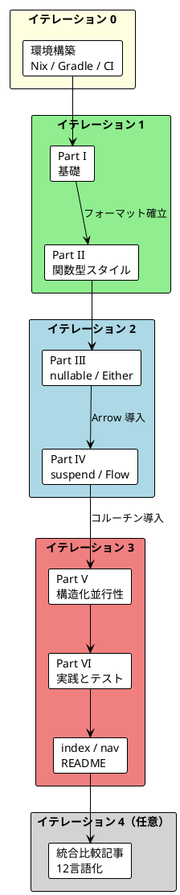

# Kotlin 版 執筆計画

## 概要

「Grokking Functional Programming」の 12 番目の言語として、**Kotlin + Arrow** による実装例と日本語解説（全 6 Part / 12 章）を作成する計画です。

既存の 11 言語版と同じく、`app/kotlin/` にテスト付きのサンプルコードを TDD で実装し、`docs/article/kotlin/` に解説記事を執筆します。

### スコープ

| 項目 | 値 |
|------|-----|
| 解説記事数 | 7 ファイル（`index.md` + `part-1.md`〜`part-6.md`） |
| 各記事の想定規模 | 600〜1,000 行（Java 版: 646〜1,324 行、Scala 版: 541〜946 行） |
| 解説記事合計（想定） | 4,500〜5,500 行 |
| サンプルコード | `app/kotlin/src/main/kotlin/ch01`〜`ch12` |
| テストコード | `app/kotlin/src/test/kotlin/ch01`〜`ch12` |
| 言語グループ | マルチパラダイム（Scala / Rust / TypeScript と同グループ） |

### 進捗

| イテレーション | 状態 | 備考 |
|--------------|------|------|
| 0: 環境構築 | 完了 | Kotlin 2.4.20 / Arrow 2.2.3 / kotlinx.coroutines 1.11.0 / Kotest 6.2.5 |
| 1: Part I・II | 完了 | |
| 2: Part III・IV | 完了 | |
| 3: Part V・VI + 統合 | 完了 | 任意節の STM（10.10）は見送り |
| 4: 統合比較記事 | 未着手（任意） | |

### スコープ外

- 11 言語統合比較記事（`docs/article/all/`）への Kotlin 追記は本計画の完了後に別計画で扱う（「イテレーション 4（任意）」参照）

---

## 技術スタック

| 項目 | 採用技術 | 用途 | 対応章 |
|------|---------|------|--------|
| 言語 | Kotlin 2.x（JVM 21） | 言語 | 全章 |
| ビルド | Gradle（Kotlin DSL）+ Gradle Wrapper | ビルド・テスト実行 | 全章 |
| FP ライブラリ | Arrow Core（`arrow-core`） | `Either`、`Option`、`Raise` DSL、`NonEmptyList` | Part III〜VI |
| 並行処理 | kotlinx.coroutines | `suspend`、`async`、構造化並行性 | Part IV〜VI |
| ストリーム | kotlinx.coroutines `Flow` | ストリーム処理 | Part IV |
| 並行 FP | Arrow Fx Coroutines（`arrow-fx-coroutines`） | `parMap`、`parZip`、`raceN`、`Resource` | Part V〜VI |
| リトライ | Arrow Resilience（`arrow-resilience`） | `Schedule` によるリトライ | Part IV |
| テスト | Kotest（`kotest-runner-junit5`、`kotest-assertions-core`） | 単体テスト | 全章 |
| PBT | Kotest Property（`kotest-property`） | プロパティベーステスト | Part VI |

ライブラリのバージョンはイテレーション 0 の環境構築時に最新の安定版を確認し、`build.gradle.kts` に固定しました（Kotlin 2.4.20、Arrow 2.2.3、kotlinx.coroutines 1.11.0、Kotest 6.2.5）。

### 採用理由

- **Arrow**: Kotlin における事実上の標準 FP ライブラリであり、Scala 版の cats / cats-effect と概念的な対応が取りやすい
- **コルーチン中心の IO 表現**: Arrow 2.x は独自の `IO` 型を持たず、`suspend` 関数を「副作用の記述」として扱う方針を取っている。この設計判断自体が Kotlin 版の最大の学習ポイントになる
- **Kotest**: `forAll` / `checkAll` によるプロパティベーステストが Scala 版の ScalaCheck と対応する

---

## Kotlin 版の特色（他言語との差別化ポイント）

各 Part の解説で強調する Kotlin 固有の論点です。

| テーマ | Kotlin での表現 | 対比する言語 | 解説の焦点 |
|--------|----------------|-------------|-----------|
| 不変性 | `val`、`List`（読み取り専用ビュー）、`data class` の `copy` | Java（Vavr）、Scala | 読み取り専用 ≠ イミュータブル の違い |
| 高階関数 | 末尾ラムダ、`it`、関数型 `(A) -> B`、拡張関数 | Scala、Java | 拡張関数によるパイプライン風の記述 |
| flatMap | `flatMap`、Arrow の `either { }` / `option { }` DSL | Scala の for 内包表記、Haskell の do 記法 | 内包表記の代わりとしての `Raise` DSL |
| Option | **nullable 型 `A?`** と `?.` / `?:` を主軸、Arrow `Option` は比較として紹介 | Scala、Rust、TypeScript | 言語組み込みの null 安全と Option 型のトレードオフ |
| Either / ADT | `sealed interface` + `data class` + `when` の網羅性チェック | F#、Rust、Java | `Either` vs `Raise<E>` のコンテキストレシーバー的スタイル |
| IO | `suspend` 関数、`() -> A` サンク | Scala（cats-effect IO）、Haskell | 「値としての IO」と「suspend による副作用の型付け」の違い |
| ストリーム | `Sequence`（同期・遅延）と `Flow`（非同期・コールド） | Scala（fs2）、Elixir | 2 種類の遅延ストリームの使い分け |
| 並行処理 | 構造化並行性、`parMap`、`Atomic` / `MutableStateFlow`、STM | Scala（Fiber / Ref）、Java（Virtual Thread） | キャンセルとスコープによる安全な並行処理 |
| リソース管理 | Arrow `Resource`、`use` | Scala（Resource）、Java（try-with-resources） | 合成可能なリソース管理 |
| テスト | Kotest `checkAll` / `Arb` | Scala（ScalaCheck）、Haskell（QuickCheck） | ジェネレータの合成 |

---

## 成果物

### 解説記事

| # | ファイル | Part | 章 | 想定規模 |
|---|---------|------|-----|---------|
| 1 | `docs/article/kotlin/index.md` | - | 概要・学習パス・Arrow 紹介 | 180〜220 行 |
| 2 | `docs/article/kotlin/part-1.md` | I | 1-2 | 550〜650 行 |
| 3 | `docs/article/kotlin/part-2.md` | II | 3-5 | 700〜900 行 |
| 4 | `docs/article/kotlin/part-3.md` | III | 6-7 | 750〜900 行 |
| 5 | `docs/article/kotlin/part-4.md` | IV | 8-9 | 750〜900 行 |
| 6 | `docs/article/kotlin/part-5.md` | V | 10 | 750〜950 行 |
| 7 | `docs/article/kotlin/part-6.md` | VI | 11-12 | 900〜1,200 行 |

### サンプルコード（Java 版の構成に準拠）

```
app/kotlin/
├── build.gradle.kts
├── settings.gradle.kts
├── gradlew / gradlew.bat / gradle/
└── src/
    ├── main/kotlin/
    │   ├── ch01/IntroKotlin.kt
    │   ├── ch02/PureFunctions.kt, ShoppingCart.kt, TipCalculator.kt
    │   ├── ch03/ImmutableList.kt, Itinerary.kt
    │   ├── ch04/HigherOrderFunctions.kt, ProgrammingLanguage.kt, WordScoring.kt
    │   ├── ch05/BookAdaptations.kt, FlatMapExamples.kt, PointsInsideCircles.kt
    │   ├── ch06/OptionBasics.kt, TvShow.kt, TvShowParser.kt
    │   ├── ch07/EitherBasics.kt, MusicArtist.kt, PaymentMethod.kt, TvShowParserEither.kt
    │   ├── ch08/CastingDie.kt, SchedulingMeetings.kt
    │   ├── ch09/CurrencyExchange.kt, Streams.kt
    │   ├── ch10/CheckIns.kt, ParallelExamples.kt
    │   ├── ch11/TravelGuide.kt, DataAccess.kt, CachedDataAccess.kt, Resources.kt
    │   └── ch12/TestDataAccess.kt
    └── test/kotlin/
        └── ch01〜ch12/（各ファイルに対応する *Test.kt）
```

### 周辺ファイル

| ファイル | 変更内容 |
|---------|---------|
| `ops/nix/environments/kotlin/shell.nix` | 新規（jdk21、gradle、kotlin） |
| `flake.nix` | `kotlin` 開発シェルを追加 |
| `.github/workflows/test-all.yml` | `kotlin` ジョブを追加（`./gradlew test`） |
| `mkdocs.yml` | ナビゲーションに Kotlin セクションを追加、`site_description` を 12 言語に更新 |
| `docs/article/index.md` | 「言語別解説」に Kotlin 版を追加、言語数の記述を 12 に更新 |
| `README.md` | 言語一覧、実行方法、Nix 環境、ライブラリ表に Kotlin を追加 |

---

## 執筆方針

### 基本方針

1. **既存フォーマットの踏襲**: 章・節番号、`まとめ` / `演習問題` / `実行方法` の構成は Java 版・Scala 版と揃える
2. **コードは必ずテスト済み**: 記事に掲載するコードはすべて `app/kotlin` のテストで検証されたものに限る
3. **Scala との対応表**: 各 Part の末尾に「Scala との対応」表を置く（Java 版の「Scala との比較」と同形式）
4. **Kotlin らしさを優先**: Scala の直訳ではなく、nullable 型、拡張関数、`suspend`、`Raise` DSL など Kotlin のイディオムを優先し、Arrow の型は必要な場面で導入する
5. **段階的な Arrow 導入**: Part I〜II は標準ライブラリのみ、Part III から Arrow Core、Part IV 以降でコルーチンと Arrow Fx を導入する

### 各 Part の記事構成（共通テンプレート）

```
# Part X: <タイトル>
（導入文）
## 第N章: <タイトル>
### N.1 ...（概念 → コード → 解説 → 図）
...
## まとめ
### Part X で学んだこと
### キーポイント
### Scala との対応
### 次のステップ
## 演習問題
### 問題 1〜n（解答は <details> で折りたたみ）
## 実行方法
```

---

## イテレーション詳細

### イテレーション 0: 環境構築

**目的**: Kotlin のビルド・テスト環境を用意し、CI で緑になる最小構成を作る

| # | タスク | 完了条件 |
|---|-------|---------|
| 0-1 | `ops/nix/environments/kotlin/shell.nix` と `flake.nix` へのシェル追加 | `nix develop .#kotlin` で `java`、`gradle`、`kotlin` が使える |
| 0-2 | `app/kotlin` に Gradle（Kotlin DSL）プロジェクトと Wrapper を作成 | `./gradlew test` が成功する |
| 0-3 | Arrow、kotlinx.coroutines、Kotest の依存を追加しバージョンを固定 | 依存解決が成功する |
| 0-4 | 動作確認用の最小テスト（ch01 の雛形）を追加 | テスト 1 件がパス |
| 0-5 | `.github/workflows/test-all.yml` に `kotlin` ジョブを追加 | CI の Kotlin ジョブが緑 |
| 0-6 | `.gitignore` に `app/kotlin/build/`、`.gradle/`、`.kotlin/` を追加 | ビルド生成物がコミットされない |

**リスク**: Low（Java 版の Gradle 構成を流用できる）

---

### イテレーション 1: 基礎と関数型スタイル（Part I・II）

**目的**: 標準ライブラリのみで FP の基礎を示し、Kotlin 版の記事フォーマットを確立する

#### Part I: 関数型プログラミングの基礎（第 1〜2 章）

**ファイル**: `part-1.md`、`app/kotlin/src/main/kotlin/ch01`〜`ch02`

**主要セクション構成**:

```
第1章: 関数型プログラミング入門
  1.1 命令型 vs 関数型（ワードスコア計算）
  1.2 Kotlin の基本構文（fun、式本体、val、型推論）
  1.3 関数の構造
  1.4 学習ポイント
第2章: 純粋関数とテスト
  2.1 純粋関数とは
  2.2 純粋関数の例
  2.3 ショッピングカートの例（問題のあるコード → 純粋関数による解決）
  2.4 チップ計算の例
  2.5 純粋関数のテスト（Kotest の StringSpec / FunSpec）
  2.6 文字 'a' を除外するワードスコア
  2.7 参照透過性
```

**Kotlin 固有の論点**: 式本体関数、`val` と `var`、トップレベル関数

#### Part II: 関数型スタイルのプログラミング（第 3〜5 章）

**ファイル**: `part-2.md`、`app/kotlin/src/main/kotlin/ch03`〜`ch05`

**主要セクション構成**:

```
第3章: イミュータブルなデータ操作
  3.1 イミュータブルとは（List と MutableList、読み取り専用ビューの注意点）
  3.2 List の基本操作（plus、take / drop、subList）
  3.3 リストの変換例
  3.4 旅程の再計画
  3.5 String と List の類似性
第4章: 関数を値として扱う
  4.1 高階関数とは（関数型 (A) -> B）
  4.2 関数を引数として渡す（sortedBy、map、filter、fold）
  4.3 data class と関数参照（::）
  4.4 関数を返す関数
  4.5 カリー化と部分適用
  4.6 ワードスコアリングの例
第5章: flatMap とネスト構造
  5.1 flatten と flatMap
  5.2 flatMap によるリストサイズの変化
  5.3 ネストした flatMap
  5.4 for 内包表記の代替（ネストした flatMap / sequence { } ビルダー）
  5.5 円内の点の判定（ガード相当のフィルタリング）
```

**Kotlin 固有の論点**: 末尾ラムダと `it`、拡張関数、`fold` と `reduce` の違い、`buildList`

#### イテレーション 1 完了条件

- [x] `part-1.md`、`part-2.md` が共通テンプレートに準拠している
- [x] ch01〜ch05 のテストがすべてパス
- [x] 記事中のコードとサンプルコードが一致している
- [x] 各 Part に演習問題（3〜4 問）と解答がある

**リスク**: Low

---

### イテレーション 2: エラーハンドリングと IO（Part III・IV）

**目的**: Arrow とコルーチンを導入し、型によるエラーハンドリングと副作用の分離を示す

#### Part III: エラーハンドリングと Option/Either（第 6〜7 章）

**ファイル**: `part-3.md`、`app/kotlin/src/main/kotlin/ch06`〜`ch07`

**主要セクション構成**:

```
第6章: nullable 型と Option による安全なエラーハンドリング
  6.1 なぜ Option が必要か
  6.2 nullable 型の基本（?.、?:、let、takeIf）
  6.3 TV番組のパース例（例外 → nullable 型）
  6.4 小さな関数から組み立てる
  6.5 ?: によるフォールバック（単年の番組に対応する）
  6.6 Arrow Option との比較（nullable 型をネストできない問題）
  6.7 エラーハンドリング戦略（Best-effort / All-or-nothing）
  6.8 all と any（forall / exists 相当）
第7章: Either 型と複合的なエラー処理
  7.1 nullable 型 / Option の限界
  7.2 Arrow Either の基本（left / right、map、flatMap、fold）
  7.3 Either を使ったパース
  7.4 either { } DSL と bind()
  7.5 Raise<E> による関数シグネチャ
  7.6 バリデーションとエラーの蓄積（zipOrAccumulate、NonEmptyList）
  7.7 代数的データ型（sealed interface / data class）
  7.8 when による網羅的パターンマッチング
  7.9 検索条件のモデリング
  7.10 支払い方法の例
```

**Kotlin 固有の論点**: 言語組み込みの null 安全、`when` の網羅性チェック、`Raise` DSL による「内包表記」

#### Part IV: IO と副作用の管理（第 8〜9 章）

**ファイル**: `part-4.md`、`app/kotlin/src/main/kotlin/ch08`〜`ch09`

**主要セクション構成**:

```
第8章: IO の導入
  8.1 副作用の問題
  8.2 副作用を値として扱う（() -> A サンクによる最小 IO）
  8.3 suspend 関数による副作用の型付け（Arrow の設計方針）
  8.4 サイコロを振る例
  8.5 IO の合成
  8.6 ミーティングスケジューリングの例
  8.7 エラーハンドリングとリトライ（Either.catch、Schedule）
  8.8 複数の IO をまとめる（map + awaitAll / parMap の予告）
第9章: ストリーム処理
  9.1 ストリームとは
  9.2 Sequence による遅延評価と無限ストリーム
  9.3 Flow によるコールドストリーム
  9.4 ストリームの主要操作（take、filter、map、zip、scan）
  9.5 通貨交換レートの例
  9.6 スライディングウィンドウ（windowed）とトレンド検出
```

**Kotlin 固有の論点**: `suspend` を「IO のマーカー」と捉える見方、`Sequence` と `Flow` の使い分け

#### イテレーション 2 完了条件

- [x] `part-3.md`、`part-4.md` が共通テンプレートに準拠している
- [x] ch06〜ch09 のテストがすべてパス（コルーチンは `runTest` / Kotest のコルーチン対応で検証）
- [x] 「Scala との対応」表で cats-effect IO と suspend の違いを説明している

**リスク**: Medium（IO モナドの表現が Scala と大きく異なるため、原著の説明との橋渡しに紙幅が必要）

---

### イテレーション 3: 並行処理と実践（Part V・VI + 統合）

**目的**: 構造化並行性と Arrow Fx による実践的なアプリケーション構築を示し、シリーズを完成させる

#### Part V: 並行処理（第 10 章）

**ファイル**: `part-5.md`、`app/kotlin/src/main/kotlin/ch10`

**主要セクション構成**:

```
第10章: 並行・並列処理
  10.1 並行処理の課題
  10.2 チェックインのリアルタイム集計
  10.3 逐次処理の問題
  10.4 アトミックな共有状態（Atomic / MutableStateFlow、Scala の Ref との対応）
  10.5 構造化並行性（coroutineScope、async / await）
  10.6 parZip と parMap
  10.7 raceN と withTimeout
  10.8 Job によるバックグラウンド実行とキャンセル（Fiber 相当）
  10.9 呼び出し元に制御を返す
  10.10 STM（arrow-fx-stm）による複合的な状態更新（任意）
```

**Kotlin 固有の論点**: 構造化並行性とキャンセルの伝播、Dispatcher の選択

**リスク**: Medium（Scala の Fiber / Ref との対応付けを誤解なく説明する必要がある）

#### Part VI: 実践的なアプリケーション構築とテスト（第 11〜12 章）

**ファイル**: `part-6.md`、`app/kotlin/src/main/kotlin/ch11`〜`ch12`

**主要セクション構成**:

```
第11章: 実践的なアプリケーション構築
  11.1 TravelGuide アプリケーション
  11.2 ドメインモデルの定義（data class / value class）
  11.3 データアクセス層の抽象化（interface + suspend）
  11.4 Arrow Resource によるリソース管理
  11.5 キャッシュの実装
  11.6 ガイドスコアの計算
  11.7 アプリケーションの組み立て
  11.8 Either.catch によるエラーハンドリング
第12章: テスト戦略
  12.1 関数型プログラミングのテスト
  12.2 SearchReport の導入
  12.3 TestDataAccess - テスト用スタブ
  12.4 プロパティベーステスト（Kotest checkAll / Arb）
  12.5 不変条件のテスト
  12.6 キャッシュのテスト
  12.7 Resource のテスト
  12.8 テストピラミッド
シリーズ全体の総括
```

#### 統合作業

| # | タスク |
|---|-------|
| 3-1 | `docs/article/kotlin/index.md` を作成（対象読者、記事一覧、学習パス、使用ライブラリ、Arrow 紹介、Scala との比較） |
| 3-2 | `mkdocs.yml` のナビゲーションに Kotlin セクションを追加 |
| 3-3 | `docs/article/index.md` と `README.md` に Kotlin 版を追加し、言語数を 12 に更新 |
| 3-4 | `mkdocs build` でリンク切れがないことを確認 |

#### イテレーション 3 完了条件

- [x] `part-5.md`、`part-6.md`、`index.md` が完成している
- [x] ch01〜ch12 のテストがすべてパスし、CI の Kotlin ジョブが緑
- [x] `mkdocs build` が警告なしで成功する
- [x] README とトップページに Kotlin 版が掲載されている

---

### イテレーション 4（任意）: 統合比較記事への追記

**目的**: `docs/article/all/` の 11 言語統合比較記事を 12 言語版に更新する

- 各章の `<details>` による全言語コード一覧に Kotlin を追加
- 言語グループ表（マルチパラダイム）に Kotlin を追加
- 特に差異が大きい章（第 6 章 nullable 型、第 8 章 suspend、第 10 章 構造化並行性）では本文でも Kotlin に言及
- 記事タイトル・目次の「11言語」表記を「12言語」に更新

本イテレーションは Kotlin 版の完成後に、統合記事の執筆計画（`docs/article/all/writing-plan.md`）側で詳細化します。

---

## 各 Part の開発ワークフロー

各 Part は以下の標準ワークフローで進めます。

```
Phase 1: 素材収集（Read）
├── Scala 版・Java 版の該当 Part を読み込む
├── 原著の該当章の要点を確認
└── Kotlin / Arrow で表現を変えるべき箇所を特定

Phase 2: 実装（TDD）
├── Red: 章の例題ごとに失敗するテストを書く
├── Green: 最小限の実装でテストを通す
├── Refactor: Kotlin のイディオムに寄せて整理
└── ./gradlew test がすべてパスすることを確認

Phase 3: 執筆（Write）
├── テスト済みコードを記事に転記
├── 概念 → コード → 解説 → 図 の順で節を構成
├── まとめ・Scala との対応表・演習問題を書く
└── 実行方法を記載

Phase 4: 品質チェック（Review）
├── 記事中のコードとサンプルコードの一致確認
├── 共通テンプレート準拠の確認
├── 日本語表記ルール（半角スペース、ですます調）の確認
└── リンクの整合性確認
```

### コミット単位

既存言語（Ruby 版など）の履歴に合わせ、Part ごとに実装と記事をまとめてコミットします。

```
chore(kotlin): add Kotlin development environment and CI job
feat(kotlin): add Kotlin Arrow Part I implementation and documentation
feat(kotlin): add Kotlin Arrow Part II implementation and documentation
...
feat(kotlin): add Kotlin Arrow Part VI implementation and documentation
docs(kotlin): add Kotlin index and update navigation
```

---

## 依存関係グラフ



---

## リスク管理

| リスク | 影響 | 対策 |
|--------|------|------|
| IO モナドの表現が原著（Scala）と異なる | 読者が原著との対応を見失う | 第 8 章で「サンクによる最小 IO」→「suspend」の順に段階的に説明し、対応表を必ず置く |
| Arrow の API 変更（1.x → 2.x で `Validated`、`Either.computation` などが整理済み） | 古い情報に基づく誤ったコード | 公式ドキュメントで最新 API を確認し、コードは必ずテストで検証する |
| nullable 型と Arrow Option の二重化 | 説明が冗長・混乱 | nullable 型を主軸にし、Option はネストが必要な場面の比較に限定する |
| Scala の Fiber / Ref と Kotlin の Job / Atomic の意味差 | 不正確な対応付け | 「同じ役割」と「異なる性質（キャンセル・スコープ）」を分けて表にする |
| Nix 環境での Kotlin / Gradle のバージョン差 | CI とローカルで挙動が異なる | Gradle Wrapper と JVM Toolchain でバージョンを固定する |
| Java 版との内容重複 | 差別化が弱くなる | 各 Part で「Kotlin 固有の論点」を最低 1 節設ける |

---

## 成果物チェックリスト

| # | 成果物 | イテレーション |
|---|--------|--------------|
| 1 | `ops/nix/environments/kotlin/shell.nix`、`flake.nix` 更新 | 0 |
| 2 | `app/kotlin/`（Gradle プロジェクト） | 0 |
| 3 | `.github/workflows/test-all.yml` 更新 | 0 |
| 4 | `docs/article/kotlin/part-1.md` + `ch01`〜`ch02` | 1 |
| 5 | `docs/article/kotlin/part-2.md` + `ch03`〜`ch05` | 1 |
| 6 | `docs/article/kotlin/part-3.md` + `ch06`〜`ch07` | 2 |
| 7 | `docs/article/kotlin/part-4.md` + `ch08`〜`ch09` | 2 |
| 8 | `docs/article/kotlin/part-5.md` + `ch10` | 3 |
| 9 | `docs/article/kotlin/part-6.md` + `ch11`〜`ch12` | 3 |
| 10 | `docs/article/kotlin/index.md` | 3 |
| 11 | `mkdocs.yml`、`docs/article/index.md`、`README.md` 更新 | 3 |
| 12 | `docs/article/all/` の 12 言語化 | 4（任意） |
