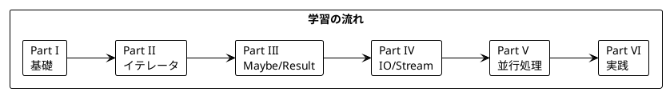

# Grokking Functional Programming - Python returns 版

本シリーズは「Grokking Functional Programming」（Michał Płachta 著）の学習コンパニオンとして、関数型プログラミングの概念を Python と [returns](https://returns.readthedocs.io/) ライブラリで実装しながら日本語で解説します。

---

## 対象読者

- Python の経験があり、関数型プログラミングに興味がある開発者
- 型安全なエラーハンドリングを Python で実現したい方
- 実践的な FP の適用方法を Python で学びたいエンジニア

---

## 記事一覧

### [Part I: 関数型プログラミングの基礎](part-1.md)

関数型プログラミングの基本概念を Python で学びます。

| 章 | トピック |
|----|----------|
| 第1章 | 命令型 vs 関数型、Python 基本構文 |
| 第2章 | 純粋関数、副作用の排除、型ヒント |

**キーワード**: 純粋関数、参照透過性、型ヒント、イミュータブル

---

### [Part II: 関数型スタイルのプログラミング](part-2.md)

イミュータブルなデータ操作と高階関数を学びます。

| 章 | トピック |
|----|----------|
| 第3章 | イミュータブルデータ、tuple、frozenset |
| 第4章 | 高階関数、map/filter/reduce、イテレータ |
| 第5章 | ジェネレータ、itertools |

**キーワード**: イミュータブル、高階関数、イテレータ、ジェネレータ

---

### [Part III: エラーハンドリングと Maybe/Result](part-3.md)

returns ライブラリを使った型安全なエラーハンドリングを学びます。

| 章 | トピック |
|----|----------|
| 第6章 | Maybe 型、Some/Nothing |
| 第7章 | Result 型、Success/Failure、パターンマッチング |

**キーワード**: Maybe、Result、returns ライブラリ、Railway Oriented Programming

---

### [Part IV: IO と副作用の管理](part-4.md)

IO コンテナとストリーム処理を学びます。

| 章 | トピック |
|----|----------|
| 第8章 | IO コンテナ、副作用の分離 |
| 第9章 | ストリーム処理、ジェネレータの活用 |

**キーワード**: IO コンテナ、遅延評価、ストリーム処理

---

### [Part V: 並行処理](part-5.md)

Python における非同期処理と並行処理を学びます。

| 章 | トピック |
|----|----------|
| 第10章 | asyncio、FutureResult |
| 第11章 | 並行パターン、gather、TaskGroup |

**キーワード**: asyncio、FutureResult、並行処理

---

### [Part VI: 実践的なアプリケーション構築とテスト](part-6.md)

実践的なアプリケーション構築とテスト戦略を学びます。

| 章 | トピック |
|----|----------|
| 第12章 | TravelGuide アプリ、依存性注入、テスト戦略 |

**キーワード**: Protocol、依存性注入、Hypothesis

---

## 学習パス



---

## 使用ライブラリ

| ライブラリ | 用途 | 対応章 |
|------------|------|--------|
| Python 3.11+ | 言語 | 全章 |
| returns | Maybe/Result/IO コンテナ | Part III-VI |
| hypothesis | プロパティベーステスト | Part VI |
| pytest | テストフレームワーク | 全章 |

---

## リポジトリ構成

```
grokkingfp-examples/
├── app/python/src/           # Python のサンプルコード
│   ├── ch01_intro.py         # 第1章
│   ├── ch02_pure_functions.py # 第2章
│   └── ...                   # 以降の章
├── app/python/tests/         # テストコード
├── app/python/pyproject.toml # 依存関係
└── docs/article/python/      # 解説記事（本ディレクトリ）
    ├── index.md              # この記事
    ├── part-1.md             # Part I
    ├── part-2.md             # Part II
    ├── part-3.md             # Part III
    ├── part-4.md             # Part IV
    ├── part-5.md             # Part V
    └── part-6.md             # Part VI
```

---

## Python と関数型プログラミング

Python は関数型プログラミングの多くの概念をサポートしています:

### 高階関数

```python
from typing import Callable

def apply_twice(f: Callable[[int], int], x: int) -> int:
    return f(f(x))

result = apply_twice(lambda x: x + 1, 5)  # 7
```

### イミュータブルデータ

```python
from typing import NamedTuple

class Point(NamedTuple):
    x: int
    y: int

p1 = Point(1, 2)
p2 = p1._replace(x=3)  # 新しいオブジェクトを生成
```

### イテレータとジェネレータ

```python
numbers = [1, 2, 3, 4, 5]
doubled = map(lambda x: x * 2, numbers)
filtered = filter(lambda x: x > 4, doubled)
result = list(filtered)  # [6, 8, 10]
```

### returns ライブラリによる型安全なエラーハンドリング

```python
from returns.maybe import Maybe, Some, Nothing
from returns.result import Result, Success, Failure

def safe_divide(a: int, b: int) -> Maybe[float]:
    if b == 0:
        return Nothing
    return Some(a / b)

def parse_int(s: str) -> Result[int, str]:
    try:
        return Success(int(s))
    except ValueError:
        return Failure(f"Cannot parse '{s}' as int")
```

### パイプライン処理

```python
from returns.pipeline import flow
from returns.pointfree import map_

result = flow(
    Some(5),
    map_(lambda x: x * 2),
    map_(lambda x: x + 1),
)  # Some(11)
```

---

## Scala との対比

| 概念 | Scala | Python (returns) |
|------|-------|------------------|
| イミュータブル変数 | `val` | `Final` / 慣習 |
| null 安全 | `Option[T]` | `Maybe[T]` |
| エラー処理 | `Either[E, A]` | `Result[T, E]` |
| 高階関数 | `map`, `flatMap` | `map`, `bind` |
| パターンマッチ | `match` | `match` (3.10+) / `fold` |
| トレイト | `trait` | `Protocol` |
| ジェネリクス | `def foo[T]` | `def foo[T](...)` |
| 非同期 | `IO[A]` (cats-effect) | `FutureResult` / `asyncio` |

---

## 関数型プログラミングの利点

本シリーズを通じて、以下の利点を実感できます:

1. **予測可能性** - 純粋関数は同じ入力に対して常に同じ出力
2. **テスト容易性** - 副作用がないためテストが簡単
3. **合成可能性** - 小さな関数を組み合わせて複雑な処理を構築
4. **並行安全性** - イミュータブルデータは競合状態を防ぐ
5. **型安全性** - Maybe、Result で None や例外を型で表現

---

## 参考資料

- [Grokking Functional Programming](https://www.manning.com/books/grokking-functional-programming) - 原著
- [returns ドキュメント](https://returns.readthedocs.io/) - Python FP ライブラリ
- [Python 公式ドキュメント](https://docs.python.org/3/)
- [Hypothesis ドキュメント](https://hypothesis.readthedocs.io/) - プロパティベーステスト
- [Real Python - Functional Programming](https://realpython.com/python-functional-programming/)
