# Part II: 関数型スタイルのプログラミング

本章では、関数型プログラミングの核心となるテクニックを学びます。イミュータブルなデータ操作、高階関数、そしてリスト内包表記による複雑なデータ変換を習得します。

---

## 第3章: イミュータブルなデータ操作

### 3.1 イミュータブルとは

イミュータブル（不変）とは、一度作成されたデータが変更されないことを意味します。データを「変更」する代わりに、新しいデータを「作成」します。

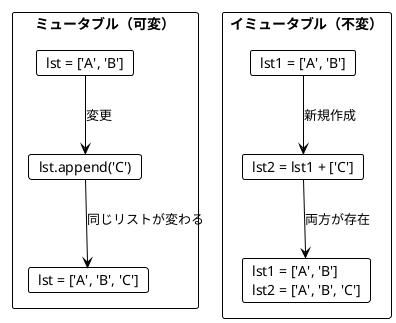

### 3.2 List の基本操作

**ソースファイル**: `app/python/src/grokking_fp/ch03_immutable_data.py`

#### appended - 要素の追加

```python
def appended(lst: list[str], element: str) -> list[str]:
    """リストに要素を追加した新しいリストを返す。"""
    return lst + [element]

original = ["Apple", "Book"]
new_list = appended(original, "Mango")

assert original == ["Apple", "Book"]       # 元のリストは変わらない
assert new_list == ["Apple", "Book", "Mango"]  # 新しいリストが作成される
```

#### スライス - リストの切り出し

Python ではスライス記法 `[start:end]` を使います。

```python
def first_two(lst: list[str]) -> list[str]:
    return lst[:2]

def last_two(lst: list[str]) -> list[str]:
    if len(lst) < 2:
        return lst[:]
    return lst[-2:]

assert first_two(["a", "b", "c"]) == ["a", "b"]
assert last_two(["a", "b", "c"]) == ["b", "c"]
```

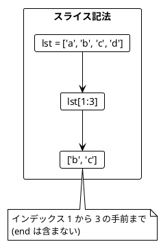

### 3.3 リストの変換例

**ソースファイル**: `app/python/src/grokking_fp/ch03_immutable_data.py`

```python
# 最初の2要素を末尾に移動
def move_first_two_to_end(lst: list[str]) -> list[str]:
    first = lst[:2]
    rest = lst[2:]
    return rest + first

assert move_first_two_to_end(["a", "b", "c"]) == ["c", "a", "b"]

# 最後の要素の前に挿入
def insert_before_last(lst: list[str], element: str) -> list[str]:
    if not lst:
        return [element]
    return lst[:-1] + [element] + lst[-1:]

assert insert_before_last(["a", "b"], "c") == ["a", "c", "b"]
```

### 3.4 旅程の再計画

**ソースファイル**: `app/python/src/grokking_fp/ch03_immutable_data.py`

旅行の計画変更をイミュータブルに行う例です。

```python
def replan(plan: list[str], new_city: str, before_city: str) -> list[str]:
    """指定した都市の前に新しい都市を挿入した旅程を返す。"""
    try:
        index = plan.index(before_city)
        return plan[:index] + [new_city] + plan[index:]
    except ValueError:
        return plan + [new_city]

plan_a = ["Paris", "Berlin", "Kraków"]
plan_b = replan(plan_a, "Vienna", "Kraków")

assert plan_b == ["Paris", "Berlin", "Vienna", "Kraków"]
assert plan_a == ["Paris", "Berlin", "Kraków"]  # 元の計画は変わらない!
```

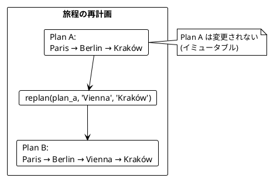

### 3.5 String と List の類似性

Python では String と List は似た操作ができます。

| 操作 | List | String |
|------|------|--------|
| 結合 | `+` | `+` |
| 切り出し | `[start:end]` | `[start:end]` |
| サイズ | `len()` | `len()` |

```python
# List の操作
ab_list = ["a", "b"]
cd_list = ["c", "d"]
abcd_list = ab_list + cd_list
assert abcd_list == ["a", "b", "c", "d"]

# String の操作
ab_str = "ab"
cd_str = "cd"
abcd_str = ab_str + cd_str
assert abcd_str == "abcd"
```

### 3.6 名前の省略

**ソースファイル**: `app/python/src/grokking_fp/ch03_immutable_data.py`

```python
def abbreviate(name: str) -> str:
    """名前を省略形にする。"""
    separator = name.find(" ")
    if separator == -1:
        return name
    initial = name[0]
    last_name = name[separator + 1:]
    return f"{initial}. {last_name}"

assert abbreviate("Alonzo Church") == "A. Church"
assert abbreviate("A. Church") == "A. Church"
```

### 3.7 NamedTuple によるイミュータブルなデータ構造

Python では `NamedTuple` を使ってイミュータブルなデータ構造を定義できます。

```python
from typing import NamedTuple

class City(NamedTuple):
    name: str
    population: int

def with_population(city: City, new_population: int) -> City:
    """人口を更新した新しい City を返す。"""
    return City(city.name, new_population)

tokyo = City("Tokyo", 13960000)
tokyo_updated = with_population(tokyo, 14000000)

assert tokyo.population == 13960000       # 元の都市は変わらない
assert tokyo_updated.population == 14000000
```

### 3.8 frozenset と 辞書のイミュータブル操作

```python
# frozenset - イミュータブルな集合
def add_to_set(s: frozenset[str], element: str) -> frozenset[str]:
    return s | {element}

s = frozenset({"a", "b"})
s2 = add_to_set(s, "c")
assert "c" not in s   # 元の集合は変わらない
assert "c" in s2

# 辞書のイミュータブル操作
def update_dict(d: dict[str, int], key: str, value: int) -> dict[str, int]:
    return {**d, key: value}

d = {"a": 1, "b": 2}
d2 = update_dict(d, "c", 3)
assert d == {"a": 1, "b": 2}       # 元の辞書は変わらない
assert d2 == {"a": 1, "b": 2, "c": 3}
```

---

## 第4章: 関数を値として扱う

### 4.1 高階関数とは

高階関数（Higher-Order Function）とは、以下のいずれかを満たす関数です:

1. 関数を引数として受け取る
2. 関数を戻り値として返す

Python では関数は第一級オブジェクトなので、変数に代入したり引数として渡したりできます。

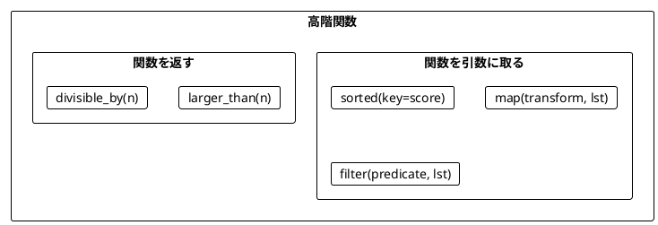

### 4.2 関数を引数として渡す

**ソースファイル**: `app/python/src/grokking_fp/ch04_higher_order.py`

#### sorted と key - ソート基準を関数で指定

```python
def score(word: str) -> int:
    """'a' を除いた文字数をスコアとする。"""
    return len(word.replace("a", ""))

words = ["rust", "java"]
sorted_words = sorted(words, key=score)

assert sorted_words == ["java", "rust"]
# java: 2文字 (j, v), rust: 4文字 (r, u, s, t)
```

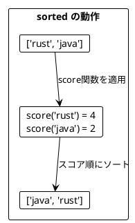

#### リスト内包表記による map

Python では `map()` よりもリスト内包表記が一般的です。

```python
# 各要素の長さを取得
lengths = [len(word) for word in ["scala", "rust", "ada"]]
assert lengths == [5, 4, 3]

# 各要素を2倍
doubles = [n * 2 for n in [5, 1, 2, 4, 0]]
assert doubles == [10, 2, 4, 8, 0]
```

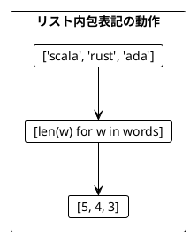

#### filter - 条件に合う要素を抽出

```python
# 奇数のみを抽出
odds = [n for n in [5, 1, 2, 4, 0] if n % 2 == 1]
assert odds == [5, 1]

# 4より大きい数のみ
large = [n for n in [5, 1, 2, 4, 0] if n > 4]
assert large == [5]
```

#### reduce - 畳み込み

```python
from functools import reduce

# 合計を計算
total = reduce(lambda acc, n: acc + n, [5, 1, 2, 4, 100], 0)
assert total == 112

# 最大値を見つける
numbers = [5, 1, 2, 4, 15]
max_val = reduce(lambda acc, n: n if n > acc else acc, numbers)
assert max_val == 15
```

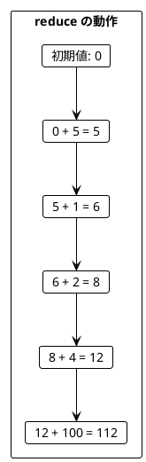

### 4.3 dataclass によるデータ構造

```python
from dataclasses import dataclass

@dataclass(frozen=True)
class ProgrammingLanguage:
    name: str
    year: int

java = ProgrammingLanguage("Java", 1995)
scala = ProgrammingLanguage("Scala", 2004)

languages = [java, scala]

# フィールドにアクセス
names = [lang.name for lang in languages]
assert names == ["Java", "Scala"]

# 条件でフィルタ
young = [lang for lang in languages if lang.year > 2000]
assert young == [scala]
```

### 4.4 関数を返す関数

**ソースファイル**: `app/python/src/grokking_fp/ch04_higher_order.py`

```python
from collections.abc import Callable

def larger_than(n: int) -> Callable[[int], bool]:
    """n より大きいかを判定する関数を返す。"""
    return lambda i: i > n

large = list(filter(larger_than(4), [5, 1, 2, 4, 0]))
assert large == [5]

medium = list(filter(larger_than(1), [5, 1, 2, 4, 0]))
assert medium == [5, 2, 4]
```

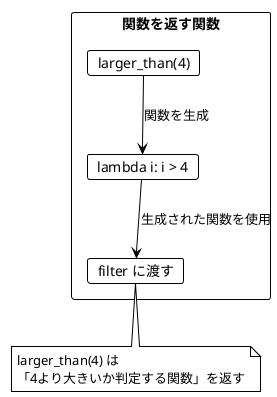

### 4.5 クロージャとカリー化

Python ではクロージャを使ってカリー化のような機能を実現できます。

```python
def high_scoring_words_with_threshold(
    word_score_fn: Callable[[str], int],
) -> Callable[[int], Callable[[list[str]], list[str]]]:
    """カリー化された関数。スコア関数、閾値、単語リストを順番に受け取る。"""
    def with_threshold(higher_than: int) -> Callable[[list[str]], list[str]]:
        def filter_words(words: list[str]) -> list[str]:
            return [word for word in words if word_score_fn(word) > higher_than]
        return filter_words
    return with_threshold

# 使用例
words = ["ada", "haskell", "scala", "java", "rust"]
scorer = high_scoring_words_with_threshold(word_score_with_bonus_and_penalty)
assert scorer(1)(words) == ["java"]
assert scorer(0)(words) == ["ada", "scala", "java"]
```

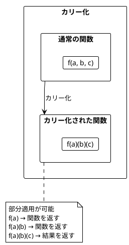

### 4.6 ワードスコアリングの例

**ソースファイル**: `app/python/src/grokking_fp/ch04_higher_order.py`

複数のスコアリングロジックを組み合わせる例です。

```python
def score(word: str) -> int:
    return len(word.replace("a", ""))

def bonus(word: str) -> int:
    return 5 if "c" in word else 0

def penalty(word: str) -> int:
    return 7 if "s" in word else 0

words = ["ada", "haskell", "scala", "java", "rust"]

# 関数を引数として渡す
def ranked_words(words: list[str], word_score: Callable[[str], int]) -> list[str]:
    return sorted(words, key=word_score, reverse=True)

# 基本スコアでランキング
ranking1 = ranked_words(words, score)
assert ranking1 == ["haskell", "rust", "scala", "java", "ada"]

# ボーナス付きスコアでランキング
ranking2 = ranked_words(words, lambda w: score(w) + bonus(w))

# ボーナスとペナルティ付き
ranking3 = ranked_words(words, lambda w: score(w) + bonus(w) - penalty(w))
```

---

## 第5章: flatMap とネスト構造

### 5.1 flatten と flat_map

**ソースファイル**: `app/python/src/grokking_fp/ch05_flatmap.py`

#### flatten - ネストしたリストを平坦化

```python
def flatten(nested: list[list[T]]) -> list[T]:
    """ネストしたリストを平坦化する。"""
    return [item for sublist in nested for item in sublist]

# ネストしたリストを平坦化
author_lists = [["Chiusano", "Bjarnason"], ["Tolkien"]]
authors = flatten(author_lists)
assert authors == ["Chiusano", "Bjarnason", "Tolkien"]
```

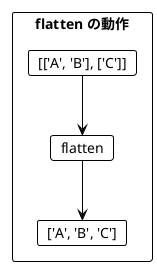

#### flat_map = map + flatten

```python
def flat_map(func: Callable[[T], list[U]], lst: list[T]) -> list[U]:
    """map してから flatten する。"""
    return [item for x in lst for item in func(x)]

# 使用例
result = flat_map(lambda x: [x, x * 2], [1, 2, 3])
assert result == [1, 2, 2, 4, 3, 6]
```

### 5.2 リスト内包表記による flat_map

Python ではリスト内包表記で flat_map の動作を実現できます。

```python
from dataclasses import dataclass

@dataclass(frozen=True)
class Book:
    title: str
    authors: list[str]

books = [
    Book("FP in Scala", ["Chiusano", "Bjarnason"]),
    Book("The Hobbit", ["Tolkien"])
]

# ネストしたループで flat_map を実現
authors = [author for book in books for author in book.authors]
assert authors == ["Chiusano", "Bjarnason", "Tolkien"]
```

### 5.3 flat_map によるリストサイズの変化

```python
# 要素数が増える
result1 = [x for n in [1, 2, 3] for x in [n, n + 10]]
assert result1 == [1, 11, 2, 12, 3, 13]  # 6要素

# 要素数が同じ
result2 = [n * 2 for n in [1, 2, 3]]
assert result2 == [2, 4, 6]  # 3要素

# 要素数が減る（フィルタリング効果）
result3 = [n for n in [1, 2, 3] if n % 2 == 0]
assert result3 == [2]  # 1要素
```

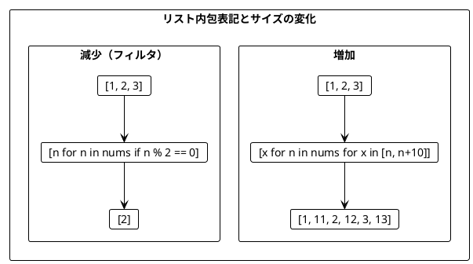

### 5.4 ネストしたリスト内包表記

複数のリストを組み合わせる場合、ネストしたリスト内包表記を使います。

```python
@dataclass(frozen=True)
class Movie:
    title: str

def book_adaptations(author: str) -> list[Movie]:
    if author == "Tolkien":
        return [Movie("An Unexpected Journey"), Movie("The Desolation of Smaug")]
    return []

books = [
    Book("FP in Scala", ["Chiusano", "Bjarnason"]),
    Book("The Hobbit", ["Tolkien"])
]

# ネストしたリスト内包表記
recommendations = [
    f"You may like {movie.title}, because you liked {author}'s {book.title}"
    for book in books
    for author in book.authors
    for movie in book_adaptations(author)
]

# 結果:
# [
#   "You may like An Unexpected Journey, because you liked Tolkien's The Hobbit",
#   "You may like The Desolation of Smaug, because you liked Tolkien's The Hobbit"
# ]
```

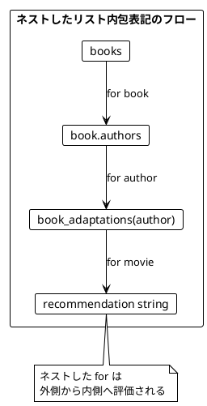

### 5.5 2D/3D ポイントの生成

**ソースファイル**: `app/python/src/grokking_fp/ch05_flatmap.py`

```python
@dataclass(frozen=True)
class Point:
    x: int
    y: int

@dataclass(frozen=True)
class Point3d:
    x: int
    y: int
    z: int

def generate_points(xs: list[int], ys: list[int]) -> list[Point]:
    return [Point(x, y) for x in xs for y in ys]

def generate_points_3d(xs: list[int], ys: list[int], zs: list[int]) -> list[Point3d]:
    return [Point3d(x, y, z) for x in xs for y in ys for z in zs]

# 使用例
points = generate_points([1], [-2, 7])
assert points == [Point(1, -2), Point(1, 7)]

points_3d = generate_points_3d([1], [-2, 7], [3, 4])
assert points_3d == [
    Point3d(1, -2, 3), Point3d(1, -2, 4),
    Point3d(1, 7, 3), Point3d(1, 7, 4)
]
```

### 5.6 ジェネレータによる遅延評価

Python のジェネレータ式を使うと、遅延評価が可能です。

```python
from collections.abc import Iterator

def generate_points_lazy(xs: list[int], ys: list[int]) -> Iterator[Point]:
    """ジェネレータを使って遅延評価で Point を生成する。"""
    return (Point(x, y) for x in xs for y in ys)

def infinite_sequence(start: int = 0) -> Iterator[int]:
    """無限シーケンスを生成する。"""
    n = start
    while True:
        yield n
        n += 1

# 無限シーケンスから最初の3つを取得
from itertools import islice
result = list(islice(infinite_sequence(5), 3))
assert result == [5, 6, 7]
```

### 5.7 itertools を使った高度な操作

```python
from itertools import product, chain, groupby

# デカルト積
pairs = list(product([1, 2], [3, 4]))
assert pairs == [(1, 3), (1, 4), (2, 3), (2, 4)]

# リストの連結
combined = list(chain.from_iterable([[1, 2], [3], [4, 5, 6]]))
assert combined == [1, 2, 3, 4, 5, 6]

# グループ化
words = ["apple", "apricot", "banana", "blueberry"]
sorted_words = sorted(words, key=lambda w: w[0])
grouped = {
    key: list(group)
    for key, group in groupby(sorted_words, key=lambda w: w[0])
}
assert grouped == {"a": ["apple", "apricot"], "b": ["banana", "blueberry"]}
```

---

## まとめ

### Part II で学んだこと

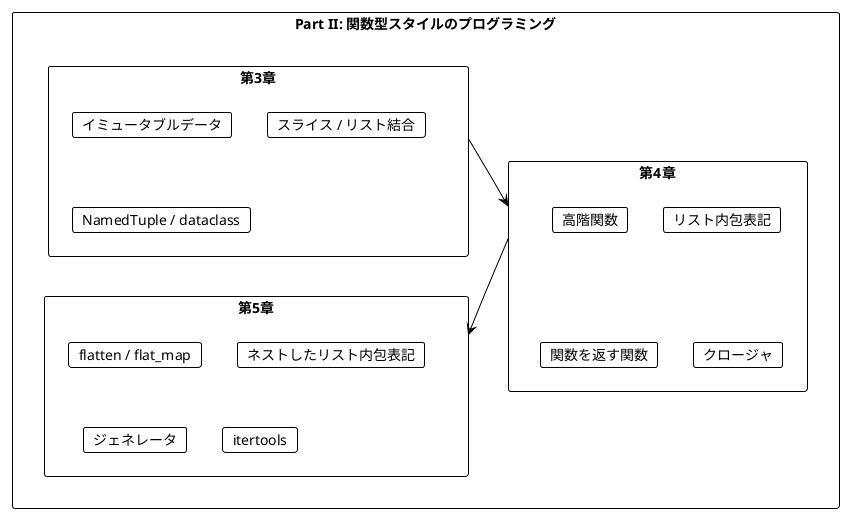

### キーポイント

| 章 | 主要概念 | Python での実現方法 |
|----|----------|---------------------|
| 第3章 | イミュータブル | `+`, スライス, `NamedTuple`, `frozenset` |
| 第4章 | 高階関数 | リスト内包表記, `filter()`, `reduce()`, `sorted()` |
| 第5章 | 平坦化 | ネストしたリスト内包表記, ジェネレータ, `itertools` |

### 重要な法則

1. **イミュータブルデータ**: 元のデータは変更せず、新しいデータを作成する
2. **関数は値**: 関数を引数として渡したり、戻り値として返したりできる
3. **リスト内包表記**: Python における flat_map の主要な表現方法
4. **ジェネレータ**: 遅延評価でメモリ効率の良い処理が可能

### Python 特有のポイント

- **リスト内包表記**: Scala の `for` 内包表記に相当
- **ジェネレータ式**: `()` で囲むと遅延評価になる
- **`@dataclass(frozen=True)`**: イミュータブルなデータクラスを定義
- **`NamedTuple`**: 軽量なイミュータブルデータ構造

### 次のステップ

Part III では、以下のトピックを学びます:

- `returns` ライブラリによる関数型プログラミング
- `Maybe` 型による安全なエラーハンドリング
- `Result` 型と複合的なエラー処理

---

## 演習問題

### 問題 1: イミュータブルな操作

以下の関数を実装してください。リストの中央に要素を挿入する関数です。

```python
def insert_at_middle(lst: list[str], element: str) -> list[str]:
    ...

# 期待される動作
assert insert_at_middle(["a", "b", "c", "d"], "X") == ["a", "b", "X", "c", "d"]
assert insert_at_middle(["a", "b"], "X") == ["a", "X", "b"]
```

<details>
<summary>解答</summary>

```python
def insert_at_middle(lst: list[str], element: str) -> list[str]:
    middle = len(lst) // 2
    return lst[:middle] + [element] + lst[middle:]
```

</details>

### 問題 2: 高階関数

以下の関数を実装してください。条件を満たす要素の数をカウントする関数です。

```python
from collections.abc import Callable
from typing import TypeVar

T = TypeVar("T")

def count_where(lst: list[T], predicate: Callable[[T], bool]) -> int:
    ...

# 期待される動作
assert count_where([1, 2, 3, 4, 5], lambda i: i > 3) == 2
assert count_where(["a", "bb", "ccc"], lambda s: len(s) > 1) == 2
```

<details>
<summary>解答</summary>

```python
def count_where(lst: list[T], predicate: Callable[[T], bool]) -> int:
    return len([x for x in lst if predicate(x)])

# または reduce を使って
from functools import reduce

def count_where2(lst: list[T], predicate: Callable[[T], bool]) -> int:
    return reduce(lambda acc, x: acc + 1 if predicate(x) else acc, lst, 0)
```

</details>

### 問題 3: ネストしたリスト内包表記

以下のネストした処理をリスト内包表記で書いてください。

```python
result = []
for x in [1, 2]:
    for y in [10, 20]:
        for z in [100, 200]:
            result.append(x + y + z)
```

<details>
<summary>解答</summary>

```python
result = [x + y + z for x in [1, 2] for y in [10, 20] for z in [100, 200]]

# 結果: [111, 211, 121, 221, 112, 212, 122, 222]
```

</details>

### 問題 4: リスト内包表記によるフィルタリング

`if` 条件を使わずに、リスト内包表記だけで偶数のみを抽出するコードを書いてください（flat_map パターン）。

```python
numbers = [1, 2, 3, 4, 5, 6]
# 偶数のみを抽出: [2, 4, 6]
```

<details>
<summary>解答</summary>

```python
# flat_map パターン: 空リストを返すことでフィルタリング
even_numbers = [x for n in numbers for x in ([n] if n % 2 == 0 else [])]

# または関数に分離
def even_filter(n: int) -> list[int]:
    return [n] if n % 2 == 0 else []

even_numbers2 = [x for n in numbers for x in even_filter(n)]
```

</details>
