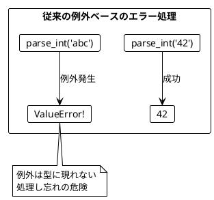
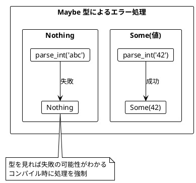
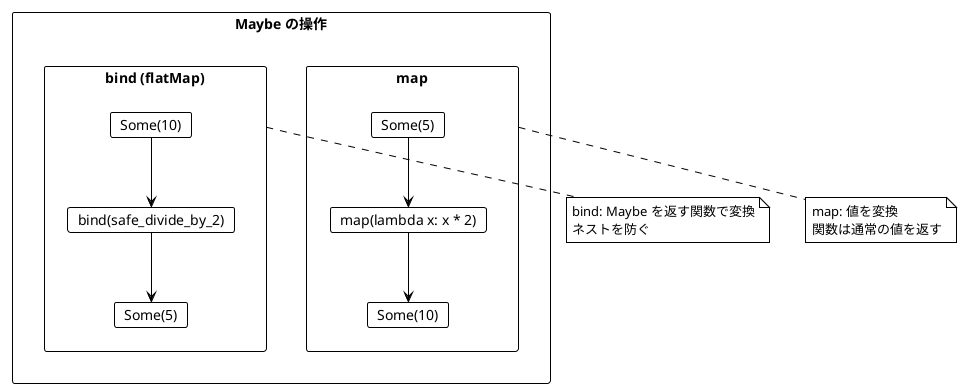
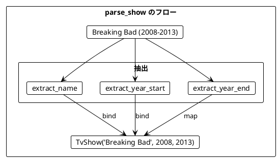
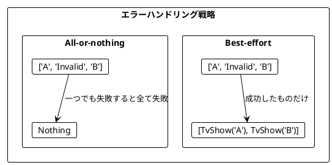
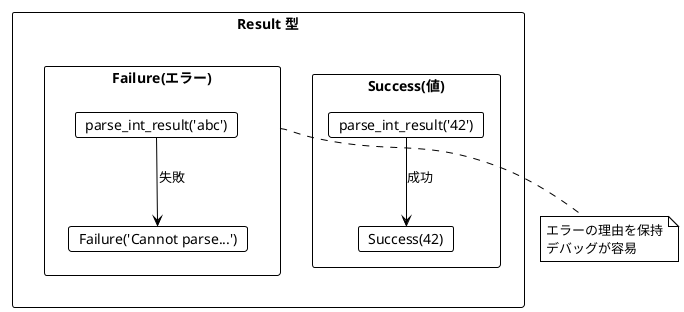
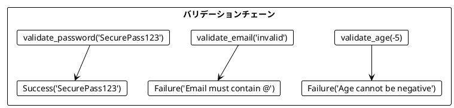
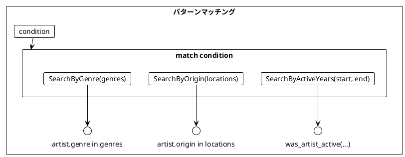
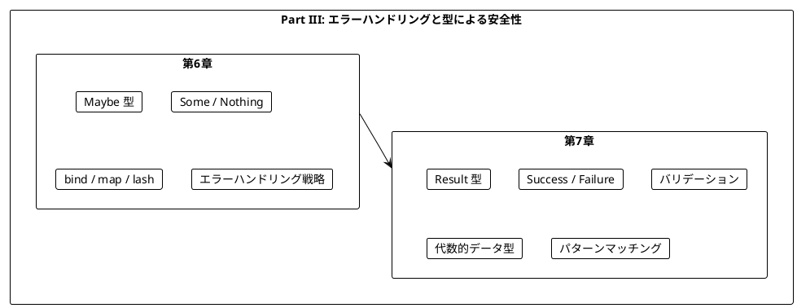

# Part III: エラーハンドリングと型による安全性

本章では、関数型プログラミングにおけるエラーハンドリングを学びます。例外を使わず、型を使って安全にエラーを扱う方法を習得します。Python では `returns` ライブラリの `Maybe` と `Result` 型を使用します。

---

## 第6章: Maybe 型による安全なエラーハンドリング

### 6.1 なぜ Maybe が必要か

従来の Python コードでは、エラーを例外で処理します。しかし、例外は関数の戻り値の型に現れないため、呼び出し側が例外を処理し忘れる可能性があります。

**ソースファイル**: `app/python/src/grokking_fp/ch06_option.py`

```python
# 従来の方法（問題あり）- 例外を使う
def unsafe_parse_int(s: str) -> int:
    return int(s)  # ValueError が発生する可能性!

# unsafe_parse_int("abc")  # ValueError: invalid literal for int()
```



### 6.2 Maybe 型の基本

`returns` ライブラリの `Maybe` 型を使うと、失敗の可能性を型で表現できます。

```python
from returns.maybe import Maybe, Nothing, Some

def parse_int(s: str) -> Maybe[int]:
    """文字列を整数に安全に変換する。"""
    try:
        return Some(int(s))
    except ValueError:
        return Nothing

# 使用例
assert parse_int("42") == Some(42)   # 成功
assert parse_int("abc") == Nothing   # 失敗（エラーではない）
```



### 6.3 TV番組のパース例

**ソースファイル**: `app/python/src/grokking_fp/ch06_option.py`

TV番組の文字列（例: `"Breaking Bad (2008-2013)"`）をパースする例で、Maybe の実践的な使い方を見てみましょう。

```python
from dataclasses import dataclass

@dataclass(frozen=True)
class TvShow:
    """TV番組を表すイミュータブルなデータクラス。"""
    title: str
    start: int
    end: int
```

#### 番組名を抽出

```python
def extract_name(raw_show: str) -> Maybe[str]:
    """番組名を抽出する。"""
    bracket_open = raw_show.find("(")
    if bracket_open > 0:
        return Some(raw_show[:bracket_open].strip())
    return Nothing

assert extract_name("Breaking Bad (2008-2013)") == Some("Breaking Bad")
assert extract_name("(2008-2013)") == Nothing  # 名前がない
```

#### 開始年・終了年を抽出

```python
def extract_year_start(raw_show: str) -> Maybe[int]:
    """開始年を抽出する。"""
    bracket_open = raw_show.find("(")
    dash = raw_show.find("-")
    if bracket_open != -1 and dash > bracket_open + 1:
        year_str = raw_show[bracket_open + 1 : dash]
        return parse_int(year_str)
    return Nothing

def extract_year_end(raw_show: str) -> Maybe[int]:
    """終了年を抽出する。"""
    dash = raw_show.find("-")
    bracket_close = raw_show.find(")")
    if dash != -1 and bracket_close > dash + 1:
        year_str = raw_show[dash + 1 : bracket_close]
        return parse_int(year_str)
    return Nothing
```

#### 単年の番組

`"Chernobyl (2019)"` のような単年の番組もサポートします。

```python
def extract_single_year(raw_show: str) -> Maybe[int]:
    """単年の番組から年を抽出する。"""
    dash = raw_show.find("-")
    bracket_open = raw_show.find("(")
    bracket_close = raw_show.find(")")
    if dash == -1 and bracket_open != -1 and bracket_close > bracket_open + 1:
        year_str = raw_show[bracket_open + 1 : bracket_close]
        return parse_int(year_str)
    return Nothing

assert extract_single_year("Chernobyl (2019)") == Some(2019)
assert extract_single_year("Breaking Bad (2008-2013)") == Nothing
```

### 6.4 Maybe の合成

複数の Maybe を組み合わせて処理するには、`bind` と `map` を使います。



#### 文字列の加算

```python
def add_strings(a: str, b: str) -> Maybe[int]:
    """2つの数値文字列を加算する。"""
    return parse_int(a).bind(lambda x: parse_int(b).map(lambda y: x + y))

assert add_strings("10", "20") == Some(30)
assert add_strings("10", "abc") == Nothing
assert add_strings("abc", "20") == Nothing
```

#### parse_show の完成

```python
def parse_show(raw_show: str) -> Maybe[TvShow]:
    """TV番組の文字列をパースする。"""
    name = extract_name(raw_show)
    # lash: Nothing の場合に代替を試す（orElse に相当）
    year_start = extract_year_start(raw_show).lash(
        lambda _: extract_single_year(raw_show)
    )
    year_end = extract_year_end(raw_show).lash(
        lambda _: extract_single_year(raw_show)
    )

    return name.bind(
        lambda n: year_start.bind(
            lambda s: year_end.map(lambda e: TvShow(n, s, e))
        )
    )

# 使用例
assert parse_show("Breaking Bad (2008-2013)") == Some(TvShow("Breaking Bad", 2008, 2013))
assert parse_show("Chernobyl (2019)") == Some(TvShow("Chernobyl", 2019, 2019))
assert parse_show("Invalid") == Nothing
```



### 6.5 安全な操作

**ソースファイル**: `app/python/src/grokking_fp/ch06_option.py`

#### 安全な除算

```python
def safe_divide(a: int, b: int) -> Maybe[int]:
    """安全な除算。"""
    if b == 0:
        return Nothing
    return Some(a // b)

assert safe_divide(10, 2) == Some(5)
assert safe_divide(10, 0) == Nothing
```

#### 安全なリストアクセス

```python
def safe_head(lst: list[T]) -> Maybe[T]:
    """リストの最初の要素を安全に取得する。"""
    if not lst:
        return Nothing
    return Some(lst[0])

def safe_find(lst: list[T], predicate) -> Maybe[T]:
    """条件を満たす最初の要素を安全に見つける。"""
    for item in lst:
        if predicate(item):
            return Some(item)
    return Nothing

assert safe_head([1, 2, 3]) == Some(1)
assert safe_head([]) == Nothing
assert safe_find([1, 2, 3, 4], lambda x: x > 2) == Some(3)
```

### 6.6 エラーハンドリング戦略

複数のパース処理を行う場合、2つの戦略があります。

**ソースファイル**: `app/python/src/grokking_fp/ch06_option.py`

#### Best-effort 戦略

パースできたものだけ返す。

```python
def parse_shows_best_effort(raw_shows: list[str]) -> list[TvShow]:
    """パースできたものだけ返す（Best-effort戦略）。"""
    results = []
    for raw in raw_shows:
        parsed = parse_show(raw)
        if isinstance(parsed, Some):
            results.append(parsed.unwrap())
    return results

shows = ["Breaking Bad (2008-2013)", "Invalid", "Mad Men (2007-2015)"]
result = parse_shows_best_effort(shows)
assert len(result) == 2  # Invalid は無視される
```

#### All-or-nothing 戦略

全部成功するか、全部失敗するか。

```python
def parse_shows_all_or_nothing(raw_shows: list[str]) -> Maybe[list[TvShow]]:
    """全部成功するか、全部失敗するか（All-or-nothing戦略）。"""
    results: list[TvShow] = []
    for raw in raw_shows:
        parsed = parse_show(raw)
        if isinstance(parsed, Some):
            results.append(parsed.unwrap())
        else:
            return Nothing
    return Some(results)

# 全て成功
shows_ok = ["Breaking Bad (2008-2013)", "Mad Men (2007-2015)"]
assert isinstance(parse_shows_all_or_nothing(shows_ok), Some)

# 一つでも失敗すると Nothing
shows_mixed = ["Breaking Bad (2008-2013)", "Invalid"]
assert parse_shows_all_or_nothing(shows_mixed) == Nothing
```



### 6.7 Maybe のユーティリティ

**ソースファイル**: `app/python/src/grokking_fp/ch06_option.py`

```python
# デフォルト値を取得
def get_value_or_default(maybe: Maybe[int], default: int) -> int:
    return maybe.value_or(default)

assert get_value_or_default(Some(42), 0) == 42
assert get_value_or_default(Nothing, 0) == 0

# 最初の Some を返す
def first_some(maybes: list[Maybe[T]]) -> Maybe[T]:
    for m in maybes:
        if isinstance(m, Some):
            return m
    return Nothing

assert first_some([Nothing, Nothing, Some(3), Some(4)]) == Some(3)

# Some の値だけを抽出
def filter_some(maybes: list[Maybe[T]]) -> list[T]:
    return [m.unwrap() for m in maybes if isinstance(m, Some)]

assert filter_some([Some(1), Nothing, Some(3)]) == [1, 3]

# 全ての Maybe が Some なら、値のリストを返す
def sequence_maybes(maybes: list[Maybe[T]]) -> Maybe[list[T]]:
    results: list[T] = []
    for m in maybes:
        if isinstance(m, Some):
            results.append(m.unwrap())
        else:
            return Nothing
    return Some(results)

assert sequence_maybes([Some(1), Some(2), Some(3)]) == Some([1, 2, 3])
assert sequence_maybes([Some(1), Nothing, Some(3)]) == Nothing
```

---

## 第7章: Result 型と複合的なエラー処理

### 7.1 Maybe の限界

`Maybe` は失敗を表現できますが、**なぜ失敗したか**を伝えることができません。

```python
# Maybe では失敗理由がわからない
assert parse_int("abc") == Nothing  # なぜ失敗した？文字？空文字？
```

### 7.2 Result 型の基本

**ソースファイル**: `app/python/src/grokking_fp/ch07_either.py`

`Result` 型を使うと、成功時は値を、失敗時はエラーメッセージを保持できます。

```python
from returns.result import Result, Success, Failure

def parse_int_result(s: str) -> Result[int, str]:
    """文字列を整数に変換し、エラーメッセージを返す。"""
    try:
        return Success(int(s))
    except ValueError:
        return Failure(f"Cannot parse '{s}' as integer")

# 使用例
assert parse_int_result("42") == Success(42)
result = parse_int_result("abc")
assert isinstance(result, Failure)
assert "Cannot parse" in result.failure()
```



#### 安全な除算（エラーメッセージ付き）

```python
def safe_divide_result(a: int, b: int) -> Result[int, str]:
    """安全な除算（エラーメッセージ付き）。"""
    if b == 0:
        return Failure("Division by zero")
    return Success(a // b)

assert safe_divide_result(10, 2) == Success(5)
assert safe_divide_result(10, 0) == Failure("Division by zero")
```

### 7.3 TV番組のパース（Result 版）

**ソースファイル**: `app/python/src/grokking_fp/ch07_either.py`

```python
def extract_name_result(raw_show: str) -> Result[str, str]:
    """番組名を抽出する（エラーメッセージ付き）。"""
    bracket_open = raw_show.find("(")
    if bracket_open > 0:
        return Success(raw_show[:bracket_open].strip())
    return Failure(f"Can't extract name from '{raw_show}'")

def extract_year_start_result(raw_show: str) -> Result[int, str]:
    """開始年を抽出する（エラーメッセージ付き）。"""
    bracket_open = raw_show.find("(")
    dash = raw_show.find("-")
    if bracket_open != -1 and dash > bracket_open + 1:
        year_str = raw_show[bracket_open + 1 : dash]
        return parse_int_result(year_str)
    return Failure(f"Can't extract start year from '{raw_show}'")
```

### 7.4 バリデーション

**ソースファイル**: `app/python/src/grokking_fp/ch07_either.py`

Result 型はバリデーションに最適です。

```python
def validate_age(age: int) -> Result[int, str]:
    """年齢を検証する。"""
    if age < 0:
        return Failure("Age cannot be negative")
    if age > 150:
        return Failure("Age cannot be greater than 150")
    return Success(age)

def validate_email(email: str) -> Result[str, str]:
    """メールアドレスを検証する。"""
    if "@" not in email:
        return Failure("Email must contain '@'")
    if not email.endswith((".com", ".org", ".net", ".jp")):
        return Failure("Email must have a valid domain")
    return Success(email)

def validate_password(password: str) -> Result[str, str]:
    """パスワードを検証する。"""
    if len(password) < 8:
        return Failure("Password must be at least 8 characters")
    if not any(c.isupper() for c in password):
        return Failure("Password must contain at least one uppercase letter")
    if not any(c.isdigit() for c in password):
        return Failure("Password must contain at least one digit")
    return Success(password)
```



### 7.5 代数的データ型（ADT）

**ソースファイル**: `app/python/src/grokking_fp/ch07_either.py`

Python では `Enum` と `dataclass` を組み合わせて代数的データ型を表現します。

```python
from enum import Enum, auto

class MusicGenre(Enum):
    """音楽ジャンルを表す列挙型。"""
    HEAVY_METAL = auto()
    POP = auto()
    HARD_ROCK = auto()
    JAZZ = auto()
    CLASSICAL = auto()

class Location(Enum):
    """場所を表す列挙型。"""
    US = "U.S."
    UK = "U.K."
    JAPAN = "Japan"
    GERMANY = "Germany"

@dataclass(frozen=True)
class PeriodInYears:
    """年の期間を表すデータクラス。"""
    start: int
    end: int | None  # None はまだアクティブなことを示す

@dataclass(frozen=True)
class Artist:
    """アーティストを表すデータクラス。"""
    name: str
    genre: MusicGenre
    origin: Location
    years_active: PeriodInYears
```

#### アーティストの活動判定

```python
def was_artist_active(artist: Artist, year_start: int, year_end: int) -> bool:
    """アーティストが指定期間中にアクティブだったかを判定する。"""
    period = artist.years_active
    if period.end is None:
        # まだアクティブ
        return period.start <= year_end
    # 活動終了済み
    return period.start <= year_end and period.end >= year_start

# 使用例
metallica = Artist("Metallica", MusicGenre.HEAVY_METAL, Location.US, PeriodInYears(1981, None))
assert was_artist_active(metallica, 2000, 2020) is True
assert was_artist_active(metallica, 1970, 1975) is False
```

### 7.6 検索条件のモデリング

**ソースファイル**: `app/python/src/grokking_fp/ch07_either.py`

Python 3.10+ のパターンマッチングを使って、検索条件を表現します。

```python
@dataclass(frozen=True)
class SearchByGenre:
    """ジャンルで検索する条件。"""
    genres: list[MusicGenre]

@dataclass(frozen=True)
class SearchByOrigin:
    """出身地で検索する条件。"""
    locations: list[Location]

@dataclass(frozen=True)
class SearchByActiveYears:
    """活動期間で検索する条件。"""
    start: int
    end: int

# Union 型で検索条件を定義
SearchCondition = SearchByGenre | SearchByOrigin | SearchByActiveYears
```

#### パターンマッチングによる条件判定

```python
def matches_condition(artist: Artist, condition: SearchCondition) -> bool:
    """アーティストが検索条件に一致するかを判定する。"""
    match condition:
        case SearchByGenre(genres):
            return artist.genre in genres
        case SearchByOrigin(locations):
            return artist.origin in locations
        case SearchByActiveYears(start, end):
            return was_artist_active(artist, start, end)
```



#### 検索の実行

```python
def search_artists(
    artists: list[Artist],
    required_conditions: list[SearchCondition],
) -> list[Artist]:
    """条件を全て満たすアーティストを検索する。"""
    return [
        artist
        for artist in artists
        if all(matches_condition(artist, cond) for cond in required_conditions)
    ]

# 使用例
metallica = Artist("Metallica", MusicGenre.HEAVY_METAL, Location.US, PeriodInYears(1981, None))
queen = Artist("Queen", MusicGenre.HARD_ROCK, Location.UK, PeriodInYears(1970, 1995))
artists = [metallica, queen]

# ジャンルで検索
result = search_artists(artists, [SearchByGenre([MusicGenre.HEAVY_METAL])])
assert len(result) == 1
assert result[0].name == "Metallica"

# 複数条件で検索
result = search_artists(artists, [
    SearchByGenre([MusicGenre.HARD_ROCK]),
    SearchByOrigin([Location.UK])
])
assert result[0].name == "Queen"
```

### 7.7 Result の合成

**ソースファイル**: `app/python/src/grokking_fp/ch07_either.py`

複数のバリデーションを組み合わせてユーザーを作成します。

```python
@dataclass(frozen=True)
class User:
    """ユーザーを表すデータクラス。"""
    name: str
    email: str
    age: int

def create_user(name: str, email: str, age: int) -> Result[User, str]:
    """ユーザーを作成する（バリデーション付き）。"""
    return validate_email(email).bind(
        lambda valid_email: validate_age(age).map(
            lambda valid_age: User(name, valid_email, valid_age)
        )
    )

# 使用例
assert create_user("Alice", "alice@example.com", 25) == Success(User("Alice", "alice@example.com", 25))

result = create_user("Bob", "invalid", 25)
assert isinstance(result, Failure)
assert "Email must contain '@'" in result.failure()
```

### 7.8 型付きエラー

**ソースファイル**: `app/python/src/grokking_fp/ch07_either.py`

文字列の代わりに Enum を使うと、より型安全なエラー処理ができます。

```python
class ValidationError(Enum):
    """バリデーションエラーの種類。"""
    EMPTY_NAME = "Name cannot be empty"
    INVALID_EMAIL = "Invalid email format"
    AGE_TOO_YOUNG = "Age must be at least 18"
    AGE_TOO_OLD = "Age cannot exceed 120"

def validate_name_typed(name: str) -> Result[str, ValidationError]:
    """名前を検証する（型付きエラー）。"""
    if not name.strip():
        return Failure(ValidationError.EMPTY_NAME)
    return Success(name)

def validate_age_typed(age: int) -> Result[int, ValidationError]:
    """年齢を検証する（型付きエラー）。"""
    if age < 18:
        return Failure(ValidationError.AGE_TOO_YOUNG)
    if age > 120:
        return Failure(ValidationError.AGE_TOO_OLD)
    return Success(age)
```

### 7.9 Result のユーティリティ

**ソースファイル**: `app/python/src/grokking_fp/ch07_either.py`

```python
from returns.maybe import Maybe, Some, Nothing

def result_to_maybe(result: Result[T, str]) -> Maybe[T]:
    """Result を Maybe に変換する。"""
    if isinstance(result, Success):
        return Some(result.unwrap())
    return Nothing

def get_or_else(result: Result[T, str], default: T) -> T:
    """Result から値を取得するか、デフォルト値を返す。"""
    if isinstance(result, Success):
        return result.unwrap()
    return default

def map_error(result: Result[T, str], f) -> Result[T, str]:
    """エラーを変換する。"""
    if isinstance(result, Failure):
        return Failure(f(result.failure()))
    return result

def sequence_results(results: list[Result[T, str]]) -> Result[list[T], str]:
    """全ての Result が Success なら、値のリストを返す。"""
    values: list[T] = []
    for r in results:
        if isinstance(r, Success):
            values.append(r.unwrap())
        else:
            return r
    return Success(values)

# 使用例
assert get_or_else(Success(42), 0) == 42
assert get_or_else(Failure("error"), 0) == 0

assert sequence_results([Success(1), Success(2)]) == Success([1, 2])
assert sequence_results([Success(1), Failure("error")]) == Failure("error")
```

---

## まとめ

### Part III で学んだこと



### Maybe vs Result

| 特徴 | Maybe | Result |
|------|-------|--------|
| 成功時 | `Some(値)` | `Success(値)` |
| 失敗時 | `Nothing` | `Failure(エラー)` |
| エラー情報 | なし | あり |
| 用途 | 値がない可能性 | 失敗理由が必要 |

### キーポイント

| 概念 | Python での実現方法 |
|------|---------------------|
| Maybe 型 | `returns.maybe.Maybe`, `Some`, `Nothing` |
| Result 型 | `returns.result.Result`, `Success`, `Failure` |
| 合成 | `bind`, `map`, `lash` |
| ADT | `Enum`, `dataclass`, Union 型 |
| パターンマッチング | `match`/`case` 文 |

### 重要な法則

1. **例外を避ける**: 型で失敗を表現する
2. **合成可能性**: `bind` と `map` でチェーン
3. **早期リターン**: 最初の失敗で処理を停止
4. **型による安全性**: コンパイル時にエラー処理を強制

### Python 特有のポイント

- **`returns` ライブラリ**: `Maybe`, `Result` を提供
- **`lash` メソッド**: `orElse` に相当（Nothing/Failure 時の代替）
- **`bind` メソッド**: `flatMap` に相当
- **パターンマッチング**: Python 3.10+ の `match`/`case`
- **Union 型**: `|` で直和型を表現

---

## 演習問題

### 問題 1: Maybe を使った安全な辞書アクセス

辞書から安全に値を取得する関数を実装してください。

```python
def safe_get(d: dict[str, T], key: str) -> Maybe[T]:
    ...

# 期待される動作
d = {"a": 1, "b": 2}
assert safe_get(d, "a") == Some(1)
assert safe_get(d, "c") == Nothing
```

<details>
<summary>解答</summary>

```python
def safe_get(d: dict[str, T], key: str) -> Maybe[T]:
    if key in d:
        return Some(d[key])
    return Nothing
```

</details>

### 問題 2: Result を使ったバリデーション

ユーザー名のバリデーション関数を実装してください。

```python
def validate_username(username: str) -> Result[str, str]:
    """
    - 空文字列: Failure("Username cannot be empty")
    - 3文字未満: Failure("Username must be at least 3 characters")
    - 20文字超: Failure("Username must be at most 20 characters")
    - それ以外: Success(username)
    """
    ...
```

<details>
<summary>解答</summary>

```python
def validate_username(username: str) -> Result[str, str]:
    if not username:
        return Failure("Username cannot be empty")
    if len(username) < 3:
        return Failure("Username must be at least 3 characters")
    if len(username) > 20:
        return Failure("Username must be at most 20 characters")
    return Success(username)
```

</details>

### 問題 3: 検索条件の追加

名前の部分一致で検索する条件を追加してください。

```python
@dataclass(frozen=True)
class SearchByName:
    """名前で検索する条件。"""
    name_contains: str

# SearchCondition に追加
SearchCondition = SearchByGenre | SearchByOrigin | SearchByActiveYears | SearchByName
```

<details>
<summary>解答</summary>

```python
def matches_condition(artist: Artist, condition: SearchCondition) -> bool:
    match condition:
        case SearchByGenre(genres):
            return artist.genre in genres
        case SearchByOrigin(locations):
            return artist.origin in locations
        case SearchByActiveYears(start, end):
            return was_artist_active(artist, start, end)
        case SearchByName(name_contains):
            return name_contains.lower() in artist.name.lower()
```

</details>

### 問題 4: sequence の実装

`Maybe` のリストを `Maybe[list]` に変換する関数を、`bind` を使って実装してください。

```python
def sequence_maybes_v2(maybes: list[Maybe[T]]) -> Maybe[list[T]]:
    """bind を使って sequence を実装する。"""
    ...
```

<details>
<summary>解答</summary>

```python
from functools import reduce

def sequence_maybes_v2(maybes: list[Maybe[T]]) -> Maybe[list[T]]:
    def append_if_some(acc: Maybe[list[T]], m: Maybe[T]) -> Maybe[list[T]]:
        return acc.bind(lambda lst: m.map(lambda x: lst + [x]))

    return reduce(append_if_some, maybes, Some([]))
```

</details>
