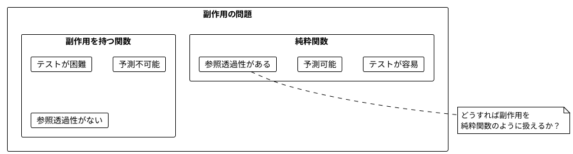
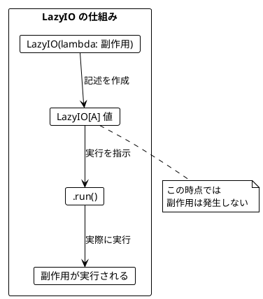
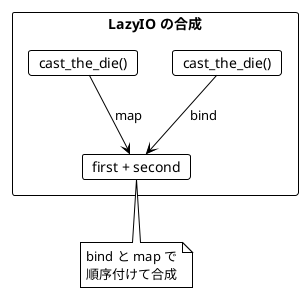
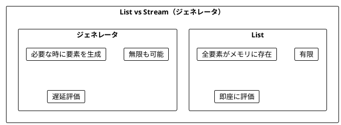
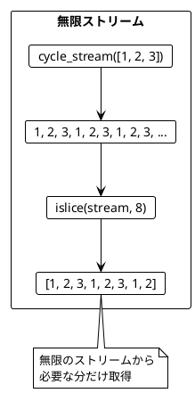
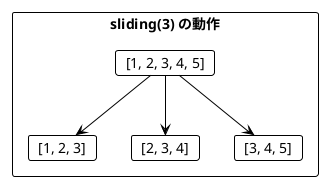
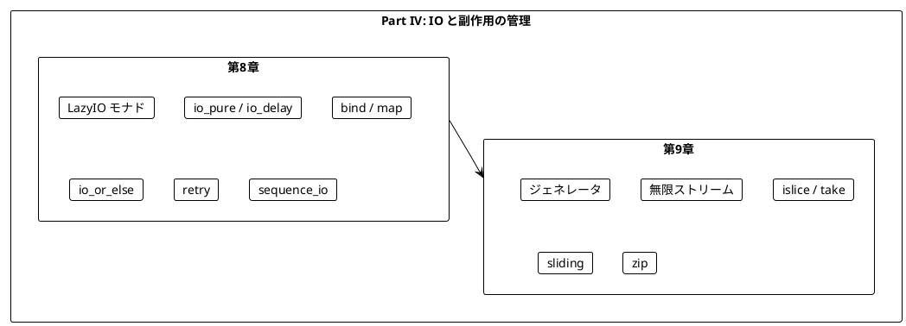

# Part IV: IO と副作用の管理

本章では、関数型プログラミングにおける副作用の扱い方を学びます。IO モナドを使って副作用を純粋関数内で安全に記述し、ストリーム処理で無限のデータを扱う方法を習得します。

---

## 第8章: IO モナドの導入

### 8.1 副作用の問題

純粋関数は副作用を持ちません。しかし、実際のプログラムには副作用が必要です:

- ファイルの読み書き
- ネットワーク通信
- データベースアクセス
- 乱数生成
- 現在時刻の取得



**ソースファイル**: `app/python/src/grokking_fp/ch08_io.py`

```python
import random

def cast_the_die_impure() -> int:
    """不純な関数: 呼び出すたびに異なる値を返す。"""
    return random.randint(1, 6)

# 呼び出すたびに異なる値が返る
print(cast_the_die_impure())  # 3
print(cast_the_die_impure())  # 5
print(cast_the_die_impure())  # 1
```

### 8.2 LazyIO モナドとは

**LazyIO モナド**は「副作用を持つ計算の**記述**」を表す型です。

- `LazyIO[A]` は「実行すると `A` 型の値を返す副作用のある計算」
- LazyIO 値を作成しただけでは副作用は発生しない
- `.run()` で実際に実行される



**ソースファイル**: `app/python/src/grokking_fp/ch08_io.py`

#### LazyIO の実装

```python
from collections.abc import Callable
from typing import Generic, TypeVar

T = TypeVar("T")
U = TypeVar("U")

class LazyIO(Generic[T]):
    """遅延評価する IO モナド。"""

    def __init__(self, effect: Callable[[], T]) -> None:
        self._effect = effect

    def run(self) -> T:
        """副作用を実行して結果を返す。"""
        return self._effect()

    def map(self, f: Callable[[T], U]) -> "LazyIO[U]":
        """値を変換する。"""
        return LazyIO(lambda: f(self.run()))

    def bind(self, f: Callable[[T], "LazyIO[U]"]) -> "LazyIO[U]":
        """IO を返す関数で変換する（flatMap）。"""
        return LazyIO(lambda: f(self.run()).run())
```

### 8.3 サイコロを振る例

#### LazyIO を使った純粋な記述

```python
def cast_the_die() -> LazyIO[int]:
    """LazyIO でラップした純粋な記述。"""
    return LazyIO(lambda: random.randint(1, 6))

# LazyIO 値を作成（この時点では実行されない）
die_cast = cast_the_die()
print(die_cast)  # LazyIO(...)

# 実際に実行
print(die_cast.run())  # 4
```

### 8.4 LazyIO の作成方法

| 関数 | 用途 | 例 |
|------|------|-----|
| `io_pure(value)` | 既存の値をラップ（副作用なし） | `io_pure(42)` |
| `io_delay(func)` | 副作用のある関数をラップ | `io_delay(lambda: print("hello"))` |

```python
def io_pure(value: T) -> LazyIO[T]:
    """既存の値を LazyIO にラップする。"""
    return LazyIO(lambda: value)

def io_delay(func: Callable[[], T]) -> LazyIO[T]:
    """副作用のある関数を LazyIO にラップする。"""
    return LazyIO(func)

# io_pure: 既存の値をラップ
pure_value = io_pure(42)
print(pure_value.run())  # 42

# io_delay: 副作用を遅延実行
counter = [0]
delayed = io_delay(lambda: counter.__setitem__(0, counter[0] + 1) or counter[0])
print(counter[0])  # 0 - まだ実行されていない
print(delayed.run())  # 1 - 実行された
```

### 8.5 LazyIO の合成

LazyIO 値は `bind` や `map` で合成できます。

```python
def cast_the_die_twice() -> LazyIO[int]:
    """サイコロを2回振って合計を返す。"""
    return cast_the_die().bind(
        lambda first: cast_the_die().map(lambda second: first + second)
    )

# まだ実行されていない
program = cast_the_die_twice()

# 実行
result = program.run()
print(result)  # 2 <= result <= 12
```



### 8.6 ミーティングスケジューリングの例

**ソースファイル**: `app/python/src/grokking_fp/ch08_io.py`

より実践的な例として、ミーティングのスケジューリングを見てみましょう。

```python
from dataclasses import dataclass

@dataclass(frozen=True)
class MeetingTime:
    """ミーティングの時間枠。"""
    start_hour: int
    end_hour: int

def meetings_overlap(meeting1: MeetingTime, meeting2: MeetingTime) -> bool:
    """2つのミーティングが重複しているかを判定する。"""
    return meeting1.start_hour < meeting2.end_hour and meeting2.start_hour < meeting1.end_hour
```

#### 空き時間の計算（純粋関数）

```python
def possible_meetings(
    existing_meetings: list[MeetingTime],
    start_hour: int,
    end_hour: int,
    length_hours: int,
) -> list[MeetingTime]:
    """空いている時間枠を計算する（純粋関数）。"""
    slots = [
        MeetingTime(start, start + length_hours)
        for start in range(start_hour, end_hour - length_hours + 1)
    ]
    return [
        slot
        for slot in slots
        if all(not meetings_overlap(meeting, slot) for meeting in existing_meetings)
    ]
```

#### カレンダー API の呼び出しを LazyIO でラップ

```python
def calendar_entries(name: str) -> LazyIO[list[MeetingTime]]:
    """カレンダー API 呼び出しを LazyIO でラップ。"""
    return LazyIO(lambda: calendar_entries_impure(name))

def scheduled_meetings(person1: str, person2: str) -> LazyIO[list[MeetingTime]]:
    """2人の予定を取得して結合する。"""
    return calendar_entries(person1).bind(
        lambda entries1: calendar_entries(person2).map(
            lambda entries2: entries1 + entries2
        )
    )
```

### 8.7 エラーハンドリングと orElse

LazyIO の `io_or_else` 関数で、失敗時のフォールバックを指定できます。

```python
def io_or_else(io: LazyIO[T], fallback: LazyIO[T]) -> LazyIO[T]:
    """IO が失敗した場合にフォールバックを使う。"""
    def run() -> T:
        try:
            return io.run()
        except Exception:
            return fallback.run()
    return LazyIO(run)

# 使用例
success = io_pure(42)
fallback = io_pure(0)
io_or_else(success, fallback).run()  # 42

def fail() -> int:
    raise ValueError("error")

failure = LazyIO(fail)
io_or_else(failure, fallback).run()  # 0
```

#### リトライ戦略

```python
def retry(action: LazyIO[T], max_retries: int, default: T) -> LazyIO[T]:
    """指定回数リトライし、全部失敗したらデフォルト値を返す。"""
    def run() -> T:
        for _ in range(max_retries):
            try:
                return action.run()
            except Exception:
                continue
        return default
    return LazyIO(run)

# 使用例
retry(calendar_entries("Alice"), 10, [])
```

### 8.8 sequence による LazyIO のリスト処理

`list[LazyIO[A]]` を `LazyIO[list[A]]` に変換するには `sequence_io` を使います。

```python
def sequence_io(ios: list[LazyIO[T]]) -> LazyIO[list[T]]:
    """IO のリストを、リストの IO に変換する。"""
    def run() -> list[T]:
        return [io.run() for io in ios]
    return LazyIO(run)

def traverse_io(items: list[T], f: Callable[[T], LazyIO[U]]) -> LazyIO[list[U]]:
    """リストの各要素に IO を返す関数を適用し、結果をまとめる。"""
    return sequence_io([f(item) for item in items])

# 使用例
ios = [io_pure(1), io_pure(2), io_pure(3)]
sequence_io(ios).run()  # [1, 2, 3]
```

---

## 第9章: ストリーム処理

### 9.1 ストリームとは

**ストリーム**は、要素の（潜在的に無限の）シーケンスを表します。Python ではジェネレータを使って実現します。



**ソースファイル**: `app/python/src/grokking_fp/ch09_streams.py`

### 9.2 基本的なストリーム

```python
from collections.abc import Generator
from itertools import count, islice

def stream_of(*args: T) -> Generator[T, None, None]:
    """有限ストリームを作成する。"""
    yield from args

def stream_range(start: int, end: int) -> Generator[int, None, None]:
    """範囲のストリームを作成する。"""
    yield from range(start, end)

# 使用例
list(stream_of(1, 2, 3))  # [1, 2, 3]
list(stream_range(1, 5))  # [1, 2, 3, 4]
```

### 9.3 無限ストリーム

```python
def infinite_stream(start: int = 0) -> Generator[int, None, None]:
    """無限の整数ストリームを作成する。"""
    yield from count(start)

def cycle_stream(items: list[T]) -> Generator[T, None, None]:
    """リストの要素を無限に繰り返すストリーム。"""
    while True:
        yield from items

# take で有限個を取得
list(islice(infinite_stream(), 5))  # [0, 1, 2, 3, 4]
list(islice(cycle_stream([1, 2, 3]), 8))  # [1, 2, 3, 1, 2, 3, 1, 2]
```



### 9.4 ストリームの主要操作

| 操作 | 説明 | 例 |
|------|------|-----|
| `stream_take(n)` | 最初の n 要素を取得 | `stream_take(stream, 3)` |
| `stream_filter(p)` | 条件を満たす要素のみ | `stream_filter(stream, lambda x: x > 0)` |
| `stream_map(f)` | 各要素を変換 | `stream_map(stream, lambda x: x * 2)` |
| `stream_append(s)` | 別のストリームを結合 | `stream_append(s1, s2)` |
| `stream_sliding(n)` | スライディングウィンドウ | `stream_sliding(stream, 3)` |

```python
def stream_take(stream: Iterator[T], n: int) -> Generator[T, None, None]:
    """ストリームから最初の n 要素を取得する。"""
    yield from islice(stream, n)

def stream_filter(stream: Iterator[T], predicate: Callable[[T], bool]) -> Generator[T, None, None]:
    """条件を満たす要素だけを返すストリーム。"""
    for item in stream:
        if predicate(item):
            yield item

def stream_map(stream: Iterator[T], f: Callable[[T], U]) -> Generator[U, None, None]:
    """各要素を変換するストリーム。"""
    for item in stream:
        yield f(item)
```

### 9.5 スライディングウィンドウ

`stream_sliding` で連続する要素をグループ化できます。

```python
from collections import deque

def stream_sliding(stream: Iterator[T], window_size: int) -> Generator[list[T], None, None]:
    """スライディングウィンドウを生成する。"""
    window: deque[T] = deque(maxlen=window_size)
    for item in stream:
        window.append(item)
        if len(window) == window_size:
            yield list(window)

# 使用例
list(stream_sliding(stream_of(1, 2, 3, 4, 5), 3))
# [[1, 2, 3], [2, 3, 4], [3, 4, 5]]
```



### 9.6 サイコロの例

**ソースファイル**: `app/python/src/grokking_fp/ch09_streams.py`

```python
def cast_die_stream() -> Generator[int, None, None]:
    """サイコロを無限に振るストリーム。"""
    while True:
        yield random.randint(1, 6)

def first_six() -> Generator[int, None, None]:
    """6 が出るまでサイコロを振り続ける。"""
    for die in cast_die_stream():
        yield die
        if die == 6:
            break

# 使用例
list(stream_take(cast_die_stream(), 10))  # [4, 2, 6, 1, 3, 5, 2, 4, 6, 1]
list(first_six())  # [..., 6]
```

### 9.7 通貨交換レートの例

**ソースファイル**: `app/python/src/grokking_fp/ch09_streams.py`

為替レートを監視して、上昇トレンドを検出する例です。

```python
from decimal import Decimal
from enum import Enum

class Currency(Enum):
    USD = "USD"
    EUR = "EUR"
    JPY = "JPY"
    GBP = "GBP"

def exchange_rate_stream(
    from_currency: Currency, to_currency: Currency
) -> Generator[Decimal, None, None]:
    """為替レートを継続的に取得するストリーム。"""
    while True:
        yield get_exchange_rate(from_currency, to_currency)
```

#### トレンド判定（純粋関数）

```python
def trending(rates: list[Decimal]) -> bool:
    """レートが上昇トレンドかどうかを判定する。"""
    if len(rates) < 2:
        return False
    return all(rates[i] < rates[i + 1] for i in range(len(rates) - 1))

trending([Decimal("0.81"), Decimal("0.82"), Decimal("0.83")])  # True
trending([Decimal("0.81"), Decimal("0.84"), Decimal("0.83")])  # False
```

#### トレンドを検出して交換

```python
def find_trending_window(
    from_currency: Currency, to_currency: Currency, window_size: int = 3
) -> list[Decimal]:
    """上昇トレンドのウィンドウを見つける。"""
    rate_stream = exchange_rate_stream(from_currency, to_currency)
    windows = stream_sliding(rate_stream, window_size)

    for window in stream_take(windows, 100):
        if trending(window):
            return window
    return []
```

### 9.8 ストリームの結合

2つのストリームを `stream_zip` で結合できます。

```python
def stream_zip(stream1: Iterator[T], stream2: Iterator[U]) -> Generator[tuple[T, U], None, None]:
    """2つのストリームを zip する。"""
    yield from zip(stream1, stream2)

# 使用例
list(stream_zip(stream_of(1, 2, 3), stream_of("a", "b", "c")))
# [(1, 'a'), (2, 'b'), (3, 'c')]
```

### 9.9 ストリームの集約

```python
def stream_sum(stream: Iterator[int | float | Decimal]) -> int | float | Decimal:
    """ストリームの合計を計算する。"""
    return sum(stream)

def stream_reduce(stream: Iterator[T], f: Callable[[U, T], U], initial: U) -> U:
    """ストリームを畳み込む。"""
    result = initial
    for item in stream:
        result = f(result, item)
    return result

def stream_find(stream: Iterator[T], predicate: Callable[[T], bool]) -> T | None:
    """条件を満たす最初の要素を見つける。"""
    for item in stream:
        if predicate(item):
            return item
    return None
```

---

## まとめ

### Part IV で学んだこと



### LazyIO と ジェネレータの比較

| 特性 | LazyIO[A] | Generator[A] |
|------|-----------|--------------|
| 要素数 | 1つ | 0個以上（無限も可） |
| 実行 | `.run()` | `list()` または `next()` |
| 用途 | 単一の副作用 | 連続した値の生成 |

### キーポイント

1. **LazyIO モナド**: 副作用を「記述」として扱い、実行を遅延させる
2. **io_delay**: 副作用のある式を LazyIO にラップ
3. **io_or_else**: 失敗時のフォールバックを指定
4. **sequence_io**: `list[LazyIO[A]]` → `LazyIO[list[A]]`
5. **ジェネレータ**: 潜在的に無限のシーケンスを遅延評価で処理
6. **sliding**: 連続する要素をグループ化してパターンを検出

### Python 特有のポイント

- **ジェネレータ**: `yield` を使った遅延評価
- **`itertools`**: `count`, `islice`, `repeat` などの便利な関数
- **`deque`**: スライディングウィンドウの効率的な実装
- **`Decimal`**: 金融計算での精度保証

---

## 演習問題

### 問題 1: LazyIO の基本

以下の関数を実装してください。

```python
def print_and_return(message: str) -> LazyIO[str]:
    """メッセージを出力して返す。"""
    ...

# 期待される動作
# print_and_return("Hello").run() は
# "Hello" をコンソールに出力し、"Hello" を返す
```

<details>
<summary>解答</summary>

```python
def print_and_return(message: str) -> LazyIO[str]:
    return LazyIO(lambda: (print(message), message)[1])

# または
def print_and_return(message: str) -> LazyIO[str]:
    def effect() -> str:
        print(message)
        return message
    return LazyIO(effect)
```

</details>

### 問題 2: LazyIO の合成

以下の関数を実装してください。2つの LazyIO を順番に実行し、結果を結合します。

```python
def combine_io(io1: LazyIO[T], io2: LazyIO[U], f: Callable[[T, U], V]) -> LazyIO[V]:
    ...

# 期待される動作
result = combine_io(io_pure(1), io_pure(2), lambda a, b: a + b)
result.run()  # 3
```

<details>
<summary>解答</summary>

```python
def combine_io(io1: LazyIO[T], io2: LazyIO[U], f: Callable[[T, U], V]) -> LazyIO[V]:
    return io1.bind(lambda a: io2.map(lambda b: f(a, b)))
```

</details>

### 問題 3: ストリーム操作

以下のストリームを作成してください。

```python
# 1. 1から10までの偶数のストリーム
evens = ???

# 2. 無限に交互に true/false を返すストリーム
alternating = ???

# 3. 最初の5つの要素の合計を計算
total = stream_sum(stream_take(stream_range(1, 100), 5))
```

<details>
<summary>解答</summary>

```python
# 1. 1から10までの偶数
evens = stream_filter(stream_range(1, 11), lambda x: x % 2 == 0)
# または
evens = stream_of(2, 4, 6, 8, 10)

# 2. 無限に交互に true/false
alternating = cycle_stream([True, False])

# 3. 最初の5つの要素の合計
total = stream_sum(stream_take(stream_range(1, 100), 5))  # 15
```

</details>

### 問題 4: トレンド検出

直近3つの値が全て同じかどうかを判定する関数を実装してください。

```python
def is_stable(values: list[Decimal]) -> bool:
    ...

# 期待される動作
assert is_stable([Decimal("5"), Decimal("5"), Decimal("5")]) == True
assert is_stable([Decimal("5"), Decimal("5"), Decimal("6")]) == False
assert is_stable([Decimal("5")]) == False  # 2つ未満は False
```

<details>
<summary>解答</summary>

```python
def is_stable(values: list[Decimal]) -> bool:
    if len(values) < 2:
        return False
    return len(set(values)) == 1
```

</details>
