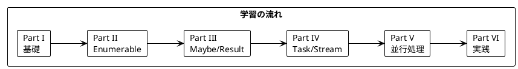
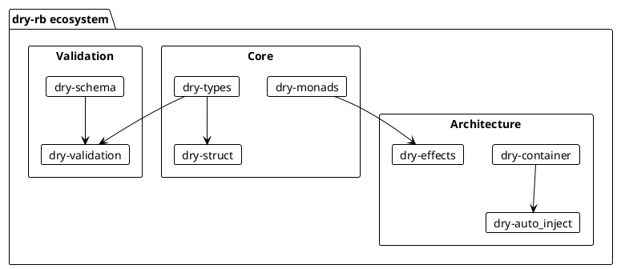

# Grokking Functional Programming - Ruby dry-rb 版

本シリーズは「Grokking Functional Programming」（Michał Płachta 著）の学習コンパニオンとして、関数型プログラミングの概念を Ruby と [dry-rb](https://dry-rb.org/) ライブラリで実装しながら日本語で解説します。

---

## 対象読者

- Ruby の経験があり、関数型プログラミングに興味がある開発者
- 型安全なエラーハンドリングを Ruby で実現したい方
- 実践的な FP の適用方法を Ruby で学びたいエンジニア

---

## 記事一覧

### [Part I: 関数型プログラミングの基礎](part-1.md)

関数型プログラミングの基本概念を Ruby で学びます。

| 章 | トピック |
|----|----------|
| 第1章 | 命令型 vs 関数型、Ruby 基本構文 |
| 第2章 | 純粋関数、副作用の排除、freeze |

**キーワード**: 純粋関数、参照透過性、イミュータブル、freeze

---

### [Part II: 関数型スタイルのプログラミング](part-2.md)

イミュータブルなデータ操作と高階関数を学びます。

| 章 | トピック |
|----|----------|
| 第3章 | イミュータブルデータ、dry-struct |
| 第4章 | 高階関数、map/select/reduce、Enumerable |
| 第5章 | flat_map、チェイニング |

**キーワード**: イミュータブル、高階関数、Enumerable、dry-struct

---

### [Part III: エラーハンドリングと Maybe/Result](part-3.md)

dry-monads を使った型安全なエラーハンドリングを学びます。

| 章 | トピック |
|----|----------|
| 第6章 | Maybe 型、Some/None |
| 第7章 | Result 型、Success/Failure、パターンマッチング |

**キーワード**: Maybe、Result、dry-monads、Railway Oriented Programming

---

### [Part IV: IO と副作用の管理](part-4.md)

Task モナドと遅延評価を学びます。

| 章 | トピック |
|----|----------|
| 第8章 | Task モナド、Lazy、副作用の分離 |
| 第9章 | ストリーム処理、Enumerator::Lazy |

**キーワード**: Task、Lazy、遅延評価、ストリーム処理

---

### [Part V: 並行処理](part-5.md)

Ruby における並行処理を学びます。

| 章 | トピック |
|----|----------|
| 第10章 | Fiber、async gem、Ractor |
| 第11章 | 並行パターン、concurrent-ruby |

**キーワード**: Fiber、async、concurrent-ruby、並行処理

---

### [Part VI: 実践的なアプリケーション構築とテスト](part-6.md)

実践的なアプリケーション構築とテスト戦略を学びます。

| 章 | トピック |
|----|----------|
| 第12章 | TravelGuide アプリ、依存性注入、テスト戦略 |

**キーワード**: dry-auto_inject、依存性注入、RSpec、プロパティベーステスト

---

## 学習パス



---

## 使用ライブラリ

| ライブラリ | 用途 | 対応章 |
|------------|------|--------|
| Ruby 3.2+ | 言語 | 全章 |
| dry-monads | Maybe/Result/Task | Part III-VI |
| dry-struct | イミュータブル構造体 | Part II-VI |
| dry-types | 型システム | Part II-VI |
| dry-auto_inject | 依存性注入 | Part VI |
| dry-validation | バリデーション | Part VI |
| concurrent-ruby | 並行処理 | Part V |
| rspec | テストフレームワーク | 全章 |
| rspec-its | プロパティベーステスト | Part VI |

---

## リポジトリ構成

```
grokkingfp-examples/
├── app/ruby/lib/              # Ruby のサンプルコード
│   ├── ch01_intro.rb          # 第1章
│   ├── ch02_pure_functions.rb # 第2章
│   └── ...                    # 以降の章
├── app/ruby/spec/             # テストコード
├── app/ruby/Gemfile           # 依存関係
└── docs/article/ruby/         # 解説記事（本ディレクトリ）
    ├── index.md               # この記事
    ├── part-1.md              # Part I
    ├── part-2.md              # Part II
    ├── part-3.md              # Part III
    ├── part-4.md              # Part IV
    ├── part-5.md              # Part V
    └── part-6.md              # Part VI
```

---

## Ruby と関数型プログラミング

Ruby は関数型プログラミングの多くの概念をサポートしています:

### 高階関数

```ruby
def apply_twice(f, x)
  f.call(f.call(x))
end

result = apply_twice(->(x) { x + 1 }, 5)  # => 7

# ブロックを使用
[1, 2, 3].map { |x| x * 2 }  # => [2, 4, 6]
```

### イミュータブルデータ（dry-struct）

```ruby
require 'dry-struct'

module Types
  include Dry.Types()
end

class Point < Dry::Struct
  attribute :x, Types::Integer
  attribute :y, Types::Integer
end

p1 = Point.new(x: 1, y: 2)
p2 = Point.new(x: 3, y: p1.y)  # 新しいオブジェクトを生成
```

### Enumerable と遅延評価

```ruby
numbers = [1, 2, 3, 4, 5]
result = numbers
  .lazy
  .map { |x| x * 2 }
  .select { |x| x > 4 }
  .force  # => [6, 8, 10]
```

### dry-monads による型安全なエラーハンドリング

```ruby
require 'dry/monads'

class Calculator
  include Dry::Monads[:maybe, :result]

  def safe_divide(a, b)
    return None() if b.zero?
    Some(a.to_f / b)
  end

  def parse_int(str)
    Integer(str)
    Success(Integer(str))
  rescue ArgumentError
    Failure("Cannot parse '#{str}' as int")
  end
end
```

### パイプライン処理

```ruby
require 'dry/monads'

include Dry::Monads[:maybe]

result = Some(5)
  .fmap { |x| x * 2 }
  .fmap { |x| x + 1 }  # => Some(11)

# bind でフラットに
Some(5)
  .bind { |x| Some(x * 2) }
  .bind { |x| Some(x + 1) }  # => Some(11)
```

---

## Scala との対比

| 概念 | Scala | Ruby (dry-rb) |
|------|-------|---------------|
| イミュータブル変数 | `val` | `freeze` / dry-struct |
| null 安全 | `Option[T]` | `Maybe` (Some/None) |
| エラー処理 | `Either[E, A]` | `Result` (Success/Failure) |
| 高階関数 | `map`, `flatMap` | `fmap`, `bind` |
| パターンマッチ | `match` | `case in` (3.0+) / `value_or` |
| トレイト | `trait` | `Module` / Duck typing |
| ジェネリクス | `def foo[T]` | Duck typing |
| 非同期 | `IO[A]` (cats-effect) | `Task` / async |

---

## dry-rb エコシステム

dry-rb は Ruby で関数型プログラミングを行うための統合的なエコシステムを提供します:



### 主要コンポーネント

| ライブラリ | 用途 |
|------------|------|
| dry-monads | Maybe、Result、Task などのモナド |
| dry-types | 型定義と型変換 |
| dry-struct | イミュータブルな値オブジェクト |
| dry-validation | スキーマベースのバリデーション |
| dry-auto_inject | 依存性注入 |
| dry-effects | 代数的効果 |

---

## 関数型プログラミングの利点

本シリーズを通じて、以下の利点を実感できます:

1. **予測可能性** - 純粋関数は同じ入力に対して常に同じ出力
2. **テスト容易性** - 副作用がないためテストが簡単
3. **合成可能性** - 小さな関数を組み合わせて複雑な処理を構築
4. **並行安全性** - イミュータブルデータは競合状態を防ぐ
5. **型安全性** - Maybe、Result で nil や例外を型で表現

---

## 参考資料

- [Grokking Functional Programming](https://www.manning.com/books/grokking-functional-programming) - 原著
- [dry-rb 公式ドキュメント](https://dry-rb.org/) - Ruby FP エコシステム
- [dry-monads ドキュメント](https://dry-rb.org/gems/dry-monads/) - モナドライブラリ
- [Ruby 公式ドキュメント](https://docs.ruby-lang.org/)
- [RSpec ドキュメント](https://rspec.info/)
- [concurrent-ruby](https://github.com/ruby-concurrency/concurrent-ruby) - 並行処理ライブラリ
