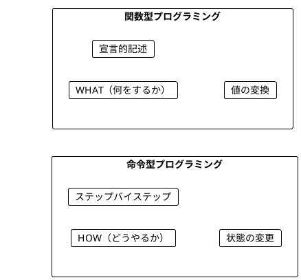
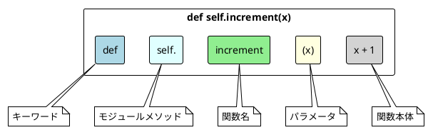
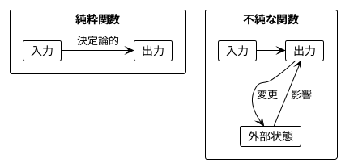
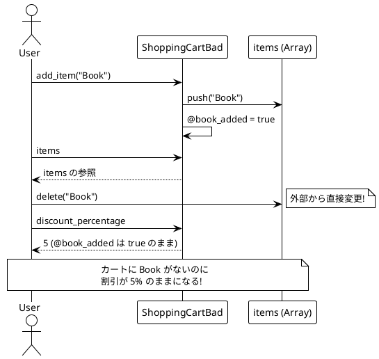
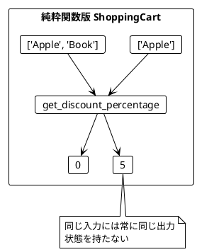
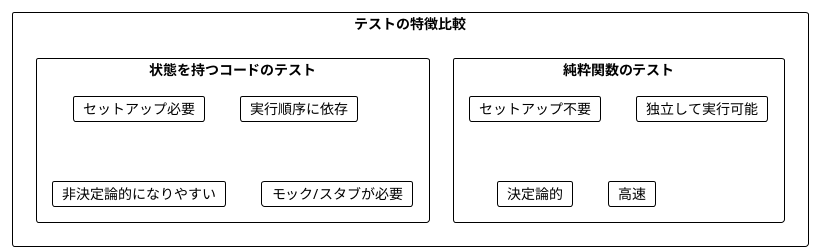
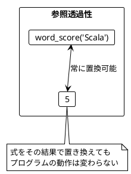
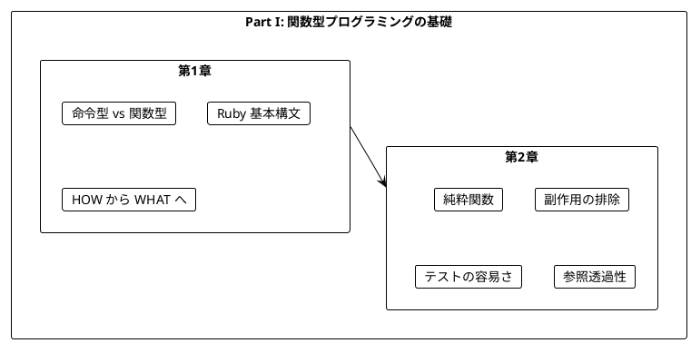

# Part I: 関数型プログラミングの基礎

本章では、関数型プログラミング（FP）の基本概念を Ruby で学びます。命令型プログラミングとの違いを理解し、純粋関数の利点を実感することが目標です。

---

## 第1章: 関数型プログラミング入門

### 1.1 命令型 vs 関数型

プログラミングには大きく分けて2つのパラダイムがあります。



**命令型プログラミング**は「どうやるか」を記述します。

**ソースファイル**: `app/ruby/lib/ch01_intro.rb`

```ruby
# 命令型: ステップバイステップでスコアを計算
def calculate_score_imperative(word)
  score = 0
  word.each_char do |_c|
    score += 1
  end
  score
end
```

**関数型プログラミング**は「何をするか」を記述します。

```ruby
# 関数型: 宣言的にスコアを計算
def word_score(word)
  word.length
end
```

### 1.2 Ruby の基本構文

Ruby での関数定義の基本形を見てみましょう。

```ruby
module Ch01Intro
  # 数値をインクリメント
  def self.increment(x)
    x + 1
  end

  # 文字列の最初の文字を取得
  def self.get_first_character(s)
    s[0]
  end

  # ワードスコア（文字数）を計算
  def self.word_score(word)
    word.length
  end
end
```

### 1.3 関数の構造



### 1.4 条件分岐と述語関数

Ruby では条件分岐を式として扱います。

```ruby
# 絶対値を返す
def self.absolute(x)
  x >= 0 ? x : -x
end

# 値をクランプ（範囲内に収める）
def self.clamp(value, min_val, max_val)
  min_value(max_value(value, min_val), max_val)
end
```

**述語関数**（真偽値を返す関数）:

```ruby
# Ruby では ? で終わるメソッド名が慣例
def self.even?(n)
  (n % 2).zero?
end

def self.positive?(n)
  n > 0
end

def self.empty?(s)
  s.empty?
end
```

### 1.5 学習ポイント

| 概念 | 命令型 | 関数型 |
|------|--------|--------|
| 焦点 | 手順（How） | 結果（What） |
| 状態 | 変更する | 変換する |
| ループ | each/while | map/select/reduce |
| データ | ミュータブル | イミュータブル |

---

## 第2章: 純粋関数とテスト

### 2.1 純粋関数とは

純粋関数（Pure Function）は以下の特徴を持つ関数です:

1. **同じ入力には常に同じ出力を返す**
2. **副作用がない**（外部状態を変更しない）



### 2.2 純粋関数の例

**ソースファイル**: `app/ruby/lib/ch02_pure_functions.rb`

```ruby
module Ch02PureFunctions
  # 純粋関数: 2つの数を加算
  def self.add(a, b)
    a + b
  end

  # 純粋関数: 文字列の長さを取得
  def self.string_length(s)
    s.length
  end

  # 純粋関数: ワードスコアを計算
  def self.word_score(word)
    word.length
  end
end
```

**純粋ではない関数の例**:

```ruby
# 不純: 毎回異なる値を返す
def self.random_number_impure
  rand
end

# 不純: 外部に出力（副作用）
def self.print_impure(message)
  puts message
end

# 不純: 現在時刻に依存
def self.current_time_impure
  Time.now
end
```

### 2.3 ショッピングカートの例

状態を持つクラスの問題点を見てみましょう。

#### 問題のあるコード

```ruby
class ShoppingCartBad
  def initialize
    @items = []
    @book_added = false
  end

  def add_item(item)
    @items << item
    @book_added = true if item == 'Book'
  end

  def discount_percentage
    @book_added ? 5 : 0
  end

  def items
    @items  # 問題: 内部状態への参照を返している
  end
end
```



#### 純粋関数による解決

```ruby
module ShoppingCart
  # 純粋関数: 入力に基づいて割引を計算
  def self.get_discount_percentage(items)
    items.include?('Book') ? 5 : 0
  end

  def self.calculate_final_price(total, items)
    discount_percentage = get_discount_percentage(items)
    discount = total * discount_percentage / 100.0
    total - discount
  end
end
```



### 2.4 チップ計算の例

```ruby
module TipCalculator
  def self.get_tip_percentage(names)
    if names.size > 5
      20
    elsif names.size > 0
      10
    else
      0
    end
  end

  def self.calculate_tip(bill_amount, names)
    percentage = get_tip_percentage(names)
    bill_amount * percentage / 100.0
  end
end
```

この関数は:
- 6人以上のグループ → 20% のチップ
- 1-5人のグループ → 10% のチップ
- 0人（空リスト） → 0% のチップ

### 2.5 純粋関数のテスト

純粋関数は非常にテストしやすいです。

```ruby
RSpec.describe Ch02PureFunctions do
  describe '.word_score' do
    it 'returns the length of the word' do
      expect(described_class.word_score('Ruby')).to eq(4)
    end

    it 'is deterministic (same input = same output)' do
      score1 = described_class.word_score('Scala')
      score2 = described_class.word_score('Scala')
      expect(score1).to eq(score2)
    end
  end

  describe '.get_discount_percentage' do
    it 'returns 5% when cart contains Book' do
      expect(described_class.get_discount_percentage(%w[Apple Book])).to eq(5)
    end

    it 'returns 0% when cart does not contain Book' do
      expect(described_class.get_discount_percentage(%w[Apple])).to eq(0)
    end
  end
end
```



### 2.6 文字 'a' を除外するワードスコア

より複雑な例を見てみましょう。

```ruby
def self.word_score_no_a(word)
  word.gsub(/[aA]/, '').length
end

# テスト
expect(word_score_no_a('Scala')).to eq(3)   # "Scl" → 3文字
expect(word_score_no_a('function')).to eq(8) # 'a' なし → 8文字
expect(word_score_no_a('')).to eq(0)         # 空文字 → 0文字
```

### 2.7 参照透過性

純粋関数は**参照透過性（Referential Transparency）**を持ちます。

> 式をその評価結果で置き換えても、プログラムの意味が変わらないこと

```ruby
# 参照透過性の例
score1 = word_score('Scala')
score2 = word_score('Scala')
# score1 と score2 は常に同じ値（5）

# 以下の2つは同等
total1 = word_score('Scala') + word_score('Java')
total2 = 5 + 4  # word_score の結果で置き換え可能
```



### 2.8 Ruby でのイミュータビリティ

Ruby ではオブジェクトを `freeze` でイミュータブルにできます。

```ruby
# freeze でオブジェクトを不変にする
str = 'hello'.freeze
str.upcase!  # => FrozenError!

# 深い freeze
def self.deep_freeze(obj)
  case obj
  when Array
    obj.each { |item| deep_freeze(item) }
    obj.freeze
  when Hash
    obj.each_value { |value| deep_freeze(value) }
    obj.freeze
  else
    obj.freeze if obj.respond_to?(:freeze)
  end
  obj
end

# イミュータブルな配列を作成
arr = deep_freeze([1, 2, 3])
arr << 4  # => FrozenError!
```

### 2.9 高階関数の基礎

関数を値として扱う:

```ruby
# 関数を引数として受け取る
def self.apply_twice(f, x)
  f.call(f.call(x))
end

increment = ->(x) { x + 1 }
apply_twice(increment, 5)  # => 7

# 関数を返す
def self.compose(f, g)
  ->(x) { f.call(g.call(x)) }
end

add_one = ->(x) { x + 1 }
double = ->(x) { x * 2 }
composed = compose(add_one, double)
composed.call(3)  # => 7 (double(3) = 6, add_one(6) = 7)
```

---

## まとめ

### Part I で学んだこと



### キーポイント

1. **関数型プログラミング**は「何をするか」を宣言的に記述する
2. **純粋関数**は同じ入力に対して常に同じ出力を返す
3. **副作用**を避けることでコードの予測可能性が向上する
4. **純粋関数**はテストが非常に簡単
5. **参照透過性**により、コードの理解と推論が容易になる
6. **freeze**を使ってイミュータビリティを強制できる

### 次のステップ

Part II では、以下のトピックを学びます:

- dry-struct によるイミュータブルなデータ構造
- Enumerable による高階関数操作
- flat_map とチェイニング

---

## 演習問題

### 問題 1: 純粋関数の識別

以下の関数のうち、純粋関数はどれですか?

```ruby
# A
def double(x)
  x * 2
end

# B
$counter = 0
def increment_counter
  $counter += 1
  $counter
end

# C
def greet(name)
  "Hello, #{name}!"
end

# D
def current_time
  Time.now
end
```

<details>
<summary>解答</summary>

**A と C は純粋関数**です。

- A: 同じ入力に対して常に同じ出力を返し、副作用がない
- B: グローバル変数 `$counter` を変更する副作用がある（不純）
- C: 同じ入力に対して常に同じ出力を返し、副作用がない
- D: 呼び出すたびに異なる値を返す（不純）

</details>

### 問題 2: 純粋関数への書き換え

以下の不純なクラスを純粋関数に書き換えてください。

```ruby
class Counter
  def initialize
    @value = 0
  end

  def increment
    @value += 1
    @value
  end
end
```

<details>
<summary>解答</summary>

```ruby
module Counter
  def self.increment(value)
    value + 1
  end
end

# 使用例
v1 = 0
v2 = Counter.increment(v1)  # 1
v3 = Counter.increment(v2)  # 2
```

状態を外部に持ち、関数は値を受け取って新しい値を返すだけにします。

</details>

### 問題 3: テストを書く

以下の関数に対するテストケースを考えてください。

```ruby
def even?(n)
  (n % 2).zero?
end
```

<details>
<summary>解答</summary>

```ruby
RSpec.describe '#even?' do
  # 基本ケース
  it 'returns true for 0' do
    expect(even?(0)).to be true
  end

  it 'returns true for even positive numbers' do
    expect(even?(2)).to be true
    expect(even?(4)).to be true
  end

  it 'returns false for odd numbers' do
    expect(even?(1)).to be false
    expect(even?(3)).to be false
  end

  # 負の数
  it 'returns true for negative even numbers' do
    expect(even?(-2)).to be true
  end

  it 'returns false for negative odd numbers' do
    expect(even?(-3)).to be false
  end
end
```

</details>

### 問題 4: 高階関数

`apply_twice` を使って、数値を4倍する関数を作成してください。

<details>
<summary>解答</summary>

```ruby
def apply_twice(f, x)
  f.call(f.call(x))
end

double = ->(x) { x * 2 }

# apply_twice で2回 double を適用 = 4倍
result = apply_twice(double, 5)  # => 20

# または新しい関数として
quadruple = ->(x) { apply_twice(double, x) }
quadruple.call(3)  # => 12
```

</details>

### 問題 5: freeze の使用

以下の配列を深くフリーズして、変更不可能にしてください。

```ruby
data = [
  { name: 'Alice', scores: [90, 85, 92] },
  { name: 'Bob', scores: [78, 82, 88] }
]
```

<details>
<summary>解答</summary>

```ruby
def deep_freeze(obj)
  case obj
  when Array
    obj.each { |item| deep_freeze(item) }
    obj.freeze
  when Hash
    obj.each_value { |value| deep_freeze(value) }
    obj.freeze
  when String
    obj.freeze
  else
    obj.freeze if obj.respond_to?(:freeze)
  end
  obj
end

data = [
  { name: 'Alice', scores: [90, 85, 92] },
  { name: 'Bob', scores: [78, 82, 88] }
]

frozen_data = deep_freeze(data)

# これらはすべて FrozenError を発生させる
frozen_data << {}                    # エラー
frozen_data[0][:name] = 'Carol'      # エラー
frozen_data[0][:scores] << 95        # エラー
```

</details>
