# Part II: 関数型スタイルのプログラミング

本章では、関数型プログラミングの核心となるテクニックを学びます。イミュータブルなデータ操作、高階関数、そして `flat_map` による複雑なデータ変換を習得します。

---

## 第3章: イミュータブルなデータ操作

### 3.1 イミュータブルとは

イミュータブル（不変）とは、一度作成されたデータが変更されないことを意味します。データを「変更」する代わりに、新しいデータを「作成」します。

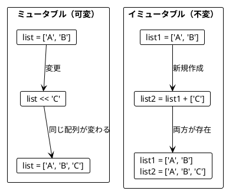

**ソースファイル**: `app/ruby/src/ch03_immutable_values.rb`

### 3.2 Array の基本操作

Ruby では `+` 演算子を使って新しい配列を作成します。

#### appended - 要素の追加

```ruby
def self.appended(list, element)
  list + [element]
end

apple_book = %w[Apple Book]
apple_book_mango = appended(apple_book, 'Mango')

# 元のリストは変わらない
apple_book.size        # => 2
apple_book_mango.size  # => 3
apple_book_mango       # => ["Apple", "Book", "Mango"]
```

#### take / drop / slice - 配列の切り出し

```ruby
def self.first_two(list)
  list.take(2)
end

def self.last_two(list)
  list.last(2)
end

def self.slice(list, start_idx, end_idx)
  list[start_idx...end_idx] || []
end

first_two(%w[a b c])  # => ["a", "b"]
last_two(%w[a b c])   # => ["b", "c"]
slice(%w[a b c d], 1, 3)  # => ["b", "c"]
```

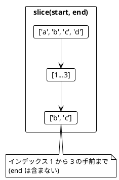

### 3.3 リストの変換例

```ruby
# 最初の2要素を末尾に移動
def self.moved_first_two_to_end(list)
  return list if list.size <= 2

  first_two = list.take(2)
  rest = list.drop(2)
  rest + first_two
end

moved_first_two_to_end(%w[a b c])  # => ["c", "a", "b"]

# 最後の要素の前に挿入
def self.inserted_before_last(list, element)
  return [element] if list.empty?

  without_last = list[0...-1]
  last_elem = list[-1..]
  without_last + [element] + last_elem
end

inserted_before_last(%w[a b], 'c')  # => ["a", "c", "b"]
```

### 3.4 旅程の再計画

旅行の計画変更をイミュータブルに行う例です。

```ruby
def self.replan(plan, new_city, before_city)
  index = plan.index(before_city)
  return plan if index.nil?

  before = plan.take(index)
  after = plan.drop(index)
  before + [new_city] + after
end

plan_a = %w[Paris Berlin Kraków]
plan_b = replan(plan_a, 'Vienna', 'Kraków')

plan_b  # => ["Paris", "Berlin", "Vienna", "Kraków"]
plan_a  # => ["Paris", "Berlin", "Kraków"]  # 元の計画は変わらない!
```

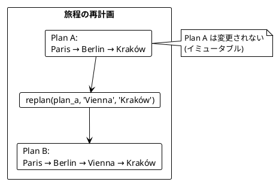

### 3.5 名前の省略

```ruby
def self.abbreviate(name)
  separator_idx = name.index(' ')
  return name if separator_idx.nil?

  initial = name[0]
  last_name = name[(separator_idx + 1)..]
  "#{initial}. #{last_name}"
end

abbreviate('Alonzo Church')  # => "A. Church"
abbreviate('A. Church')      # => "A. Church"
```

---

## 第4章: 関数を値として扱う

### 4.1 高階関数とは

高階関数（Higher-Order Function）とは、以下のいずれかを満たす関数です:

1. 関数を引数として受け取る
2. 関数を戻り値として返す

**ソースファイル**: `app/ruby/src/ch04_functions_as_values.rb`

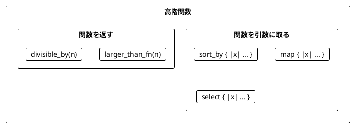

### 4.2 関数を引数として渡す

#### sort_by - ソート基準を関数で指定

```ruby
def self.score(word)
  word.gsub(/a/i, '').length
end

words = %w[rust java]
sorted_words = words.sort_by { |w| score(w) }

sorted_words  # => ["java", "rust"]
# java: 2文字 (j, v), rust: 4文字 (r, u, s, t)
```

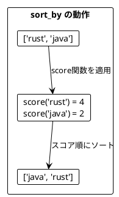

#### map - 各要素を変換

```ruby
def self.lengths(strings)
  strings.map(&:length)
end

lengths(%w[scala rust ada])  # => [5, 4, 3]

def self.double_all(numbers)
  numbers.map { |n| n * 2 }
end

double_all([5, 1, 2, 4, 0])  # => [10, 2, 4, 8, 0]
```

#### select / filter - 条件に合う要素を抽出

```ruby
def self.odds(numbers)
  numbers.select(&:odd?)
end

odds([5, 1, 2, 4, 0])  # => [5, 1]

def self.larger_than(numbers, n)
  numbers.select { |i| i > n }
end

larger_than([5, 1, 2, 4, 0], 4)  # => [5]
```

#### reduce / fold - 畳み込み

```ruby
def self.sum(numbers)
  numbers.reduce(0, :+)
end

sum([5, 1, 2, 4, 100])  # => 112

def self.maximum(numbers)
  return nil if numbers.empty?
  numbers.reduce { |max, n| n > max ? n : max }
end

maximum([5, 1, 2, 4, 15])  # => 15
```

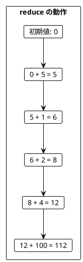

### 4.3 Struct（case class 相当）

```ruby
# Struct を使った不変データ型
ProgrammingLanguage = Struct.new(:name, :year, keyword_init: true) do
  def young?(threshold_year)
    year > threshold_year
  end
end

java = ProgrammingLanguage.new(name: 'Java', year: 1995)
scala = ProgrammingLanguage.new(name: 'Scala', year: 2004)

languages = [java, scala]

# フィールドにアクセス
names = languages.map(&:name)
names  # => ["Java", "Scala"]

# 条件でフィルタ
young = languages.select { |lang| lang.year > 2000 }
young.map(&:name)  # => ["Scala"]
```

### 4.4 関数を返す関数

```ruby
def self.larger_than_fn(n)
  ->(i) { i > n }
end

large = [5, 1, 2, 4, 0].select(&larger_than_fn(4))
large  # => [5]

medium = [5, 1, 2, 4, 0].select(&larger_than_fn(1))
medium  # => [5, 2, 4]
```

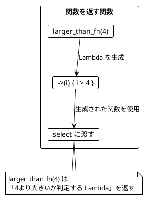

### 4.5 カリー化

カリー化（Currying）は、複数の引数を取る関数を、引数を1つずつ取る関数のチェーンに変換する技法です。

```ruby
# カリー化された関数
def self.larger_than_curried
  ->(n) { ->(i) { i > n } }
end

# 使用例
larger_than = larger_than_curried
larger_than_5 = larger_than.call(5)
larger_than_5.call(10)  # => true
larger_than_5.call(3)   # => false

# proc の curry メソッドも使える
add = ->(a, b) { a + b }
add_curried = add.curry
add_5 = add_curried.call(5)
add_5.call(3)  # => 8
```

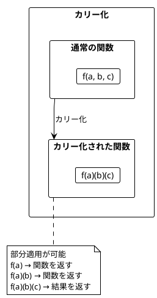

### 4.6 ワードスコアリングの例

複数のスコアリングロジックを組み合わせる例です。

```ruby
def self.score(word)
  word.gsub(/a/i, '').length
end

def self.bonus(word)
  word.downcase.include?('c') ? 5 : 0
end

def self.penalty(word)
  word.downcase.include?('s') ? 7 : 0
end

words = %w[ada haskell scala java rust]

# 関数を引数として渡す
def self.ranked_words(words, &score_fn)
  words.sort_by(&score_fn).reverse
end

# 基本スコアでランキング
ranking1 = ranked_words(words) { |w| score(w) }
ranking1  # => ["haskell", "rust", "scala", "java", "ada"]

# ボーナス付きスコアでランキング
ranking2 = ranked_words(words) { |w| score(w) + bonus(w) }
ranking2.first  # => "scala"

# ボーナスとペナルティ付きスコアでランキング
ranking3 = ranked_words(words) { |w| score(w) + bonus(w) - penalty(w) }
ranking3.first  # => "java"
```

### 4.7 関数合成

```ruby
# compose: f(g(x))
def self.compose(f, g)
  ->(x) { f.call(g.call(x)) }
end

# pipe: 左から右へ適用
def self.pipe(value, *fns)
  fns.reduce(value) { |acc, fn| fn.call(acc) }
end

add_one = ->(x) { x + 1 }
double = ->(x) { x * 2 }

composed = compose(add_one, double)
composed.call(3)  # => 7  (double(3) = 6, add_one(6) = 7)

pipe(3, add_one, double)  # => 8  (add_one(3) = 4, double(4) = 8)
```

---

## 第5章: flat_map とネスト構造

### 5.1 flatten と flat_map

**ソースファイル**: `app/ruby/src/ch05_flatmap.rb`

#### flatten - ネストした配列を平坦化

```ruby
Book = Struct.new(:title, :authors, keyword_init: true)

books = [
  Book.new(title: 'FP in Scala', authors: %w[Chiusano Bjarnason]),
  Book.new(title: 'The Hobbit', authors: ['Tolkien'])
]

# map だけだとネストする
author_lists = books.map(&:authors)
# [["Chiusano", "Bjarnason"], ["Tolkien"]]

# flatten で平坦化
authors = author_lists.flatten
# ["Chiusano", "Bjarnason", "Tolkien"]
```

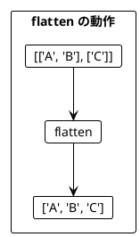

#### flat_map = map + flatten

```ruby
# map して flatten
authors1 = books.map(&:authors).flatten

# flat_map で同じことを1行で
authors2 = books.flat_map(&:authors)

authors1 == authors2  # => true
# ["Chiusano", "Bjarnason", "Tolkien"]
```

### 5.2 flat_map によるサイズの変化

```ruby
# 要素数が増える (1 -> 2)
[1, 2, 3].flat_map { |i| [i, i + 10] }
# => [1, 11, 2, 12, 3, 13]  - 6要素

# 要素数が同じ (1 -> 1)
[1, 2, 3].flat_map { |i| [i * 2] }
# => [2, 4, 6]  - 3要素

# 要素数が減る（フィルタリング効果）
[1, 2, 3].flat_map { |i| i.even? ? [i] : [] }
# => [2]  - 1要素
```

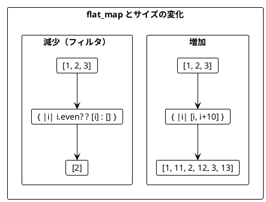

### 5.3 ネストした flat_map

複数のリストを組み合わせる場合、flat_map をネストします。

```ruby
Book = Struct.new(:title, :authors, keyword_init: true)
Movie = Struct.new(:title, keyword_init: true)

def book_adaptations(author)
  case author
  when 'Tolkien'
    [Movie.new(title: 'An Unexpected Journey'), Movie.new(title: 'The Desolation of Smaug')]
  else
    []
  end
end

books = [
  Book.new(title: 'FP in Scala', authors: %w[Chiusano Bjarnason]),
  Book.new(title: 'The Hobbit', authors: ['Tolkien'])
]

# ネストした flat_map
recommendations = books.flat_map do |book|
  book.authors.flat_map do |author|
    book_adaptations(author).map do |movie|
      "You may like #{movie.title}, because you liked #{author}'s #{book.title}"
    end
  end
end

# 結果:
# [
#   "You may like An Unexpected Journey, because you liked Tolkien's The Hobbit",
#   "You may like The Desolation of Smaug, because you liked Tolkien's The Hobbit"
# ]
```

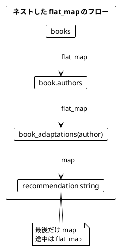

### 5.4 デカルト積（全組み合わせ）

```ruby
def self.cartesian_product(list1, list2)
  list1.flat_map do |a|
    list2.map do |b|
      [a, b]
    end
  end
end

cartesian_product([1, 2], %w[a b])
# => [[1, "a"], [1, "b"], [2, "a"], [2, "b"]]

# 3つのリストの組み合わせ
def self.triplets(list1, list2, list3)
  list1.flat_map do |a|
    list2.flat_map do |b|
      list3.map do |c|
        [a, b, c]
      end
    end
  end
end
```

### 5.5 円内の点の判定

```ruby
Point = Struct.new(:x, :y, keyword_init: true) do
  def distance_from_origin
    Math.sqrt(x * x + y * y)
  end
end

def inside?(point, radius)
  point.x * point.x + point.y * point.y <= radius * radius
end

points = [Point.new(x: 5, y: 2), Point.new(x: 1, y: 1)]
radiuses = [2, 1]

# 全組み合わせを生成
results = radiuses.flat_map do |r|
  points.map do |point|
    "Point(#{point.x}, #{point.y}) is within radius #{r}: #{inside?(point, r)}"
  end
end

# フィルタリング（条件に合うもののみ）
inside_points = radiuses.flat_map do |r|
  points.flat_map do |point|
    inside?(point, r) ? [{ point: point, radius: r }] : []
  end
end
```

### 5.6 モナディックパターンのプレビュー

flat_map を使ったエラーハンドリングのパターンです（Part III で詳しく学びます）。

```ruby
# 安全な除算（結果を配列で返す）
def self.safe_divide(a, b)
  b.zero? ? [] : [a / b]
end

# 操作をチェーン
def self.safe_calculation(a, b, c)
  safe_divide(a, b).flat_map do |result1|
    safe_divide(result1, c)
  end
end

safe_calculation(100, 2, 5)  # => [10]
safe_calculation(100, 0, 5)  # => []  (ゼロ除算は空配列)
safe_calculation(100, 2, 0)  # => []

# パースと計算の組み合わせ
def self.safe_parse_int(str)
  [Integer(str)]
rescue ArgumentError
  []
end

def self.parse_and_divide(str1, str2)
  safe_parse_int(str1).flat_map do |a|
    safe_parse_int(str2).flat_map do |b|
      safe_divide(a, b)
    end
  end
end

parse_and_divide('10', '2')   # => [5]
parse_and_divide('abc', '2')  # => []  (パースエラー)
parse_and_divide('10', '0')   # => []  (ゼロ除算)
```

---

## まとめ

### Part II で学んだこと

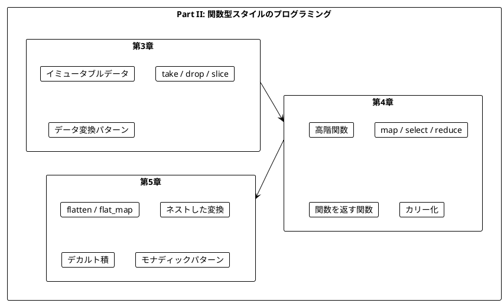

### キーポイント

| 章 | 主要概念 | Ruby のキー操作 |
|----|----------|----------------|
| 第3章 | イミュータブル | `+`, `take`, `drop`, `[]` |
| 第4章 | 高階関数 | `map`, `select`, `reduce`, `sort_by` |
| 第5章 | 平坦化 | `flatten`, `flat_map` |

### Scala との対応

| Scala | Ruby | 説明 |
|-------|------|------|
| `appended` | `+ [elem]` | 要素追加 |
| `slice` | `[start...end]` | 切り出し |
| `map` | `map` | 変換 |
| `filter` | `select` | 抽出 |
| `foldLeft` | `reduce` | 畳み込み |
| `flatMap` | `flat_map` | 平坦化変換 |
| `case class` | `Struct` | データ構造 |
| `=>` (lambda) | `->` (lambda) | 無名関数 |

### 重要な法則

1. **イミュータブルデータ**: 元のデータは変更せず、新しいデータを作成する
2. **関数は値**: 関数を引数として渡したり、戻り値として返したりできる
3. **flat_map パターン**: ネストした構造を平坦化しながら変換する
4. **空配列によるエラー表現**: `[]` を返すことでエラーケースを表現できる

### 次のステップ

Part III では、以下のトピックを学びます:

- dry-monads の `Maybe` 型による安全なエラーハンドリング
- `Result` 型と複合的なエラー処理
- モナディックな操作の実践

---

## 演習問題

### 問題 1: イミュータブルな操作

配列の中央に要素を挿入する関数を実装してください。

```ruby
def insert_at_middle(list, element)
  # 実装してください
end

# 期待される動作
insert_at_middle(%w[a b c d], 'X')  # => ["a", "b", "X", "c", "d"]
insert_at_middle(%w[a b], 'X')      # => ["a", "X", "b"]
```

<details>
<summary>解答</summary>

```ruby
def insert_at_middle(list, element)
  middle = list.size / 2
  before = list.take(middle)
  after = list.drop(middle)
  before + [element] + after
end
```

</details>

### 問題 2: 高階関数

条件を満たす要素の数をカウントする関数を実装してください。

```ruby
def count_where(list, &predicate)
  # 実装してください
end

# 期待される動作
count_where([1, 2, 3, 4, 5]) { |i| i > 3 }  # => 2
count_where(%w[a bb ccc]) { |s| s.length > 1 }  # => 2
```

<details>
<summary>解答</summary>

```ruby
def count_where(list, &predicate)
  list.count(&predicate)
end

# または reduce を使って
def count_where2(list, &predicate)
  list.reduce(0) { |count, elem| predicate.call(elem) ? count + 1 : count }
end
```

</details>

### 問題 3: flat_map

以下のネストした flat_map をより読みやすく書き換えてください。

```ruby
result = [1, 2].flat_map do |x|
  [10, 20].flat_map do |y|
    [100, 200].map do |z|
      x + y + z
    end
  end
end
```

<details>
<summary>解答</summary>

```ruby
# メソッドに分離
def triplet_sums(xs, ys, zs)
  xs.flat_map do |x|
    ys.flat_map do |y|
      zs.map do |z|
        x + y + z
      end
    end
  end
end

result = triplet_sums([1, 2], [10, 20], [100, 200])
# => [111, 211, 121, 221, 112, 212, 122, 222]
```

</details>

### 問題 4: flat_map によるフィルタリング

`select` を使わずに、flat_map だけで偶数のみを抽出するコードを書いてください。

```ruby
numbers = [1, 2, 3, 4, 5, 6]
# 偶数のみを抽出: [2, 4, 6]
```

<details>
<summary>解答</summary>

```ruby
even_numbers = numbers.flat_map do |n|
  n.even? ? [n] : []
end

# または関数に分離
def even_filter(n)
  n.even? ? [n] : []
end

even_numbers2 = numbers.flat_map { |n| even_filter(n) }
```

</details>
