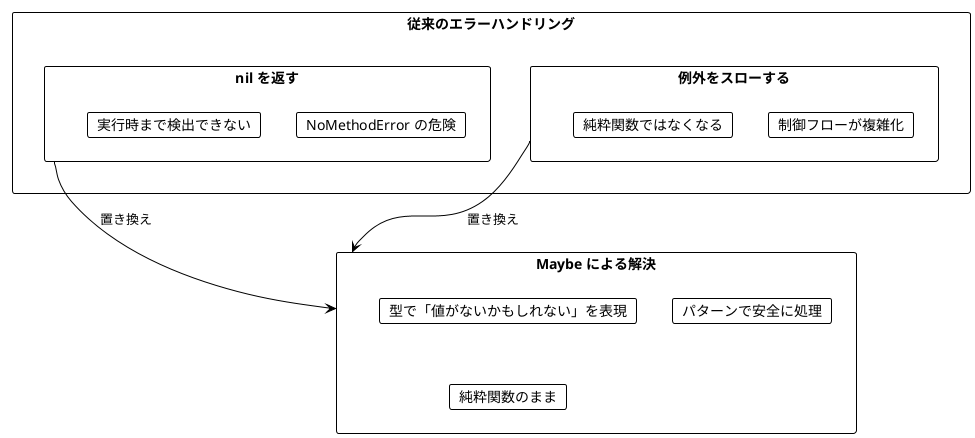
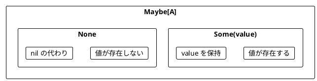
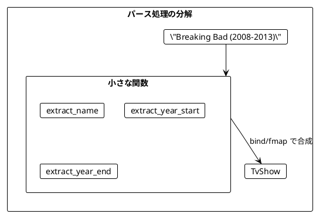
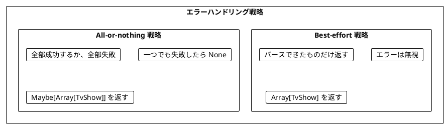
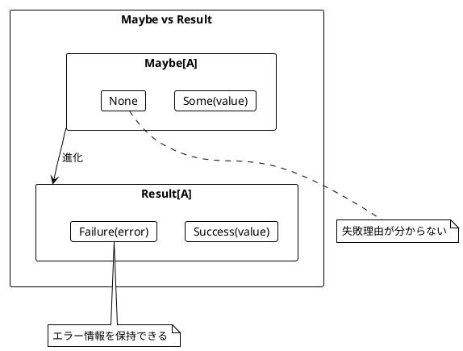
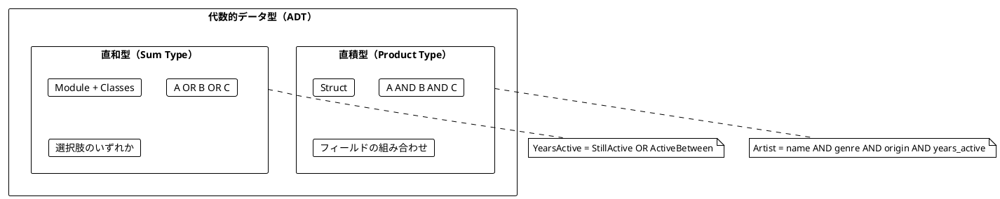
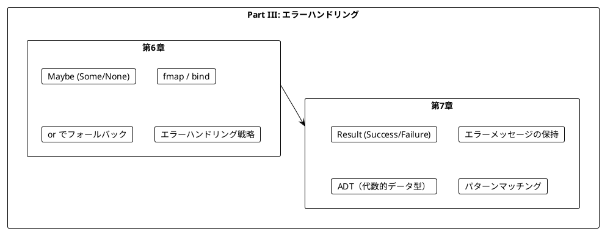

# Part III: エラーハンドリングと Maybe/Result

本章では、関数型プログラミングにおける安全なエラーハンドリングを学びます。`nil` や例外に頼らず、dry-monads の `Maybe` と `Result` を使って型安全にエラーを扱う方法を習得します。

---

## 第6章: Maybe 型による安全なエラーハンドリング

### 6.1 なぜ Maybe が必要か

従来のエラーハンドリングには問題があります。



**ソースファイル**: `app/ruby/src/ch06_error_handling.rb`

### 6.2 Maybe の基本

dry-monads の `Maybe` は「値があるか、ないか」を表す型です。



```ruby
require 'dry/monads'

module MyModule
  include Dry::Monads[:maybe]

  # Some を作成
  result = Some(42)
  result.value!  # => 42

  # None を作成
  no_value = None()
  no_value.value_or(0)  # => 0

  # 値を Maybe でラップ（nil は None になる）
  Maybe(5)    # => Some(5)
  Maybe(nil)  # => None
end
```

### 6.3 安全な操作

#### 安全な除算

```ruby
def self.safe_divide(a, b)
  return None() if b.zero?
  Some(a / b)
end

safe_divide(10, 2)  # => Some(5)
safe_divide(10, 0)  # => None
```

#### 安全な整数パース

```ruby
def self.safe_parse_int(str)
  Some(Integer(str))
rescue ArgumentError, TypeError
  None()
end

safe_parse_int('42')   # => Some(42)
safe_parse_int('abc')  # => None
```

### 6.4 TV番組のパース例

TV番組の文字列をパースする例で Maybe の使い方を学びます。

```ruby
TvShow = Struct.new(:title, :start_year, :end_year, keyword_init: true)

# 入力例: "Breaking Bad (2008-2013)"
# 期待する出力: TvShow(title: "Breaking Bad", start_year: 2008, end_year: 2013)
```

#### 小さな関数から組み立てる

```ruby
# 名前を抽出
def self.extract_name(raw_show)
  bracket_open = raw_show.index('(')
  return None() if bracket_open.nil? || bracket_open <= 0

  Some(raw_show[0...bracket_open].strip)
end

# 開始年を抽出
def self.extract_year_start(raw_show)
  bracket_open = raw_show.index('(')
  dash = raw_show.index('-')

  return None() if bracket_open.nil? || dash.nil?
  return None() if dash <= bracket_open + 1

  year_str = raw_show[(bracket_open + 1)...dash]
  safe_parse_int(year_str)
end

# 終了年を抽出
def self.extract_year_end(raw_show)
  dash = raw_show.index('-')
  bracket_close = raw_show.index(')')

  return None() if dash.nil? || bracket_close.nil?
  return None() if bracket_close <= dash + 1

  year_str = raw_show[(dash + 1)...bracket_close]
  safe_parse_int(year_str)
end
```



### 6.5 or によるフォールバック

`or` を使って、最初の Maybe が `None` の場合に代替を試すことができます。

```ruby
seven = Some(7)
eight = Some(8)
none = None()

seven.or(eight)  # => Some(7) - 最初が Some なのでそのまま
none.or(eight)   # => Some(8) - 最初が None なので代替を使用
seven.or(none)   # => Some(7)
none.or(none)    # => None
```

#### 単年の番組に対応する

```ruby
# 単年を抽出（"Chernobyl (2019)" 形式）
def self.extract_single_year(raw_show)
  dash = raw_show.index('-')
  return None() unless dash.nil?  # ダッシュがあれば単年ではない

  bracket_open = raw_show.index('(')
  bracket_close = raw_show.index(')')
  return None() if bracket_open.nil? || bracket_close.nil?

  year_str = raw_show[(bracket_open + 1)...bracket_close]
  safe_parse_int(year_str)
end

# パース関数（or でフォールバック）
def self.parse_show(raw_show)
  name = extract_name(raw_show)
  year_start = extract_year_start(raw_show).or(extract_single_year(raw_show))
  year_end = extract_year_end(raw_show).or(extract_single_year(raw_show))

  name.bind do |n|
    year_start.bind do |ys|
      year_end.fmap do |ye|
        TvShow.new(title: n, start_year: ys, end_year: ye)
      end
    end
  end
end

parse_show('Breaking Bad (2008-2013)')  # => Some(TvShow(...))
parse_show('Chernobyl (2019)')          # => Some(TvShow(start_year: 2019, end_year: 2019))
parse_show('Invalid')                    # => None
```

### 6.6 Maybe の主要メソッド

| メソッド | 説明 | 例 |
|----------|------|-----|
| `fmap` | 値があれば変換 | `Some(5).fmap { \|x\| x * 2 }` → `Some(10)` |
| `bind` | Maybe を返す関数を適用 | `Some(5).bind { \|x\| Some(x * 2) }` → `Some(10)` |
| `or` | None なら代替を使用 | `None().or(Some(5))` → `Some(5)` |
| `value_or` | None ならデフォルト値 | `None().value_or(0)` → `0` |
| `value!` | 値を取り出す（None なら例外） | `Some(5).value!` → `5` |

```ruby
year = Some(996)
no_year = None()

# fmap
year.fmap { |y| y * 2 }     # => Some(1992)
no_year.fmap { |y| y * 2 }  # => None

# bind
year.bind { |y| Some(y * 2) }     # => Some(1992)
no_year.bind { |y| Some(y * 2) }  # => None

# or
year.or(Some(2020))     # => Some(996)
no_year.or(Some(2020))  # => Some(2020)

# value_or
year.value_or(2020)     # => 996
no_year.value_or(2020)  # => 2020
```

### 6.7 エラーハンドリング戦略

複数の要素をパースする場合、2つの戦略があります。



#### Best-effort 戦略

```ruby
def self.parse_shows_best_effort(raw_shows)
  raw_shows
    .map { |raw| parse_show(raw) }
    .flat_map { |maybe| maybe_to_array(maybe) }
end

raw_shows = [
  'Breaking Bad (2008-2013)',
  'Invalid Show',           # 無効な形式
  'Mad Men (2007-2015)'
]

parse_shows_best_effort(raw_shows)
# => [TvShow("Breaking Bad", ...), TvShow("Mad Men", ...)]
# 無効なものは無視される
```

#### All-or-nothing 戦略

```ruby
def self.parse_shows_all_or_nothing(raw_shows)
  initial = Some([])

  raw_shows.reduce(initial) do |acc, raw|
    parsed = parse_show(raw)
    acc.bind do |shows|
      parsed.fmap { |show| shows + [show] }
    end
  end
end

# 全部成功 → Some([...])
parse_shows_all_or_nothing(['Breaking Bad (2008-2013)', 'Mad Men (2007-2015)'])
# => Some([TvShow(...), TvShow(...)])

# 一つでも失敗 → None
parse_shows_all_or_nothing(['Breaking Bad (2008-2013)', 'Invalid'])
# => None
```

---

## 第7章: Result 型と複合的なエラー処理

### 7.1 Maybe の限界

`Maybe` は「値があるかないか」しか表現できません。**なぜ失敗したのか**を伝えられません。



**ソースファイル**: `app/ruby/src/ch07_result.rb`

### 7.2 Result の基本

dry-monads の `Result` は「成功値かエラーか」を表す型です。

- `Success(value)`: 成功（Scala の `Right` 相当）
- `Failure(error)`: 失敗（Scala の `Left` 相当）

```ruby
require 'dry/monads'

module MyModule
  include Dry::Monads[:result]

  def extract_name(show)
    bracket_open = show.index('(')
    if bracket_open && bracket_open > 0
      Success(show[0...bracket_open].strip)
    else
      Failure("Can't extract name from #{show}")
    end
  end

  extract_name('The Wire (2002-2008)')  # => Success("The Wire")
  extract_name('(2022)')                # => Failure("Can't extract name from (2022)")
end
```

### 7.3 Result を使ったパース

```ruby
def self.safe_parse_int(str)
  Success(Integer(str))
rescue ArgumentError, TypeError
  Failure("Cannot parse '#{str}' as integer")
end

def self.extract_year_start(raw_show)
  bracket_open = raw_show.index('(')
  dash = raw_show.index('-')

  if bracket_open.nil? || dash.nil? || dash <= bracket_open + 1
    Failure("Cannot extract start year from '#{raw_show}'")
  else
    year_str = raw_show[(bracket_open + 1)...dash]
    safe_parse_int(year_str)
  end
end

extract_year_start('The Wire (2002-2008)')   # => Success(2002)
extract_year_start('The Wire (-2008)')       # => Failure("Cannot extract start year from...")
extract_year_start('The Wire (oops-2008)')   # => Failure("Cannot parse 'oops' as integer")
```

### 7.4 Maybe から Result への変換

```ruby
def self.maybe_to_result(maybe_value, error_msg)
  case maybe_value
  when Dry::Monads::Some
    Success(maybe_value.value!)
  else
    Failure(error_msg)
  end
end

maybe_to_result(Some(5), 'not found')   # => Success(5)
maybe_to_result(None(), 'not found')    # => Failure('not found')
```

### 7.5 Result の主要メソッド

| メソッド | 説明 | 例 |
|----------|------|-----|
| `fmap` | Success の値を変換 | `Success(5).fmap { \|x\| x * 2 }` → `Success(10)` |
| `bind` | Result を返す関数を適用 | `Success(5).bind { \|x\| Success(x * 2) }` → `Success(10)` |
| `or` | Failure なら代替を使用 | `Failure('err').or(Success(5))` → `Success(5)` |
| `value_or` | Failure ならデフォルト値 | `Failure('err').value_or(0)` → `0` |
| `to_maybe` | Maybe に変換 | `Success(5).to_maybe` → `Some(5)` |

```ruby
year = Success(996)
no_year = Failure('no year')

# fmap
year.fmap { |y| y * 2 }     # => Success(1992)
no_year.fmap { |y| y * 2 }  # => Failure('no year')

# bind
year.bind { |y| Success(y * 2) }         # => Success(1992)
year.bind { |_| Failure("can't proceed") }  # => Failure("can't proceed")

# or
year.or(Success(2020))     # => Success(996)
no_year.or(Success(2020))  # => Success(2020)

# to_maybe
year.to_maybe     # => Some(996)
no_year.to_maybe  # => None
```

### 7.6 バリデーション例

```ruby
def self.validate_age(age)
  if age.negative?
    Failure('Age cannot be negative')
  elsif age > 150
    Failure('Age cannot be greater than 150')
  else
    Success(age)
  end
end

def self.validate_email(email)
  if email.nil? || email.strip.empty?
    Failure('Email cannot be empty')
  elsif !email.include?('@')
    Failure('Email must contain @')
  else
    Success(email.strip)
  end
end

# 複数のバリデーションを組み合わせ
Person = Struct.new(:name, :age, :email, keyword_init: true)

def self.validate_person(name, age, email)
  validate_non_empty(name, 'Name').bind do |n|
    validate_age(age).bind do |a|
      validate_email(email).fmap do |e|
        Person.new(name: n, age: a, email: e)
      end
    end
  end
end

validate_person('Alice', 25, 'alice@example.com')  # => Success(Person(...))
validate_person('', 25, 'alice@example.com')       # => Failure('Name cannot be empty')
validate_person('Alice', -5, 'alice@example.com')  # => Failure('Age cannot be negative')
```

### 7.7 ADT（代数的データ型）を Ruby で表現

#### 直積型（Product Type）

複数のフィールドを **AND** で組み合わせる型です。Ruby では `Struct` を使います。

```ruby
Artist = Struct.new(:name, :genre, :origin, :years_active, keyword_init: true)
```

#### 直和型（Sum Type）

複数の選択肢を **OR** で表す型です。Ruby ではモジュールとクラスで表現します。

```ruby
module YearsActive
  class StillActive
    attr_reader :since

    def initialize(since)
      @since = since
    end

    def active_during?(year_start, year_end)
      since <= year_end
    end

    def active_length(current_year)
      current_year - since
    end
  end

  class ActiveBetween
    attr_reader :start_year, :end_year

    def initialize(start_year, end_year)
      @start_year = start_year
      @end_year = end_year
    end

    def active_during?(year_start, year_end)
      start_year <= year_end && end_year >= year_start
    end

    def active_length(_current_year = nil)
      end_year - start_year
    end
  end
end

metallica = Artist.new(
  name: 'Metallica',
  genre: :heavy_metal,
  origin: 'U.S.',
  years_active: YearsActive::StillActive.new(1981)
)

led_zeppelin = Artist.new(
  name: 'Led Zeppelin',
  genre: :hard_rock,
  origin: 'England',
  years_active: YearsActive::ActiveBetween.new(1968, 1980)
)
```



### 7.8 パターンマッチング

Ruby 3.0+ では `case/when` でパターンマッチングができます。

```ruby
def self.describe_years_active(years_active)
  case years_active
  when YearsActive::StillActive
    "Active since #{years_active.since}"
  when YearsActive::ActiveBetween
    "Active from #{years_active.start_year} to #{years_active.end_year}"
  else
    'Unknown'
  end
end

describe_years_active(metallica.years_active)
# => "Active since 1981"

describe_years_active(led_zeppelin.years_active)
# => "Active from 1968 to 1980"
```

### 7.9 検索条件のモデリング

```ruby
module SearchCondition
  class ByGenre
    attr_reader :genres

    def initialize(genres)
      @genres = genres
    end

    def matches?(artist)
      genres.include?(artist.genre)
    end
  end

  class ByOrigin
    attr_reader :locations

    def initialize(locations)
      @locations = locations
    end

    def matches?(artist)
      locations.include?(artist.origin)
    end
  end

  class ByActiveYears
    attr_reader :start_year, :end_year

    def initialize(start_year, end_year)
      @start_year = start_year
      @end_year = end_year
    end

    def matches?(artist)
      artist.years_active.active_during?(start_year, end_year)
    end
  end
end

def self.search_artists(artists, conditions)
  artists.select do |artist|
    conditions.all? { |condition| condition.matches?(artist) }
  end
end

# 使用例
conditions = [
  SearchCondition::ByGenre.new(%i[heavy_metal]),
  SearchCondition::ByOrigin.new(['U.S.'])
]

search_artists([metallica, led_zeppelin], conditions)
# => [metallica]
```

### 7.10 エラーの収集

通常の `bind` チェーンでは最初のエラーで停止しますが、全てのエラーを収集することも可能です。

```ruby
def self.validate_all(validations)
  errors = []
  values = []

  validations.each do |validation|
    case validation
    when Dry::Monads::Success
      values << validation.value!
    when Dry::Monads::Failure
      errors << validation.failure
    end
  end

  if errors.empty?
    Success(values)
  else
    Failure(errors)
  end
end

validations = [
  validate_non_empty('', 'Name'),      # Failure
  validate_age(-5),                     # Failure
  validate_email('invalid')             # Failure
]

validate_all(validations)
# => Failure(['Name cannot be empty', 'Age cannot be negative', 'Email must contain @'])
```

---

## まとめ

### Part III で学んだこと



### Maybe vs Result の使い分け

| 状況 | 使用する型 |
|------|------------|
| 値があるかないかだけが重要 | `Maybe` |
| 失敗理由を伝える必要がある | `Result` |
| 検索結果が見つからない | `Maybe` |
| バリデーションエラーを伝える | `Result` |
| 複数のエラー種別がある | `Result` |

### Scala との対応

| Scala | dry-monads | 説明 |
|-------|------------|------|
| `Option[A]` | `Maybe` | 値の有無 |
| `Some(x)` | `Some(x)` | 値あり |
| `None` | `None()` | 値なし |
| `Either[E, A]` | `Result` | 成功/失敗 |
| `Right(x)` | `Success(x)` | 成功 |
| `Left(e)` | `Failure(e)` | 失敗 |
| `map` | `fmap` | 値の変換 |
| `flatMap` | `bind` | モナディック合成 |
| `orElse` | `or` | フォールバック |
| `getOrElse` | `value_or` | デフォルト値 |

### キーポイント

1. **Maybe**: 値の有無を型で表現する
2. **Result**: 成功/失敗とエラー情報を型で表現する
3. **bind チェーン**: Maybe/Result を組み合わせて使う
4. **or**: フォールバックを提供する
5. **ADT**: 直積型（Struct）と直和型（Module+Class）でドメインをモデリング
6. **パターンマッチング**: 直和型を安全に処理する

### 次のステップ

Part IV では、以下のトピックを学びます:

- IO モナドの導入
- 副作用の管理
- 非同期処理

---

## 演習問題

### 問題 1: Maybe の基本

以下の関数を実装してください。

```ruby
def safe_divide(a, b)
  # 実装してください
end

# 期待される動作
safe_divide(10, 2)  # => Some(5)
safe_divide(10, 0)  # => None
safe_divide(7, 2)   # => Some(3)
```

<details>
<summary>解答</summary>

```ruby
def safe_divide(a, b)
  return None() if b.zero?
  Some(a / b)
end
```

</details>

### 問題 2: Maybe の合成

以下の関数を実装してください。2つの数値文字列を受け取り、その合計を返します。

```ruby
def add_strings(a, b)
  # 実装してください
end

# 期待される動作
add_strings('10', '20')   # => Some(30)
add_strings('10', 'abc')  # => None
add_strings('xyz', '20')  # => None
```

<details>
<summary>解答</summary>

```ruby
def add_strings(a, b)
  safe_parse_int(a).bind do |x|
    safe_parse_int(b).fmap do |y|
      x + y
    end
  end
end
```

</details>

### 問題 3: Result によるバリデーション

以下の関数を実装してください。年齢を検証し、エラーメッセージを返します。

```ruby
def validate_age(age)
  # 実装してください
end

# 期待される動作
validate_age(25)   # => Success(25)
validate_age(-5)   # => Failure('Age cannot be negative')
validate_age(200)  # => Failure('Age cannot be greater than 150')
```

<details>
<summary>解答</summary>

```ruby
def validate_age(age)
  if age.negative?
    Failure('Age cannot be negative')
  elsif age > 150
    Failure('Age cannot be greater than 150')
  else
    Success(age)
  end
end
```

</details>

### 問題 4: パターンマッチング

以下のモジュールとパターンマッチングを使った関数を実装してください。

```ruby
module PaymentMethod
  class CreditCard
    attr_reader :number, :expiry
    def initialize(number, expiry)
      @number = number
      @expiry = expiry
    end
  end

  class BankTransfer
    attr_reader :account_number
    def initialize(account_number)
      @account_number = account_number
    end
  end

  class Cash
  end
end

def describe_payment(method)
  # 実装してください
end

# 期待される動作
describe_payment(PaymentMethod::CreditCard.new('1234', '12/25'))
# => 'Credit card ending in 1234'

describe_payment(PaymentMethod::BankTransfer.new('9876'))
# => 'Bank transfer to account 9876'

describe_payment(PaymentMethod::Cash.new)
# => 'Cash payment'
```

<details>
<summary>解答</summary>

```ruby
def describe_payment(method)
  case method
  when PaymentMethod::CreditCard
    "Credit card ending in #{method.number}"
  when PaymentMethod::BankTransfer
    "Bank transfer to account #{method.account_number}"
  when PaymentMethod::Cash
    'Cash payment'
  else
    'Unknown payment method'
  end
end
```

</details>
