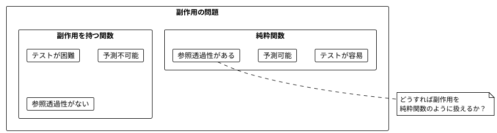
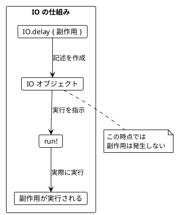
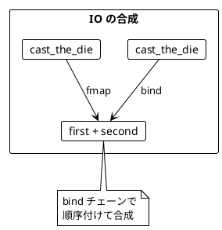
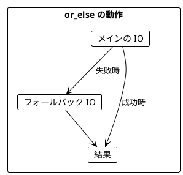
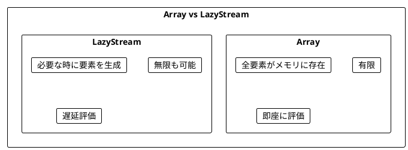
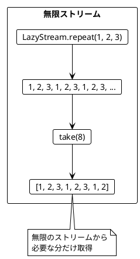
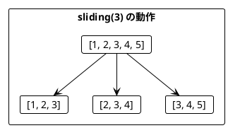
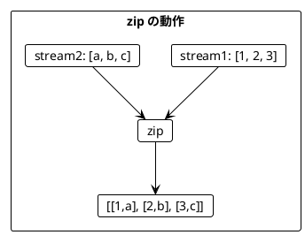
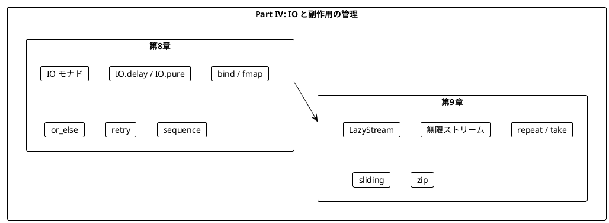

# Part IV: IO と副作用の管理

本章では、関数型プログラミングにおける副作用の扱い方を学びます。IO モナドを使って副作用を純粋関数内で安全に記述し、ストリーム処理で無限のデータを扱う方法を習得します。

---

## 第8章: IO モナドの導入

### 8.1 副作用の問題

純粋関数は副作用を持ちません。しかし、実際のプログラムには副作用が必要です:

- ファイルの読み書き
- ネットワーク通信
- データベースアクセス
- 乱数生成
- 現在時刻の取得



### 8.2 IO モナドとは

**IO モナド**は「副作用を持つ計算の**記述**」を表す型です。

- `IO` は「実行すると値を返す副作用のある計算」
- IO 値を作成しただけでは副作用は発生しない
- `run!` で実際に実行される



### 8.3 Ruby での IO モナド実装

**ソースファイル**: `app/ruby/src/ch08_io.rb`

Ruby には Cats Effect のような IO ライブラリがないため、シンプルな IO クラスを実装します:

```ruby
class IO
  def initialize(&computation)
    @computation = computation
  end

  # 副作用のある計算から IO を作成（遅延評価）
  def self.delay(&block)
    new(&block)
  end

  # 純粋な値から IO を作成（副作用なし）
  def self.pure(value)
    new { value }
  end

  # IO を実行して結果を返す（安全でない！）
  def run!
    @computation.call
  end
end
```

### 8.4 サイコロを振る例

#### 不純な関数（副作用あり）

```ruby
def cast_the_die_impure
  rand(1..6)
end

# 呼び出すたびに異なる値が返る
puts cast_the_die_impure  # 3
puts cast_the_die_impure  # 5
puts cast_the_die_impure  # 1
```

#### IO を使った純粋な記述

```ruby
def cast_the_die
  IO.delay { rand(1..6) }
end

# IO 値を作成（この時点では実行されない）
die_cast = cast_the_die
puts die_cast  # IO(...) - まだ実行されていない

# 実際に実行
puts die_cast.run!  # 4
```

### 8.5 IO の作成方法

| メソッド | 用途 | 例 |
|----------|------|-----|
| `IO.delay { expr }` | 副作用のある式をラップ | `IO.delay { puts "hello" }` |
| `IO.pure(value)` | 既存の値をラップ（副作用なし） | `IO.pure(42)` |
| `IO.unit` | 何もしない IO | `IO.unit` (= `IO.pure(nil)`) |

```ruby
# IO.delay: 副作用を遅延実行
delayed_print = IO.delay { puts "Hello" }
# puts はまだ実行されていない

# IO.pure: 既存の値をラップ
pure_value = IO.pure(42)
# 副作用なし、即座に 42 が確定
```

### 8.6 IO の合成

IO 値は `bind` や `fmap` で合成できます。

```ruby
def cast_the_die_twice
  cast_the_die.bind do |first|
    cast_the_die.fmap { |second| first + second }
  end
end

# まだ実行されていない
program = cast_the_die_twice

# 実行
result = program.run!
```



### 8.7 ミーティングスケジューリングの例

より実践的な例として、ミーティングのスケジューリングを見てみましょう。

```ruby
MeetingTime = Struct.new(:start_hour, :end_hour, keyword_init: true)

# 副作用のある API 呼び出しを IO でラップ
def calendar_entries(name)
  IO.delay { calendar_entries_api_call(name) }
end

def create_meeting(names, meeting)
  IO.delay { create_meeting_api_call(names, meeting) }
end
```

#### 予定の取得

```ruby
def scheduled_meetings(person1, person2)
  calendar_entries(person1).bind do |entries1|
    calendar_entries(person2).fmap do |entries2|
      entries1 + entries2
    end
  end
end
```

#### 空き時間の計算（純粋関数）

```ruby
def possible_meetings(existing_meetings, start_hour, end_hour, length_hours)
  slots = (start_hour..(end_hour - length_hours)).map do |start|
    MeetingTime.new(start_hour: start, end_hour: start + length_hours)
  end

  slots.select do |slot|
    existing_meetings.none? { |meeting| meetings_overlap?(meeting, slot) }
  end
end
```

### 8.8 or_else によるエラーハンドリング

IO の `or_else` メソッドで、失敗時のフォールバックを指定できます。

```ruby
year = IO.pure(996)
no_year = IO.delay { raise 'no year' }

year.or_else(IO.pure(2020)).run!     # 996
no_year.or_else(IO.pure(2020)).run!  # 2020
```



#### リトライ戦略

```ruby
# API 呼び出しを3回までリトライ
calendar_entries('Alice')
  .or_else(calendar_entries('Alice'))
  .or_else(calendar_entries('Alice'))
  .or_else(IO.pure([]))  # 全部失敗したら空リスト
```

#### 汎用リトライ関数

```ruby
def retry_action(action, max_retries)
  (0...max_retries).reduce(action) do |program, _|
    program.or_else(action)
  end
end

# 使用例
retry_action(calendar_entries('Alice'), 10)
```

### 8.9 sequence による IO のリスト処理

`[IO[A]]` を `IO[[A]]` に変換するには `sequence` を使います。

```ruby
def sequence(io_array)
  io_array.reduce(IO.pure([])) do |acc, io|
    acc.bind do |results|
      io.fmap { |result| results + [result] }
    end
  end
end

actions = [IO.pure(1), IO.pure(2), IO.pure(3)]
combined = sequence(actions)

combined.run!  # [1, 2, 3]
```

#### 複数人の予定を取得

```ruby
def scheduled_meetings_for_all(attendees)
  traverse(attendees) do |attendee|
    retry_with_default(calendar_entries(attendee), 3, [])
  end.fmap(&:flatten)
end
```

---

## 第9章: ストリーム処理

### 9.1 ストリームとは

**ストリーム**は、要素の（潜在的に無限の）シーケンスを表します。Ruby では `Enumerator::Lazy` を使用します。



### 9.2 LazyStream の実装

**ソースファイル**: `app/ruby/src/ch09_streams.rb`

Ruby の `Enumerator::Lazy` をラップした `LazyStream` クラスを実装します:

```ruby
class LazyStream
  def initialize(enumerator)
    @enumerator = enumerator.lazy
  end

  def self.from_array(array)
    new(array.each)
  end

  def self.repeat(*values)
    enum = Enumerator.new do |yielder|
      loop do
        values.each { |v| yielder << v }
      end
    end
    new(enum)
  end

  def take(n)
    LazyStream.new(@enumerator.take(n))
  end

  def to_array
    @enumerator.to_a
  end
end
```

### 9.3 純粋なストリーム

```ruby
# 有限ストリーム
numbers = LazyStream.from_array([1, 2, 3])
numbers.to_array  # [1, 2, 3]

# フィルタリング
odd_numbers = numbers.filter(&:odd?)
odd_numbers.to_array  # [1, 3]
```

### 9.4 無限ストリーム

```ruby
# repeat で無限に繰り返し
infinite_123s = LazyStream.repeat(1, 2, 3)

# take で有限個を取得
infinite_123s.take(8).to_array  # [1, 2, 3, 1, 2, 3, 1, 2]
```



### 9.5 便利なストリーム生成メソッド

```ruby
# 整数ストリーム（無限）
LazyStream.from(1).take(5).to_array  # [1, 2, 3, 4, 5]

# iterate で漸化式
LazyStream.iterate(1) { |n| n * 2 }.take(5).to_array  # [1, 2, 4, 8, 16]

# continually でブロックを繰り返し実行
counter = 0
LazyStream.continually { counter += 1 }.take(3).to_array  # [1, 2, 3]
```

### 9.6 IO を含むストリーム

```ruby
class IOStream
  def initialize(&stream_fn)
    @stream_fn = stream_fn
  end

  # IO アクションから無限ストリームを作成
  def self.repeat_eval(io_action)
    enum = Enumerator.new do |yielder|
      loop { yielder << io_action.run! }
    end
    new { enum.lazy }
  end

  # リストにコンパイル（IO を返す）
  def compile_to_list
    IO.delay { @stream_fn.call.to_a }
  end
end

# 無限にサイコロを振るストリーム
infinite_die_casts = IOStream.repeat_eval(cast_the_die)
```

#### ストリームの実行

```ruby
# 最初の3回を取得
first_three = infinite_die_casts.take(3).compile_to_list
first_three.run!  # [4, 2, 6]

# 6 が出るまで振り続ける
six = infinite_die_casts.filter { |n| n == 6 }.take(1).compile_to_list
six.run!  # [6]
```

### 9.7 ストリームの主要操作

| 操作 | 説明 | 例 |
|------|------|-----|
| `take(n)` | 最初の n 要素を取得 | `stream.take(3)` |
| `filter(p)` | 条件を満たす要素のみ | `stream.filter(&:even?)` |
| `fmap(f)` | 各要素を変換 | `stream.fmap { \|x\| x * 2 }` |
| `append(s)` | 別のストリームを結合 | `stream1.append(stream2)` |
| `repeat` | 無限に繰り返し | `stream.repeat` |
| `sliding(n)` | スライディングウィンドウ | `stream.sliding(3)` |

### 9.8 通貨交換レートの例

為替レートを監視して、上昇トレンドを検出する例です。

#### トレンド判定（純粋関数）

```ruby
def trending?(rates)
  return false if rates.size <= 1

  rates.each_cons(2).all? { |prev, curr| curr > prev }
end

trending?([0.81, 0.82, 0.83])  # true (上昇トレンド)
trending?([0.81, 0.84, 0.83])  # false
```

#### レートのストリーム

```ruby
def rates_stream(from_currency, to_currency)
  IOStream.repeat_eval(exchange_table(from_currency))
    .fmap { |table| extract_single_currency_rate(to_currency, table) }
    .filter { |rate| !rate.nil? }
end
```

### 9.9 スライディングウィンドウ

`sliding` で連続する要素をグループ化できます。

```ruby
stream = LazyStream.from_array([1, 2, 3, 4, 5])

stream.sliding(3).to_array
# [[1, 2, 3], [2, 3, 4], [3, 4, 5]]
```



#### トレンド検出

```ruby
def detect_trend(values, window_size)
  LazyStream.from_array(values)
    .sliding(window_size)
    .fmap { |window| { window: window, trending: trending?(window) } }
end

detect_trend([1, 2, 3, 4, 3], 3).to_array
# [{window: [1,2,3], trending: true},
#  {window: [2,3,4], trending: true},
#  {window: [3,4,3], trending: false}]
```

### 9.10 ストリームの結合

2つのストリームを `zip` で結合できます。

```ruby
stream1 = LazyStream.from_array([1, 2, 3])
stream2 = LazyStream.from_array(['a', 'b', 'c'])

stream1.zip(stream2).to_array
# [[1, 'a'], [2, 'b'], [3, 'c']]

# 左の値のみ保持
stream1.zip_left(stream2).to_array  # [1, 2, 3]
```



### 9.11 便利なストリーム関数

```ruby
# フィボナッチ数列
def fibonacci
  enum = Enumerator.new do |yielder|
    a, b = 0, 1
    loop do
      yielder << a
      a, b = b, a + b
    end
  end
  LazyStream.new(enum)
end

fibonacci.take(10).to_array  # [0, 1, 1, 2, 3, 5, 8, 13, 21, 34]

# 素数
def primes
  LazyStream.from(2).filter { |n| prime?(n) }
end

primes.take(10).to_array  # [2, 3, 5, 7, 11, 13, 17, 19, 23, 29]

# 累積和
def running_sum(stream)
  scan(stream, 0) { |acc, x| acc + x }
end

running_sum(LazyStream.from_array([1, 2, 3, 4, 5])).to_array
# [0, 1, 3, 6, 10, 15]
```

---

## まとめ

### Part IV で学んだこと



### IO と LazyStream の比較

| 特性 | IO | LazyStream |
|------|-----|------------|
| 要素数 | 1つ | 0個以上（無限も可） |
| 実行 | `run!` | `to_array` |
| 用途 | 単一の副作用 | 連続した値の処理 |

### Ruby と Scala の対応

| Scala (Cats Effect / fs2) | Ruby |
|---------------------------|------|
| `IO[A]` | `IO` クラス |
| `IO.delay(expr)` | `IO.delay { expr }` |
| `IO.pure(value)` | `IO.pure(value)` |
| `flatMap` | `bind` |
| `map` | `fmap` |
| `unsafeRunSync()` | `run!` |
| `Stream[Pure, A]` | `LazyStream` |
| `Stream.eval(io)` | `IOStream.eval(io)` |
| `.compile.toList` | `.compile_to_list` |

### キーポイント

1. **IO モナド**: 副作用を「記述」として扱い、実行を遅延させる
2. **IO.delay**: 副作用のある式を IO にラップ
3. **or_else**: 失敗時のフォールバックを指定
4. **sequence**: `[IO[A]]` → `IO[[A]]`
5. **LazyStream**: 潜在的に無限のシーケンスを遅延評価で処理
6. **sliding**: 連続する要素をグループ化してパターンを検出

### 次のステップ

Part V では、以下のトピックを学びます:

- 並行・並列処理
- 共有状態管理

---

## 演習問題

### 問題 1: IO の基本

以下の関数を実装してください。

```ruby
def print_and_return(message)
  # メッセージをコンソールに出力し、同じメッセージを返す IO
  ???
end

# 期待される動作
# print_and_return("Hello").run! は
# "Hello" をコンソールに出力し、"Hello" を返す
```

<details>
<summary>解答</summary>

```ruby
def print_and_return(message)
  IO.delay do
    puts message
    message
  end
end

# または
def print_and_return(message)
  IO.delay { puts message }.fmap { message }
end
```

</details>

### 問題 2: IO の合成

以下の関数を実装してください。2つの IO を順番に実行し、結果を結合します。

```ruby
def combine_io(io1, io2, &fn)
  ???
end

# 期待される動作
result = combine_io(IO.pure(1), IO.pure(2)) { |a, b| a + b }
result.run!  # 3
```

<details>
<summary>解答</summary>

```ruby
def combine_io(io1, io2, &fn)
  io1.bind do |a|
    io2.fmap { |b| fn.call(a, b) }
  end
end
```

</details>

### 問題 3: リトライ

以下の関数を実装してください。指定回数リトライし、全部失敗したらデフォルト値を返します。

```ruby
def retry_with_default(action, max_retries, default)
  ???
end
```

<details>
<summary>解答</summary>

```ruby
def retry_with_default(action, max_retries, default)
  (0...max_retries)
    .reduce(action) { |program, _| program.or_else(action) }
    .or_else(IO.pure(default))
end
```

</details>

### 問題 4: ストリーム操作

以下のストリームを作成してください。

```ruby
# 1. 1から10までの偶数のストリーム
evens = ???

# 2. 無限に交互に true/false を返すストリーム
alternating = ???

# 3. 最初の5つの要素の合計を計算
sum = LazyStream.from_array([1, 2, 3, 4, 5, 6, 7, 8, 9, 10]).take(5).???
```

<details>
<summary>解答</summary>

```ruby
# 1. 1から10までの偶数
evens = LazyStream.from_range(1..10).filter(&:even?)
# または
evens = LazyStream.from_array([2, 4, 6, 8, 10])

# 2. 無限に交互に true/false
alternating = LazyStream.repeat(true, false)

# 3. 最初の5つの要素の合計
sum = LazyStream.from_array([1, 2, 3, 4, 5, 6, 7, 8, 9, 10])
  .take(5)
  .to_array
  .sum  # 15

# または fold を使用
sum = LazyStream.from_array([1, 2, 3, 4, 5, 6, 7, 8, 9, 10])
  .take(5)
  .fold(0) { |acc, x| acc + x }  # 15
```

</details>

### 問題 5: トレンド検出

以下の関数を実装してください。直近3つの値が全て同じかどうかを判定します。

```ruby
def stable?(values)
  ???
end

# 期待される動作
stable?([5, 5, 5])    # true
stable?([5, 5, 6])    # false
stable?([5, 6, 5])    # false
stable?([5])          # false (3つ未満は false)
```

<details>
<summary>解答</summary>

```ruby
def stable?(values)
  values.size >= 3 && values.uniq.size == 1
end

# または
def stable?(values)
  return false if values.size < 3

  values.each_cons(2).all? { |prev, curr| prev == curr }
end
```

</details>

### 問題 6: フィボナッチ数列

`iterate` を使ってフィボナッチ数列のストリームを作成してください。

```ruby
def fibonacci_stream
  ???
end

fibonacci_stream.take(10).to_array
# [0, 1, 1, 2, 3, 5, 8, 13, 21, 34]
```

<details>
<summary>解答</summary>

```ruby
def fibonacci_stream
  enum = Enumerator.new do |yielder|
    a, b = 0, 1
    loop do
      yielder << a
      a, b = b, a + b
    end
  end
  LazyStream.new(enum)
end

# または iterate を使用（ペアを使う）
def fibonacci_stream
  LazyStream.iterate([0, 1]) { |pair| [pair[1], pair[0] + pair[1]] }
    .fmap { |pair| pair[0] }
end
```

</details>

### 問題 7: 移動平均

スライディングウィンドウを使って移動平均を計算してください。

```ruby
def moving_average(values, window_size)
  ???
end

moving_average([1, 2, 3, 4, 5], 3).to_array
# [2.0, 3.0, 4.0]  # (1+2+3)/3, (2+3+4)/3, (3+4+5)/3
```

<details>
<summary>解答</summary>

```ruby
def moving_average(values, window_size)
  LazyStream.from_array(values)
    .sliding(window_size)
    .fmap { |window| window.sum.to_f / window.size }
end
```

</details>
