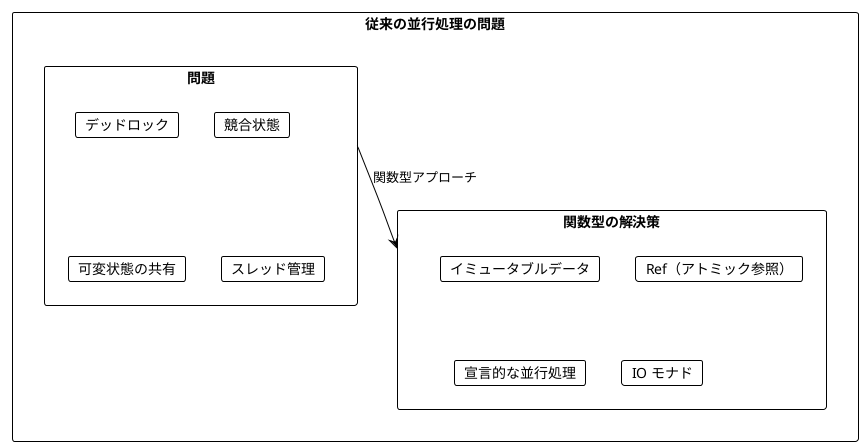
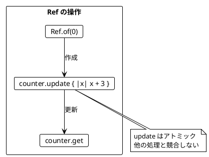
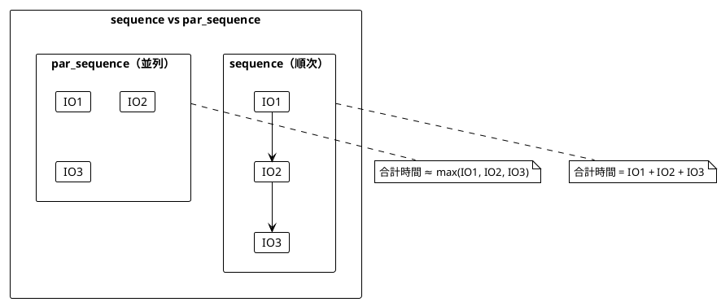
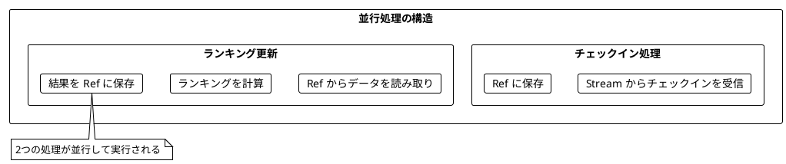
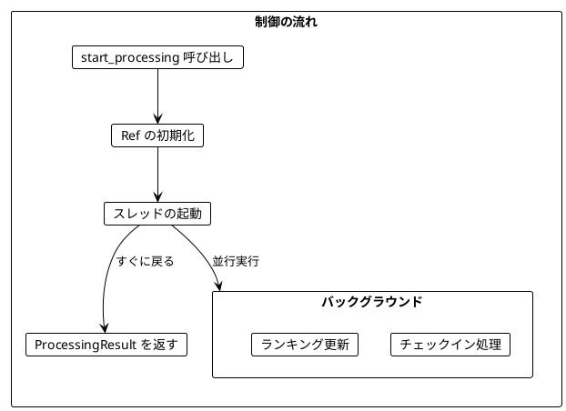
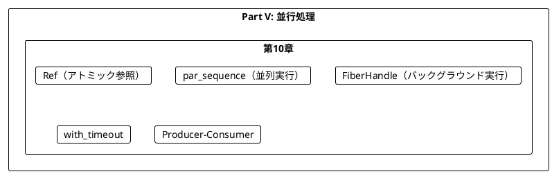

# Part V: 並行処理

本章では、関数型プログラミングにおける並行処理を学びます。Ref による安全な共有状態管理、並列実行、そして並行プログラムの構築方法を習得します。

---

## 第10章: 並行・並列処理

### 10.1 並行処理の課題

従来の並行処理には多くの課題があります:

- デッドロック
- 競合状態（Race Condition）
- 共有状態の管理の複雑さ
- スレッドのオーバーヘッド



### 10.2 Ref - アトミックな共有状態

**ソースファイル**: `app/ruby/src/ch10_concurrency.rb`

**Ref** は、複数の並行処理から安全にアクセスできるアトミックな参照です。

```ruby
class Ref
  def initialize(initial_value)
    @value = initial_value
    @mutex = Mutex.new
  end

  def self.of(initial_value)
    IO.delay { new(initial_value) }
  end

  def get
    IO.delay { @mutex.synchronize { @value } }
  end

  def update(&fn)
    IO.delay do
      @mutex.synchronize { @value = fn.call(@value) }
    end
  end
end
```

#### Ref の使用例

```ruby
# Ref の作成と使用
program = Ref.of(0).bind do |counter|
  counter.update { |x| x + 3 }.bind do
    counter.get
  end
end

program.run!  # 3
```



#### Ref の主要メソッド

| メソッド | 説明 | 例 |
|----------|------|-----|
| `Ref.of(initial)` | 初期値で Ref を作成 | `Ref.of(0)` |
| `ref.get` | 現在の値を取得 | `counter.get` |
| `ref.set(value)` | 値を設定 | `counter.set(10)` |
| `ref.update { }` | アトミックに更新 | `counter.update { \|x\| x + 1 }` |
| `ref.modify { }` | 更新して古い値を返す | `counter.modify { \|n\| [n + 1, n] }` |

### 10.3 スレッドセーフな更新

Ref を使った並行更新はスレッドセーフです:

```ruby
ref = Ref.new(0)

# 100スレッドで各10回インクリメント
threads = 100.times.map do
  Thread.new do
    10.times { ref.update { |x| x + 1 }.run! }
  end
end

threads.each(&:join)
ref.get.run!  # 常に 1000
```

### 10.4 par_sequence - 並列実行

`sequence` は IO を順番に実行しますが、`par_sequence` は並列に実行します。

```ruby
# 順次実行
def sequence(ios)
  ios.reduce(IO.pure([])) do |acc, io|
    acc.bind do |results|
      io.fmap { |result| results + [result] }
    end
  end
end

# 並列実行
def par_sequence(ios)
  IO.delay do
    threads = ios.map do |io|
      Thread.new { io.run! }
    end
    threads.map(&:value)
  end
end
```



#### 並列実行の効果

```ruby
# 各IOが0.1秒かかる場合
ios = 3.times.map { IO.delay { sleep(0.1); 1 } }

# 順次実行: 約0.3秒
sequence(ios).run!

# 並列実行: 約0.1秒
par_sequence(ios).run!
```

### 10.5 チェックインのリアルタイム集計

都市へのチェックインをリアルタイムで集計し、ランキングを更新する例を見ていきます。

```ruby
City = Struct.new(:name, keyword_init: true)
CityStats = Struct.new(:city, :check_ins, keyword_init: true)

# チェックインデータ
check_ins = [
  City.new(name: 'Sydney'),
  City.new(name: 'Dublin'),
  City.new(name: 'Sydney'),
  City.new(name: 'Lima'),
  City.new(name: 'Sydney')
]
```

#### トップ N 都市の計算（純粋関数）

```ruby
def top_cities(city_check_ins, n = 3)
  city_check_ins
    .map { |city, count| CityStats.new(city: city, check_ins: count) }
    .sort_by { |stats| -stats.check_ins }
    .take(n)
end
```

#### チェックインの保存

```ruby
def store_check_in(stored_check_ins, city)
  stored_check_ins.update do |check_ins|
    current = check_ins[city] || 0
    check_ins.merge(city => current + 1)
  end
end
```

### 10.6 並行チェックイン処理

チェックインの保存とランキングの更新を並行して実行します。

```ruby
def process_check_ins_concurrent(check_ins)
  IO.delay do
    stored_check_ins = Ref.new({})
    stored_ranking = Ref.new([])

    cancel_flag = { cancelled: false }

    # ランキング更新スレッド（継続的に実行）
    ranking_thread = Thread.new do
      until cancel_flag[:cancelled]
        update_ranking(stored_check_ins, stored_ranking).run!
        sleep(0.01)
      end
    end

    # チェックイン処理スレッド
    checkin_thread = Thread.new do
      check_ins.each do |city|
        break if cancel_flag[:cancelled]
        store_check_in(stored_check_ins, city).run!
      end
    end

    # チェックイン完了を待機
    checkin_thread.join

    # 最終ランキング更新
    sleep(0.05)
    cancel_flag[:cancelled] = true
    ranking_thread.join

    stored_ranking.get.run!
  end
end
```



### 10.7 FiberHandle - バックグラウンド実行

`FiberHandle` はバックグラウンドで実行中の計算を表します。

```ruby
class FiberHandle
  attr_reader :thread

  def initialize(thread, cancel_flag)
    @thread = thread
    @cancel_flag = cancel_flag
  end

  def join
    IO.delay { @thread.value }
  end

  def cancel
    IO.delay do
      @cancel_flag[:cancelled] = true
      @thread.kill if @thread.alive?
    end
  end
end

# IO をバックグラウンドで開始
def start(io)
  IO.delay do
    cancel_flag = { cancelled: false }
    thread = Thread.new do
      io.run! unless cancel_flag[:cancelled]
    end
    FiberHandle.new(thread, cancel_flag)
  end
end
```

#### 使用例

```ruby
# バックグラウンドで処理を開始
fiber = start(long_running_io).run!

# 何か他の作業をする
do_other_work

# 結果を待つ
result = fiber.join.run!

# または途中でキャンセル
fiber.cancel.run!
```

### 10.8 呼び出し元に制御を返す設計

FiberHandle を使って、呼び出し元に制御を返しつつバックグラウンドで処理を続ける設計ができます。

```ruby
ProcessingResult = Struct.new(:current_ranking, :stop, keyword_init: true)

def start_processing(check_ins)
  IO.delay do
    stored_check_ins = Ref.new({})
    stored_ranking = Ref.new([])

    cancel_flag = { cancelled: false }

    # バックグラウンドスレッドを開始
    ranking_thread = Thread.new do
      until cancel_flag[:cancelled]
        update_ranking(stored_check_ins, stored_ranking).run!
        sleep(0.01)
      end
    end

    checkin_thread = Thread.new do
      check_ins.each do |city|
        break if cancel_flag[:cancelled]
        store_check_in(stored_check_ins, city).run!
      end
    end

    # 制御インターフェースを返す
    current_ranking = IO.delay { stored_ranking.get.run! }
    stop = IO.delay do
      cancel_flag[:cancelled] = true
      checkin_thread.kill if checkin_thread.alive?
      ranking_thread.join
    end

    ProcessingResult.new(current_ranking: current_ranking, stop: stop)
  end
end
```



#### 使用例

```ruby
# 処理を開始（すぐに戻る）
processing = start_processing(check_ins).run!

# ランキングを確認
ranking = processing.current_ranking.run!
puts ranking

# しばらく待機
sleep(1)

# 更新されたランキングを確認
new_ranking = processing.current_ranking.run!

# 処理を停止
processing.stop.run!
```

### 10.9 タイムアウト付き実行

```ruby
def with_timeout(io, timeout_seconds)
  IO.delay do
    result = nil
    completed = false

    thread = Thread.new do
      result = io.run!
      completed = true
    end

    thread.join(timeout_seconds)

    if completed
      { success: true, value: result }
    else
      thread.kill
      { success: false, error: 'Timeout' }
    end
  end
end

# 使用例
io = IO.delay { sleep(0.5); 42 }
result = with_timeout(io, 1.0).run!  # { success: true, value: 42 }
result = with_timeout(io, 0.1).run!  # { success: false, error: 'Timeout' }
```

### 10.10 一定時間の結果収集

```ruby
def collect_for(producer_io, duration_seconds)
  IO.delay do
    collected = Ref.new([])
    cancel_flag = { cancelled: false }

    producer_thread = Thread.new do
      until cancel_flag[:cancelled]
        result = producer_io.run!
        collected.update { |arr| arr + [result] }.run!
      end
    end

    sleep(duration_seconds)
    cancel_flag[:cancelled] = true
    producer_thread.kill if producer_thread.alive?

    collected.get.run!
  end
end

# 0.5秒間、サイコロを振り続けて結果を収集
results = collect_for(cast_the_die, 0.5).run!
```

### 10.11 並列マップ更新

```ruby
Update = Struct.new(:key, :value, keyword_init: true)

def apply_updates(updates)
  Ref.of({}).bind do |map_ref|
    ios = updates.map do |update|
      map_ref.update { |m| m.merge(update.key => update.value) }
    end
    par_sequence(ios).bind { map_ref.get }
  end
end

# 使用例
updates = [
  Update.new(key: 'a', value: 1),
  Update.new(key: 'b', value: 2),
  Update.new(key: 'c', value: 3)
]
result = apply_updates(updates).run!  # { 'a' => 1, 'b' => 2, 'c' => 3 }
```

### 10.12 Producer-Consumer パターン

```ruby
class RefQueue
  def initialize
    @ref = Ref.new([])
  end

  def enqueue(value)
    @ref.update { |arr| arr + [value] }
  end

  def dequeue
    @ref.modify do |arr|
      if arr.empty?
        [arr, nil]
      else
        [arr[1..], arr[0]]
      end
    end
  end
end

def producer_consumer(producer_io, consumer_fn, duration_seconds)
  IO.delay do
    queue = RefQueue.new
    results = Ref.new([])
    cancel_flag = { cancelled: false }

    # プロデューサースレッド
    producer_thread = Thread.new do
      until cancel_flag[:cancelled]
        value = producer_io.run!
        queue.enqueue(value).run!
      end
    end

    # コンシューマースレッド
    consumer_thread = Thread.new do
      until cancel_flag[:cancelled]
        value = queue.dequeue.run!
        if value
          result = consumer_fn.call(value)
          results.update { |arr| arr + [result] }.run!
        else
          sleep(0.001)
        end
      end
    end

    sleep(duration_seconds)
    cancel_flag[:cancelled] = true
    producer_thread.kill if producer_thread.alive?
    consumer_thread.kill if consumer_thread.alive?

    results.get.run!
  end
end
```

---

## まとめ

### Part V で学んだこと



### 主要コンポーネント

| コンポーネント | 用途 |
|----------------|------|
| `Ref` | スレッドセーフな共有状態 |
| `par_sequence` | IO のリストを並列実行 |
| `par_map2` | 2つの IO を並列実行して結合 |
| `FiberHandle` | バックグラウンド実行の制御 |
| `with_timeout` | タイムアウト付き実行 |
| `RefQueue` | スレッドセーフなキュー |

### Ruby と Scala の対応

| Scala (Cats Effect) | Ruby |
|---------------------|------|
| `Ref[IO, A]` | `Ref` クラス |
| `Ref.of[IO, A](initial)` | `Ref.of(initial)` |
| `ref.get` | `ref.get` |
| `ref.update(f)` | `ref.update { }` |
| `parSequence` | `par_sequence` |
| `Fiber` | `FiberHandle` |
| `fiber.start` | `start(io)` |
| `fiber.cancel` | `fiber.cancel` |

### キーポイント

1. **Ref**: 複数のスレッドから安全にアクセスできるアトミックな参照
2. **par_sequence**: IO のリストを並列実行して結果を集約
3. **FiberHandle**: バックグラウンドで実行し、後で結果を取得/キャンセル
4. **Mutex**: Ruby のスレッドセーフ機構を活用
5. **Producer-Consumer**: キューを介したスレッド間通信

### 設計パターン


### 次のステップ

Part VI では、以下のトピックを学びます:

- 実践的なアプリケーション構築
- 外部 API との連携
- テスト戦略

---

## 演習問題

### 問題 1: Ref の基本

以下のプログラムを実装してください。カウンターを 0 から始めて、3回インクリメントした結果を返します。

```ruby
def increment_three_times
  ???
end

# 期待される動作
increment_three_times.run!  # 3
```

<details>
<summary>解答</summary>

```ruby
def increment_three_times
  Ref.of(0).bind do |counter|
    counter.update { |x| x + 1 }.bind do
      counter.update { |x| x + 1 }.bind do
        counter.update { |x| x + 1 }.bind do
          counter.get
        end
      end
    end
  end
end

# または
def increment_three_times
  Ref.of(0).bind do |counter|
    3.times { counter.update { |x| x + 1 }.run! }
    counter.get
  end
end
```

</details>

### 問題 2: 並列実行

以下のプログラムを実装してください。3つの IO を並列実行し、結果の合計を返します。

```ruby
def sum_parallel(io1, io2, io3)
  ???
end

# 期待される動作
sum_parallel(IO.pure(1), IO.pure(2), IO.pure(3)).run!  # 6
```

<details>
<summary>解答</summary>

```ruby
def sum_parallel(io1, io2, io3)
  par_sequence([io1, io2, io3]).fmap { |results| results.sum }
end
```

</details>

### 問題 3: 並行カウント

以下のプログラムを実装してください。複数の IO を並行実行し、そのうち偶数を返した回数をカウントします。

```ruby
def count_evens(ios)
  ???
end

# 使用例
ios = [IO.pure(2), IO.pure(3), IO.pure(4), IO.pure(5), IO.pure(6)]
count_evens(ios).run!  # 3
```

<details>
<summary>解答</summary>

```ruby
def count_evens(ios)
  Ref.of(0).bind do |counter|
    check_ios = ios.map do |io|
      io.bind do |n|
        if n.even?
          counter.update { |c| c + 1 }
        else
          IO.unit
        end
      end
    end
    par_sequence(check_ios).bind { counter.get }
  end
end
```

</details>

### 問題 4: タイムアウト付き実行

以下のプログラムを実装してください。指定時間後に処理をキャンセルし、それまでに蓄積された結果を返します。

```ruby
def collect_for(producer_io, duration_seconds)
  ???
end

# 期待される動作
# 0.5秒間、50msごとに乱数を生成してリストに追加
# 約10個の要素が返される
producer = IO.delay { sleep(0.05); rand(100) }
collect_for(producer, 0.5).run!
```

<details>
<summary>解答</summary>

```ruby
def collect_for(producer_io, duration_seconds)
  IO.delay do
    collected = Ref.new([])
    cancel_flag = { cancelled: false }

    producer_thread = Thread.new do
      until cancel_flag[:cancelled]
        result = producer_io.run!
        collected.update { |arr| arr + [result] }.run!
      end
    end

    sleep(duration_seconds)
    cancel_flag[:cancelled] = true
    producer_thread.kill if producer_thread.alive?

    collected.get.run!
  end
end
```

</details>

### 問題 5: 並行マップ更新

以下のプログラムを実装してください。複数の更新を並行して Map に適用し、最終的な Map を返します。

```ruby
Update = Struct.new(:key, :value, keyword_init: true)

def apply_updates(updates)
  ???
end

# 期待される動作
updates = [
  Update.new(key: 'a', value: 1),
  Update.new(key: 'b', value: 2),
  Update.new(key: 'c', value: 3)
]
apply_updates(updates).run!  # { 'a' => 1, 'b' => 2, 'c' => 3 }
```

<details>
<summary>解答</summary>

```ruby
def apply_updates(updates)
  Ref.of({}).bind do |map_ref|
    ios = updates.map do |update|
      map_ref.update { |m| m.merge(update.key => update.value) }
    end
    par_sequence(ios).bind { map_ref.get }
  end
end
```

</details>

### 問題 6: レース

2つの IO のうち、先に完了した方の結果を返す関数を実装してください。

```ruby
def race(io1, io2)
  ???
end

# 期待される動作
slow = IO.delay { sleep(0.2); 'slow' }
fast = IO.delay { sleep(0.05); 'fast' }
race(slow, fast).run!  # 'fast'
```

<details>
<summary>解答</summary>

```ruby
def race(io1, io2)
  IO.delay do
    result = nil
    done = false
    mutex = Mutex.new
    cv = ConditionVariable.new

    [io1, io2].each do |io|
      Thread.new do
        value = io.run!
        mutex.synchronize do
          unless done
            result = value
            done = true
            cv.signal
          end
        end
      end
    end

    mutex.synchronize do
      cv.wait(mutex) until done
      result
    end
  end
end
```

</details>
