# Part VI: 実践的なアプリケーション構築とテスト

本章では、これまで学んだ関数型プログラミングの概念を統合し、実践的なアプリケーションを構築します。また、関数型プログラミングにおけるテスト戦略についても学びます。

---

## 第11章: 実践的なアプリケーション構築

### 11.1 TravelGuide アプリケーション

旅行ガイドアプリケーションを例に、実践的な FP アプリケーションの構築方法を学びます。

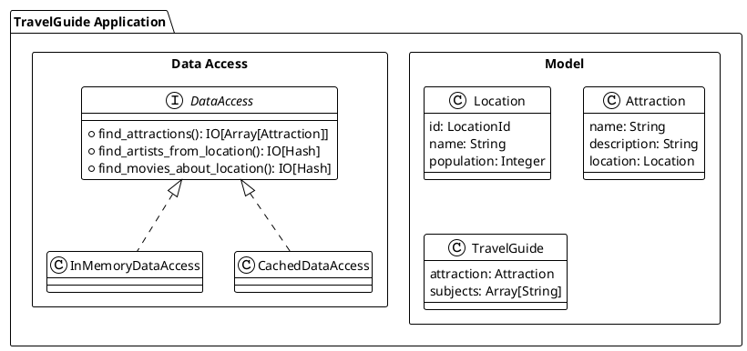

### 11.2 ドメインモデルの定義

**ソースファイル**: `app/ruby/src/ch11_application.rb`

```ruby
# 位置情報を表す値オブジェクト
class LocationId
  attr_reader :value

  def initialize(value)
    @value = value
  end

  def ==(other)
    other.is_a?(LocationId) && @value == other.value
  end
  alias eql? ==

  def hash
    @value.hash
  end
end

# ロケーション
Location = Struct.new(:id, :name, :population, keyword_init: true)

# アトラクション（観光地）
Attraction = Struct.new(:name, :description, :location, keyword_init: true)

# 旅行ガイド
TravelGuide = Struct.new(:attraction, :subjects, :search_report, keyword_init: true)
```

### 11.3 データアクセス層の抽象化

外部データソースへのアクセスをモジュールで抽象化します。

```ruby
module DataAccess
  def find_attractions(name, ordering, limit)
    raise NotImplementedError
  end

  def find_artists_from_location(location_id, limit)
    raise NotImplementedError
  end

  def find_movies_about_location(location_id, limit)
    raise NotImplementedError
  end

  def find_hotels_near_location(location_id, limit)
    raise NotImplementedError
  end
end
```

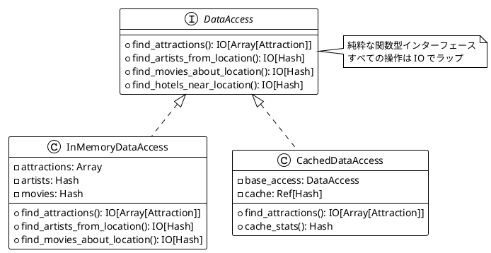

### 11.4 InMemoryDataAccess の実装

テストや開発用のインメモリ実装:

```ruby
class InMemoryDataAccess
  include DataAccess

  def initialize(attractions: [], artists: {}, movies: {}, hotels: {})
    @attractions = attractions
    @artists = artists
    @movies = movies
    @hotels = hotels
  end

  def find_attractions(name, ordering, limit)
    Ch08IO::IO.delay do
      filtered = @attractions.select do |a|
        a.name.downcase.include?(name.downcase)
      end

      sorted = case ordering
               when AttractionOrdering::BY_NAME
                 filtered.sort_by(&:name)
               when AttractionOrdering::BY_LOCATION_POPULATION
                 filtered.sort_by { |a| -a.location.population }
               else
                 filtered
               end

      sorted.take(limit)
    end
  end

  def find_artists_from_location(location_id, limit)
    Ch08IO::IO.delay do
      artists = @artists[location_id] || []
      { success: true, value: artists.take(limit) }
    end
  end

  # 他のメソッドも同様に実装...
end
```

### 11.5 Resource によるリソース管理

安全なリソース管理を実現する `Resource` パターンの実装:

**ソースファイル**: `app/ruby/src/ch11_application.rb`

```ruby
class Resource
  def initialize(acquire, &release)
    @acquire = acquire
    @release = release
  end

  def self.make(acquire_io, &release)
    new(acquire_io, &release)
  end

  def use(&fn)
    Ch08IO::IO.delay do
      resource = @acquire.run!
      begin
        fn.call(resource)
      ensure
        @release&.call(resource)
      end
    end
  end

  def fmap(&fn)
    Resource.new(
      @acquire.fmap(&fn),
      &@release
    )
  end
end
```

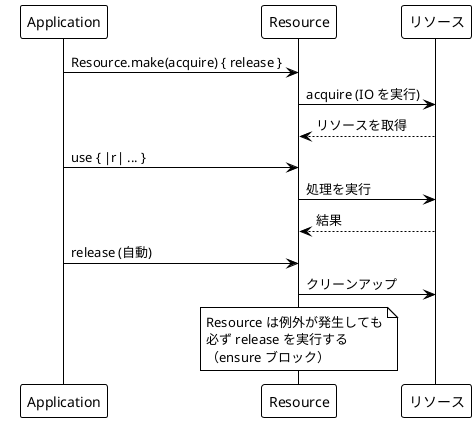

#### Resource の使用例

```ruby
# ファイルリソースの例
file_resource = Resource.make(
  Ch08IO::IO.delay { File.open('data.txt', 'r') }
) { |file| file.close }

# 使用
content = file_resource.use { |file| file.read }.run!

# データベース接続の例
db_resource = Resource.make(
  Ch08IO::IO.delay { Database.connect }
) { |conn| conn.disconnect }

result = db_resource.use { |conn| conn.query('SELECT * FROM users') }.run!
```

### 11.6 キャッシュの実装

`Ref` を使用したスレッドセーフなキャッシュの実装:

```ruby
class CachedDataAccess
  include DataAccess

  def initialize(base_access)
    @base_access = base_access
    @attractions_cache = Ch10Concurrency::Ref.new({})
    @artists_cache = Ch10Concurrency::Ref.new({})
    @movies_cache = Ch10Concurrency::Ref.new({})
    @hotels_cache = Ch10Concurrency::Ref.new({})
  end

  def find_attractions(name, ordering, limit)
    Ch08IO::IO.delay do
      key = "#{name}-#{ordering}-#{limit}"
      cached = @attractions_cache.get.run!

      if cached.key?(key)
        cached[key]
      else
        result = @base_access.find_attractions(name, ordering, limit).run!
        @attractions_cache.update { |c| c.merge(key => result) }.run!
        result
      end
    end
  end

  def cache_stats
    {
      attractions: @attractions_cache.get.run!.size,
      artists: @artists_cache.get.run!.size,
      movies: @movies_cache.get.run!.size,
      hotels: @hotels_cache.get.run!.size
    }
  end

  # 他のメソッドも同様にキャッシュを実装...
end
```

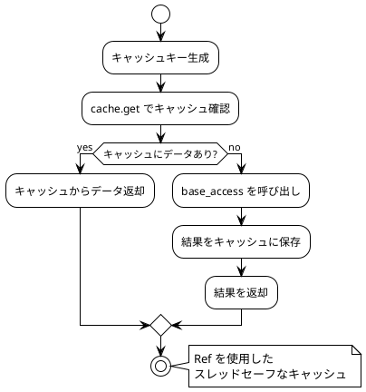

### 11.7 FailingDataAccess - テスト用エラー注入

テスト用にエラーを注入できる DataAccess の実装:

```ruby
class FailingDataAccess
  include DataAccess

  def initialize(base_access, failing_methods: [])
    @base_access = base_access
    @failing_methods = failing_methods
  end

  def find_artists_from_location(location_id, limit)
    if @failing_methods.include?(:find_artists_from_location)
      Ch08IO::IO.pure({ success: false, error: 'Network error: artists service unavailable' })
    else
      @base_access.find_artists_from_location(location_id, limit)
    end
  end

  # 他のメソッドも同様...
end
```

### 11.8 アプリケーションの組み立て

すべてのコンポーネントを組み合わせてアプリケーションを構築します。

```ruby
def self.travel_guide(data_access, attraction_name)
  Ch08IO::IO.delay do
    attractions = data_access.find_attractions(
      attraction_name,
      AttractionOrdering::BY_LOCATION_POPULATION,
      1
    ).run!

    if attractions.empty?
      nil
    else
      attraction = attractions.first
      location_id = attraction.location.id

      # 複数のデータソースから情報を取得
      artists_result = data_access.find_artists_from_location(location_id, 2).run!
      movies_result = data_access.find_movies_about_location(location_id, 2).run!

      # エラーを収集
      errors = []
      errors << artists_result[:error] unless artists_result[:success]
      errors << movies_result[:error] unless movies_result[:success]

      # 成功した結果を抽出
      artists = artists_result[:success] ? artists_result[:value] : []
      movies = movies_result[:success] ? movies_result[:value] : []

      subjects = artists.map(&:name) + movies.map(&:name)

      TravelGuide.new(
        attraction: attraction,
        subjects: subjects,
        search_report: SearchReport.new(
          attractions_searched: attractions.size,
          errors: errors
        )
      )
    end
  end
end
```

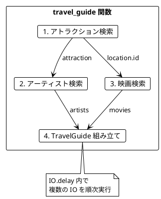

### 11.9 ExtendedTravelGuide

ホテル情報も含む拡張版:

```ruby
ExtendedTravelGuide = Struct.new(
  :attraction, :artists, :movies, :hotels, :search_report,
  keyword_init: true
)

def self.extended_travel_guide(data_access, attraction_name)
  Ch08IO::IO.delay do
    attractions = data_access.find_attractions(
      attraction_name,
      AttractionOrdering::BY_LOCATION_POPULATION,
      1
    ).run!

    if attractions.empty?
      nil
    else
      attraction = attractions.first
      location_id = attraction.location.id

      # 並列で取得することも可能
      artists_result = data_access.find_artists_from_location(location_id, 5).run!
      movies_result = data_access.find_movies_about_location(location_id, 5).run!
      hotels_result = data_access.find_hotels_near_location(location_id, 5).run!

      errors = []
      errors << artists_result[:error] unless artists_result[:success]
      errors << movies_result[:error] unless movies_result[:success]
      errors << hotels_result[:error] unless hotels_result[:success]

      ExtendedTravelGuide.new(
        attraction: attraction,
        artists: artists_result[:success] ? artists_result[:value] : [],
        movies: movies_result[:success] ? movies_result[:value] : [],
        hotels: hotels_result[:success] ? hotels_result[:value] : [],
        search_report: SearchReport.new(
          attractions_searched: attractions.size,
          errors: errors
        )
      )
    end
  end
end
```

---

## 第12章: テスト戦略

### 12.1 関数型プログラミングのテスト

関数型プログラミングでは、純粋関数のおかげでテストが非常に簡単になります。

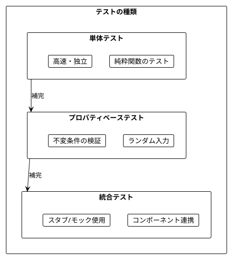

### 12.2 SearchReport の導入

**ソースファイル**: `app/ruby/src/ch11_application.rb`

テスト可能性を高めるため、`SearchReport` を導入します。

```ruby
class SearchReport
  attr_reader :attractions_searched, :errors

  def initialize(attractions_searched:, errors:)
    @attractions_searched = attractions_searched
    @errors = errors.freeze
  end

  def self.empty
    new(attractions_searched: 0, errors: [])
  end

  def add_error(error)
    SearchReport.new(
      attractions_searched: @attractions_searched,
      errors: @errors + [error]
    )
  end

  def with_attractions_count(count)
    SearchReport.new(
      attractions_searched: count,
      errors: @errors
    )
  end
end
```

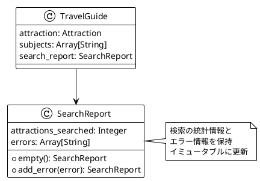

### 12.3 テストスタブの実装

**ソースファイル**: `app/ruby/src/ch12_testing.rb`

```ruby
class TestDataAccess
  include Ch11Application::DataAccess

  def initialize(
    attractions: [],
    artists_by_location: {},
    movies_by_location: {},
    hotels_by_location: {},
    artist_errors: {},
    movie_errors: {},
    hotel_errors: {}
  )
    @attractions = attractions
    @artists_by_location = artists_by_location
    @movies_by_location = movies_by_location
    @hotels_by_location = hotels_by_location
    @artist_errors = artist_errors
    @movie_errors = movie_errors
    @hotel_errors = hotel_errors
  end

  def find_attractions(name, ordering, limit)
    Ch08IO::IO.delay do
      filtered = @attractions.select { |a| a.name.downcase.include?(name.downcase) }
      sorted = case ordering
               when Ch11Application::AttractionOrdering::BY_NAME
                 filtered.sort_by(&:name)
               when Ch11Application::AttractionOrdering::BY_LOCATION_POPULATION
                 filtered.sort_by { |a| -a.location.population }
               else
                 filtered
               end
      sorted.take(limit)
    end
  end

  def find_artists_from_location(location_id, limit)
    Ch08IO::IO.delay do
      if @artist_errors[location_id]
        { success: false, error: @artist_errors[location_id] }
      else
        artists = @artists_by_location[location_id] || []
        { success: true, value: artists.take(limit) }
      end
    end
  end

  # 他のメソッドも同様...
end
```

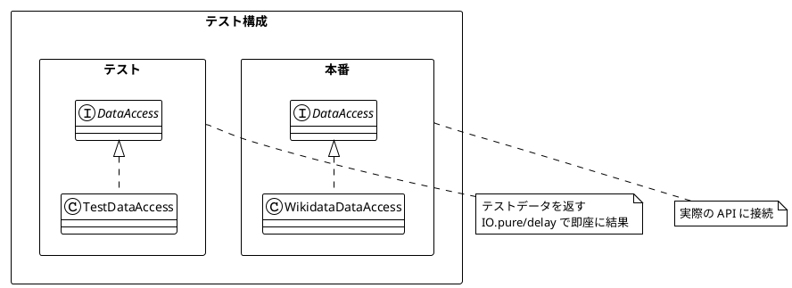

### 12.4 テストデータビルダー

テストデータを簡単に構築するためのビルダーパターン:

```ruby
class LocationBuilder
  def initialize
    @id = Ch11Application::LocationId.new("Q#{rand(1000)}")
    @name = 'Test City'
    @population = 100_000
  end

  def with_id(id)
    @id = id.is_a?(Ch11Application::LocationId) ? id : Ch11Application::LocationId.new(id)
    self
  end

  def with_name(name)
    @name = name
    self
  end

  def with_population(population)
    @population = population
    self
  end

  def build
    Ch11Application::Location.new(id: @id, name: @name, population: @population)
  end
end

class AttractionBuilder
  def initialize
    @name = 'Test Attraction'
    @description = 'A test attraction'
    @location = LocationBuilder.new.build
  end

  def with_name(name)
    @name = name
    self
  end

  def with_location(location)
    @location = location
    self
  end

  def build
    Ch11Application::Attraction.new(
      name: @name,
      description: @description,
      location: @location
    )
  end
end
```

#### 使用例

```ruby
# シンプルなロケーション
location = LocationBuilder.new.build

# カスタマイズしたロケーション
sydney = LocationBuilder.new
  .with_name('Sydney')
  .with_population(5_000_000)
  .build

# アトラクション with カスタムロケーション
attraction = AttractionBuilder.new
  .with_name('Opera House')
  .with_location(sydney)
  .build
```

### 12.5 プロパティベーステスト

ランダムな入力でプロパティ（不変条件）を検証するテスト手法:

```ruby
module Gen
  def self.string(length = 10)
    chars = ('a'..'z').to_a + ('A'..'Z').to_a
    Array.new(length) { chars.sample }.join
  end

  def self.int(min = 0, max = 100)
    rand(min..max)
  end

  def self.positive_int(max = 1_000_000)
    rand(1..max)
  end

  def self.boolean
    [true, false].sample
  end

  def self.one_of(*options)
    options.sample
  end

  def self.list_of(size = 5, &generator)
    Array.new(size) { generator.call }
  end

  def self.location
    Ch11Application::Location.new(
      id: location_id,
      name: string(8),
      population: positive_int(50_000_000)
    )
  end

  def self.attraction
    Ch11Application::Attraction.new(
      name: string(15),
      description: option { string(50) },
      location: location
    )
  end
end
```

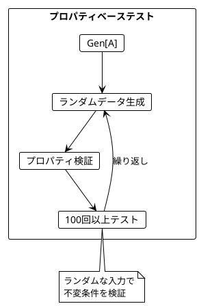

### 12.6 PropertyTest フレームワーク

```ruby
class PropertyTest
  attr_reader :name, :failures

  def initialize(name, iterations: 100)
    @name = name
    @iterations = iterations
    @failures = []
  end

  def for_all(*generators, &property)
    @iterations.times do |i|
      inputs = generators.map(&:call)
      begin
        result = property.call(*inputs)
        unless result
          @failures << { iteration: i, inputs: inputs, error: 'Property returned false' }
        end
      rescue StandardError => e
        @failures << { iteration: i, inputs: inputs, error: e.message }
      end
    end
    self
  end

  def passed?
    @failures.empty?
  end

  def summary
    if passed?
      "#{@name}: PASSED (#{@iterations} iterations)"
    else
      "#{@name}: FAILED (#{@failures.size}/#{@iterations} failures)"
    end
  end
end
```

#### 使用例

```ruby
# プロパティ: フィルタ結果は入力以下
test = PropertyTest.new('filter returns subset', iterations: 100)
test.for_all(
  -> { Gen.list_of(10) { Gen.location } },
  -> { Gen.positive_int(10_000_000) }
) do |locations, min_pop|
  result = filter_popular_locations(locations, min_pop)
  result.size <= locations.size
end

puts test.summary
# => "filter returns subset: PASSED (100 iterations)"
```

### 12.7 共通プロパティの定義

再利用可能なプロパティを定義:

```ruby
module Properties
  # フィルタ結果は入力以下
  def self.filter_bounded?(input, result)
    result.size <= input.size
  end

  # すべての結果が述語を満たす
  def self.filter_satisfies?(result, &predicate)
    result.all?(&predicate)
  end

  # 制限が守られている
  def self.limit_respected?(result, limit)
    result.size <= limit
  end

  # 順序が保持されている
  def self.ordering_preserved?(result, &compare)
    result.each_cons(2).all? { |a, b| compare.call(a, b) }
  end

  # エラー数が制限内
  def self.errors_bounded?(search_report, max_errors)
    search_report.errors.size <= max_errors
  end
end
```

### 12.8 純粋関数のテスト

純粋関数は入力と出力の関係のみをテストすれば良いため、テストが簡単です。

```ruby
# テスト対象の純粋関数
def filter_popular_locations(locations, min_population)
  locations.select { |loc| loc.population >= min_population }
end

def sort_attractions_by_name(attractions)
  attractions.sort_by(&:name)
end

def average_rating(hotels)
  return nil if hotels.empty?
  hotels.sum(&:rating) / hotels.size.to_f
end
```

#### RSpec でのテスト

```ruby
RSpec.describe '.filter_popular_locations' do
  it 'filters locations by population' do
    loc1 = LocationBuilder.new.with_population(100_000).build
    loc2 = LocationBuilder.new.with_population(500_000).build
    loc3 = LocationBuilder.new.with_population(200_000).build

    result = Ch12Testing.filter_popular_locations([loc1, loc2, loc3], 150_000)

    expect(result.size).to eq(2)
    expect(result.map(&:population)).to all(be >= 150_000)
  end

  # プロパティベーステスト
  it 'always returns subset of input' do
    test = PropertyTest.new('filter returns subset', iterations: 50)
    test.for_all(
      -> { Gen.list_of(10) { Gen.location } },
      -> { Gen.positive_int(10_000_000) }
    ) do |locations, min_pop|
      result = Ch12Testing.filter_popular_locations(locations, min_pop)
      Properties.filter_bounded?(locations, result)
    end

    expect(test.passed?).to be true
  end
end
```

### 12.9 統合テスト

コンポーネントを組み合わせた統合テスト:

```ruby
RSpec.describe 'TravelGuide integration tests' do
  it 'works with TestDataAccess' do
    location = Fixtures.sydney
    attraction = Fixtures.sydney_opera_house

    data_access = TestDataAccess.new(
      attractions: [attraction],
      artists_by_location: { location.id => Fixtures.sydney_artists },
      movies_by_location: { location.id => Fixtures.sydney_movies },
      hotels_by_location: { location.id => Fixtures.sydney_hotels }
    )

    guide = Ch11Application.travel_guide(data_access, 'Sydney').run!

    Assertions.assert_travel_guide_valid(guide)
    Assertions.assert_no_errors(guide)
    Assertions.assert_subjects_present(guide)
  end

  it 'handles errors gracefully' do
    location = Fixtures.sydney
    attraction = Fixtures.sydney_opera_house

    data_access = TestDataAccess.new(
      attractions: [attraction],
      artist_errors: { location.id => 'Network error' },
      movie_errors: { location.id => 'Timeout' }
    )

    guide = Ch11Application.travel_guide(data_access, 'Sydney').run!

    Assertions.assert_travel_guide_valid(guide)
    Assertions.assert_has_errors(guide, count: 2)
  end
end
```

### 12.10 テストフィクスチャ

事前に構築された再利用可能なテストデータ:

```ruby
module Fixtures
  def self.sydney
    @sydney ||= begin
      id = Ch11Application::LocationId.new('Q60')
      Ch11Application::Location.new(id: id, name: 'Sydney', population: 5_312_000)
    end
  end

  def self.sydney_opera_house
    @sydney_opera_house ||= Ch11Application::Attraction.new(
      name: 'Sydney Opera House',
      description: 'Iconic performing arts venue',
      location: sydney
    )
  end

  def self.sydney_artists
    @sydney_artists ||= [
      Ch11Application::MusicArtist.new(name: 'AC/DC', genre: 'Rock'),
      Ch11Application::MusicArtist.new(name: 'Sia', genre: 'Pop')
    ]
  end

  def self.complete_data_access
    @complete_data_access ||= TestDataAccess.new(
      attractions: [sydney_opera_house],
      artists_by_location: { sydney.id => sydney_artists },
      movies_by_location: { sydney.id => sydney_movies },
      hotels_by_location: { sydney.id => sydney_hotels }
    )
  end
end
```

### 12.11 アサーションヘルパー

テストアサーションを簡潔に書くためのヘルパー:

```ruby
module Assertions
  def self.assert_travel_guide_valid(guide)
    raise 'Guide is nil' if guide.nil?
    raise 'Attraction is nil' if guide.attraction.nil?
    raise 'Search report is nil' if guide.search_report.nil?
    true
  end

  def self.assert_no_errors(guide)
    errors = guide.search_report.errors
    raise "Expected no errors but got: #{errors}" unless errors.empty?
    true
  end

  def self.assert_has_errors(guide, count: nil)
    errors = guide.search_report.errors
    raise 'Expected errors but got none' if errors.empty?
    raise "Expected #{count} errors but got #{errors.size}" if count && errors.size != count
    true
  end
end
```

### 12.12 テストピラミッド

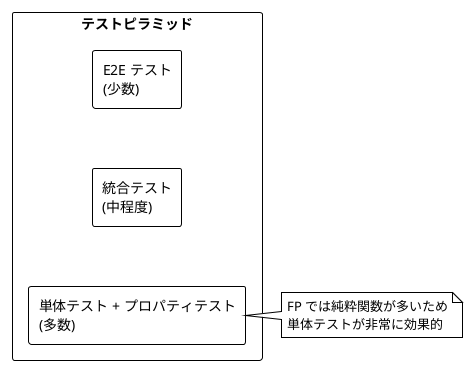

---

## まとめ

### Part VI で学んだこと


### 主要コンポーネント

| コンポーネント | 用途 |
|----------------|------|
| `DataAccess` | 外部データソースへのアクセス抽象化 |
| `InMemoryDataAccess` | テスト・開発用のインメモリ実装 |
| `CachedDataAccess` | Ref を使ったキャッシュ層 |
| `FailingDataAccess` | エラー注入用のラッパー |
| `Resource` | 安全なリソース管理 |
| `SearchReport` | 検索統計とエラー追跡 |
| `TestDataAccess` | テスト用スタブ実装 |
| `LocationBuilder` | テストデータビルダー |
| `PropertyTest` | プロパティベーステスト |

### Ruby と Scala の対応

| Scala | Ruby |
|-------|------|
| `trait DataAccess` | `module DataAccess` |
| `case class` | `Struct` |
| `opaque type LocationId` | `LocationId` クラス |
| `Resource[IO, A]` | `Resource` クラス |
| `Either[String, A]` | `{ success: bool, value/error: ... }` |
| `ScalaCheck Gen` | `Gen` モジュール |
| `property` | `PropertyTest` |

### キーポイント

1. **抽象化の重要性**: DataAccess モジュールで外部依存を抽象化
2. **Resource でリソース管理**: ensure ブロックで安全なリソースの取得と解放
3. **Ref でキャッシュ**: スレッドセーフな状態管理
4. **Hash でエラー処理**: `{ success:, value/error: }` で明示的なエラーハンドリング
5. **SearchReport**: テスト可能性と可観測性の向上
6. **スタブ**: 外部依存を差し替えてテスト
7. **プロパティベーステスト**: ランダム入力で不変条件を検証
8. **ビルダーパターン**: テストデータの柔軟な構築

### 学習の総括

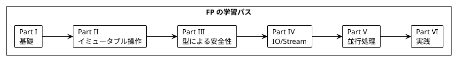

---

## 演習問題

### 問題 1: DataAccess の拡張

以下の要件で `DataAccess` を拡張してください:
- 新しいメソッド `find_restaurants_near_location` を追加
- 戻り値は `IO[{ success: Boolean, value/error: ... }]`

<details>
<summary>解答</summary>

```ruby
Restaurant = Struct.new(:name, :cuisine, :rating, :location, keyword_init: true)

module DataAccess
  # 既存のメソッド...

  def find_restaurants_near_location(location_id, limit)
    raise NotImplementedError
  end
end

class InMemoryDataAccess
  def initialize(attractions: [], artists: {}, movies: {}, hotels: {}, restaurants: {})
    # ...
    @restaurants = restaurants
  end

  def find_restaurants_near_location(location_id, limit)
    Ch08IO::IO.delay do
      restaurants = @restaurants[location_id] || []
      { success: true, value: restaurants.take(limit) }
    end
  end
end

# テスト用スタブ
class TestDataAccess
  def initialize(restaurants_by_location: {}, restaurant_errors: {}, **options)
    # ...
    @restaurants_by_location = restaurants_by_location
    @restaurant_errors = restaurant_errors
  end

  def find_restaurants_near_location(location_id, limit)
    Ch08IO::IO.delay do
      if @restaurant_errors[location_id]
        { success: false, error: @restaurant_errors[location_id] }
      else
        restaurants = @restaurants_by_location[location_id] || []
        { success: true, value: restaurants.take(limit) }
      end
    end
  end
end
```

</details>

### 問題 2: プロパティベーステスト

以下の関数に対するプロパティベーステストを書いてください:

```ruby
def filter_popular_locations(locations, min_population)
  locations.select { |loc| loc.population >= min_population }
end
```

<details>
<summary>解答</summary>

```ruby
# プロパティ1: 結果は入力以下の要素数
test1 = PropertyTest.new('result size <= input size', iterations: 100)
test1.for_all(
  -> { Gen.list_of(10) { Gen.location } },
  -> { Gen.positive_int(10_000_000) }
) do |locations, min_pop|
  result = filter_popular_locations(locations, min_pop)
  result.size <= locations.size
end

# プロパティ2: 結果のすべての要素は条件を満たす
test2 = PropertyTest.new('all results meet minimum', iterations: 100)
test2.for_all(
  -> { Gen.list_of(10) { Gen.location } },
  -> { Gen.positive_int(10_000_000) }
) do |locations, min_pop|
  result = filter_popular_locations(locations, min_pop)
  result.all? { |loc| loc.population >= min_pop }
end

# プロパティ3: 条件を満たす要素はすべて結果に含まれる
test3 = PropertyTest.new('all qualifying in result', iterations: 100)
test3.for_all(
  -> { Gen.list_of(10) { Gen.location } },
  -> { Gen.positive_int(10_000_000) }
) do |locations, min_pop|
  result = filter_popular_locations(locations, min_pop)
  qualifying = locations.select { |loc| loc.population >= min_pop }
  qualifying.all? { |loc| result.include?(loc) }
end
```

</details>

### 問題 3: Resource の実装

ファイルを安全に読み取る `Resource` を実装してください。

<details>
<summary>解答</summary>

```ruby
def file_resource(path)
  Resource.make(
    Ch08IO::IO.delay { File.open(path, 'r') }
  ) { |file| file.close }
end

def read_lines(path)
  file_resource(path).use do |file|
    file.readlines.map(&:chomp)
  end
end

# 使用例
lines = read_lines('data.txt').run!
puts "Read #{lines.size} lines"
```

</details>

### 問題 4: テストシナリオの作成

`create_test_scenario` と `create_failing_scenario` を使って、以下のテストを実装してください:

1. 正常系: すべてのデータが取得できるケース
2. 部分失敗: アーティスト取得のみ失敗するケース

<details>
<summary>解答</summary>

```ruby
RSpec.describe 'TravelGuide scenarios' do
  it 'handles complete success' do
    data_access = Ch12Testing.create_test_scenario
    guide = Ch11Application.travel_guide(data_access, 'Test').run!

    expect(guide).not_to be_nil
    expect(guide.search_report.errors).to be_empty
    expect(guide.subjects).not_to be_empty
  end

  it 'handles partial failure' do
    location = Ch12Testing::LocationBuilder.new.build
    attraction = Ch12Testing::AttractionBuilder.new.with_location(location).build

    data_access = Ch12Testing.create_failing_scenario(
      location: location,
      attraction: attraction,
      artist_error: 'Service unavailable'
    )

    guide = Ch11Application.travel_guide(data_access, 'Test').run!

    expect(guide).not_to be_nil
    expect(guide.search_report.errors.size).to eq(1)
    expect(guide.search_report.errors.first).to include('Service unavailable')
  end
end
```

</details>

---

## シリーズ全体の総括

本シリーズでは、「Grokking Functional Programming」の内容に沿って、関数型プログラミングの基礎から実践的なアプリケーション構築までを Ruby で学びました。

### 学んだ主な概念

| Part | 章 | 主な概念 |
|------|-----|----------|
| I | 1-2 | 純粋関数、参照透過性 |
| II | 3-5 | イミュータブルデータ、高階関数、flatMap |
| III | 6-7 | Option (nil 安全)、Either (結果型)、ADT |
| IV | 8-9 | IO モナド、Stream |
| V | 10 | 並行処理、Ref、FiberHandle |
| VI | 11-12 | 実践アプリケーション、テスト |

### 関数型プログラミングの利点

1. **予測可能性**: 純粋関数は同じ入力に対して常に同じ出力
2. **テスト容易性**: 副作用がないためテストが簡単
3. **合成可能性**: 小さな関数を組み合わせて複雑な処理を構築
4. **並行安全性**: イミュータブルデータは競合状態を防ぐ
5. **型安全性**: Option、Either でエラーを明示的に表現

### 次のステップ

- dry-rb ライブラリのより高度な機能を学ぶ
- dry-monads の実践的な使用方法を深める
- 実際のプロジェクトで FP パターンを適用する
- 他の FP 言語 (Haskell, Scala) との比較で理解を深める
