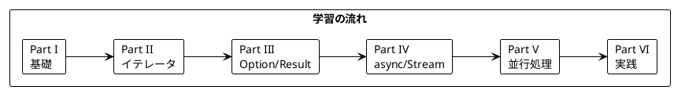

# Grokking Functional Programming - Rust 版

本シリーズは「Grokking Functional Programming」（Michał Płachta 著）の学習コンパニオンとして、関数型プログラミングの概念を Rust で実装しながら日本語で解説します。

---

## 対象読者

- 他言語の経験があり、Rust と関数型プログラミングに興味がある開発者
- Rust の所有権システムと FP の概念を結びつけて理解したい方
- 実践的な FP の適用方法を Rust で学びたいエンジニア

---

## 記事一覧

### [Part I: 関数型プログラミングの基礎](part-1.md)

関数型プログラミングの基本概念を Rust で学びます。

| 章 | トピック |
|----|----------|
| 第1章 | 命令型 vs 関数型、Rust 基本構文 |
| 第2章 | 純粋関数、副作用の排除、所有権とイミュータビリティ |

**キーワード**: 純粋関数、参照透過性、所有権、借用

---

### [Part II: 関数型スタイルのプログラミング](part-2.md)

イテレータとクロージャを使った関数型スタイルを学びます。

| 章 | トピック |
|----|----------|
| 第3章 | イミュータブルデータ、Vec 操作 |
| 第4章 | イテレータ、map/filter/fold |
| 第5章 | flat_map、イテレータチェーン |

**キーワード**: イテレータ、クロージャ、Iterator トレイト

---

### [Part III: エラーハンドリングと Option/Result](part-3.md)

型安全なエラーハンドリングを学びます。

| 章 | トピック |
|----|----------|
| 第6章 | Option 型、Some/None |
| 第7章 | Result 型、列挙型（enum）、パターンマッチング |

**キーワード**: Option、Result、? 演算子、代数的データ型（ADT）

---

### [Part IV: 非同期処理とストリーム](part-4.md)

async/await とストリーム処理を学びます。

| 章 | トピック |
|----|----------|
| 第8章 | async/await、Future |
| 第9章 | Stream、tokio-stream |

**キーワード**: async/await、Future、Stream、tokio

---

### [Part V: 並行処理](part-5.md)

Rust における安全な並行処理を学びます。

| 章 | トピック |
|----|----------|
| 第10章 | Arc、Mutex、チャネル |
| 第11章 | tokio タスク、並行パターン |

**キーワード**: 並行処理、Arc、Mutex、mpsc、tokio

---

### [Part VI: 実践的なアプリケーション構築とテスト](part-6.md)

実践的なアプリケーション構築とテスト戦略を学びます。

| 章 | トピック |
|----|----------|
| 第12章 | TravelGuide アプリ、トレイトによる抽象化、テスト戦略 |

**キーワード**: トレイト、依存性注入、proptest

---

## 学習パス



---

## 使用ライブラリ

| ライブラリ | 用途 | 対応章 |
|------------|------|--------|
| Rust (stable) | 言語 | 全章 |
| tokio | 非同期ランタイム | Part IV-VI |
| tokio-stream | ストリーム処理 | Part IV-V |
| proptest | プロパティベーステスト | Part VI |
| anyhow / thiserror | エラーハンドリング | Part III-VI |

---

## リポジトリ構成

```
grokkingfp-examples/
├── app/rust/src/           # Rust のサンプルコード
│   ├── ch01/               # 第1章
│   ├── ch02/               # 第2章
│   └── ...                 # 以降の章
├── app/rust/Cargo.toml     # 依存関係
└── docs/article/rust/      # 解説記事（本ディレクトリ）
    ├── index.md            # この記事
    ├── part-1.md           # Part I
    ├── part-2.md           # Part II
    ├── part-3.md           # Part III
    ├── part-4.md           # Part IV
    ├── part-5.md           # Part V
    └── part-6.md           # Part VI
```

---

## Rust と関数型プログラミング

Rust は関数型プログラミングの多くの概念を取り入れています:

### 所有権とイミュータビリティ

```rust
// デフォルトでイミュータブル
let x = 5;
// x = 6; // コンパイルエラー

// 明示的に mut を付ける
let mut y = 5;
y = 6; // OK
```

### イテレータとクロージャ

```rust
let numbers = vec![1, 2, 3, 4, 5];
let doubled: Vec<i32> = numbers
    .iter()
    .map(|x| x * 2)
    .filter(|x| *x > 4)
    .collect();
```

### 代数的データ型

```rust
enum Option<T> {
    Some(T),
    None,
}

enum Result<T, E> {
    Ok(T),
    Err(E),
}
```

### パターンマッチング

```rust
match value {
    Some(x) if x > 0 => println!("Positive: {}", x),
    Some(x) => println!("Non-positive: {}", x),
    None => println!("No value"),
}
```

---

## 関数型プログラミングの利点

本シリーズを通じて、以下の利点を実感できます:

1. **予測可能性** - 純粋関数は同じ入力に対して常に同じ出力
2. **テスト容易性** - 副作用がないためテストが簡単
3. **合成可能性** - イテレータチェーンで複雑な処理を構築
4. **並行安全性** - 所有権システムがデータ競合を防ぐ
5. **型安全性** - Option、Result で null や例外を型で表現

---

## Scala との対比

| 概念 | Scala | Rust |
|------|-------|------|
| イミュータブル変数 | `val` | `let` |
| ミュータブル変数 | `var` | `let mut` |
| null 安全 | `Option[T]` | `Option<T>` |
| エラー処理 | `Either[E, A]` | `Result<T, E>` |
| 高階関数 | `map`, `flatMap` | `map`, `flat_map` |
| パターンマッチ | `match` | `match` |
| トレイト | `trait` | `trait` |
| ジェネリクス | `def foo[T]` | `fn foo<T>` |
| 非同期 | `IO[A]` (cats-effect) | `async fn` / `Future` |

---

## 参考資料

- [Grokking Functional Programming](https://www.manning.com/books/grokking-functional-programming) - 原著
- [The Rust Programming Language](https://doc.rust-lang.org/book/) - 公式ドキュメント
- [Rust by Example](https://doc.rust-lang.org/rust-by-example/) - 実例で学ぶ Rust
- [tokio ドキュメント](https://tokio.rs/) - 非同期ランタイム
- [Rust Design Patterns](https://rust-unofficial.github.io/patterns/) - Rust のデザインパターン
