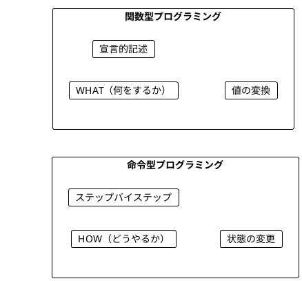
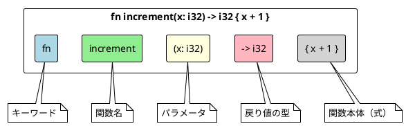
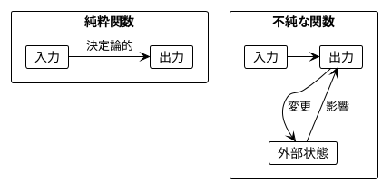
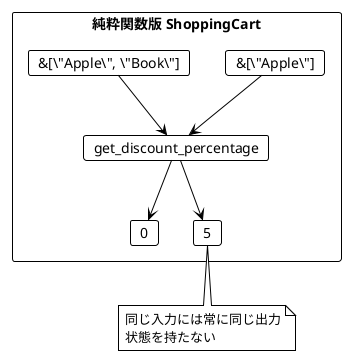
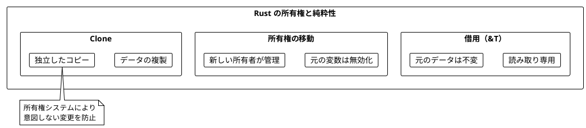
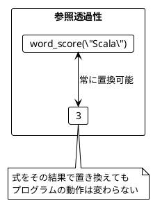
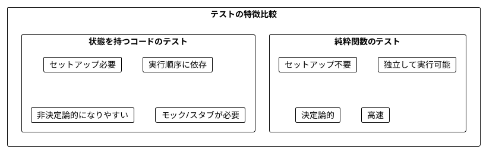
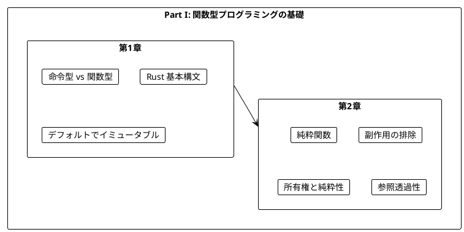

# Part I: 関数型プログラミングの基礎

本章では、関数型プログラミング（FP）の基本概念を Rust で学びます。命令型プログラミングとの違いを理解し、純粋関数の利点を実感することが目標です。

---

## 第1章: 関数型プログラミング入門

### 1.1 命令型 vs 関数型

プログラミングには大きく分けて2つのパラダイムがあります。



**命令型プログラミング**は「どうやるか」を記述します。

```rust
// 命令型スタイル: ステップバイステップで計算
fn calculate_score_imperative(word: &str) -> usize {
    let mut score = 0;
    for _ in word.chars() {
        score += 1;
    }
    score
}
```

**関数型プログラミング**は「何をするか」を記述します。

```rust
// 関数型スタイル: 宣言的に記述
fn word_score(word: &str) -> usize {
    word.len()
}
```

### 1.2 Rust の基本的な関数

**ソースファイル**: `app/rust/src/ch01_intro.rs`

Rust での関数定義の基本形を見てみましょう。

```rust
/// 整数をインクリメント
fn increment(x: i32) -> i32 {
    x + 1
}

/// 文字列の最初の文字を取得
fn get_first_character(s: &str) -> Option<char> {
    s.chars().next()
}

/// 挨拶文を生成
fn greet(name: &str) -> String {
    format!("Hello, {}!", name)
}
```

### 1.3 関数の構造



### 1.4 Rust の特徴: デフォルトでイミュータブル

Rust では変数はデフォルトでイミュータブル（不変）です。

```rust
let x = 5;        // イミュータブル
// x = 6;         // コンパイルエラー!

let mut y = 5;    // ミュータブル（明示的に指定）
y = 6;            // OK
```

この特性は関数型プログラミングと非常に相性が良いです。

### 1.5 学習ポイント

| 概念 | 命令型 | 関数型 (Rust) |
|------|--------|---------------|
| 焦点 | 手順（How） | 結果（What） |
| 変数 | `let mut` | `let` |
| ループ | `for`/`while` | `iter().map()` |
| データ | ミュータブル | イミュータブル |

---

## 第2章: 純粋関数とテスト

### 2.1 純粋関数とは

純粋関数（Pure Function）は以下の特徴を持つ関数です:

1. **同じ入力には常に同じ出力を返す**
2. **副作用がない**（外部状態を変更しない）



### 2.2 純粋関数の例

**ソースファイル**: `app/rust/src/ch02_pure_functions.rs`

```rust
/// 純粋関数: 同じ入力に対して常に同じ出力
fn add(a: i32, b: i32) -> i32 {
    a + b
}

/// 純粋関数: 文字 'a' を除外したワードスコア
fn word_score(word: &str) -> usize {
    word.chars().filter(|&c| c != 'a').count()
}

// テスト
assert_eq!(word_score("Scala"), 3);    // "Scl" → 3文字
assert_eq!(word_score("function"), 8); // 'a' なし → 8文字
assert_eq!(word_score(""), 0);         // 空文字 → 0文字
```

**不純な関数の例**:

```rust
// 不純な関数 - 呼び出すたびに異なる値を返す
fn current_timestamp() -> u64 {
    use std::time::{SystemTime, UNIX_EPOCH};
    SystemTime::now()
        .duration_since(UNIX_EPOCH)
        .unwrap()
        .as_secs()
}
```

### 2.3 ショッピングカートの例

**ソースファイル**: `app/rust/src/ch02_pure_functions.rs`

純粋関数を使ったショッピングカートの実装:

```rust
/// ショッピングカートの割引率を計算（純粋関数）
fn get_discount_percentage(items: &[&str]) -> i32 {
    if items.contains(&"Book") {
        5
    } else {
        0
    }
}

/// 割引額を計算（純粋関数）
fn calculate_discount(total: i32, percentage: i32) -> i32 {
    total * percentage / 100
}

/// 最終価格を計算（純粋関数の合成）
fn calculate_final_price(total: i32, items: &[&str]) -> i32 {
    let discount_percentage = get_discount_percentage(items);
    let discount = calculate_discount(total, discount_percentage);
    total - discount
}

// テスト
assert_eq!(calculate_final_price(100, &["Apple", "Book"]), 95);
assert_eq!(calculate_final_price(100, &["Apple"]), 100);
```



### 2.4 チップ計算の例

```rust
/// チップの割合を計算（純粋関数）
fn get_tip_percentage(names: &[&str]) -> i32 {
    match names.len() {
        0 => 0,
        1..=5 => 10,
        _ => 20,
    }
}

// テスト
assert_eq!(get_tip_percentage(&[]), 0);
assert_eq!(get_tip_percentage(&["Alice", "Bob"]), 10);
assert_eq!(get_tip_percentage(&["A", "B", "C", "D", "E", "F"]), 20);
```

### 2.5 Rust の所有権と純粋性

Rust の所有権システムは純粋関数の実装を支援します。

```rust
/// 借用を使った純粋関数（元のデータを変更しない）
fn count_vowels(s: &str) -> usize {
    s.chars()
        .filter(|c| matches!(c.to_ascii_lowercase(), 'a' | 'e' | 'i' | 'o' | 'u'))
        .count()
}

/// Vec を変換する純粋関数（新しい Vec を返す）
fn double_all(numbers: &[i32]) -> Vec<i32> {
    numbers.iter().map(|x| x * 2).collect()
}

// 元のデータは変更されない
let numbers = vec![1, 2, 3];
let doubled = double_all(&numbers);
assert_eq!(doubled, vec![2, 4, 6]);
assert_eq!(numbers, vec![1, 2, 3]);  // 元のデータはそのまま
```



### 2.6 参照透過性

純粋関数は**参照透過性（Referential Transparency）**を持ちます。

> 式をその評価結果で置き換えても、プログラムの意味が変わらないこと

```rust
// word_score("Scala") は常に 3 を返す
let score1 = word_score("Scala");
let score2 = word_score("Scala");
// score1 と score2 は常に同じ値（3）

// 以下の2つは同等
let total1 = word_score("Scala") + word_score("Java");
let total2 = 3 + 2;  // word_score の結果で置き換え可能
assert_eq!(total1, total2);
```



### 2.7 純粋関数のテスト

純粋関数は非常にテストしやすいです。

```rust
#[cfg(test)]
mod tests {
    use super::*;

    #[test]
    fn test_word_score() {
        assert_eq!(word_score("Scala"), 3);
        assert_eq!(word_score("function"), 8);
        assert_eq!(word_score("aaa"), 0);
        assert_eq!(word_score(""), 0);
    }

    #[test]
    fn test_get_discount_percentage() {
        assert_eq!(get_discount_percentage(&["Apple", "Book"]), 5);
        assert_eq!(get_discount_percentage(&["Apple"]), 0);
        assert_eq!(get_discount_percentage(&[]), 0);
    }

    #[test]
    fn test_referential_transparency() {
        // 参照透過性: 同じ呼び出しは常に同じ結果
        let result1 = word_score("Scala");
        let result2 = word_score("Scala");
        assert_eq!(result1, result2);
    }
}
```



---

## まとめ

### Part I で学んだこと



### キーポイント

1. **関数型プログラミング**は「何をするか」を宣言的に記述する
2. **純粋関数**は同じ入力に対して常に同じ出力を返す
3. **Rust のデフォルト**はイミュータブルで、FP と相性が良い
4. **所有権システム**が純粋性の維持を支援する
5. **純粋関数**はテストが非常に簡単
6. **参照透過性**により、コードの理解と推論が容易になる

### Scala との対比

| 概念 | Scala | Rust |
|------|-------|------|
| イミュータブル変数 | `val` | `let` |
| ミュータブル変数 | `var` | `let mut` |
| 関数定義 | `def f(x: Int): Int` | `fn f(x: i32) -> i32` |
| null 安全 | `Option[T]` | `Option<T>` |
| 文字列参照 | `String` | `&str` / `String` |
| パターンマッチ | `match` | `match` |

### 次のステップ

Part II では、以下のトピックを学びます:

- イテレータを使った関数型スタイル
- 高階関数（クロージャ）
- `map`/`filter`/`fold` パターン
- イテレータチェーン

---

## 演習問題

### 問題 1: 純粋関数の識別

以下の関数のうち、純粋関数はどれですか?

```rust
// A
fn double(x: i32) -> i32 {
    x * 2
}

// B
static mut COUNTER: i32 = 0;
fn increment_counter() -> i32 {
    unsafe {
        COUNTER += 1;
        COUNTER
    }
}

// C
fn greet(name: &str) -> String {
    format!("Hello, {}!", name)
}

// D
fn current_time() -> u64 {
    std::time::SystemTime::now()
        .duration_since(std::time::UNIX_EPOCH)
        .unwrap()
        .as_secs()
}
```

<details>
<summary>解答</summary>

**A と C は純粋関数**です。

- A: 同じ入力に対して常に同じ出力を返し、副作用がない
- B: 外部変数 `COUNTER` を変更する副作用がある（不純）
- C: 同じ入力に対して常に同じ出力を返し、副作用がない
- D: 呼び出すたびに異なる値を返す（不純）

</details>

### 問題 2: 純粋関数への書き換え

以下の関数を純粋関数に書き換えてください。

```rust
struct Counter {
    value: i32,
}

impl Counter {
    fn increment(&mut self) -> i32 {
        self.value += 1;
        self.value
    }
}
```

<details>
<summary>解答</summary>

```rust
fn increment(value: i32) -> i32 {
    value + 1
}

// 使用例
let v1 = 0;
let v2 = increment(v1);  // 1
let v3 = increment(v2);  // 2
```

状態を引数として受け取り、関数は新しい値を返すだけにします。

</details>

### 問題 3: テストを書く

以下の関数に対するテストケースを考えてください。

```rust
fn is_even(n: i32) -> bool {
    n % 2 == 0
}
```

<details>
<summary>解答</summary>

```rust
#[cfg(test)]
mod tests {
    use super::*;

    #[test]
    fn test_is_even() {
        // 基本ケース
        assert!(is_even(0));
        assert!(is_even(2));
        assert!(is_even(4));

        // 奇数
        assert!(!is_even(1));
        assert!(!is_even(3));

        // 負の数
        assert!(is_even(-2));
        assert!(!is_even(-3));

        // 境界値
        assert!(!is_even(i32::MAX));
        assert!(is_even(i32::MIN));
    }
}
```

</details>

### 問題 4: イテレータを使った変換

以下の命令型コードを、イテレータを使った関数型スタイルに書き換えてください。

```rust
fn sum_of_squares(numbers: &[i32]) -> i32 {
    let mut sum = 0;
    for n in numbers {
        sum += n * n;
    }
    sum
}
```

<details>
<summary>解答</summary>

```rust
fn sum_of_squares(numbers: &[i32]) -> i32 {
    numbers.iter().map(|n| n * n).sum()
}

// テスト
assert_eq!(sum_of_squares(&[1, 2, 3]), 14);  // 1 + 4 + 9
assert_eq!(sum_of_squares(&[]), 0);
```

</details>
