# Part II: 関数型スタイルのプログラミング

本章では、関数型プログラミングの核心となるテクニックを学びます。イミュータブルなデータ操作、高階関数、そして `flat_map` による複雑なデータ変換を習得します。

---

## 第3章: イミュータブルなデータ操作

### 3.1 イミュータブルとは

Rust ではデフォルトで変数は不変（イミュータブル）です。これは関数型プログラミングの重要な原則と一致しています。

**ソースファイル**: `app/rust/src/ch03_immutable_data.rs`

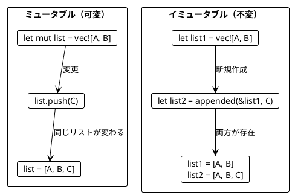

```rust
let list = vec!["Apple", "Book"];
// list.push("Mango"); // コンパイルエラー！不変だから

// 新しい Vec を作成する
let mut new_list = list.clone();
new_list.push("Mango");

assert_eq!(list.len(), 2);     // 元のリストは変わらない
assert_eq!(new_list.len(), 3); // 新しいリストに追加された
```

### 3.2 Vec の基本操作

#### appended - 要素の追加

元の Vec を変更せず、新しい Vec を返す関数を作成します。

```rust
pub fn appended<T: Clone>(list: &[T], element: T) -> Vec<T> {
    let mut result = list.to_vec();
    result.push(element);
    result
}

let apple_book = vec!["Apple", "Book"];
let apple_book_mango = appended(&apple_book, "Mango");

assert_eq!(apple_book.len(), 2);      // 元のリストは変わらない
assert_eq!(apple_book_mango.len(), 3);
assert_eq!(apple_book_mango, vec!["Apple", "Book", "Mango"]);
```

#### slice - リストの切り出し

Rust のスライスを使って部分的なデータを取得します。

```rust
pub fn first_two<T: Clone>(list: &[T]) -> Vec<T> {
    list.iter().take(2).cloned().collect()
}

pub fn last_two<T: Clone>(list: &[T]) -> Vec<T> {
    let len = list.len();
    if len <= 2 {
        list.to_vec()
    } else {
        list[len - 2..].to_vec()
    }
}

assert_eq!(first_two(&["a", "b", "c"]), vec!["a", "b"]);
assert_eq!(last_two(&["a", "b", "c"]), vec!["b", "c"]);
```

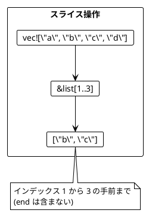

### 3.3 リストの変換例

```rust
/// 最初の2要素を末尾に移動
pub fn move_first_two_to_end<T: Clone>(list: &[T]) -> Vec<T> {
    if list.len() <= 2 {
        return list.to_vec();
    }
    let first_two = &list[..2];
    let without_first_two = &list[2..];
    appended_all(without_first_two, first_two)
}

assert_eq!(
    move_first_two_to_end(&["a", "b", "c"]),
    vec!["c", "a", "b"]
);

/// 最後の要素の前に新しい要素を挿入
pub fn insert_before_last<T: Clone>(list: &[T], element: T) -> Vec<T> {
    if list.is_empty() {
        return vec![element];
    }
    let len = list.len();
    let without_last = &list[..len - 1];
    let last = &list[len - 1..];
    let mut result = without_last.to_vec();
    result.push(element);
    result.extend_from_slice(last);
    result
}

assert_eq!(insert_before_last(&["a", "b"], "c"), vec!["a", "c", "b"]);
```

### 3.4 旅程の再計画

旅行の計画変更をイミュータブルに行う例です。

```rust
pub fn replan<'a>(plan: &[&'a str], new_city: &'a str, before_city: &str) -> Vec<&'a str> {
    let before_city_index = plan.iter().position(|&c| c == before_city);

    match before_city_index {
        Some(index) => {
            let cities_before = &plan[..index];
            let cities_after = &plan[index..];
            let mut result = cities_before.to_vec();
            result.push(new_city);
            result.extend_from_slice(cities_after);
            result
        }
        None => {
            let mut result = plan.to_vec();
            result.push(new_city);
            result
        }
    }
}

let plan_a = vec!["Paris", "Berlin", "Kraków"];
let plan_b = replan(&plan_a, "Vienna", "Kraków");

assert_eq!(plan_b, vec!["Paris", "Berlin", "Vienna", "Kraków"]);
assert_eq!(plan_a, vec!["Paris", "Berlin", "Kraków"]);  // 元の計画は変わらない!
```

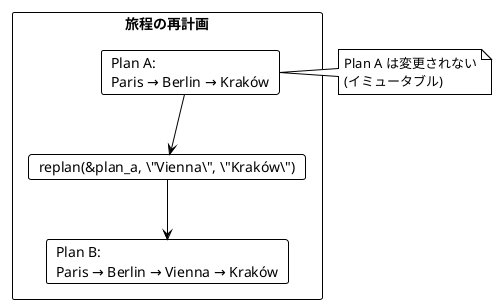

### 3.5 String とスライスの類似性

Rust の `&str` と `&[T]` は似た操作ができます。

| 操作 | Vec/スライス | String/&str |
|------|-------------|-------------|
| 結合 | `extend_from_slice` | `push_str`, `+` |
| 切り出し | `&list[start..end]` | `&s[start..end]` |
| サイズ | `len()` | `len()` |

```rust
pub fn abbreviate(name: &str) -> String {
    if let Some(space_index) = name.find(' ') {
        let initial = &name[..1];
        let last_name = &name[space_index + 1..];
        format!("{}. {}", initial, last_name)
    } else {
        name.to_string()
    }
}

assert_eq!(abbreviate("Alonzo Church"), "A. Church");
assert_eq!(abbreviate("Alan Turing"), "A. Turing");
```

---

## 第4章: 関数を値として扱う

### 4.1 高階関数とは

高階関数（Higher-Order Function）とは、以下のいずれかを満たす関数です:

1. 関数を引数として受け取る
2. 関数を戻り値として返す

**ソースファイル**: `app/rust/src/ch04_higher_order.rs`

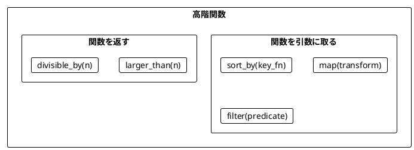

### 4.2 関数を引数として渡す

#### sort_by - ソート基準を関数で指定

```rust
pub fn score(word: &str) -> usize {
    word.chars().filter(|&c| c != 'a').count()
}

pub fn sort_by_score<T, F, K>(list: &[T], key_fn: F) -> Vec<T>
where
    T: Clone,
    F: Fn(&T) -> K,
    K: Ord,
{
    let mut result = list.to_vec();
    result.sort_by_key(|item| key_fn(item));
    result
}

let words = vec!["rust", "java"];
let sorted = sort_by_score(&words, |w| score(w));

assert_eq!(sorted, vec!["java", "rust"]);
// java: 2文字 (j, v), rust: 4文字 (r, u, s, t)
```

#### map - 各要素を変換

Rust のイテレータには `map` メソッドが組み込まれています。

```rust
let lengths: Vec<usize> = vec!["scala", "rust", "ada"]
    .iter()
    .map(|s| s.len())
    .collect();
assert_eq!(lengths, vec![5, 4, 3]);

let doubles: Vec<i32> = vec![5, 1, 2, 4, 0]
    .iter()
    .map(|&i| i * 2)
    .collect();
assert_eq!(doubles, vec![10, 2, 4, 8, 0]);
```

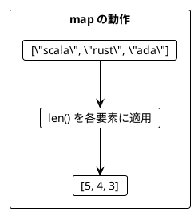

#### filter - 条件に合う要素を抽出

```rust
let odds: Vec<i32> = vec![5, 1, 2, 4, 0]
    .iter()
    .filter(|&&i| i % 2 == 1)
    .cloned()
    .collect();
assert_eq!(odds, vec![5, 1]);

let large: Vec<i32> = vec![5, 1, 2, 4, 0]
    .iter()
    .filter(|&&i| i > 4)
    .cloned()
    .collect();
assert_eq!(large, vec![5]);
```

#### fold - 畳み込み

Rust では `fold` メソッドを使います（Scala の `foldLeft` 相当）。

```rust
let sum = vec![5, 1, 2, 4, 100]
    .iter()
    .fold(0, |acc, &i| acc + i);
assert_eq!(sum, 112);

let max = vec![5, 1, 2, 4, 15]
    .iter()
    .fold(i32::MIN, |max, &i| if i > max { i } else { max });
assert_eq!(max, 15);
```

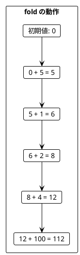

### 4.3 構造体とパターン

```rust
#[derive(Debug, Clone, PartialEq)]
pub struct ProgrammingLanguage {
    pub name: String,
    pub year: i32,
}

impl ProgrammingLanguage {
    pub fn new(name: &str, year: i32) -> Self {
        Self {
            name: name.to_string(),
            year,
        }
    }
}

let java = ProgrammingLanguage::new("Java", 1995);
let scala = ProgrammingLanguage::new("Scala", 2004);
let languages = vec![java.clone(), scala.clone()];

// フィールドにアクセス
let names: Vec<String> = languages.iter().map(|lang| lang.name.clone()).collect();
assert_eq!(names, vec!["Java", "Scala"]);

// 条件でフィルタ
let young: Vec<_> = languages.iter().filter(|lang| lang.year > 2000).collect();
assert_eq!(young.len(), 1);
```

### 4.4 関数を返す関数

Rust ではクロージャを返すことで、関数を返す関数を実現します。

```rust
pub fn larger_than(n: i32) -> impl Fn(i32) -> bool {
    move |i| i > n
}

let larger_than_4 = larger_than(4);
assert!(larger_than_4(5));
assert!(!larger_than_4(4));

// filter で使う場合
let large: Vec<i32> = vec![5, 1, 2, 4, 0]
    .into_iter()
    .filter(|&x| larger_than(4)(x))
    .collect();
assert_eq!(large, vec![5]);
```

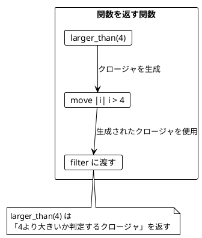

### 4.5 カリー化

カリー化（Currying）は、複数の引数を取る関数を、引数を1つずつ取る関数のチェーンに変換する技法です。

```rust
// カリー化された関数
pub fn curried_add(a: i32) -> impl Fn(i32) -> i32 {
    move |b| a + b
}

let add_10 = curried_add(10);
assert_eq!(add_10(5), 15);
assert_eq!(add_10(20), 30);
```

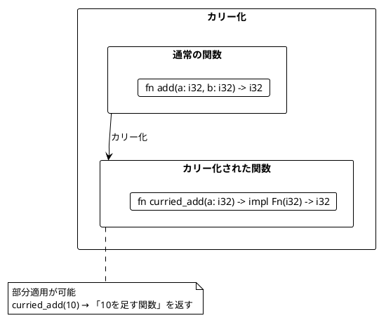

### 4.6 ワードスコアリングの例

複数のスコアリングロジックを組み合わせる例です。

```rust
pub fn score(word: &str) -> usize {
    word.chars().filter(|&c| c != 'a').count()
}

pub fn bonus(word: &str) -> i32 {
    if word.contains('c') { 5 } else { 0 }
}

pub fn penalty(word: &str) -> i32 {
    if word.contains('s') { 7 } else { 0 }
}

pub fn ranked_words<'a, F>(words: &[&'a str], word_score: F) -> Vec<&'a str>
where
    F: Fn(&str) -> i32,
{
    let mut result: Vec<&'a str> = words.to_vec();
    result.sort_by(|a, b| word_score(b).cmp(&word_score(a))); // 降順
    result
}

let words = vec!["ada", "haskell", "scala", "java", "rust"];

// 基本スコアでランキング
let ranking1 = ranked_words(&words, |w| score(w) as i32);
assert_eq!(ranking1, vec!["haskell", "rust", "scala", "java", "ada"]);

// ボーナス付きスコアでランキング
let ranking2 = ranked_words(&words, |w| score(w) as i32 + bonus(w));
assert_eq!(ranking2, vec!["scala", "haskell", "rust", "java", "ada"]);
```

---

## 第5章: flat_map とネスト構造

### 5.1 flatten と flat_map

**ソースファイル**: `app/rust/src/ch05_flatmap.rs`

#### flatten - ネストしたイテレータを平坦化

```rust
#[derive(Debug, Clone, PartialEq)]
pub struct Book {
    pub title: String,
    pub authors: Vec<String>,
}

let books = vec![
    Book::new("FP in Scala", vec!["Chiusano", "Bjarnason"]),
    Book::new("The Hobbit", vec!["Tolkien"]),
];

// map だけだとネストする
let author_lists: Vec<Vec<String>> = books.iter().map(|b| b.authors.clone()).collect();
// [["Chiusano", "Bjarnason"], ["Tolkien"]]

// flatten で平坦化
let authors: Vec<String> = author_lists.into_iter().flatten().collect();
// ["Chiusano", "Bjarnason", "Tolkien"]
```

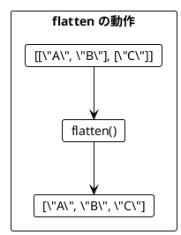

#### flat_map = map + flatten

```rust
// flat_map で同じことを1行で
let authors: Vec<String> = books
    .iter()
    .flat_map(|book| book.authors.clone())
    .collect();

assert_eq!(authors, vec!["Chiusano", "Bjarnason", "Tolkien"]);
```

### 5.2 flat_map によるリストサイズの変化

```rust
// 要素数が増える
let expanded: Vec<i32> = vec![1, 2, 3]
    .iter()
    .flat_map(|&i| vec![i, i + 10])
    .collect();
assert_eq!(expanded, vec![1, 11, 2, 12, 3, 13]);

// 要素数が同じ（map と同等）
let doubled: Vec<i32> = vec![1, 2, 3]
    .iter()
    .flat_map(|&i| vec![i * 2])
    .collect();
assert_eq!(doubled, vec![2, 4, 6]);

// 要素数が減る（filter の代替）
let evens: Vec<i32> = vec![1, 2, 3]
    .iter()
    .flat_map(|&i| if i % 2 == 0 { vec![i] } else { vec![] })
    .collect();
assert_eq!(evens, vec![2]);
```

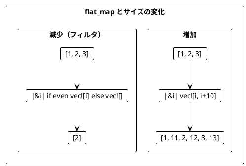

### 5.3 ネストした flat_map

複数のコレクションを組み合わせる場合、flat_map をネストします。

```rust
#[derive(Debug, Clone, PartialEq)]
pub struct Movie {
    pub title: String,
}

pub fn book_adaptations(author: &str) -> Vec<Movie> {
    if author == "Tolkien" {
        vec![
            Movie::new("An Unexpected Journey"),
            Movie::new("The Desolation of Smaug"),
        ]
    } else {
        vec![]
    }
}

let books = vec![
    Book::new("FP in Scala", vec!["Chiusano", "Bjarnason"]),
    Book::new("The Hobbit", vec!["Tolkien"]),
];

// ネストした flat_map
let recommendations: Vec<String> = books
    .iter()
    .flat_map(|book| {
        let book_title = book.title.clone();
        book.authors.iter().flat_map(move |author| {
            let author_name = author.clone();
            let book_title_inner = book_title.clone();
            book_adaptations(&author_name).into_iter().map(move |movie| {
                format!(
                    "You may like {}, because you liked {}'s {}",
                    movie.title, author_name, book_title_inner
                )
            })
        })
    })
    .collect();

// 結果:
// [
//   "You may like An Unexpected Journey, because you liked Tolkien's The Hobbit",
//   "You may like The Desolation of Smaug, because you liked Tolkien's The Hobbit"
// ]
```

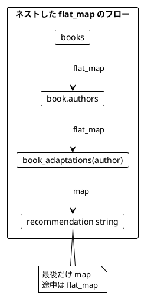

### 5.4 イテレータチェーン（Rust の for 内包表記相当）

Scala の for 内包表記に相当するものとして、Rust ではイテレータチェーンを使います。

```rust
// 全組み合わせを生成
pub fn all_combinations(xs: &[i32], ys: &[i32]) -> Vec<i32> {
    xs.iter()
        .flat_map(|&x| ys.iter().map(move |&y| x + y))
        .collect()
}

let result = all_combinations(&[1, 2], &[10, 20]);
assert_eq!(result, vec![11, 21, 12, 22]);

// 3つのリストの組み合わせ
pub fn three_way_combinations(xs: &[i32], ys: &[i32], zs: &[i32]) -> Vec<i32> {
    xs.iter()
        .flat_map(|&x| {
            ys.iter()
                .flat_map(move |&y| zs.iter().map(move |&z| x + y + z))
        })
        .collect()
}

let result = three_way_combinations(&[1, 2], &[10, 20], &[100, 200]);
assert_eq!(result, vec![111, 211, 121, 221, 112, 212, 122, 222]);
```

### 5.5 円内の点の判定

フィルタリングも含めた例です。

```rust
#[derive(Debug, Clone, Copy, PartialEq)]
pub struct Point {
    pub x: i32,
    pub y: i32,
}

pub fn is_inside(point: &Point, radius: i32) -> bool {
    radius * radius >= point.x * point.x + point.y * point.y
}

let points = vec![Point::new(5, 2), Point::new(1, 1)];
let radiuses = vec![2, 1];

// フィルタリングして円内の点のみを返す
let inside: Vec<String> = radiuses
    .iter()
    .flat_map(|&r| {
        points
            .iter()
            .filter(move |point| is_inside(point, r))
            .map(move |point| {
                format!("Point({},{}) is within a radius of {}", point.x, point.y, r)
            })
    })
    .collect();

assert_eq!(inside, vec!["Point(1,1) is within a radius of 2"]);
```

#### flat_map でフィルタリング（filter の代替）

```rust
// flat_map を使ったフィルタリング
let inside: Vec<String> = radiuses
    .iter()
    .flat_map(|&r| {
        points.iter().flat_map(move |point| {
            if is_inside(point, r) {
                vec![format!(
                    "Point({},{}) is within a radius of {}",
                    point.x, point.y, r
                )]
            } else {
                vec![]
            }
        })
    })
    .collect();
```

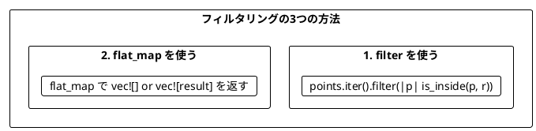

### 5.6 型の変化

イテレータの最初の型が結果の型を決定します。

```rust
use std::collections::HashSet;

// Vec から始まると Vec が返る
let list_result: Vec<i32> = vec![1, 2]
    .into_iter()
    .flat_map(|a| vec![2, 1].into_iter().map(move |b| a * b))
    .collect();
assert_eq!(list_result, vec![2, 1, 4, 2]); // 重複あり

// HashSet を使うと重複が除去される
let set_a: HashSet<i32> = [1, 2].into_iter().collect();
let list_b = vec![2, 1];

let set_result: HashSet<i32> = set_a
    .into_iter()
    .flat_map(|a| list_b.iter().map(move |&b| a * b))
    .collect();
assert_eq!(set_result.len(), 3); // 重複なし: {1, 2, 4}
```

---

## まとめ

### Part II で学んだこと

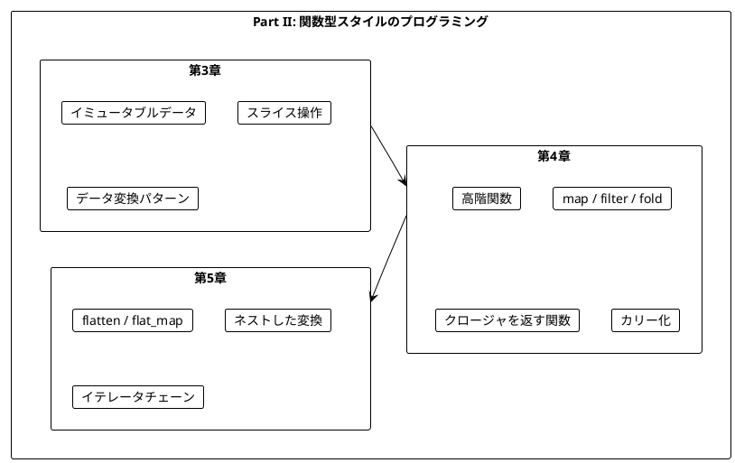

### Scala との比較

| 概念 | Scala | Rust |
|------|-------|------|
| イミュータブル | `val` (デフォルト) | `let` (デフォルト) |
| リスト追加 | `list.appended(elem)` | 自作 `appended()` or `Vec::push` |
| スライス | `list.slice(start, end)` | `&list[start..end]` |
| 高階関数 | `list.map(f)` | `iter().map(f).collect()` |
| フィルタ | `list.filter(p)` | `iter().filter(p).collect()` |
| 畳み込み | `list.foldLeft(init)(f)` | `iter().fold(init, f)` |
| 関数を返す | `def f(x: Int): Int => Boolean` | `fn f(x: i32) -> impl Fn(i32) -> bool` |
| for 内包表記 | `for { ... } yield ...` | イテレータチェーン |
| flat_map | `list.flatMap(f)` | `iter().flat_map(f).collect()` |

### キーポイント

| 章 | 主要概念 | キー操作 |
|----|----------|----------|
| 第3章 | イミュータブル | スライス `[..]`, `to_vec()`, `extend_from_slice` |
| 第4章 | 高階関数 | `map`, `filter`, `fold`, `sort_by_key` |
| 第5章 | 平坦化 | `flatten`, `flat_map`, イテレータチェーン |

### 重要な法則

1. **イミュータブルデータ**: Rust ではデフォルトで不変。新しいデータを作成する
2. **関数は値**: クロージャを引数として渡したり、戻り値として返したりできる
3. **flat_map パターン**: ネストした構造を平坦化しながら変換する
4. **イテレータチェーン**: Scala の for 内包表記に相当する表現力を持つ

### 次のステップ

Part III では、以下のトピックを学びます:

- `Option<T>` 型による安全な null ハンドリング
- `Result<T, E>` 型とエラー処理

---

## 演習問題

### 問題 1: イミュータブルな操作

以下の関数を実装してください。リストの中央に要素を挿入する関数です。

```rust
fn insert_at_middle<T: Clone>(list: &[T], element: T) -> Vec<T> {
    todo!()
}

// 期待される動作
assert_eq!(insert_at_middle(&["a", "b", "c", "d"], "X"), vec!["a", "b", "X", "c", "d"]);
assert_eq!(insert_at_middle(&["a", "b"], "X"), vec!["a", "X", "b"]);
```

<details>
<summary>解答</summary>

```rust
fn insert_at_middle<T: Clone>(list: &[T], element: T) -> Vec<T> {
    let middle = list.len() / 2;
    let before = &list[..middle];
    let after = &list[middle..];
    let mut result = before.to_vec();
    result.push(element);
    result.extend_from_slice(after);
    result
}
```

</details>

### 問題 2: 高階関数

以下の関数を実装してください。条件を満たす要素の数をカウントする関数です。

```rust
fn count_where<T, F>(list: &[T], predicate: F) -> usize
where
    F: Fn(&T) -> bool,
{
    todo!()
}

// 期待される動作
assert_eq!(count_where(&[1, 2, 3, 4, 5], |&i| i > 3), 2);
assert_eq!(count_where(&["a", "bb", "ccc"], |s| s.len() > 1), 2);
```

<details>
<summary>解答</summary>

```rust
fn count_where<T, F>(list: &[T], predicate: F) -> usize
where
    F: Fn(&T) -> bool,
{
    list.iter().filter(|item| predicate(item)).count()
}

// または fold を使って
fn count_where2<T, F>(list: &[T], predicate: F) -> usize
where
    F: Fn(&T) -> bool,
{
    list.iter().fold(0, |count, elem| {
        if predicate(elem) { count + 1 } else { count }
    })
}
```

</details>

### 問題 3: イテレータチェーン

以下のネストした flat_map を読みやすく整理してください。

```rust
let result: Vec<i32> = vec![1, 2]
    .iter()
    .flat_map(|&x| {
        vec![10, 20]
            .iter()
            .flat_map(move |&y| {
                vec![100, 200]
                    .iter()
                    .map(move |&z| x + y + z)
            })
    })
    .collect();
```

<details>
<summary>解答</summary>

```rust
// イテレータアダプタ iproduct を使う方法（itertools クレート）
use itertools::iproduct;

let result: Vec<i32> = iproduct!(
    vec![1, 2],
    vec![10, 20],
    vec![100, 200]
)
.map(|(x, y, z)| x + y + z)
.collect();

// または、ヘルパー関数を使う
fn three_way_combinations(xs: &[i32], ys: &[i32], zs: &[i32]) -> Vec<i32> {
    xs.iter()
        .flat_map(|&x| {
            ys.iter()
                .flat_map(move |&y| zs.iter().map(move |&z| x + y + z))
        })
        .collect()
}

let result = three_way_combinations(&[1, 2], &[10, 20], &[100, 200]);
// 結果: [111, 211, 121, 221, 112, 212, 122, 222]
```

</details>

### 問題 4: flat_map によるフィルタリング

flat_map だけで偶数のみを抽出するコードを書いてください。

```rust
let numbers = vec![1, 2, 3, 4, 5, 6];
// 偶数のみを抽出: vec![2, 4, 6]
```

<details>
<summary>解答</summary>

```rust
let even_numbers: Vec<i32> = numbers
    .iter()
    .flat_map(|&n| if n % 2 == 0 { vec![n] } else { vec![] })
    .collect();

// または関数に分離
fn even_filter(n: &i32) -> Vec<i32> {
    if n % 2 == 0 { vec![*n] } else { vec![] }
}

let even_numbers2: Vec<i32> = numbers.iter().flat_map(even_filter).collect();
```

</details>
