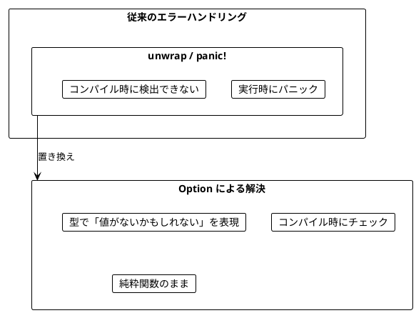
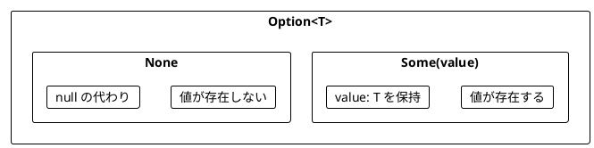
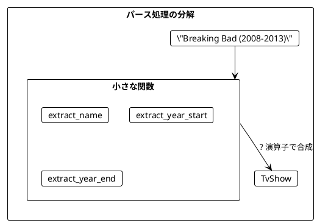
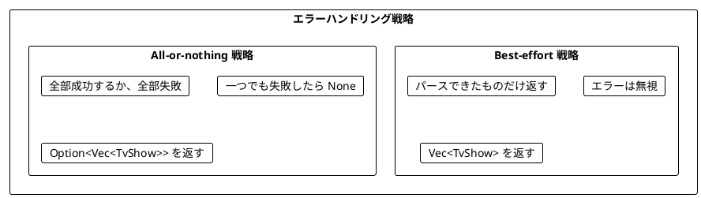
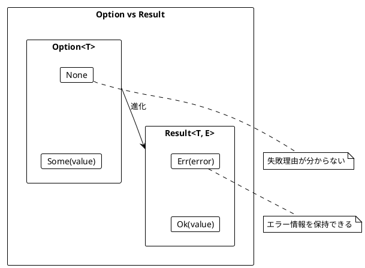
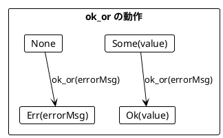
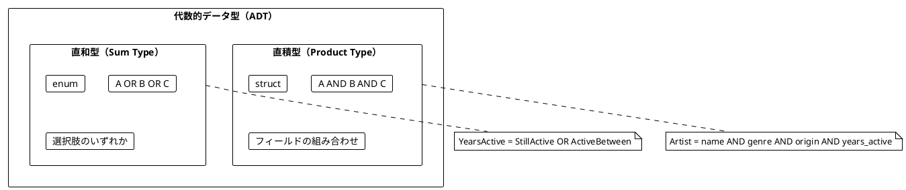
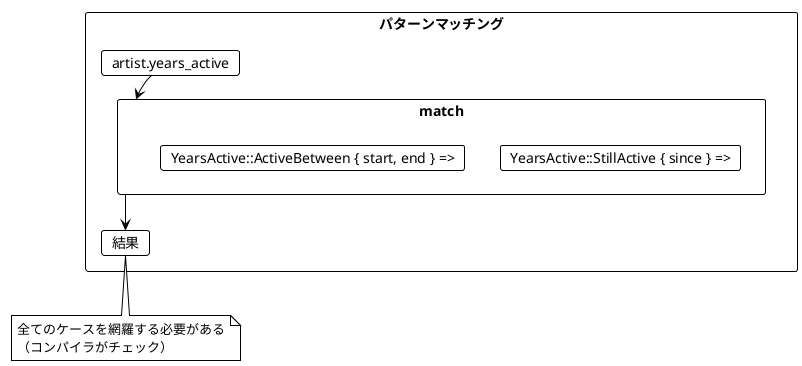
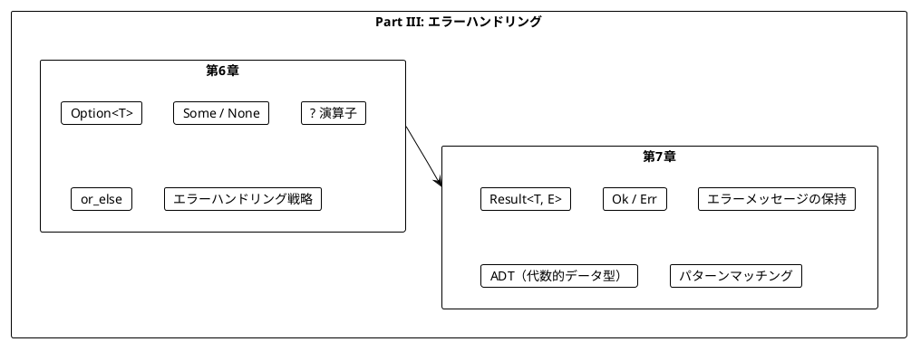

# Part III: エラーハンドリングと Option/Result

本章では、関数型プログラミングにおける安全なエラーハンドリングを学びます。`null` や例外に頼らず、`Option<T>` と `Result<T, E>` を使って型安全にエラーを扱う方法を習得します。

---

## 第6章: Option 型による安全なエラーハンドリング

### 6.1 なぜ Option が必要か

従来のエラーハンドリングには問題があります。

**ソースファイル**: `app/rust/src/ch06_option.rs`



#### 問題のあるコード（unwrap を使用）

```rust
// panic! が発生する可能性あり
pub fn parse_show_unsafe(raw_show: &str) -> (&str, i32, i32) {
    let bracket_open = raw_show.find('(').unwrap();  // パニックの可能性
    let bracket_close = raw_show.find(')').unwrap(); // パニックの可能性
    let dash = raw_show.find('-').unwrap();          // パニックの可能性

    let name = raw_show[..bracket_open].trim();
    let year_start: i32 = raw_show[bracket_open + 1..dash].parse().unwrap();
    let year_end: i32 = raw_show[dash + 1..bracket_close].parse().unwrap();

    (name, year_start, year_end)
}

// 正常ケース
parse_show_unsafe("Breaking Bad (2008-2013)");  // OK

// 異常ケース → panic!
parse_show_unsafe("Chernobyl (2019)");  // パニック！ '-' がない
parse_show_unsafe("The Wire 2002-2008"); // パニック！ '(' がない
```

### 6.2 Option の基本

`Option<T>` は「`T` 型の値があるか、ないか」を表す型です。



```rust
#[derive(Debug, Clone, PartialEq)]
pub struct TvShow {
    pub title: String,
    pub start: i32,
    pub end: i32,
}

impl TvShow {
    pub fn new(title: &str, start: i32, end: i32) -> Self {
        Self {
            title: title.to_string(),
            start,
            end,
        }
    }
}
```

### 6.3 TV番組のパース例

Option を使って安全にパースする方法を学びます。

#### 小さな関数から組み立てる

```rust
/// 番組名を抽出
pub fn extract_name(raw_show: &str) -> Option<String> {
    let bracket_open = raw_show.find('(')?;  // ? 演算子で None を伝播
    if bracket_open > 0 {
        Some(raw_show[..bracket_open].trim().to_string())
    } else {
        None
    }
}

/// 開始年を抽出
pub fn extract_year_start(raw_show: &str) -> Option<i32> {
    let bracket_open = raw_show.find('(')?;
    let dash = raw_show.find('-')?;

    if dash > bracket_open + 1 {
        let year_str = &raw_show[bracket_open + 1..dash];
        year_str.parse().ok()  // parse の Result を Option に変換
    } else {
        None
    }
}

/// 終了年を抽出
pub fn extract_year_end(raw_show: &str) -> Option<i32> {
    let dash = raw_show.find('-')?;
    let bracket_close = raw_show.find(')')?;

    if bracket_close > dash + 1 {
        let year_str = &raw_show[dash + 1..bracket_close];
        year_str.parse().ok()
    } else {
        None
    }
}
```



### 6.4 ? 演算子による合成

Rust の `?` 演算子は、Scala の for 内包表記に相当します。

```rust
/// TV番組をパース（Option 版）
pub fn parse_show(raw_show: &str) -> Option<TvShow> {
    let name = extract_name(raw_show)?;
    let year_start = extract_year_start(raw_show)
        .or_else(|| extract_single_year(raw_show))?;
    let year_end = extract_year_end(raw_show)
        .or_else(|| extract_single_year(raw_show))?;

    Some(TvShow::new(&name, year_start, year_end))
}

// 正常ケース
parse_show("Breaking Bad (2008-2013)");  // Some(TvShow { ... })
parse_show("Chernobyl (2019)");          // Some(TvShow { ... })

// 異常ケース → None が返される（パニックなし）
parse_show("The Wire 2002-2008");         // None
```

### 6.5 or_else によるフォールバック

`or_else` を使って、最初の Option が `None` の場合に代替を試すことができます。

```rust
let seven: Option<i32> = Some(7);
let eight: Option<i32> = Some(8);
let none: Option<i32> = None;

assert_eq!(seven.or(eight), Some(7));   // 最初が Some なのでそのまま
assert_eq!(none.or(eight), Some(8));    // 最初が None なので代替を使用
assert_eq!(seven.or(none), Some(7));
assert_eq!(none.or(none), None);
```

#### 単年の番組に対応する

```rust
/// 単年の番組から年を抽出（例: "Chernobyl (2019)"）
pub fn extract_single_year(raw_show: &str) -> Option<i32> {
    // ダッシュがある場合は単年ではない
    if raw_show.contains('-') {
        return None;
    }

    let bracket_open = raw_show.find('(')?;
    let bracket_close = raw_show.find(')')?;

    if bracket_close > bracket_open + 1 {
        let year_str = &raw_show[bracket_open + 1..bracket_close];
        year_str.parse().ok()
    } else {
        None
    }
}

// これで単年の番組もパースできる
parse_show("Chernobyl (2019)");  // Some(TvShow { title: "Chernobyl", start: 2019, end: 2019 })
```

### 6.6 Option の主要メソッド

| メソッド | 説明 | 例 |
|----------|------|-----|
| `map` | 値があれば変換 | `Some(5).map(\|x\| x * 2)` → `Some(10)` |
| `and_then` | 値があれば Option を返す関数を適用 | `Some(5).and_then(\|x\| Some(x * 2))` → `Some(10)` |
| `filter` | 条件を満たさなければ None | `Some(5).filter(\|&x\| x > 10)` → `None` |
| `or` / `or_else` | None なら代替を使用 | `None.or(Some(5))` → `Some(5)` |
| `unwrap_or` | None ならデフォルト値 | `None.unwrap_or(0)` → `0` |
| `ok_or` | Result に変換 | `Some(5).ok_or("error")` → `Ok(5)` |

```rust
let year: Option<i32> = Some(996);
let no_year: Option<i32> = None;

// map
assert_eq!(year.map(|y| y * 2), Some(1992));
assert_eq!(no_year.map(|y| y * 2), None);

// and_then (Scala の flatMap 相当)
assert_eq!(year.and_then(|y| Some(y * 2)), Some(1992));
assert_eq!(no_year.and_then(|y| Some(y * 2)), None);

// filter
assert_eq!(year.filter(|&y| y < 2020), Some(996));
assert_eq!(year.filter(|&y| y > 2020), None);

// unwrap_or
assert_eq!(year.unwrap_or(0), 996);
assert_eq!(no_year.unwrap_or(0), 0);
```

### 6.7 エラーハンドリング戦略

複数の要素をパースする場合、2つの戦略があります。



#### Best-effort 戦略

```rust
pub fn parse_shows_best_effort(raw_shows: &[&str]) -> Vec<TvShow> {
    raw_shows
        .iter()
        .filter_map(|raw| parse_show(raw))  // Some のみ収集
        .collect()
}

let raw_shows = vec![
    "Breaking Bad (2008-2013)",
    "The Wire 2002 2008",        // 無効な形式
    "Mad Men (2007-2015)",
];

let shows = parse_shows_best_effort(&raw_shows);
// vec![TvShow("Breaking Bad", ...), TvShow("Mad Men", ...)]
// 無効なものは無視される
```

#### All-or-nothing 戦略

```rust
pub fn parse_shows_all_or_nothing(raw_shows: &[&str]) -> Option<Vec<TvShow>> {
    raw_shows.iter().map(|raw| parse_show(raw)).collect()
}

// 全部成功 → Some(vec![...])
parse_shows_all_or_nothing(&["Breaking Bad (2008-2013)", "Mad Men (2007-2015)"]);
// Some(vec![TvShow(...), TvShow(...)])

// 一つでも失敗 → None
parse_shows_all_or_nothing(&["Breaking Bad (2008-2013)", "Invalid"]);
// None
```

### 6.8 forall と exists 相当

Scala の `forall` と `exists` に相当する操作を実装できます。

```rust
/// Option に対する forall
pub fn option_forall<T, F>(opt: &Option<T>, predicate: F) -> bool
where
    F: Fn(&T) -> bool,
{
    opt.as_ref().map(predicate).unwrap_or(true)
}

/// Option に対する exists
pub fn option_exists<T, F>(opt: &Option<T>, predicate: F) -> bool
where
    F: Fn(&T) -> bool,
{
    opt.as_ref().map(predicate).unwrap_or(false)
}

let year: Option<i32> = Some(996);
let no_year: Option<i32> = None;

// forall: 「全て」または「存在しない」
assert!(option_forall(&year, |&y| y < 2020));     // true
assert!(option_forall(&no_year, |&y| y < 2020));  // true (None は true)

// exists: 「存在して条件を満たす」
assert!(option_exists(&year, |&y| y < 2020));     // true
assert!(!option_exists(&no_year, |&y| y < 2020)); // false (None は false)
```

---

## 第7章: Result 型と複合的なエラー処理

### 7.1 Option の限界

`Option` は「値があるかないか」しか表現できません。**なぜ失敗したのか**を伝えられません。

**ソースファイル**: `app/rust/src/ch07_result.rs`



### 7.2 Result の基本

`Result<T, E>` は「`T` 型の成功値か、`E` 型のエラーか」を表す型です。

- `Ok(value)`: 成功
- `Err(error)`: 失敗（エラー情報を保持）

```rust
pub fn extract_name(raw_show: &str) -> Result<String, String> {
    let bracket_open = raw_show
        .find('(')
        .ok_or_else(|| format!("Can't find '(' in {}", raw_show))?;

    if bracket_open > 0 {
        Ok(raw_show[..bracket_open].trim().to_string())
    } else {
        Err(format!("Can't extract name from {}", raw_show))
    }
}

extract_name("The Wire (2002-2008)");  // Ok("The Wire")
extract_name("(2022)");                // Err("Can't extract name from (2022)")
```

### 7.3 Result を使ったパース

```rust
pub fn extract_year_start(raw_show: &str) -> Result<i32, String> {
    let bracket_open = raw_show
        .find('(')
        .ok_or_else(|| format!("Can't find '(' in {}", raw_show))?;
    let dash = raw_show
        .find('-')
        .ok_or_else(|| format!("Can't find '-' in {}", raw_show))?;

    if dash > bracket_open + 1 {
        let year_str = &raw_show[bracket_open + 1..dash];
        year_str
            .parse()
            .map_err(|_| format!("Can't parse '{}' as year", year_str))
    } else {
        Err(format!("Can't extract start year from {}", raw_show))
    }
}

extract_year_start("The Wire (2002-2008)");  // Ok(2002)
extract_year_start("The Wire (-2008)");      // Err("Can't extract start year from ...")
extract_year_start("The Wire (oops-2008)");  // Err("Can't parse 'oops' as year")
```

### 7.4 Option から Result への変換

`ok_or` / `ok_or_else` メソッドで `Option` を `Result` に変換できます。

```rust
let year: Option<i32> = Some(996);
let no_year: Option<i32> = None;

assert_eq!(year.ok_or("no year given"), Ok(996));
assert_eq!(no_year.ok_or("no year given"), Err("no year given"));
```



### 7.5 Result による完全なパーサー

```rust
pub fn parse_show(raw_show: &str) -> Result<TvShow, String> {
    let name = extract_name(raw_show)?;
    let year_start = extract_year_start(raw_show)
        .or_else(|_| extract_single_year(raw_show))?;
    let year_end = extract_year_end(raw_show)
        .or_else(|_| extract_single_year(raw_show))?;

    Ok(TvShow::new(&name, year_start, year_end))
}

parse_show("The Wire (2002-2008)");  // Ok(TvShow { ... })
parse_show("Mad Men ()");            // Err("Can't extract single year from ...")
parse_show("(2002-2008)");           // Err("Can't extract name from ...")
```

### 7.6 Result の主要メソッド

| メソッド | 説明 | 例 |
|----------|------|-----|
| `map` | Ok の値を変換 | `Ok(5).map(\|x\| x * 2)` → `Ok(10)` |
| `and_then` | Ok なら Result を返す関数を適用 | `Ok(5).and_then(\|x\| Ok(x * 2))` → `Ok(10)` |
| `or_else` | Err なら代替を使用 | `Err("err").or_else(\|_\| Ok(5))` → `Ok(5)` |
| `ok` | Option に変換 | `Ok(5).ok()` → `Some(5)` |
| `map_err` | Err の値を変換 | `Err("e").map_err(\|e\| format!("Error: {}", e))` |

```rust
let year: Result<i32, &str> = Ok(996);
let no_year: Result<i32, &str> = Err("no year");

// map
assert_eq!(year.map(|y| y * 2), Ok(1992));
assert_eq!(no_year.map(|y| y * 2), Err("no year"));

// and_then
assert_eq!(year.and_then(|y| Ok(y * 2)), Ok(1992));
assert_eq!(no_year.and_then(|y| Ok(y * 2)), Err("no year"));

// ok (Option に変換)
assert_eq!(year.ok(), Some(996));
assert_eq!(no_year.ok(), None);
```

### 7.7 代数的データ型（ADT）- enum

Rust の `enum` を使って、より表現力の高いモデルを作れます。

#### 直和型（Sum Type）

複数の選択肢を **OR** で表す型です。

```rust
/// 音楽ジャンル
#[derive(Debug, Clone, Copy, PartialEq, Eq)]
pub enum MusicGenre {
    HeavyMetal,
    Pop,
    HardRock,
    Jazz,
}

/// 活動期間
#[derive(Debug, Clone, PartialEq)]
pub enum YearsActive {
    /// 現在も活動中
    StillActive { since: i32 },
    /// 活動終了
    ActiveBetween { start: i32, end: i32 },
}
```

#### 直積型（Product Type）

複数のフィールドを **AND** で組み合わせる型です。

```rust
/// アーティスト
#[derive(Debug, Clone, PartialEq)]
pub struct Artist {
    pub name: String,
    pub genre: MusicGenre,
    pub origin: String,
    pub years_active: YearsActive,
}
```



### 7.8 パターンマッチング

直和型は **パターンマッチング** で処理します。

```rust
/// アーティストが指定期間に活動していたか判定
pub fn was_artist_active(artist: &Artist, year_start: i32, year_end: i32) -> bool {
    match &artist.years_active {
        YearsActive::StillActive { since } => *since <= year_end,
        YearsActive::ActiveBetween { start, end } => *start <= year_end && *end >= year_start,
    }
}

/// アーティストの活動年数を計算
pub fn active_length(artist: &Artist, current_year: i32) -> i32 {
    match &artist.years_active {
        YearsActive::StillActive { since } => current_year - since,
        YearsActive::ActiveBetween { start, end } => end - start,
    }
}

let metallica = Artist::new(
    "Metallica",
    MusicGenre::HeavyMetal,
    "U.S.",
    YearsActive::StillActive { since: 1981 }
);

let led_zeppelin = Artist::new(
    "Led Zeppelin",
    MusicGenre::HardRock,
    "England",
    YearsActive::ActiveBetween { start: 1968, end: 1980 }
);

assert!(was_artist_active(&metallica, 1990, 2000));
assert!(!was_artist_active(&led_zeppelin, 1990, 2000));

assert_eq!(active_length(&metallica, 2024), 43);
assert_eq!(active_length(&led_zeppelin, 2024), 12);
```



### 7.9 検索条件のモデリング

検索条件も enum でモデリングできます。

```rust
/// 検索条件
#[derive(Debug, Clone, PartialEq)]
pub enum SearchCondition {
    SearchByGenre(Vec<MusicGenre>),
    SearchByOrigin(Vec<String>),
    SearchByActiveYears { start: i32, end: i32 },
}

/// アーティストを検索
pub fn search_artists<'a>(
    artists: &'a [Artist],
    conditions: &[SearchCondition],
) -> Vec<&'a Artist> {
    artists
        .iter()
        .filter(|artist| {
            conditions.iter().all(|condition| match condition {
                SearchCondition::SearchByGenre(genres) => genres.contains(&artist.genre),
                SearchCondition::SearchByOrigin(locations) => locations.contains(&artist.origin),
                SearchCondition::SearchByActiveYears { start, end } => {
                    was_artist_active(artist, *start, *end)
                }
            })
        })
        .collect()
}
```

### 7.10 カスタムエラー型

エラー種別を enum で定義することで、より型安全なエラーハンドリングができます。

```rust
/// パースエラー
#[derive(Debug, Clone, PartialEq)]
pub enum ParseError {
    MissingName,
    MissingYear,
    InvalidYear(String),
    MissingBracket,
}

impl std::fmt::Display for ParseError {
    fn fmt(&self, f: &mut std::fmt::Formatter<'_>) -> std::fmt::Result {
        match self {
            ParseError::MissingName => write!(f, "Missing name"),
            ParseError::MissingYear => write!(f, "Missing year"),
            ParseError::InvalidYear(s) => write!(f, "Invalid year: {}", s),
            ParseError::MissingBracket => write!(f, "Missing bracket"),
        }
    }
}

/// TV番組をパース（カスタムエラー型版）
pub fn parse_show_typed(raw_show: &str) -> Result<TvShow, ParseError> {
    let bracket_open = raw_show.find('(').ok_or(ParseError::MissingBracket)?;

    if bracket_open == 0 {
        return Err(ParseError::MissingName);
    }

    // ... 以下省略
}

parse_show_typed("Breaking Bad (2008-2013)");  // Ok(TvShow { ... })
parse_show_typed("(2008-2013)");               // Err(ParseError::MissingName)
parse_show_typed("Test ()");                   // Err(ParseError::MissingYear)
```

### 7.11 支払い方法の例

より実践的な enum の例として、支払い方法をモデリングします。

```rust
/// 支払い方法
#[derive(Debug, Clone, PartialEq)]
pub enum PaymentMethod {
    CreditCard { number: String, expiry: String },
    BankTransfer { account_number: String },
    Cash,
}

/// 支払い方法を説明
pub fn describe_payment(method: &PaymentMethod) -> String {
    match method {
        PaymentMethod::CreditCard { number, .. } => {
            format!("Credit card ending in {}", number)
        }
        PaymentMethod::BankTransfer { account_number } => {
            format!("Bank transfer to account {}", account_number)
        }
        PaymentMethod::Cash => "Cash payment".to_string(),
    }
}

assert_eq!(
    describe_payment(&PaymentMethod::CreditCard {
        number: "1234".to_string(),
        expiry: "12/25".to_string()
    }),
    "Credit card ending in 1234"
);
assert_eq!(describe_payment(&PaymentMethod::Cash), "Cash payment");
```

---

## まとめ

### Part III で学んだこと



### Scala との比較

| 概念 | Scala | Rust |
|------|-------|------|
| 値の有無 | `Option[A]` | `Option<T>` |
| 成功/失敗 | `Either[E, A]` | `Result<T, E>` |
| 値あり | `Some(value)` | `Some(value)` |
| 値なし | `None` | `None` |
| 成功 | `Right(value)` | `Ok(value)` |
| 失敗 | `Left(error)` | `Err(error)` |
| for 内包表記 | `for { ... } yield` | `?` 演算子 |
| flatMap | `flatMap` | `and_then` |
| orElse | `orElse` | `or_else` |
| Option→Either | `toRight` | `ok_or` |
| ADT | `sealed trait` + `case class` | `enum` |

### Option vs Result の使い分け

| 状況 | 使用する型 |
|------|------------|
| 値があるかないかだけが重要 | `Option<T>` |
| 失敗理由を伝える必要がある | `Result<T, E>` |
| 検索結果が見つからない | `Option<T>` |
| バリデーションエラーを伝える | `Result<T, String>` |
| 複数のエラー種別がある | `Result<T, ErrorEnum>` |

### キーポイント

1. **Option**: 値の有無を型で表現する
2. **Result**: 成功/失敗とエラー情報を型で表現する
3. **? 演算子**: Option/Result を組み合わせて使う（Scala の for 内包表記相当）
4. **or_else**: フォールバックを提供する
5. **ADT**: enum でドメインを正確にモデリング
6. **パターンマッチング**: enum を安全に処理する（網羅性チェックあり）

### 次のステップ

Part IV では、以下のトピックを学びます:

- 非同期処理（async/await）
- ストリーム処理（tokio-stream）

---

## 演習問題

### 問題 1: Option の基本

以下の関数を実装してください。

```rust
fn safe_divide(a: i32, b: i32) -> Option<i32> {
    todo!()
}

// 期待される動作
assert_eq!(safe_divide(10, 2), Some(5));
assert_eq!(safe_divide(10, 0), None);
assert_eq!(safe_divide(7, 2), Some(3));
```

<details>
<summary>解答</summary>

```rust
fn safe_divide(a: i32, b: i32) -> Option<i32> {
    if b == 0 {
        None
    } else {
        Some(a / b)
    }
}
```

</details>

### 問題 2: Option の合成

以下の関数を実装してください。2つの数値文字列を受け取り、その合計を返します。

```rust
fn add_strings(a: &str, b: &str) -> Option<i32> {
    todo!()
}

// 期待される動作
assert_eq!(add_strings("10", "20"), Some(30));
assert_eq!(add_strings("10", "abc"), None);
assert_eq!(add_strings("xyz", "20"), None);
```

<details>
<summary>解答</summary>

```rust
fn add_strings(a: &str, b: &str) -> Option<i32> {
    let x: i32 = a.parse().ok()?;
    let y: i32 = b.parse().ok()?;
    Some(x + y)
}
```

</details>

### 問題 3: Result によるバリデーション

以下の関数を実装してください。年齢を検証し、エラーメッセージを返します。

```rust
fn validate_age(age: i32) -> Result<i32, String> {
    todo!()
}

// 期待される動作
assert_eq!(validate_age(25), Ok(25));
assert_eq!(validate_age(-5), Err("Age cannot be negative".to_string()));
assert_eq!(validate_age(200), Err("Age cannot be greater than 150".to_string()));
```

<details>
<summary>解答</summary>

```rust
fn validate_age(age: i32) -> Result<i32, String> {
    if age < 0 {
        Err("Age cannot be negative".to_string())
    } else if age > 150 {
        Err("Age cannot be greater than 150".to_string())
    } else {
        Ok(age)
    }
}
```

</details>

### 問題 4: パターンマッチング

以下の enum とパターンマッチングを使った関数を実装してください。

```rust
enum PaymentMethod {
    CreditCard { number: String, expiry: String },
    BankTransfer { account_number: String },
    Cash,
}

fn describe_payment(method: &PaymentMethod) -> String {
    todo!()
}

// 期待される動作
assert_eq!(
    describe_payment(&PaymentMethod::CreditCard {
        number: "1234".to_string(),
        expiry: "12/25".to_string()
    }),
    "Credit card ending in 1234"
);
assert_eq!(
    describe_payment(&PaymentMethod::BankTransfer {
        account_number: "9876".to_string()
    }),
    "Bank transfer to account 9876"
);
assert_eq!(describe_payment(&PaymentMethod::Cash), "Cash payment");
```

<details>
<summary>解答</summary>

```rust
fn describe_payment(method: &PaymentMethod) -> String {
    match method {
        PaymentMethod::CreditCard { number, .. } => {
            format!("Credit card ending in {}", number)
        }
        PaymentMethod::BankTransfer { account_number } => {
            format!("Bank transfer to account {}", account_number)
        }
        PaymentMethod::Cash => "Cash payment".to_string(),
    }
}
```

</details>
