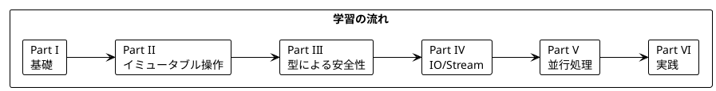

# Grokking Functional Programming 日本語解説

本シリーズは「Grokking Functional Programming」（Michał Płachta 著）の学習コンパニオンとして、関数型プログラミングの概念を日本語で解説します。

---

## 対象読者

- Java や OOP の経験があり、関数型プログラミングに興味がある開発者
- Scala を学びたいが、FP の概念から理解したい方
- 実践的な FP の適用方法を知りたいエンジニア

---

## 記事一覧

### [Part I: 関数型プログラミングの基礎](part-1.md)

関数型プログラミングの基本概念を学びます。

| 章 | トピック |
|----|----------|
| 第1章 | 命令型 vs 関数型、Scala 基本構文 |
| 第2章 | 純粋関数、副作用の排除、テストの容易さ |

**キーワード**: 純粋関数、参照透過性、副作用

---

### [Part II: 関数型スタイルのプログラミング](part-2.md)

イミュータブルなデータ操作と高階関数を学びます。

| 章 | トピック |
|----|----------|
| 第3章 | イミュータブルデータ、List 操作 |
| 第4章 | 高階関数、map/filter/foldLeft |
| 第5章 | flatMap、for 内包表記 |

**キーワード**: イミュータブル、高階関数、flatMap、for 内包表記

---

### [Part III: エラーハンドリングと Option/Either](part-3.md)

型安全なエラーハンドリングを学びます。

| 章 | トピック |
|----|----------|
| 第6章 | Option 型、Some/None |
| 第7章 | Either 型、ADT、パターンマッチング |

**キーワード**: Option、Either、代数的データ型（ADT）

---

### [Part IV: IO と副作用の管理](part-4.md)

IO モナドとストリーム処理を学びます。

| 章 | トピック |
|----|----------|
| 第8章 | IO モナド、cats-effect |
| 第9章 | fs2 Stream、無限ストリーム |

**キーワード**: IO モナド、遅延評価、ストリーム処理

---

### [Part V: 並行処理](part-5.md)

関数型プログラミングにおける並行処理を学びます。

| 章 | トピック |
|----|----------|
| 第10章 | Ref、Fiber、parSequence |

**キーワード**: 並行処理、Ref、Fiber、軽量スレッド

---

### [Part VI: 実践的なアプリケーション構築とテスト](part-6.md)

実践的なアプリケーション構築とテスト戦略を学びます。

| 章 | トピック |
|----|----------|
| 第11章 | TravelGuide アプリ、Resource、キャッシュ |
| 第12章 | テスト戦略、プロパティベーステスト |

**キーワード**: Resource、DataAccess 抽象化、ScalaCheck

---

## 学習パス



---

## 使用ライブラリ

| ライブラリ | 用途 | 対応章 |
|------------|------|--------|
| Scala 3 | 言語 | 全章 |
| cats-effect | IO モナド | Part IV-VI |
| fs2 | ストリーム処理 | Part IV-V |
| ScalaCheck | プロパティベーステスト | Part VI |

---

## リポジトリ構成

```
grokkingfp-examples/
├── app/scala/src/main/scala/    # Scala のサンプルコード
├── app/java/src/main/java/      # Java の比較用コード
├── src/test/scala/              # テストコード
├── docs/journal/                # 開発履歴
└── docs/article/                # 解説記事（本ディレクトリ）
    ├── index.md                 # この記事
    ├── outline.md               # アウトライン
    ├── part-1.md                # Part I
    ├── part-2.md                # Part II
    ├── part-3.md                # Part III
    ├── part-4.md                # Part IV
    ├── part-5.md                # Part V
    └── part-6.md                # Part VI
```

---

## 関数型プログラミングの利点

本シリーズを通じて、以下の利点を実感できます:

1. **予測可能性** - 純粋関数は同じ入力に対して常に同じ出力
2. **テスト容易性** - 副作用がないためテストが簡単
3. **合成可能性** - 小さな関数を組み合わせて複雑な処理を構築
4. **並行安全性** - イミュータブルデータは競合状態を防ぐ
5. **型安全性** - Option、Either で null や例外を型で表現

---

## 参考資料

- [Grokking Functional Programming](https://www.manning.com/books/grokking-functional-programming) - 原著
- [Scala 公式ドキュメント](https://docs.scala-lang.org/)
- [cats-effect ドキュメント](https://typelevel.org/cats-effect/)
- [fs2 ドキュメント](https://fs2.io/)
