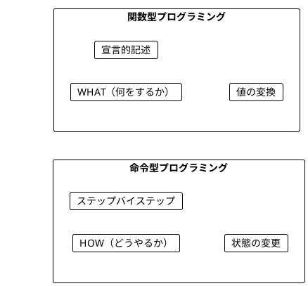
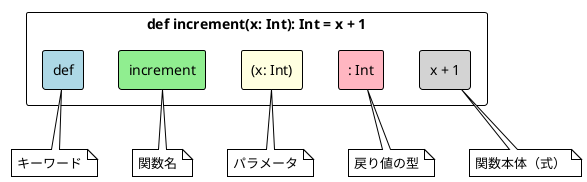
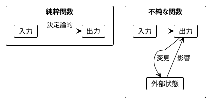
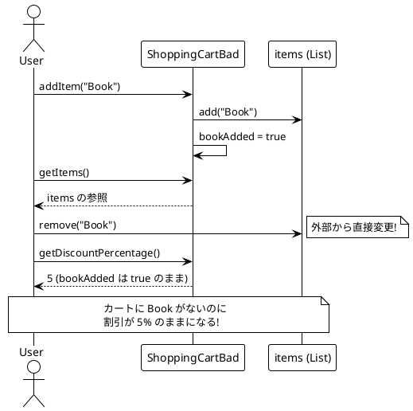
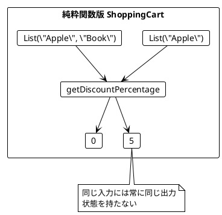
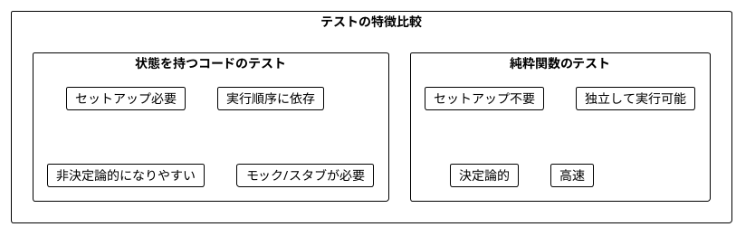
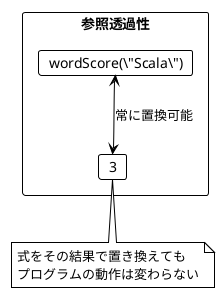
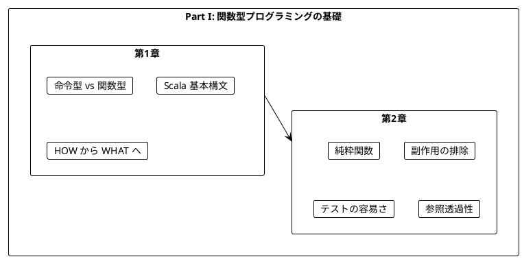

# Part I: 関数型プログラミングの基礎

本章では、関数型プログラミング（FP）の基本概念を学びます。命令型プログラミングとの違いを理解し、純粋関数の利点を実感することが目標です。

---

## 第1章: 関数型プログラミング入門

### 1.1 命令型 vs 関数型

プログラミングには大きく分けて2つのパラダイムがあります。



**命令型プログラミング**は「どうやるか」を記述します。

```java
// Java: 命令型でワードスコアを計算
public static int calculateScore(String word) {
    int score = 0;
    for(char c : word.toCharArray()) {
        score++;
    }
    return score;
}
```

**関数型プログラミング**は「何をするか」を記述します。

```scala
// Scala: 関数型でワードスコアを計算
def wordScore(word: String): Int = {
  word.length()
}
```

### 1.2 Scala の基本構文

Scala での関数定義の基本形を見てみましょう。

**ソースファイル**: `app/scala/src/main/scala/ch01_IntroScala.scala`

```scala
def increment(x: Int): Int = {
  x + 1
}

def getFirstCharacter(s: String): Char = {
  s.charAt(0)
}

def wordScore(word: String): Int = {
  word.length()
}
```

### 1.3 関数の構造



### 1.4 学習ポイント

| 概念 | 命令型 | 関数型 |
|------|--------|--------|
| 焦点 | 手順（How） | 結果（What） |
| 状態 | 変更する | 変換する |
| ループ | for/while | map/filter/reduce |
| データ | ミュータブル | イミュータブル |

---

## 第2章: 純粋関数とテスト

### 2.1 純粋関数とは

純粋関数（Pure Function）は以下の特徴を持つ関数です:

1. **同じ入力には常に同じ出力を返す**
2. **副作用がない**（外部状態を変更しない）



### 2.2 純粋関数の例

**ソースファイル**: `app/java/src/main/java/ch02_PureFunctions.java`

```java
// 純粋関数の例
static int increment(int x) {
    return x + 1;
}

static int add(int a, int b) {
    return a + b;
}

static char getFirstCharacter(String s) {
    return s.charAt(0);
}
```

**純粋ではない関数の例**:

```java
// 不純な関数 - Math.random() は毎回異なる値を返す
static double randomPart(double x) {
    return x * Math.random();
}
```

### 2.3 ショッピングカートの例

状態を持つクラスの問題点を見てみましょう。

**ソースファイル**: `app/java/src/main/java/ch02_ShoppingCartDiscounts.java`

#### 問題のあるコード

```java
class ShoppingCartBad {
    private List<String> items = new ArrayList<>();
    private boolean bookAdded = false;

    public void addItem(String item) {
        items.add(item);
        if(item.equals("Book")) {
            bookAdded = true;
        }
    }

    public int getDiscountPercentage() {
        if(bookAdded) {
            return 5;
        } else {
            return 0;
        }
    }

    public List<String> getItems() {
        return items;  // 問題: 内部状態への参照を返している
    }
}
```



#### 純粋関数による解決

**ソースファイル**: `app/scala/src/main/scala/ch02_ShoppingCartDiscountsScala.scala`

```scala
object ShoppingCart {
  def getDiscountPercentage(items: List[String]): Int = {
    if (items.contains("Book")) {
      5
    } else {
      0
    }
  }
}
```



### 2.4 チップ計算の例

**ソースファイル**: `app/scala/src/main/scala/ch02_TipCalculationScala.scala`

```scala
object TipCalculator {
  def getTipPercentage(names: List[String]): Int = {
    if (names.size > 5) 20
    else if (names.size > 0) 10
    else 0
  }
}
```

この関数は:
- 6人以上のグループ → 20% のチップ
- 1-5人のグループ → 10% のチップ
- 0人（空リスト） → 0% のチップ

### 2.5 純粋関数のテスト

純粋関数は非常にテストしやすいです。

**ソースファイル**: `app/scala/src/main/scala/ch02_TestingPureFunctions.scala`

```scala
def increment(x: Int): Int = {
  x + 1
}

// テストケース
assert(increment(6) == 7)
assert(increment(0) == 1)
assert(increment(-6) == -5)
assert(increment(Integer.MAX_VALUE - 1) == Integer.MAX_VALUE)
```



### 2.6 文字 'a' を除外するワードスコア

より複雑な例を見てみましょう。

```scala
def wordScore(word: String): Int = {
  word.replaceAll("a", "").length
}

// テスト
assert(wordScore("Scala") == 3)    // "Scl" → 3文字
assert(wordScore("function") == 8) // 'a' なし → 8文字
assert(wordScore("") == 0)         // 空文字 → 0文字
```

### 2.7 参照透過性

純粋関数は**参照透過性（Referential Transparency）**を持ちます。

> 式をその評価結果で置き換えても、プログラムの意味が変わらないこと

```scala
// 参照透過性の例
val score1 = wordScore("Scala")
val score2 = wordScore("Scala")
// score1 と score2 は常に同じ値（3）

// 以下の2つは同等
val total1 = wordScore("Scala") + wordScore("Java")
val total2 = 3 + 4  // wordScore の結果で置き換え可能
```



---

## まとめ

### Part I で学んだこと



### キーポイント

1. **関数型プログラミング**は「何をするか」を宣言的に記述する
2. **純粋関数**は同じ入力に対して常に同じ出力を返す
3. **副作用**を避けることでコードの予測可能性が向上する
4. **純粋関数**はテストが非常に簡単
5. **参照透過性**により、コードの理解と推論が容易になる

### 次のステップ

Part II では、以下のトピックを学びます:

- イミュータブルなデータ操作
- 高階関数（関数を値として扱う）
- `flatMap` とネスト構造の平坦化
- for 内包表記

---

## 演習問題

### 問題 1: 純粋関数の識別

以下の関数のうち、純粋関数はどれですか?

```scala
// A
def double(x: Int): Int = x * 2

// B
var counter = 0
def incrementCounter(): Int = {
  counter += 1
  counter
}

// C
def greet(name: String): String = s"Hello, $name!"

// D
def currentTime(): Long = System.currentTimeMillis()
```

<details>
<summary>解答</summary>

**A と C は純粋関数**です。

- A: 同じ入力に対して常に同じ出力を返し、副作用がない
- B: 外部変数 `counter` を変更する副作用がある（不純）
- C: 同じ入力に対して常に同じ出力を返し、副作用がない
- D: 呼び出すたびに異なる値を返す（不純）

</details>

### 問題 2: 純粋関数への書き換え

以下の不純な関数を純粋関数に書き換えてください。

```java
class Counter {
    private int value = 0;

    public int increment() {
        value++;
        return value;
    }
}
```

<details>
<summary>解答</summary>

```scala
def increment(value: Int): Int = value + 1

// 使用例
val v1 = 0
val v2 = increment(v1)  // 1
val v3 = increment(v2)  // 2
```

状態を外部に持ち、関数は値を受け取って新しい値を返すだけにします。

</details>

### 問題 3: テストを書く

以下の関数に対するテストケースを考えてください。

```scala
def isEven(n: Int): Boolean = n % 2 == 0
```

<details>
<summary>解答</summary>

```scala
// 基本ケース
assert(isEven(0) == true)
assert(isEven(2) == true)
assert(isEven(4) == true)

// 奇数
assert(isEven(1) == false)
assert(isEven(3) == false)

// 負の数
assert(isEven(-2) == true)
assert(isEven(-3) == false)

// 境界値
assert(isEven(Integer.MAX_VALUE) == false)
assert(isEven(Integer.MIN_VALUE) == true)
```

</details>
