# Part II: 関数型スタイルのプログラミング

本章では、関数型プログラミングの核心となるテクニックを学びます。イミュータブルなデータ操作、高階関数、そして `flatMap` による複雑なデータ変換を習得します。

---

## 第3章: イミュータブルなデータ操作

### 3.1 イミュータブルとは

イミュータブル（不変）とは、一度作成されたデータが変更されないことを意味します。データを「変更」する代わりに、新しいデータを「作成」します。

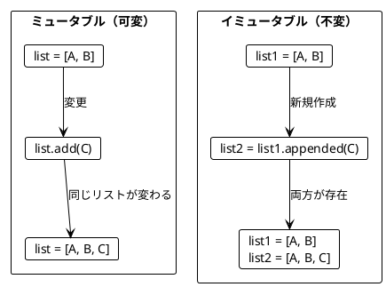

### 3.2 List の基本操作

**ソースファイル**: `app/scala/src/main/scala/ch03_SlicingAndAppending.scala`

#### appended - 要素の追加

```scala
val appleBook      = List("Apple", "Book")
val appleBookMango = appleBook.appended("Mango")

assert(appleBook.size == 2)       // 元のリストは変わらない
assert(appleBookMango.size == 3)  // 新しいリストが作成される
assert(appleBookMango == List("Apple", "Book", "Mango"))
```

#### slice - リストの切り出し

```scala
def firstTwo(list: List[String]): List[String] =
  list.slice(0, 2)

def lastTwo(list: List[String]): List[String] =
  list.slice(list.size - 2, list.size)

assert(firstTwo(List("a", "b", "c")) == List("a", "b"))
assert(lastTwo(List("a", "b", "c")) == List("b", "c"))
```

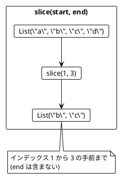

### 3.3 リストの変換例

**ソースファイル**: `app/scala/src/main/scala/ch03_SlicingAndAppending.scala`

```scala
// 最初の2要素を末尾に移動
def movedFirstTwoToTheEnd(list: List[String]): List[String] = {
  val firstTwo        = list.slice(0, 2)
  val withoutFirstTwo = list.slice(2, list.size)
  withoutFirstTwo.appendedAll(firstTwo)
}

assert(movedFirstTwoToTheEnd(List("a", "b", "c")) == List("c", "a", "b"))

// 最後の要素の前に挿入
def insertedBeforeLast(list: List[String], element: String): List[String] = {
  val last        = list.slice(list.size - 1, list.size)
  val withoutLast = list.slice(0, list.size - 1)
  withoutLast.appended(element).appendedAll(last)
}

assert(insertedBeforeLast(List("a", "b"), "c") == List("a", "c", "b"))
```

### 3.4 旅程の再計画

**ソースファイル**: `app/scala/src/main/scala/ch03_ItineraryScala.scala`

旅行の計画変更をイミュータブルに行う例です。

```scala
def replan(plan: List[String], newCity: String, beforeCity: String): List[String] = {
  val beforeCityIndex = plan.indexOf(beforeCity)
  val citiesBefore    = plan.slice(0, beforeCityIndex)
  val citiesAfter     = plan.slice(beforeCityIndex, plan.size)
  citiesBefore.appended(newCity).appendedAll(citiesAfter)
}

val planA = List("Paris", "Berlin", "Kraków")
val planB = replan(planA, "Vienna", "Kraków")

assert(planB == List("Paris", "Berlin", "Vienna", "Kraków"))
assert(planA == List("Paris", "Berlin", "Kraków"))  // 元の計画は変わらない!
```

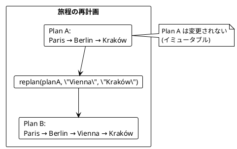

### 3.5 String と List の類似性

**ソースファイル**: `app/scala/src/main/scala/ch03_ListVsStringScala.scala`

String と List は似た操作ができます。

| 操作 | List | String |
|------|------|--------|
| 結合 | `appendedAll` | `concat` |
| 切り出し | `slice` | `substring` |
| サイズ | `size` | `length` |

```scala
// List の操作
val abList   = List("a", "b")
val cdList   = List("c", "d")
val abcdList = abList.appendedAll(cdList)
assert(abcdList == List("a", "b", "c", "d"))

// String の操作
val abStr   = "ab"
val cdStr   = "cd"
val abcdStr = abStr.concat(cdStr)
assert(abcdStr == "abcd")
```

### 3.6 名前の省略

**ソースファイル**: `app/scala/src/main/scala/ch03_AbbreviateNames.scala`

```scala
def abbreviate(name: String): String = {
  val initial   = name.substring(0, 1)
  val separator = name.indexOf(' ')
  val lastName  = name.substring(separator + 1)
  initial + ". " + lastName
}

assert(abbreviate("Alonzo Church") == "A. Church")
assert(abbreviate("A. Church") == "A. Church")
```

---

## 第4章: 関数を値として扱う

### 4.1 高階関数とは

高階関数（Higher-Order Function）とは、以下のいずれかを満たす関数です:

1. 関数を引数として受け取る
2. 関数を戻り値として返す

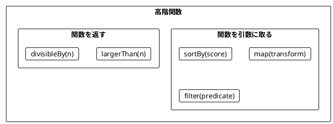

### 4.2 関数を引数として渡す

**ソースファイル**: `app/scala/src/main/scala/ch04_PassingFunctions.scala`

#### sortBy - ソート基準を関数で指定

```scala
def score(word: String): Int = word.replaceAll("a", "").length

val words = List("rust", "java")
val sortedWords = words.sortBy(score)

assert(sortedWords == List("java", "rust"))
// java: 2文字 (j, v), rust: 4文字 (r, u, s, t)
```

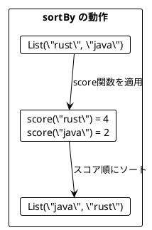

#### map - 各要素を変換

```scala
def len(s: String): Int = s.length

val lengths = List("scala", "rust", "ada").map(len)
assert(lengths == List(5, 4, 3))

def double(i: Int): Int = 2 * i
val doubles = List(5, 1, 2, 4, 0).map(double)
assert(doubles == List(10, 2, 4, 8, 0))
```

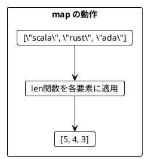

#### filter - 条件に合う要素を抽出

```scala
def odd(i: Int): Boolean = i % 2 == 1

val odds = List(5, 1, 2, 4, 0).filter(odd)
assert(odds == List(5, 1))

def largerThan4(i: Int): Boolean = i > 4
val large = List(5, 1, 2, 4, 0).filter(largerThan4)
assert(large == List(5))
```

#### foldLeft - 畳み込み

```scala
val sum = List(5, 1, 2, 4, 100).foldLeft(0)((acc, i) => acc + i)
assert(sum == 112)

val max = List(5, 1, 2, 4, 15).foldLeft(Int.MinValue)((max, i) =>
  if (i > max) i else max
)
assert(max == 15)
```

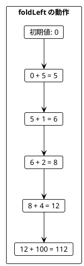

### 4.3 case class とパターン

**ソースファイル**: `app/scala/src/main/scala/ch04_ProgrammingLanguages.scala`

```scala
case class ProgrammingLanguage(name: String, year: Int)

val javalang  = ProgrammingLanguage("Java", 1995)
val scalalang = ProgrammingLanguage("Scala", 2004)

val languages = List(javalang, scalalang)

// フィールドにアクセス
val names = languages.map(lang => lang.name)
assert(names == List("Java", "Scala"))

// 省略記法（アンダースコア）
val names2 = languages.map(_.name)
assert(names2 == List("Java", "Scala"))

// 条件でフィルタ
val young = languages.filter(_.year > 2000)
assert(young == List(scalalang))
```

### 4.4 関数を返す関数

**ソースファイル**: `app/scala/src/main/scala/ch04_ReturningFunctions.scala`

```scala
def largerThan(n: Int): Int => Boolean = i => i > n

val large = List(5, 1, 2, 4, 0).filter(largerThan(4))
assert(large == List(5))

val medium = List(5, 1, 2, 4, 0).filter(largerThan(1))
assert(medium == List(5, 2, 4))
```

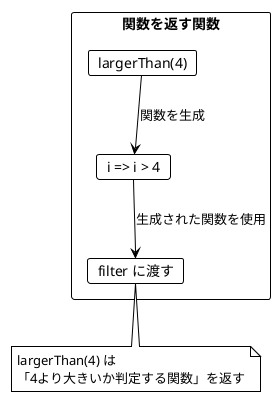

### 4.5 カリー化

カリー化（Currying）は、複数の引数を取る関数を、引数を1つずつ取る関数のチェーンに変換する技法です。

```scala
// 通常の関数
def largerThanNormal(n: Int, i: Int): Boolean = i > n

// カリー化された関数
def largerThan(n: Int)(i: Int): Boolean = i > n

// 使用例
val large = List(5, 1, 2, 4, 0).filter(largerThan(4))
assert(large == List(5))
```

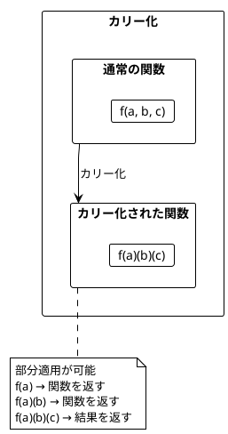

### 4.6 ワードスコアリングの例

**ソースファイル**: `app/scala/src/main/scala/ch04_WordScoringScala.scala`

複数のスコアリングロジックを組み合わせる例です。

```scala
def score(word: String): Int = word.replaceAll("a", "").length
def bonus(word: String): Int = if (word.contains("c")) 5 else 0
def penalty(word: String): Int = if (word.contains("s")) 7 else 0

val words = List("ada", "haskell", "scala", "java", "rust")

// 関数を引数として渡す
def rankedWords(wordScore: String => Int, words: List[String]): List[String] = {
  words.sortBy(wordScore).reverse
}

// 基本スコアでランキング
val ranking1 = rankedWords(score, words)
assert(ranking1 == List("haskell", "rust", "scala", "java", "ada"))

// ボーナス付きスコアでランキング
val ranking2 = rankedWords(w => score(w) + bonus(w), words)
assert(ranking2 == List("scala", "haskell", "rust", "java", "ada"))

// ボーナスとペナルティ付きスコアでランキング
val ranking3 = rankedWords(w => score(w) + bonus(w) - penalty(w), words)
assert(ranking3 == List("java", "scala", "ada", "haskell", "rust"))
```

---

## 第5章: flatMap とネスト構造

### 5.1 flatten と flatMap

**ソースファイル**: `app/scala/src/main/scala/ch05_BookAdaptations.scala`

#### flatten - ネストしたリストを平坦化

```scala
case class Book(title: String, authors: List[String])

val books = List(
  Book("FP in Scala", List("Chiusano", "Bjarnason")),
  Book("The Hobbit", List("Tolkien"))
)

// map だけだとネストする
val authorLists = books.map(_.authors)
// List(List("Chiusano", "Bjarnason"), List("Tolkien"))

// flatten で平坦化
val authors = authorLists.flatten
// List("Chiusano", "Bjarnason", "Tolkien")
```

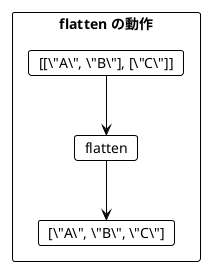

#### flatMap = map + flatten

```scala
// map して flatten
val authors1 = books.map(_.authors).flatten

// flatMap で同じことを1行で
val authors2 = books.flatMap(_.authors)

assert(authors1 == authors2)
// List("Chiusano", "Bjarnason", "Tolkien")
```

### 5.2 flatMap によるリストサイズの変化

```scala
// 要素数が増える
List(1, 2, 3).flatMap(i => List(i, i + 10))
// List(1, 11, 2, 12, 3, 13) - 6要素

// 要素数が同じ
List(1, 2, 3).flatMap(i => List(i * 2))
// List(2, 4, 6) - 3要素

// 要素数が減る（フィルタリング効果）
List(1, 2, 3).flatMap(i => if (i % 2 == 0) List(i) else List.empty)
// List(2) - 1要素
```

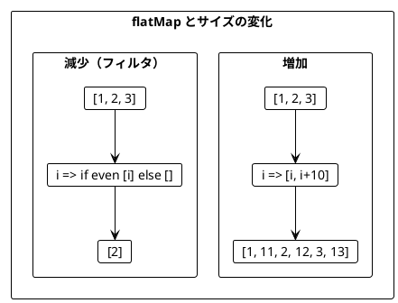

### 5.3 ネストした flatMap

複数のリストを組み合わせる場合、flatMap をネストします。

```scala
case class Book(title: String, authors: List[String])
case class Movie(title: String)

def bookAdaptations(author: String): List[Movie] = {
  if (author == "Tolkien")
    List(Movie("An Unexpected Journey"), Movie("The Desolation of Smaug"))
  else
    List.empty
}

val books = List(
  Book("FP in Scala", List("Chiusano", "Bjarnason")),
  Book("The Hobbit", List("Tolkien"))
)

// ネストした flatMap
val recommendations = books.flatMap(book =>
  book.authors.flatMap(author =>
    bookAdaptations(author).map(movie =>
      s"You may like ${movie.title}, because you liked $author's ${book.title}"
    )
  )
)

// 結果:
// List(
//   "You may like An Unexpected Journey, because you liked Tolkien's The Hobbit",
//   "You may like The Desolation of Smaug, because you liked Tolkien's The Hobbit"
// )
```

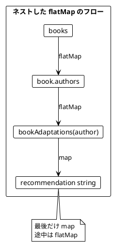

### 5.4 for 内包表記

ネストした flatMap は for 内包表記で読みやすく書けます。

```scala
// flatMap/map 版
val c1 = books.flatMap(book =>
  book.authors.flatMap(author =>
    bookAdaptations(author).map(movie =>
      s"You may like ${movie.title}, because you liked $author's ${book.title}"
    )
  )
)

// for 内包表記版（等価）
val c2 = for {
  book   <- books
  author <- book.authors
  movie  <- bookAdaptations(author)
} yield s"You may like ${movie.title}, because you liked $author's ${book.title}"

assert(c1 == c2)
```

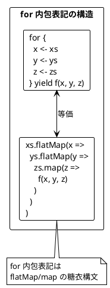

### 5.5 円内の点の判定

**ソースファイル**: `app/scala/src/main/scala/ch05_PointsInsideCircles.scala`

for 内包表記でフィルタリングも行う例です。

```scala
case class Point(x: Int, y: Int)

val points   = List(Point(5, 2), Point(1, 1))
val radiuses = List(2, 1)

def isInside(point: Point, radius: Int): Boolean = {
  radius * radius >= point.x * point.x + point.y * point.y
}

// 全組み合わせを生成
val allCombinations = for {
  r     <- radiuses
  point <- points
} yield s"$point is within a radius of $r: ${isInside(point, r)}"

// 結果:
// List(
//   "Point(5,2) is within a radius of 2: false",
//   "Point(1,1) is within a radius of 2: true",
//   "Point(5,2) is within a radius of 1: false",
//   "Point(1,1) is within a radius of 1: false"
// )
```

#### ガード式によるフィルタリング

```scala
// if を使ったフィルタリング（ガード式）
val insidePoints = for {
  r     <- radiuses
  point <- points
  if isInside(point, r)  // ガード式
} yield s"$point is within a radius of $r"

// 結果: List("Point(1,1) is within a radius of 2")
```

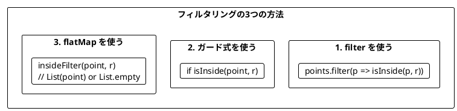

### 5.6 for 内包表記と型

**ソースファイル**: `app/scala/src/main/scala/ch05_RandomForComprehensions.scala`

for 内包表記の戻り値の型は、最初のジェネレータの型に依存します。

```scala
// List から始まる → List を返す
val listResult = for {
  a <- List(1, 2)
  b <- Set(2, 1)
} yield a * b
// List(2, 1, 4, 2) - 重複あり

// Set から始まる → Set を返す
val setResult = for {
  a <- Set(1, 2)
  b <- List(2, 1)
} yield a * b
// Set(2, 1, 4) - 重複なし
```

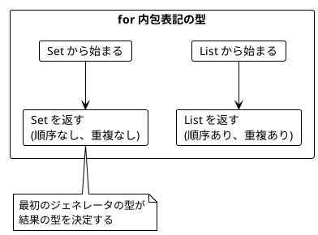

---

## まとめ

### Part II で学んだこと

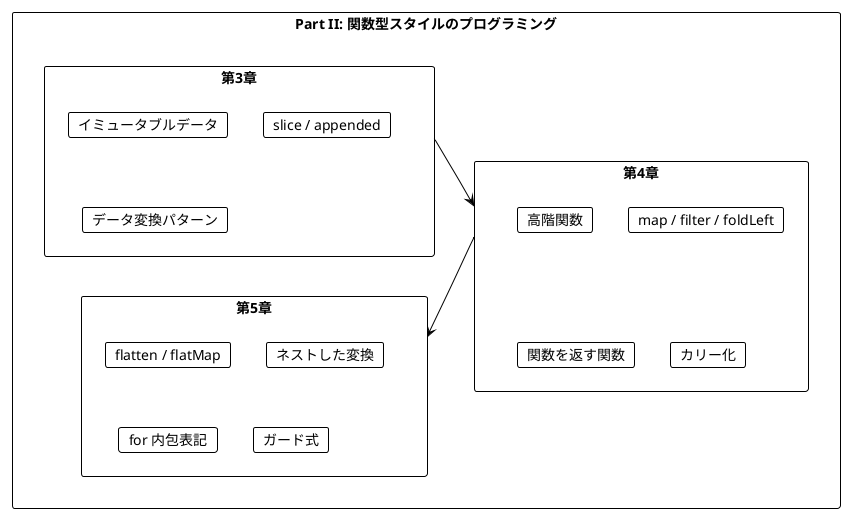

### キーポイント

| 章 | 主要概念 | キー操作 |
|----|----------|----------|
| 第3章 | イミュータブル | `slice`, `appended`, `appendedAll` |
| 第4章 | 高階関数 | `map`, `filter`, `foldLeft`, `sortBy` |
| 第5章 | 平坦化 | `flatten`, `flatMap`, `for` 内包表記 |

### 重要な法則

1. **イミュータブルデータ**: 元のデータは変更せず、新しいデータを作成する
2. **関数は値**: 関数を引数として渡したり、戻り値として返したりできる
3. **flatMap パターン**: ネストした構造を平坦化しながら変換する
4. **for 内包表記**: flatMap/map の糖衣構文として使える

### 次のステップ

Part III では、以下のトピックを学びます:

- `Option` 型による安全なエラーハンドリング
- `Either` 型と複合的なエラー処理

---

## 演習問題

### 問題 1: イミュータブルな操作

以下の関数を実装してください。リストの中央に要素を挿入する関数です。

```scala
def insertAtMiddle(list: List[String], element: String): List[String] = ???

// 期待される動作
assert(insertAtMiddle(List("a", "b", "c", "d"), "X") == List("a", "b", "X", "c", "d"))
assert(insertAtMiddle(List("a", "b"), "X") == List("a", "X", "b"))
```

<details>
<summary>解答</summary>

```scala
def insertAtMiddle(list: List[String], element: String): List[String] = {
  val middle = list.size / 2
  val before = list.slice(0, middle)
  val after  = list.slice(middle, list.size)
  before.appended(element).appendedAll(after)
}
```

</details>

### 問題 2: 高階関数

以下の関数を実装してください。条件を満たす要素の数をカウントする関数です。

```scala
def countWhere[A](list: List[A], predicate: A => Boolean): Int = ???

// 期待される動作
assert(countWhere(List(1, 2, 3, 4, 5), (i: Int) => i > 3) == 2)
assert(countWhere(List("a", "bb", "ccc"), (s: String) => s.length > 1) == 2)
```

<details>
<summary>解答</summary>

```scala
def countWhere[A](list: List[A], predicate: A => Boolean): Int = {
  list.filter(predicate).size
}

// または foldLeft を使って
def countWhere2[A](list: List[A], predicate: A => Boolean): Int = {
  list.foldLeft(0)((count, elem) => if (predicate(elem)) count + 1 else count)
}
```

</details>

### 問題 3: for 内包表記

以下のネストした flatMap を for 内包表記で書き換えてください。

```scala
val result = List(1, 2).flatMap(x =>
  List(10, 20).flatMap(y =>
    List(100, 200).map(z =>
      x + y + z
    )
  )
)
```

<details>
<summary>解答</summary>

```scala
val result = for {
  x <- List(1, 2)
  y <- List(10, 20)
  z <- List(100, 200)
} yield x + y + z

// 結果: List(111, 211, 121, 221, 112, 212, 122, 222)
```

</details>

### 問題 4: flatMap によるフィルタリング

for 内包表記の `if` を使わずに、flatMap だけで偶数のみを抽出するコードを書いてください。

```scala
val numbers = List(1, 2, 3, 4, 5, 6)
// 偶数のみを抽出: List(2, 4, 6)
```

<details>
<summary>解答</summary>

```scala
val evenNumbers = numbers.flatMap(n =>
  if (n % 2 == 0) List(n) else List.empty
)

// または関数に分離
def evenFilter(n: Int): List[Int] =
  if (n % 2 == 0) List(n) else List.empty

val evenNumbers2 = numbers.flatMap(evenFilter)
```

</details>
