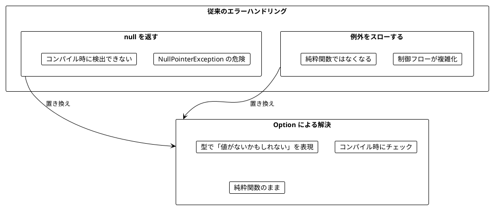
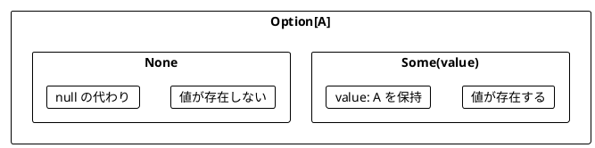
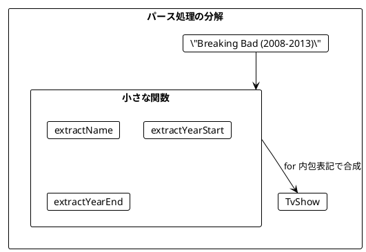
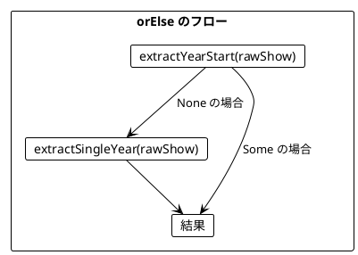
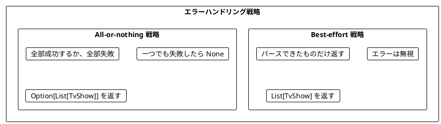
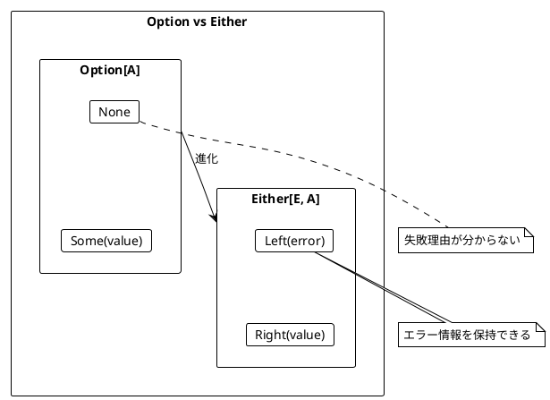
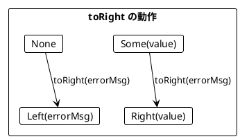
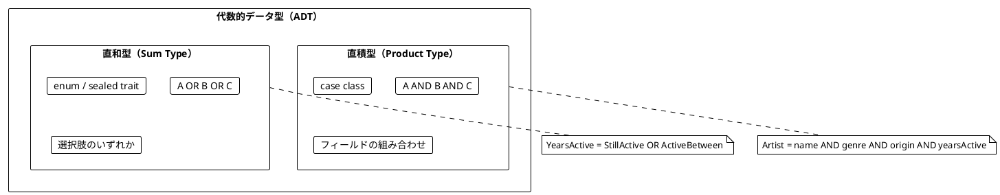
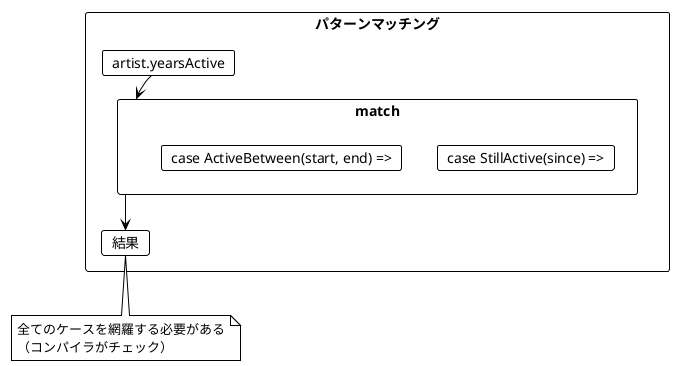
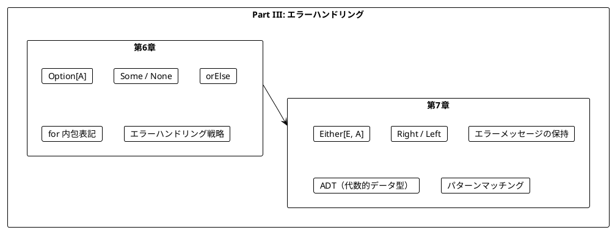

# Part III: エラーハンドリングと Option/Either

本章では、関数型プログラミングにおける安全なエラーハンドリングを学びます。`null` や例外に頼らず、`Option` と `Either` を使って型安全にエラーを扱う方法を習得します。

---

## 第6章: Option 型による安全なエラーハンドリング

### 6.1 なぜ Option が必要か

従来のエラーハンドリングには問題があります。



### 6.2 Option の基本

`Option[A]` は「`A` 型の値があるか、ないか」を表す型です。



**ソースファイル**: `app/scala/src/main/scala/ch06_TvShows.scala`

### 6.3 TV番組のパース例

TV番組の文字列をパースする例で Option の使い方を学びます。

```scala
case class TvShow(title: String, start: Int, end: Int)

// 入力例: "Breaking Bad (2008-2013)"
// 期待する出力: TvShow("Breaking Bad", 2008, 2013)
```

#### 例外を使う方法（問題あり）

```scala
def parseShow(rawShow: String): TvShow = {
  val bracketOpen  = rawShow.indexOf('(')
  val bracketClose = rawShow.indexOf(')')
  val dash         = rawShow.indexOf('-')

  val name      = rawShow.substring(0, bracketOpen).trim
  val yearStart = rawShow.substring(bracketOpen + 1, dash).toInt
  val yearEnd   = rawShow.substring(dash + 1, bracketClose).toInt

  TvShow(name, yearStart, yearEnd)
}

// 正常ケース
parseShow("Breaking Bad (2008-2013)")  // TvShow("Breaking Bad", 2008, 2013)

// 異常ケース → 例外がスローされる!
parseShow("Chernobyl (2019)")           // StringIndexOutOfBoundsException
parseShow("The Wire 2002-2008")         // StringIndexOutOfBoundsException
```

#### Option を使う方法

```scala
def parseShow(rawShow: String): Option[TvShow] = {
  for {
    name      <- extractName(rawShow)
    yearStart <- extractYearStart(rawShow)
    yearEnd   <- extractYearEnd(rawShow)
  } yield TvShow(name, yearStart, yearEnd)
}

// 正常ケース
parseShow("Breaking Bad (2008-2013)")  // Some(TvShow("Breaking Bad", 2008, 2013))

// 異常ケース → None が返される（例外なし）
parseShow("The Wire 2002-2008")         // None
```

### 6.4 小さな関数から組み立てる

複雑なパース処理を小さな関数に分解します。

```scala
// 名前を抽出
def extractName(rawShow: String): Option[String] = {
  val bracketOpen = rawShow.indexOf('(')
  if (bracketOpen > 0) Some(rawShow.substring(0, bracketOpen).trim)
  else None
}

// 開始年を抽出
def extractYearStart(rawShow: String): Option[Int] = {
  val bracketOpen = rawShow.indexOf('(')
  val dash        = rawShow.indexOf('-')
  for {
    yearStr <- if (bracketOpen != -1 && dash > bracketOpen + 1)
                 Some(rawShow.substring(bracketOpen + 1, dash))
               else None
    year    <- yearStr.toIntOption
  } yield year
}

// 終了年を抽出
def extractYearEnd(rawShow: String): Option[Int] = {
  val dash         = rawShow.indexOf('-')
  val bracketClose = rawShow.indexOf(')')
  for {
    yearStr <- if (dash != -1 && bracketClose > dash + 1)
                 Some(rawShow.substring(dash + 1, bracketClose))
               else None
    year    <- yearStr.toIntOption
  } yield year
}
```



### 6.5 orElse によるフォールバック

`orElse` を使って、最初の Option が `None` の場合に代替を試すことができます。

```scala
val seven: Option[Int] = Some(7)
val eight: Option[Int] = Some(8)
val none: Option[Int]  = None

seven.orElse(eight)  // Some(7) - 最初が Some なのでそのまま
none.orElse(eight)   // Some(8) - 最初が None なので代替を使用
seven.orElse(none)   // Some(7)
none.orElse(none)    // None
```

#### 単年の番組に対応する

「Chernobyl (2019)」のような単年の番組をパースできるようにします。

```scala
def extractSingleYear(rawShow: String): Option[Int] = {
  val dash         = rawShow.indexOf('-')
  val bracketOpen  = rawShow.indexOf('(')
  val bracketClose = rawShow.indexOf(')')
  for {
    yearStr <- if (dash == -1 && bracketOpen != -1 && bracketClose > bracketOpen + 1)
                 Some(rawShow.substring(bracketOpen + 1, bracketClose))
               else None
    year    <- yearStr.toIntOption
  } yield year
}

def parseShow(rawShow: String): Option[TvShow] = {
  for {
    name      <- extractName(rawShow)
    yearStart <- extractYearStart(rawShow).orElse(extractSingleYear(rawShow))
    yearEnd   <- extractYearEnd(rawShow).orElse(extractSingleYear(rawShow))
  } yield TvShow(name, yearStart, yearEnd)
}

// これで単年の番組もパースできる
parseShow("Chernobyl (2019)")  // Some(TvShow("Chernobyl", 2019, 2019))
```



### 6.6 Option の主要メソッド

| メソッド | 説明 | 例 |
|----------|------|-----|
| `map` | 値があれば変換 | `Some(5).map(_ * 2)` → `Some(10)` |
| `flatMap` | 値があれば Option を返す関数を適用 | `Some(5).flatMap(x => Some(x * 2))` → `Some(10)` |
| `filter` | 条件を満たさなければ None | `Some(5).filter(_ > 10)` → `None` |
| `orElse` | None なら代替を使用 | `None.orElse(Some(5))` → `Some(5)` |
| `getOrElse` | None ならデフォルト値 | `None.getOrElse(0)` → `0` |
| `toList` | List に変換 | `Some(5).toList` → `List(5)` |
| `toRight` | Either に変換 | `Some(5).toRight("error")` → `Right(5)` |

```scala
val year: Option[Int]   = Some(996)
val noYear: Option[Int] = None

// map
year.map(_ * 2)    // Some(1992)
noYear.map(_ * 2)  // None

// flatMap
year.flatMap(y => Some(y * 2))    // Some(1992)
noYear.flatMap(y => Some(y * 2))  // None

// filter
year.filter(_ < 2020)   // Some(996)
year.filter(_ > 2020)   // None

// orElse
year.orElse(Some(2020))    // Some(996)
noYear.orElse(Some(2020))  // Some(2020)
```

### 6.7 エラーハンドリング戦略

複数の要素をパースする場合、2つの戦略があります。



#### Best-effort 戦略

```scala
def parseShows(rawShows: List[String]): List[TvShow] = {
  rawShows
    .map(parseShow)     // List[Option[TvShow]]
    .map(_.toList)      // List[List[TvShow]]
    .flatten            // List[TvShow]
}

val rawShows = List(
  "Breaking Bad (2008-2013)",
  "The Wire 2002 2008",        // 無効な形式
  "Mad Men (2007-2015)"
)

parseShows(rawShows)
// List(TvShow("Breaking Bad", 2008, 2013), TvShow("Mad Men", 2007, 2015))
// 無効なものは無視される
```

#### All-or-nothing 戦略

```scala
def addOrResign(
    parsedShows: Option[List[TvShow]],
    newParsedShow: Option[TvShow]
): Option[List[TvShow]] = {
  for {
    shows      <- parsedShows
    parsedShow <- newParsedShow
  } yield shows.appended(parsedShow)
}

def parseShows(rawShows: List[String]): Option[List[TvShow]] = {
  val initialResult: Option[List[TvShow]] = Some(List.empty)
  rawShows
    .map(parseShow)
    .foldLeft(initialResult)(addOrResign)
}

// 全部成功 → Some(List(...))
parseShows(List("Breaking Bad (2008-2013)", "Mad Men (2007-2015)"))
// Some(List(TvShow("Breaking Bad", 2008, 2013), TvShow("Mad Men", 2007, 2015)))

// 一つでも失敗 → None
parseShows(List("Breaking Bad (2008-2013)", "Invalid"))
// None
```

---

## 第7章: Either 型と複合的なエラー処理

### 7.1 Option の限界

`Option` は「値があるかないか」しか表現できません。**なぜ失敗したのか**を伝えられません。



### 7.2 Either の基本

`Either[E, A]` は「`E` 型のエラーか、`A` 型の成功値か」を表す型です。

- `Right(value)`: 成功（慣例的に「正しい」= right）
- `Left(error)`: 失敗（エラー情報を保持）

```scala
def extractName(show: String): Either[String, String] = {
  val bracketOpen = show.indexOf('(')
  if (bracketOpen > 0) Right(show.substring(0, bracketOpen).trim)
  else Left(s"Can't extract name from $show")
}

extractName("The Wire (2002-2008)")  // Right("The Wire")
extractName("(2022)")                // Left("Can't extract name from (2022)")
```

### 7.3 Either を使ったパース

**ソースファイル**: `app/scala/src/main/scala/ch06_TvShows.scala`

```scala
def extractYearStart(rawShow: String): Either[String, Int] = {
  val bracketOpen = rawShow.indexOf('(')
  val dash        = rawShow.indexOf('-')
  for {
    yearStr <- if (bracketOpen != -1 && dash > bracketOpen + 1)
                 Right(rawShow.substring(bracketOpen + 1, dash))
               else Left(s"Can't extract start year from $rawShow")
    year    <- yearStr.toIntOption.toRight(s"Can't parse $yearStr")
  } yield year
}

extractYearStart("The Wire (2002-2008)")  // Right(2002)
extractYearStart("The Wire (-2008)")      // Left("Can't extract start year from The Wire (-2008)")
extractYearStart("The Wire (oops-2008)")  // Left("Can't parse oops")
```

### 7.4 Option から Either への変換

`toRight` メソッドで `Option` を `Either` に変換できます。

```scala
val year: Option[Int] = Some(996)
val noYear: Option[Int] = None

year.toRight("no year given")    // Right(996)
noYear.toRight("no year given")  // Left("no year given")
```



### 7.5 Either による完全なパーサー

```scala
def parseShow(rawShow: String): Either[String, TvShow] = {
  for {
    name      <- extractName(rawShow)
    yearStart <- extractYearStart(rawShow).orElse(extractSingleYear(rawShow))
    yearEnd   <- extractYearEnd(rawShow).orElse(extractSingleYear(rawShow))
  } yield TvShow(name, yearStart, yearEnd)
}

parseShow("The Wire (2002-2008)")  // Right(TvShow("The Wire", 2002, 2008))
parseShow("Mad Men ()")            // Left("Can't extract single year from Mad Men ()")
parseShow("The Wire (-)")          // Left("Can't extract single year from The Wire (-)")
parseShow("(2002-2008)")           // Left("Can't extract name from (2002-2008)")
```

### 7.6 Either の主要メソッド

| メソッド | 説明 | 例 |
|----------|------|-----|
| `map` | Right の値を変換 | `Right(5).map(_ * 2)` → `Right(10)` |
| `flatMap` | Right なら Either を返す関数を適用 | `Right(5).flatMap(x => Right(x * 2))` → `Right(10)` |
| `orElse` | Left なら代替を使用 | `Left("err").orElse(Right(5))` → `Right(5)` |
| `toOption` | Option に変換 | `Right(5).toOption` → `Some(5)` |
| `flatten` | ネストした Either を平坦化 | `Right(Right(5)).flatten` → `Right(5)` |

```scala
val year: Either[String, Int]   = Right(996)
val noYear: Either[String, Int] = Left("no year")

// map
year.map(_ * 2)    // Right(1992)
noYear.map(_ * 2)  // Left("no year")

// flatMap
year.flatMap(y => Right(y * 2))             // Right(1992)
noYear.flatMap(y => Right(y * 2))           // Left("no year")
year.flatMap(y => Left("can't progress"))   // Left("can't progress")

// orElse
year.orElse(Right(2020))           // Right(996)
noYear.orElse(Right(2020))         // Right(2020)
noYear.orElse(Left("can't recover")) // Left("can't recover")

// toOption
year.toOption    // Some(996)
noYear.toOption  // None
```

### 7.7 音楽アーティスト検索の例

**ソースファイル**: `app/scala/src/main/scala/ch07_MusicArtistsSearch.scala`

より複雑な例として、音楽アーティストの検索機能を見てみましょう。

#### 基本的なモデル（問題あり）

```scala
case class Artist(
    name: String,
    genre: String,
    origin: String,
    yearsActiveStart: Int,
    isActive: Boolean,
    yearsActiveEnd: Int  // アクティブな場合は 0 を入れる？
)
```

この設計には問題があります:
- `isActive` が `true` の場合、`yearsActiveEnd` は何を入れるべき？
- 無効な状態（`isActive = true` かつ `yearsActiveEnd = 2020`）を作れてしまう

#### Option を使った改善

```scala
case class Artist(
    name: String,
    genre: String,
    origin: String,
    yearsActiveStart: Int,
    yearsActiveEnd: Option[Int]  // アクティブなら None
)

val metallica = Artist("Metallica", "Heavy Metal", "U.S.", 1981, None)
val ledZeppelin = Artist("Led Zeppelin", "Hard Rock", "England", 1968, Some(1980))
```

### 7.8 代数的データ型（ADT）

**enum**（列挙型）を使って、より表現力の高いモデルを作れます。

#### 直積型（Product Type）

複数のフィールドを**AND**で組み合わせる型です。

```scala
case class PeriodInYears(start: Int, end: Option[Int])

case class Artist(
    name: String,
    genre: MusicGenre,
    origin: Location,
    yearsActive: PeriodInYears
)
```

#### 直和型（Sum Type）

複数の選択肢を**OR**で表す型です。

```scala
enum MusicGenre {
  case HeavyMetal
  case Pop
  case HardRock
}

enum YearsActive {
  case StillActive(since: Int)
  case ActiveBetween(start: Int, end: Int)
}
```



### 7.9 パターンマッチング

直和型は**パターンマッチング**で処理します。

```scala
def wasArtistActive(artist: Artist, yearStart: Int, yearEnd: Int): Boolean = {
  artist.yearsActive match {
    case StillActive(since)        => since <= yearEnd
    case ActiveBetween(start, end) => start <= yearEnd && end >= yearStart
  }
}

def activeLength(artist: Artist, currentYear: Int): Int = {
  artist.yearsActive match {
    case StillActive(since)        => currentYear - since
    case ActiveBetween(start, end) => end - start
  }
}
```



### 7.10 検索条件のモデリング

検索条件も ADT でモデリングできます。

```scala
enum SearchCondition {
  case SearchByGenre(genres: List[MusicGenre])
  case SearchByOrigin(locations: List[Location])
  case SearchByActiveYears(start: Int, end: Int)
}

def searchArtists(
    artists: List[Artist],
    requiredConditions: List[SearchCondition]
): List[Artist] = {
  artists.filter(artist =>
    requiredConditions.forall(condition =>
      condition match {
        case SearchByGenre(genres)           => genres.contains(artist.genre)
        case SearchByOrigin(locations)       => locations.contains(artist.origin)
        case SearchByActiveYears(start, end) => wasArtistActive(artist, start, end)
      }
    )
  )
}
```

### 7.11 forall と exists

Option と List で条件判定をする際に便利なメソッドです。

| メソッド | Option での動作 | List での動作 |
|----------|-----------------|---------------|
| `forall(p)` | None → true, Some(x) → p(x) | 全要素が p を満たす |
| `exists(p)` | None → false, Some(x) → p(x) | いずれかの要素が p を満たす |
| `contains(x)` | Some(x) と等しいか | x を含むか |

```scala
val year: Option[Int] = Some(996)
val noYear: Option[Int] = None

// forall - 「全て」または「存在しない」
year.forall(_ < 2020)    // true (996 < 2020)
noYear.forall(_ < 2020)  // true (値がないので「全て」が自明に真)
year.forall(_ > 2020)    // false

// exists - 「存在して条件を満たす」
year.exists(_ < 2020)    // true
noYear.exists(_ < 2020)  // false (値がないので存在しない)
```

---

## まとめ

### Part III で学んだこと



### Option vs Either の使い分け

| 状況 | 使用する型 |
|------|------------|
| 値があるかないかだけが重要 | `Option[A]` |
| 失敗理由を伝える必要がある | `Either[E, A]` |
| 検索結果が見つからない | `Option[A]` |
| バリデーションエラーを伝える | `Either[String, A]` |
| 複数のエラー種別がある | `Either[ErrorType, A]` |

### キーポイント

1. **Option**: 値の有無を型で表現する
2. **Either**: 成功/失敗とエラー情報を型で表現する
3. **for 内包表記**: Option/Either を組み合わせて使う
4. **orElse**: フォールバックを提供する
5. **ADT**: 直積型と直和型でドメインを正確にモデリング
6. **パターンマッチング**: 直和型を安全に処理する

### 次のステップ

Part IV では、以下のトピックを学びます:

- IO モナドの導入
- 副作用の管理
- ストリーム処理

---

## 演習問題

### 問題 1: Option の基本

以下の関数を実装してください。

```scala
def safeDivide(a: Int, b: Int): Option[Int] = ???

// 期待される動作
assert(safeDivide(10, 2) == Some(5))
assert(safeDivide(10, 0) == None)
assert(safeDivide(7, 2) == Some(3))
```

<details>
<summary>解答</summary>

```scala
def safeDivide(a: Int, b: Int): Option[Int] = {
  if (b == 0) None
  else Some(a / b)
}
```

</details>

### 問題 2: Option の合成

以下の関数を実装してください。2つの数値文字列を受け取り、その合計を返します。

```scala
def addStrings(a: String, b: String): Option[Int] = ???

// 期待される動作
assert(addStrings("10", "20") == Some(30))
assert(addStrings("10", "abc") == None)
assert(addStrings("xyz", "20") == None)
```

<details>
<summary>解答</summary>

```scala
def addStrings(a: String, b: String): Option[Int] = {
  for {
    x <- a.toIntOption
    y <- b.toIntOption
  } yield x + y
}
```

</details>

### 問題 3: Either によるバリデーション

以下の関数を実装してください。年齢を検証し、エラーメッセージを返します。

```scala
def validateAge(age: Int): Either[String, Int] = ???

// 期待される動作
assert(validateAge(25) == Right(25))
assert(validateAge(-5) == Left("Age cannot be negative"))
assert(validateAge(200) == Left("Age cannot be greater than 150"))
```

<details>
<summary>解答</summary>

```scala
def validateAge(age: Int): Either[String, Int] = {
  if (age < 0) Left("Age cannot be negative")
  else if (age > 150) Left("Age cannot be greater than 150")
  else Right(age)
}
```

</details>

### 問題 4: パターンマッチング

以下の enum とパターンマッチングを使った関数を実装してください。

```scala
enum PaymentMethod {
  case CreditCard(number: String, expiry: String)
  case BankTransfer(accountNumber: String)
  case Cash
}

def describePayment(method: PaymentMethod): String = ???

// 期待される動作
assert(describePayment(CreditCard("1234", "12/25")) == "Credit card ending in 1234")
assert(describePayment(BankTransfer("9876")) == "Bank transfer to account 9876")
assert(describePayment(Cash) == "Cash payment")
```

<details>
<summary>解答</summary>

```scala
import PaymentMethod._

def describePayment(method: PaymentMethod): String = method match {
  case CreditCard(number, _) => s"Credit card ending in $number"
  case BankTransfer(account) => s"Bank transfer to account $account"
  case Cash                  => "Cash payment"
}
```

</details>

### 問題 5: forall と exists

以下の条件に合うユーザーを抽出する関数を実装してください。

```scala
case class User(name: String, email: Option[String], age: Int)

val users = List(
  User("Alice", Some("alice@example.com"), 25),
  User("Bob", None, 30),
  User("Charlie", Some("charlie@test.com"), 17)
)

// 1. メールアドレスが設定されていないか、example.com ドメインのユーザー
def f1(users: List[User]): List[User] = ???

// 2. メールアドレスが設定されていて、test.com ドメインのユーザー
def f2(users: List[User]): List[User] = ???
```

<details>
<summary>解答</summary>

```scala
// 1. メールアドレスが設定されていないか、example.com ドメイン
def f1(users: List[User]): List[User] = {
  users.filter(_.email.forall(_.endsWith("@example.com")))
}
// List(User("Alice", ...), User("Bob", None, 30))

// 2. メールアドレスが設定されていて、test.com ドメイン
def f2(users: List[User]): List[User] = {
  users.filter(_.email.exists(_.endsWith("@test.com")))
}
// List(User("Charlie", ...))
```

</details>
