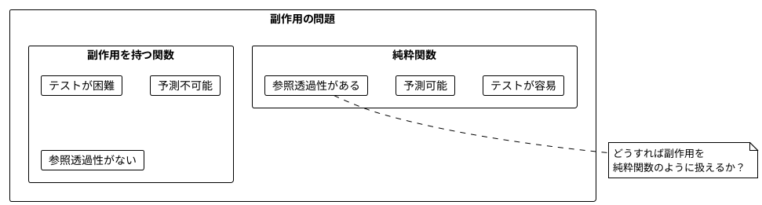
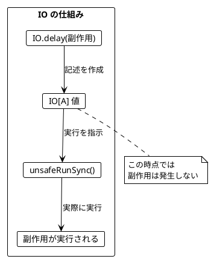
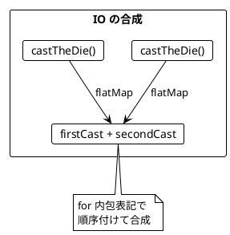
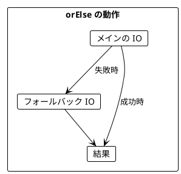
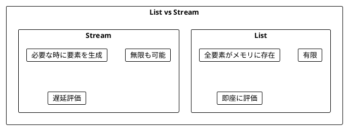
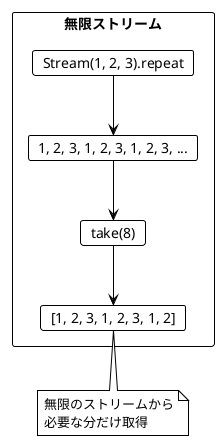
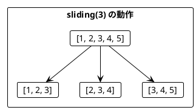
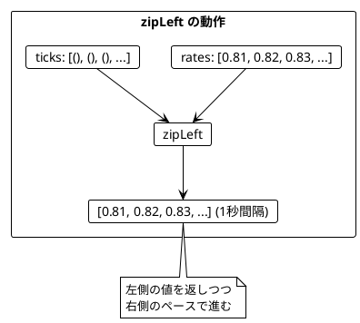
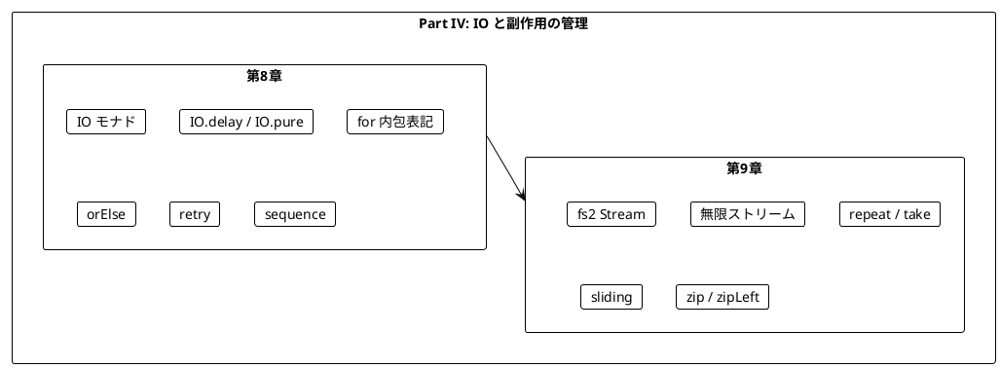

# Part IV: IO と副作用の管理

本章では、関数型プログラミングにおける副作用の扱い方を学びます。IO モナドを使って副作用を純粋関数内で安全に記述し、ストリーム処理で無限のデータを扱う方法を習得します。

---

## 第8章: IO モナドの導入

### 8.1 副作用の問題

純粋関数は副作用を持ちません。しかし、実際のプログラムには副作用が必要です:

- ファイルの読み書き
- ネットワーク通信
- データベースアクセス
- 乱数生成
- 現在時刻の取得



### 8.2 IO モナドとは

**IO モナド**は「副作用を持つ計算の**記述**」を表す型です。

- `IO[A]` は「実行すると `A` 型の値を返す副作用のある計算」
- IO 値を作成しただけでは副作用は発生しない
- `unsafeRunSync()` で実際に実行される



### 8.3 サイコロを振る例

**ソースファイル**: `app/scala/src/main/scala/ch08_CastingDie.scala`

#### 不純な関数（副作用あり）

```scala
def castTheDieImpure(): Int = {
  val random = new java.util.Random()
  random.nextInt(6) + 1
}

// 呼び出すたびに異なる値が返る
println(castTheDieImpure())  // 3
println(castTheDieImpure())  // 5
println(castTheDieImpure())  // 1
```

#### IO を使った純粋な記述

```scala
import cats.effect.IO

def castTheDie(): IO[Int] = IO.delay(castTheDieImpure())

// IO 値を作成（この時点では実行されない）
val dieCast: IO[Int] = castTheDie()
println(dieCast)  // IO(...) - まだ実行されていない

// 実際に実行
println(dieCast.unsafeRunSync())  // 4
```

### 8.4 IO の作成方法

| メソッド | 用途 | 例 |
|----------|------|-----|
| `IO.delay(expr)` | 副作用のある式をラップ | `IO.delay(println("hello"))` |
| `IO.pure(value)` | 既存の値をラップ（副作用なし） | `IO.pure(42)` |
| `IO.unit` | 何もしない IO | `IO.unit` (= `IO.pure(())`) |

```scala
// IO.delay: 副作用を遅延実行
val delayedPrint: IO[Unit] = IO.delay(println("Hello"))
// println はまだ実行されていない

// IO.pure: 既存の値をラップ
val pureValue: IO[Int] = IO.pure(42)
// 副作用なし、即座に 42 が確定
```

### 8.5 IO の合成

IO 値は `flatMap` や `for` 内包表記で合成できます。

```scala
def castTheDieTwice(): IO[Int] = {
  for {
    firstCast  <- castTheDie()
    secondCast <- castTheDie()
  } yield firstCast + secondCast
}

// まだ実行されていない
val program: IO[Int] = castTheDieTwice()

// 実行
val result: Int = program.unsafeRunSync()
```



### 8.6 ミーティングスケジューリングの例

**ソースファイル**: `app/scala/src/main/scala/ch08_SchedulingMeetings.scala`

より実践的な例として、ミーティングのスケジューリングを見てみましょう。

```scala
case class MeetingTime(startHour: Int, endHour: Int)

// 副作用のある API 呼び出しを IO でラップ
def calendarEntries(name: String): IO[List[MeetingTime]] = {
  IO.delay(calendarEntriesApiCall(name))
}

def createMeeting(names: List[String], meeting: MeetingTime): IO[Unit] = {
  IO.delay(createMeetingApiCall(names, meeting))
}
```

#### 予定の取得

```scala
def scheduledMeetings(person1: String, person2: String): IO[List[MeetingTime]] = {
  for {
    person1Entries <- calendarEntries(person1)
    person2Entries <- calendarEntries(person2)
  } yield person1Entries.appendedAll(person2Entries)
}
```

#### 空き時間の計算（純粋関数）

```scala
def possibleMeetings(
    existingMeetings: List[MeetingTime],
    startHour: Int,
    endHour: Int,
    lengthHours: Int
): List[MeetingTime] = {
  val slots = List.range(startHour, endHour - lengthHours + 1)
    .map(start => MeetingTime(start, start + lengthHours))
  slots.filter(slot =>
    existingMeetings.forall(meeting => !meetingsOverlap(meeting, slot))
  )
}
```

### 8.7 orElse によるエラーハンドリング

IO の `orElse` メソッドで、失敗時のフォールバックを指定できます。

```scala
val year: IO[Int]   = IO.delay(996)
val noYear: IO[Int] = IO.delay(throw new Exception("no year"))

year.orElse(IO.delay(2020)).unsafeRunSync()    // 996
noYear.orElse(IO.delay(2020)).unsafeRunSync()  // 2020
```



#### リトライ戦略

```scala
// API 呼び出しを3回までリトライ
calendarEntries("Alice")
  .orElse(calendarEntries("Alice"))
  .orElse(calendarEntries("Alice"))
  .orElse(IO.pure(List.empty))  // 全部失敗したら空リスト
```

#### 汎用リトライ関数

```scala
def retry[A](action: IO[A], maxRetries: Int): IO[A] = {
  List.range(0, maxRetries)
    .map(_ => action)
    .foldLeft(action)((program, retryAction) =>
      program.orElse(retryAction)
    )
}

// 使用例
retry(calendarEntries("Alice"), 10)
```

### 8.8 sequence による IO のリスト処理

`List[IO[A]]` を `IO[List[A]]` に変換するには `sequence` を使います。

```scala
import cats.implicits._

val actions: List[IO[Int]] = List(IO.pure(1), IO.pure(2), IO.pure(3))
val combined: IO[List[Int]] = actions.sequence

combined.unsafeRunSync()  // List(1, 2, 3)
```

#### 複数人の予定を取得

```scala
def scheduledMeetings(attendees: List[String]): IO[List[MeetingTime]] = {
  attendees
    .map(attendee => retry(calendarEntries(attendee), 10))
    .sequence
    .map(_.flatten)
}
```

---

## 第9章: ストリーム処理

### 9.1 ストリームとは

**ストリーム**は、要素の（潜在的に無限の）シーケンスを表します。fs2 ライブラリを使用します。



### 9.2 純粋なストリーム

**ソースファイル**: `app/scala/src/main/scala/ch09_CastingDieStream.scala`

```scala
import fs2.{Pure, Stream}

// 有限ストリーム
val numbers: Stream[Pure, Int] = Stream(1, 2, 3)

// List に変換
numbers.toList  // List(1, 2, 3)

// フィルタリング
val oddNumbers = numbers.filter(_ % 2 != 0)
oddNumbers.toList  // List(1, 3)
```

### 9.3 無限ストリーム

```scala
// repeat で無限に繰り返し
val infinite123s: Stream[Pure, Int] = Stream(1, 2, 3).repeat

// take で有限個を取得
infinite123s.take(8).toList  // List(1, 2, 3, 1, 2, 3, 1, 2)
```



### 9.4 IO を含むストリーム

```scala
import cats.effect.IO
import fs2.Stream

def castTheDie(): IO[Int] = IO.delay(castTheDieImpure())

// 単一の IO をストリームに
val dieCast: Stream[IO, Int] = Stream.eval(castTheDie())

// 無限にサイコロを振るストリーム
val infiniteDieCasts: Stream[IO, Int] = Stream.eval(castTheDie()).repeat
```

#### ストリームの実行

```scala
// 最初の3回を取得
val firstThree: IO[List[Int]] = infiniteDieCasts.take(3).compile.toList
firstThree.unsafeRunSync()  // List(4, 2, 6)

// 6 が出るまで振り続ける
val six: IO[List[Int]] = infiniteDieCasts.filter(_ == 6).take(1).compile.toList
six.unsafeRunSync()  // List(6)
```

### 9.5 ストリームの主要操作

| 操作 | 説明 | 例 |
|------|------|-----|
| `take(n)` | 最初の n 要素を取得 | `stream.take(3)` |
| `filter(p)` | 条件を満たす要素のみ | `stream.filter(_ > 0)` |
| `map(f)` | 各要素を変換 | `stream.map(_ * 2)` |
| `append(s)` | 別のストリームを結合 | `stream1.append(stream2)` |
| `repeat` | 無限に繰り返し | `stream.repeat` |
| `sliding(n)` | スライディングウィンドウ | `stream.sliding(3)` |

### 9.6 通貨交換レートの例

**ソースファイル**: `app/scala/src/main/scala/ch09_CurrencyExchange.scala`

為替レートを監視して、上昇トレンドを検出する例です。

#### トレンド判定（純粋関数）

```scala
def trending(rates: List[BigDecimal]): Boolean = {
  rates.size > 1 &&
  rates.zip(rates.drop(1)).forall {
    case (previousRate, rate) => rate > previousRate
  }
}

trending(List(0.81, 0.82, 0.83))  // true (上昇トレンド)
trending(List(0.81, 0.84, 0.83))  // false
```

#### レートのストリーム

```scala
def rates(from: Currency, to: Currency): Stream[IO, BigDecimal] = {
  Stream
    .eval(exchangeTable(from))
    .repeat
    .map(extractSingleCurrencyRate(to))
    .unNone  // None を除外
    .orElse(rates(from, to))  // エラー時はリトライ
}
```

### 9.7 スライディングウィンドウ

`sliding` で連続する要素をグループ化できます。

```scala
val stream = Stream(1, 2, 3, 4, 5)

stream.sliding(3).toList
// List(Queue(1, 2, 3), Queue(2, 3, 4), Queue(3, 4, 5))
```



#### トレンドを検出して交換

```scala
def exchangeIfTrending(
    amount: BigDecimal,
    from: Currency,
    to: Currency
): IO[BigDecimal] = {
  rates(from, to)
    .sliding(3)
    .map(_.toList)
    .filter(trending)        // 上昇トレンドを検出
    .map(_.last)             // 最新のレートを取得
    .take(1)
    .compile
    .lastOrError
    .map(_ * amount)
}
```

### 9.8 ストリームの結合

2つのストリームを `zip` で結合できます。

```scala
import scala.concurrent.duration._

val ticks: Stream[IO, Unit] = Stream.fixedRate[IO](1.second)

// レートと tick を結合（1秒間隔で取得）
val ratesWithDelay = rates(from, to).zipLeft(ticks)
```



---

## まとめ

### Part IV で学んだこと



### IO と Stream の比較

| 特性 | IO[A] | Stream[IO, A] |
|------|-------|---------------|
| 要素数 | 1つ | 0個以上（無限も可） |
| 実行 | `unsafeRunSync()` | `compile.toList.unsafeRunSync()` |
| 用途 | 単一の副作用 | 連続した副作用 |

### キーポイント

1. **IO モナド**: 副作用を「記述」として扱い、実行を遅延させる
2. **IO.delay**: 副作用のある式を IO にラップ
3. **orElse**: 失敗時のフォールバックを指定
4. **sequence**: `List[IO[A]]` → `IO[List[A]]`
5. **Stream**: 潜在的に無限のシーケンスを遅延評価で処理
6. **sliding**: 連続する要素をグループ化してパターンを検出

### 次のステップ

Part V では、以下のトピックを学びます:

- 並行・並列処理
- Fiber による軽量スレッド
- Ref による共有状態管理

---

## 演習問題

### 問題 1: IO の基本

以下の関数を実装してください。

```scala
import cats.effect.IO

def printAndReturn(message: String): IO[String] = ???

// 期待される動作
// printAndReturn("Hello").unsafeRunSync() は
// "Hello" をコンソールに出力し、"Hello" を返す
```

<details>
<summary>解答</summary>

```scala
def printAndReturn(message: String): IO[String] = {
  IO.delay {
    println(message)
    message
  }
}

// または
def printAndReturn(message: String): IO[String] = {
  for {
    _ <- IO.delay(println(message))
  } yield message
}
```

</details>

### 問題 2: IO の合成

以下の関数を実装してください。2つの IO を順番に実行し、結果を結合します。

```scala
def combineIO[A, B, C](io1: IO[A], io2: IO[B])(f: (A, B) => C): IO[C] = ???

// 期待される動作
val result = combineIO(IO.pure(1), IO.pure(2))(_ + _)
result.unsafeRunSync()  // 3
```

<details>
<summary>解答</summary>

```scala
def combineIO[A, B, C](io1: IO[A], io2: IO[B])(f: (A, B) => C): IO[C] = {
  for {
    a <- io1
    b <- io2
  } yield f(a, b)
}
```

</details>

### 問題 3: リトライ

以下の関数を実装してください。指定回数リトライし、全部失敗したらデフォルト値を返します。

```scala
def retryWithDefault[A](action: IO[A], maxRetries: Int, default: A): IO[A] = ???
```

<details>
<summary>解答</summary>

```scala
def retryWithDefault[A](action: IO[A], maxRetries: Int, default: A): IO[A] = {
  List.range(0, maxRetries)
    .foldLeft(action)((program, _) => program.orElse(action))
    .orElse(IO.pure(default))
}
```

</details>

### 問題 4: ストリーム操作

以下のストリームを作成してください。

```scala
import fs2.Stream

// 1. 1から10までの偶数のストリーム
val evens: Stream[Pure, Int] = ???

// 2. 無限に交互に true/false を返すストリーム
val alternating: Stream[Pure, Boolean] = ???

// 3. 最初の5つの要素の合計を計算
val sum: Int = Stream(1, 2, 3, 4, 5, 6, 7, 8, 9, 10).take(5).???
```

<details>
<summary>解答</summary>

```scala
// 1. 1から10までの偶数
val evens: Stream[Pure, Int] = Stream.range(1, 11).filter(_ % 2 == 0)
// または
val evens: Stream[Pure, Int] = Stream(2, 4, 6, 8, 10)

// 2. 無限に交互に true/false
val alternating: Stream[Pure, Boolean] = Stream(true, false).repeat

// 3. 最初の5つの要素の合計
val sum: Int = Stream(1, 2, 3, 4, 5, 6, 7, 8, 9, 10)
  .take(5)
  .toList
  .sum  // 15
```

</details>

### 問題 5: トレンド検出

以下の関数を実装してください。直近3つの値が全て同じかどうかを判定します。

```scala
def isStable(values: List[Int]): Boolean = ???

// 期待される動作
assert(isStable(List(5, 5, 5)) == true)
assert(isStable(List(5, 5, 6)) == false)
assert(isStable(List(5, 6, 5)) == false)
assert(isStable(List(5)) == false)  // 3つ未満は false
```

<details>
<summary>解答</summary>

```scala
def isStable(values: List[Int]): Boolean = {
  values.size >= 3 &&
  values.zip(values.drop(1)).forall {
    case (prev, curr) => prev == curr
  }
}

// または
def isStable(values: List[Int]): Boolean = {
  values.size >= 3 && values.distinct.size == 1
}
```

</details>
