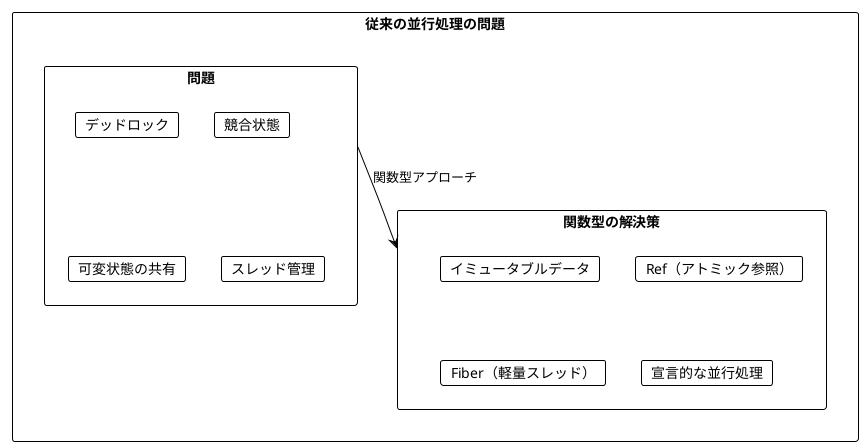
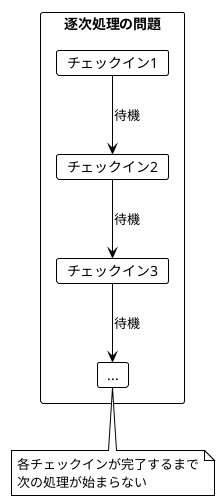
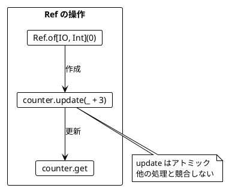
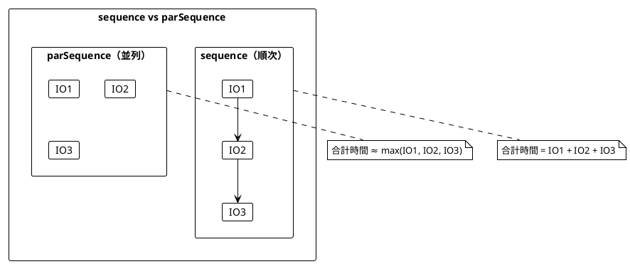
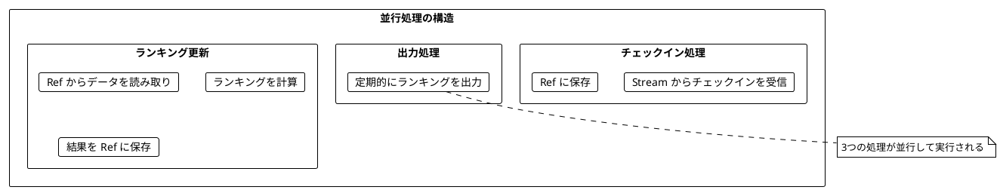
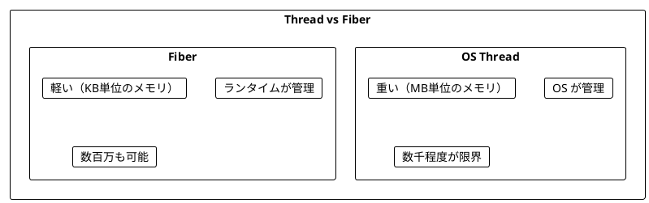
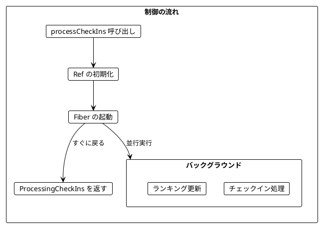
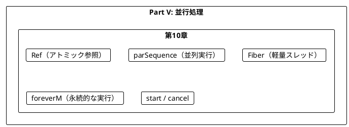
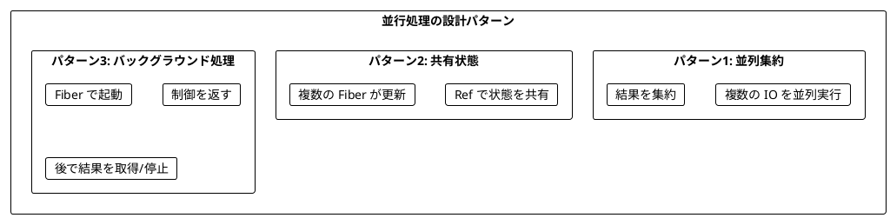

# Part V: 並行処理

本章では、関数型プログラミングにおける並行処理を学びます。Fiber による軽量スレッド、Ref による安全な共有状態管理、そして並行プログラムの構築方法を習得します。

---

## 第10章: 並行・並列処理

### 10.1 並行処理の課題

従来の並行処理には多くの課題があります:

- デッドロック
- 競合状態（Race Condition）
- 共有状態の管理の複雑さ
- スレッドのオーバーヘッド



### 10.2 チェックインのリアルタイム集計

**ソースファイル**: `app/scala/src/main/scala/ch10_CheckIns.scala`

都市へのチェックインをリアルタイムで集計し、ランキングを更新する例を見ていきます。

```scala
case class City(name: String)
case class CityStats(city: City, checkIns: Int)

// チェックインのストリーム
val checkIns: Stream[IO, City] =
  Stream(City("Sydney"), City("Dublin"), City("Cape Town"), City("Lima"), City("Singapore"))
    .repeatN(100_000)
    .covary[IO]
```

#### トップ3都市の計算（純粋関数）

```scala
def topCities(cityCheckIns: Map[City, Int]): List[CityStats] = {
  cityCheckIns.toList
    .map { case (city, checkIns) => CityStats(city, checkIns) }
    .sortBy(_.checkIns)
    .reverse
    .take(3)
}
```

### 10.3 逐次処理の問題

最初の実装は逐次処理で、パフォーマンスに問題があります。

```scala
def processCheckIns(checkIns: Stream[IO, City]): IO[Unit] = {
  checkIns
    .scan(Map.empty[City, Int])((cityCheckIns, city) =>
      cityCheckIns.updatedWith(city)(_.map(_ + 1).orElse(Some(1)))
    )
    .map(topCities)
    .foreach(IO.println)
    .compile
    .drain
}
```



### 10.4 Ref - アトミックな共有状態

**Ref** は、複数の並行処理から安全にアクセスできるアトミックな参照です。

```scala
import cats.effect.Ref

// Ref の作成と使用
val example: IO[Int] = for {
  counter <- Ref.of[IO, Int](0)    // 初期値 0 の Ref を作成
  _       <- counter.update(_ + 3)  // アトミックに更新
  result  <- counter.get            // 現在の値を取得
} yield result

example.unsafeRunSync()  // 3
```



#### Ref の主要メソッド

| メソッド | 説明 | 例 |
|----------|------|-----|
| `Ref.of[IO, A](initial)` | 初期値で Ref を作成 | `Ref.of[IO, Int](0)` |
| `ref.get` | 現在の値を取得 | `counter.get` |
| `ref.set(value)` | 値を設定 | `counter.set(10)` |
| `ref.update(f)` | アトミックに更新 | `counter.update(_ + 1)` |
| `ref.modify(f)` | 更新して古い値を返す | `counter.modify(n => (n + 1, n))` |

### 10.5 parSequence - 並列実行

`sequence` は IO を順番に実行しますが、`parSequence` は並列に実行します。

```scala
import cats.implicits._

// 順次実行
val sequential: IO[List[Int]] =
  List(IO.pure(1), IO.pure(2), IO.pure(3)).sequence

// 並列実行
val parallel: IO[List[Int]] =
  List(IO.pure(1), IO.pure(2), IO.pure(3)).parSequence
```



#### スリープを使った比較

```scala
import scala.concurrent.duration._

val program1 = IO.sleep(1.second).flatMap(_ => IO.pure(1))
val program2 = IO.sleep(1.second).flatMap(_ => IO.pure(2))
val program3 = IO.sleep(1.second).flatMap(_ => IO.pure(3))

// 順次実行: 約3秒
List(program1, program2, program3).sequence

// 並列実行: 約1秒
List(program1, program2, program3).parSequence
```

### 10.6 サイコロを並行して振る

**ソースファイル**: `app/scala/src/main/scala/ch10_CastingDieConcurrently.scala`

```scala
def castTheDie(): IO[Int] = IO.delay(castTheDieImpure())

// 2つのサイコロを並行して振り、合計を返す
val program: IO[Int] = for {
  _      <- IO.sleep(1.second)
  result <- List(castTheDie(), castTheDie()).parSequence
} yield result.sum
```

#### Ref と parSequence の組み合わせ

```scala
// 3つのサイコロを並行して振り、結果を Ref に保存
val program: IO[List[Int]] = for {
  storedCasts <- Ref.of[IO, List[Int]](List.empty)
  singleCast   = castTheDie().flatMap(result =>
                   storedCasts.update(_.appended(result)))
  _           <- List.fill(3)(singleCast).parSequence
  casts       <- storedCasts.get
} yield casts
```

### 10.7 チェックイン処理の並行版

チェックインの保存とランキングの更新を並行して実行します。

#### チェックインの保存

```scala
def storeCheckIn(storedCheckIns: Ref[IO, Map[City, Int]])(city: City): IO[Unit] = {
  storedCheckIns.update(_.updatedWith(city) {
    case None           => Some(1)
    case Some(checkIns) => Some(checkIns + 1)
  })
}
```

#### ランキングの継続的な更新

```scala
def updateRanking(
    storedCheckIns: Ref[IO, Map[City, Int]],
    storedRanking: Ref[IO, List[CityStats]]
): IO[Nothing] = {
  storedCheckIns.get
    .map(topCities)
    .flatMap(storedRanking.set)
    .foreverM  // 永遠に繰り返す
}
```



#### 完全な並行処理版

```scala
def processCheckIns(checkIns: Stream[IO, City]): IO[Unit] = {
  for {
    storedCheckIns <- Ref.of[IO, Map[City, Int]](Map.empty)
    storedRanking  <- Ref.of[IO, List[CityStats]](List.empty)

    // ランキング更新プログラム（永遠に実行）
    rankingProgram  = updateRanking(storedCheckIns, storedRanking)

    // チェックイン処理プログラム
    checkInsProgram = checkIns.evalMap(storeCheckIn(storedCheckIns)).compile.drain

    // 出力プログラム（1秒ごとにランキングを出力）
    outputProgram   = IO.sleep(1.second)
                        .flatMap(_ => storedRanking.get)
                        .flatMap(IO.println)
                        .foreverM

    // 3つのプログラムを並行実行
    _ <- List(rankingProgram, checkInsProgram, outputProgram).parSequence
  } yield ()
}
```

### 10.8 Fiber - 軽量スレッド

**Fiber** は、OS スレッドよりもはるかに軽量な実行単位です。



#### Fiber の起動とキャンセル

```scala
val program: IO[Unit] = for {
  // Fiber を起動（バックグラウンドで実行）
  fiber <- IO.sleep(300.millis)
             .flatMap(_ => IO.println("hello"))
             .foreverM
             .start

  // 1秒待機
  _ <- IO.sleep(1.second)

  // Fiber をキャンセル
  _ <- fiber.cancel

  // さらに1秒待機（hello は出力されない）
  _ <- IO.sleep(1.second)
} yield ()
```

### 10.9 呼び出し元に制御を返す

Fiber を使って、呼び出し元に制御を返しつつバックグラウンドで処理を続ける設計ができます。

```scala
case class ProcessingCheckIns(
  currentRanking: IO[List[CityStats]],  // 現在のランキングを取得
  stop: IO[Unit]                         // 処理を停止
)

def processCheckIns(checkIns: Stream[IO, City]): IO[ProcessingCheckIns] = {
  for {
    storedCheckIns <- Ref.of[IO, Map[City, Int]](Map.empty)
    storedRanking  <- Ref.of[IO, List[CityStats]](List.empty)

    rankingProgram  = updateRanking(storedCheckIns, storedRanking)
    checkInsProgram = checkIns.evalMap(storeCheckIn(storedCheckIns)).compile.drain

    // Fiber として起動し、すぐに戻る
    fiber <- List(rankingProgram, checkInsProgram).parSequence.start
  } yield ProcessingCheckIns(storedRanking.get, fiber.cancel)
}
```



#### 使用例

```scala
val program: IO[List[CityStats]] = for {
  processing <- processCheckIns(checkIns)

  // 最初のランキングを取得
  ranking    <- processing.currentRanking
  _          <- IO.println(ranking)

  // 1秒待機
  _          <- IO.sleep(1.second)

  // 更新されたランキングを取得
  newRanking <- processing.currentRanking

  // 処理を停止
  _          <- processing.stop
} yield newRanking
```

### 10.10 IO.sleep vs Thread.sleep

`IO.sleep` と `Thread.sleep` は異なる動作をします。

| 特性 | IO.sleep | Thread.sleep |
|------|----------|--------------|
| ブロック対象 | Fiber | OS Thread |
| リソース | 軽量 | 重い |
| 並行性 | 他の Fiber が実行可能 | スレッドがブロック |

```scala
// Thread.sleep: スレッドをブロック
val threadSleep = IO.delay(Thread.sleep(1000))

// IO.sleep: Fiber をスリープ（スレッドは解放）
val fiberSleep = IO.sleep(1.second)

// シングルスレッドで3つの IO.sleep を並行実行 → 約1秒
List.fill(3)(fiberSleep).parSequence

// シングルスレッドで3つの Thread.sleep を並行実行 → 約3秒
List.fill(3)(threadSleep).parSequence
```

---

## まとめ

### Part V で学んだこと



### 主要コンポーネント

| コンポーネント | 用途 |
|----------------|------|
| `Ref[IO, A]` | スレッドセーフな共有状態 |
| `parSequence` | IO のリストを並列実行 |
| `Fiber` | 軽量な実行単位 |
| `fiber.start` | Fiber をバックグラウンドで起動 |
| `fiber.cancel` | Fiber をキャンセル |
| `foreverM` | 永遠に繰り返し実行 |

### キーポイント

1. **Ref**: 複数の並行処理から安全にアクセスできるアトミックな参照
2. **parSequence**: IO のリストを並列実行して結果を集約
3. **Fiber**: OS スレッドより軽量で、数百万の並行処理が可能
4. **start**: Fiber をバックグラウンドで起動し、すぐに制御を返す
5. **IO.sleep**: Fiber をスリープさせ、スレッドは解放する

### 設計パターン



### 次のステップ

Part VI では、以下のトピックを学びます:

- 実践的なアプリケーション構築
- 外部 API との連携
- テスト戦略

---

## 演習問題

### 問題 1: Ref の基本

以下のプログラムを実装してください。カウンターを 0 から始めて、3回インクリメントした結果を返します。

```scala
def incrementThreeTimes(): IO[Int] = ???

// 期待される動作
incrementThreeTimes().unsafeRunSync()  // 3
```

<details>
<summary>解答</summary>

```scala
def incrementThreeTimes(): IO[Int] = {
  for {
    counter <- Ref.of[IO, Int](0)
    _       <- counter.update(_ + 1)
    _       <- counter.update(_ + 1)
    _       <- counter.update(_ + 1)
    result  <- counter.get
  } yield result
}
```

</details>

### 問題 2: 並列実行

以下のプログラムを実装してください。3つの IO を並列実行し、結果の合計を返します。

```scala
def sumParallel(io1: IO[Int], io2: IO[Int], io3: IO[Int]): IO[Int] = ???

// 期待される動作
sumParallel(IO.pure(1), IO.pure(2), IO.pure(3)).unsafeRunSync()  // 6
```

<details>
<summary>解答</summary>

```scala
import cats.implicits._

def sumParallel(io1: IO[Int], io2: IO[Int], io3: IO[Int]): IO[Int] = {
  List(io1, io2, io3).parSequence.map(_.sum)
}
```

</details>

### 問題 3: 並行カウント

以下のプログラムを実装してください。100個の IO を並行実行し、そのうち偶数を返した回数をカウントします。

```scala
def countEvens(ios: List[IO[Int]]): IO[Int] = ???

// 使用例
val ios = List.fill(100)(IO.delay(scala.util.Random.nextInt(10)))
countEvens(ios).unsafeRunSync()  // 約50（ランダム）
```

<details>
<summary>解答</summary>

```scala
def countEvens(ios: List[IO[Int]]): IO[Int] = {
  for {
    counter <- Ref.of[IO, Int](0)
    _       <- ios.map(io =>
                 io.flatMap(n =>
                   if (n % 2 == 0) counter.update(_ + 1)
                   else IO.unit
                 )
               ).parSequence
    result  <- counter.get
  } yield result
}
```

</details>

### 問題 4: タイムアウト付き実行

以下のプログラムを実装してください。指定時間後に Fiber をキャンセルし、それまでに蓄積された結果を返します。

```scala
def collectFor(duration: FiniteDuration): IO[List[Int]] = ???

// 期待される動作
// 1秒間、100msごとに乱数を生成してリストに追加
// 約10個の要素が返される
collectFor(1.second).unsafeRunSync()
```

<details>
<summary>解答</summary>

```scala
import scala.concurrent.duration._

def collectFor(duration: FiniteDuration): IO[List[Int]] = {
  for {
    collected <- Ref.of[IO, List[Int]](List.empty)

    // 100msごとに乱数を追加するプログラム
    producer = (IO.sleep(100.millis) *>
                IO.delay(scala.util.Random.nextInt(100))
                  .flatMap(n => collected.update(_.appended(n))))
                .foreverM

    // Fiber として起動
    fiber <- producer.start

    // 指定時間待機
    _ <- IO.sleep(duration)

    // キャンセル
    _ <- fiber.cancel

    // 結果を取得
    result <- collected.get
  } yield result
}
```

</details>

### 問題 5: 並行マップ更新

以下のプログラムを実装してください。複数の更新を並行して Map に適用し、最終的な Map を返します。

```scala
case class Update(key: String, value: Int)

def applyUpdates(updates: List[Update]): IO[Map[String, Int]] = ???

// 期待される動作
val updates = List(
  Update("a", 1),
  Update("b", 2),
  Update("a", 3),  // "a" を上書き
  Update("c", 4)
)
applyUpdates(updates).unsafeRunSync()  // Map("a" -> 3, "b" -> 2, "c" -> 4)
```

<details>
<summary>解答</summary>

```scala
case class Update(key: String, value: Int)

def applyUpdates(updates: List[Update]): IO[Map[String, Int]] = {
  for {
    mapRef <- Ref.of[IO, Map[String, Int]](Map.empty)
    _      <- updates.map(update =>
                mapRef.update(_.updated(update.key, update.value))
              ).parSequence
    result <- mapRef.get
  } yield result
}
```

注意: 並行実行なので、同じキーへの複数の更新がある場合、最終的な値は実行順序に依存します。

</details>
