# Part VI: 実践的なアプリケーション構築とテスト

本章では、これまで学んだ関数型プログラミングの概念を統合し、実践的なアプリケーションを構築します。また、関数型プログラミングにおけるテスト戦略についても学びます。

---

## 第11章: 実践的なアプリケーション構築

### 11.1 TravelGuide アプリケーション

旅行ガイドアプリケーションを例に、実践的な FP アプリケーションの構築方法を学びます。

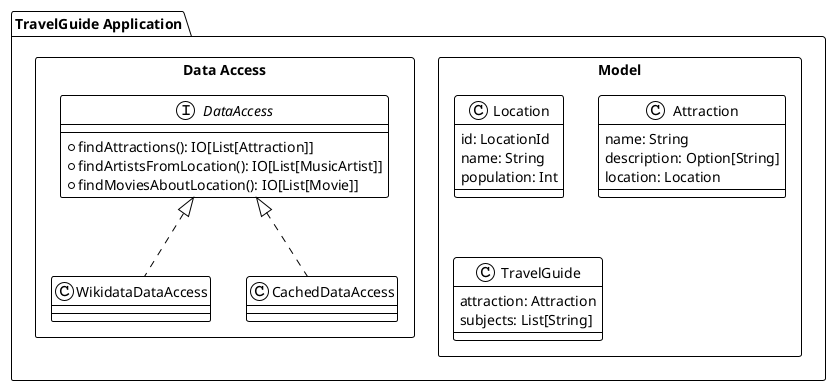

### 11.2 ドメインモデルの定義

**ソースファイル**: `app/scala/src/main/scala/ch11_TravelGuide.scala`

```scala
// 位置情報を表す値オブジェクト
opaque type LocationId = String
object LocationId {
  def apply(value: String): LocationId = value
  extension (a: LocationId) def value: String = a
}

// ロケーション
case class Location(id: LocationId, name: String, population: Int)

// アトラクション（観光地）
case class Attraction(
    name: String,
    description: Option[String],
    location: Location
)

// 旅行ガイド
case class TravelGuide(attraction: Attraction, subjects: List[String])
```

### 11.3 データアクセス層の抽象化

外部データソースへのアクセスをトレイトで抽象化します。

```scala
trait DataAccess {
  def findAttractions(
      name: String,
      ordering: AttractionOrdering,
      limit: Int
  ): IO[List[Attraction]]

  def findArtistsFromLocation(
      locationId: LocationId,
      limit: Int
  ): IO[List[MusicArtist]]

  def findMoviesAboutLocation(
      locationId: LocationId,
      limit: Int
  ): IO[List[Movie]]
}
```

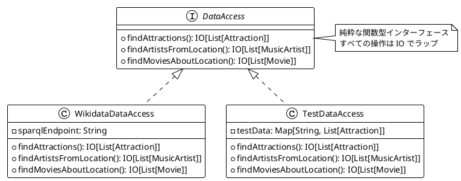

### 11.4 Resource によるリソース管理

cats-effect の `Resource` を使用して、安全なリソース管理を実現します。

**ソースファイル**: `app/scala/src/main/scala/ch11_TravelGuide.scala`

```scala
def execQuery(
    query: String
): Resource[IO, List[QuerySolution]] = {
  val connection: Resource[IO, RDFConnection] =
    Resource.make(
      IO.blocking(
        RDFConnectionRemote
          .create()
          .destination(WikidataSparqlEndpoint)
          .build()
      )
    )(connection => IO.blocking(connection.close()))

  for {
    conn   <- connection
    result <- Resource.eval(IO.blocking {
      val resultSet = conn.query(query).execSelect()
      resultSet.asScala.toList
    })
  } yield result
}
```

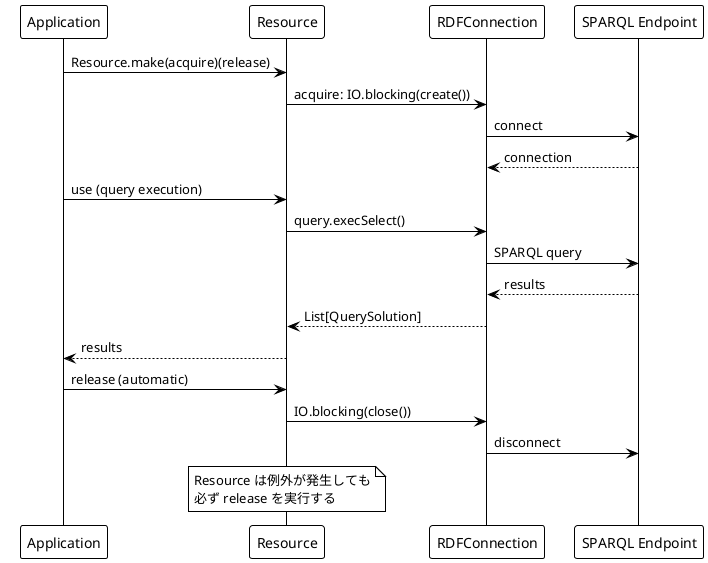

### 11.5 キャッシュの実装

`Ref` を使用したスレッドセーフなキャッシュの実装:

```scala
def cachedAttractions(
    dataAccess: DataAccess
): IO[DataAccess] = {
  for {
    cache <- Ref.of[IO, Map[String, List[Attraction]]](Map.empty)
  } yield new DataAccess {
    def findAttractions(
        name: String,
        ordering: AttractionOrdering,
        limit: Int
    ): IO[List[Attraction]] = {
      val key = s"$name-$ordering-$limit"
      for {
        cached <- cache.get.map(_.get(key))
        result <- cached match {
          case Some(attractions) => IO.pure(attractions)
          case None =>
            for {
              attractions <- dataAccess.findAttractions(name, ordering, limit)
              _           <- cache.update(_ + (key -> attractions))
            } yield attractions
        }
      } yield result
    }

    // 他のメソッドも同様に実装...
  }
}
```

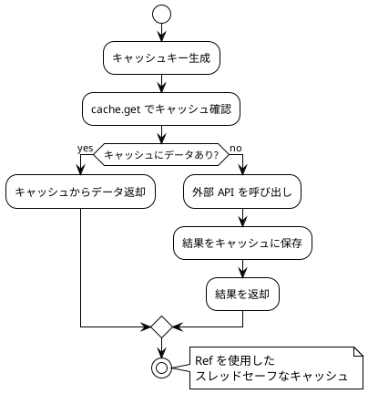

### 11.6 アプリケーションの組み立て

すべてのコンポーネントを組み合わせてアプリケーションを構築します。

```scala
def travelGuide(data: DataAccess, attractionName: String): IO[Option[TravelGuide]] = {
  for {
    attractions <- data.findAttractions(attractionName, ByLocationPopulation, 1)
    guide <- attractions.headOption match {
      case None => IO.pure(None)
      case Some(attraction) =>
        for {
          artists <- data.findArtistsFromLocation(attraction.location.id, 2)
          movies  <- data.findMoviesAboutLocation(attraction.location.id, 2)
        } yield Some(
          TravelGuide(
            attraction,
            artists.map(_.name) ++ movies.map(_.name)
          )
        )
    }
  } yield guide
}
```

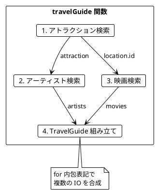

---

## 第12章: テスト戦略

### 12.1 関数型プログラミングのテスト

関数型プログラミングでは、純粋関数のおかげでテストが非常に簡単になります。

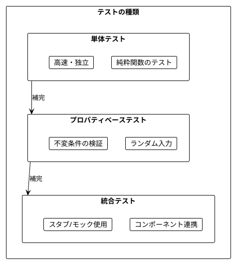

### 12.2 SearchReport の導入

**ソースファイル**: `app/scala/src/main/scala/ch12_TravelGuide.scala`

テスト可能性を高めるため、`SearchReport` を導入します。

```scala
case class SearchReport(
    attractionsSearched: Int,
    errors: List[String]
)

case class TravelGuide(
    attraction: Attraction,
    subjects: List[String],
    searchReport: SearchReport
)
```

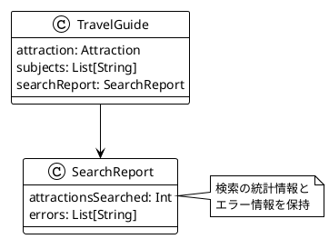

### 12.3 エラーハンドリングの改善

```scala
def findArtistsFromLocation(
    locationId: LocationId,
    limit: Int
): IO[Either[String, List[MusicArtist]]]

def findMoviesAboutLocation(
    locationId: LocationId,
    limit: Int
): IO[Either[String, List[Movie]]]
```

Either を使用してエラーを明示的に扱います:

```scala
def travelGuide(
    data: DataAccess,
    attractionName: String
): IO[Option[TravelGuide]] = {
  for {
    attractions <- data.findAttractions(attractionName, ByLocationPopulation, 3)
    guides <- attractions.traverse { attraction =>
      for {
        artistsResult <- data.findArtistsFromLocation(attraction.location.id, 2)
        moviesResult  <- data.findMoviesAboutLocation(attraction.location.id, 2)
      } yield {
        val errors = List(artistsResult, moviesResult).collect {
          case Left(error) => error
        }
        val artists = artistsResult.getOrElse(Nil)
        val movies = moviesResult.getOrElse(Nil)
        TravelGuide(
          attraction,
          artists.map(_.name) ++ movies.map(_.name),
          SearchReport(attractions.size, errors)
        )
      }
    }
  } yield guides.headOption
}
```

### 12.4 スタブを使用したテスト

**ソースファイル**: `app/scala/src/main/scala/ch12_TravelGuideTest.scala`

```scala
// テスト用のスタブ実装
val testDataAccess: DataAccess = new DataAccess {
  def findAttractions(
      name: String,
      ordering: AttractionOrdering,
      limit: Int
  ): IO[List[Attraction]] = IO.pure(
    List(
      Attraction(
        "Test Attraction",
        Some("A test attraction"),
        Location(LocationId("Q123"), "Test City", 100000)
      )
    )
  )

  def findArtistsFromLocation(
      locationId: LocationId,
      limit: Int
  ): IO[Either[String, List[MusicArtist]]] =
    IO.pure(Right(List(MusicArtist("Test Artist"))))

  def findMoviesAboutLocation(
      locationId: LocationId,
      limit: Int
  ): IO[Either[String, List[Movie]]] =
    IO.pure(Right(List(Movie("Test Movie"))))
}
```

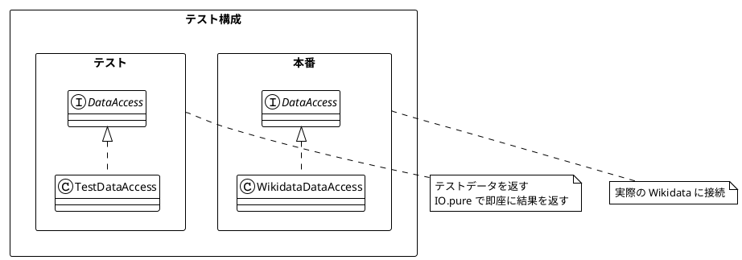

### 12.5 プロパティベーステスト

ScalaCheck を使用したプロパティベーステスト:

```scala
import org.scalacheck.Gen
import org.scalacheck.Prop.forAll

// ジェネレータの定義
val locationIdGen: Gen[LocationId] =
  Gen.alphaNumStr.map(LocationId.apply)

val locationGen: Gen[Location] = for {
  id         <- locationIdGen
  name       <- Gen.alphaStr
  population <- Gen.posNum[Int]
} yield Location(id, name, population)

val attractionGen: Gen[Attraction] = for {
  name        <- Gen.alphaStr
  description <- Gen.option(Gen.alphaStr)
  location    <- locationGen
} yield Attraction(name, description, location)
```

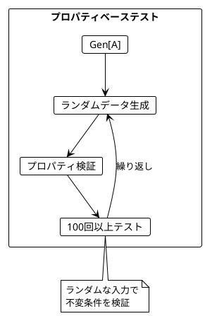

### 12.6 不変条件のテスト

```scala
// プロパティ: アトラクションの数は limit 以下
property("findAttractions returns at most limit attractions") =
  forAll(Gen.alphaStr, Gen.posNum[Int]) { (name: String, limit: Int) =>
    val result = dataAccess
      .findAttractions(name, ByLocationPopulation, limit)
      .unsafeRunSync()
    result.size <= limit
  }

// プロパティ: SearchReport のエラー数は検索数以下
property("SearchReport errors are bounded by searches") =
  forAll(attractionGen) { attraction =>
    val guide = travelGuide(testDataAccess, attraction.name).unsafeRunSync()
    guide.forall { g =>
      g.searchReport.errors.size <= 2 // artists + movies
    }
  }
```

### 12.7 統合テスト

```scala
// 統合テスト: エンドツーエンドのシナリオ
test("travelGuide returns guide for valid attraction") {
  val result = travelGuide(testDataAccess, "Test").unsafeRunSync()

  assert(result.isDefined)
  result.foreach { guide =>
    assert(guide.attraction.name == "Test Attraction")
    assert(guide.subjects.nonEmpty)
    assert(guide.searchReport.errors.isEmpty)
  }
}

// エラーケースのテスト
test("travelGuide handles errors gracefully") {
  val failingDataAccess = new DataAccess {
    def findAttractions(name: String, ordering: AttractionOrdering, limit: Int) =
      IO.pure(List(testAttraction))

    def findArtistsFromLocation(locationId: LocationId, limit: Int) =
      IO.pure(Left("Network error"))

    def findMoviesAboutLocation(locationId: LocationId, limit: Int) =
      IO.pure(Left("Timeout"))
  }

  val result = travelGuide(failingDataAccess, "Test").unsafeRunSync()

  assert(result.isDefined)
  result.foreach { guide =>
    assert(guide.searchReport.errors.size == 2)
  }
}
```

### 12.8 テストピラミッド

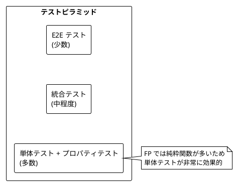

---

## まとめ

### Part VI で学んだこと

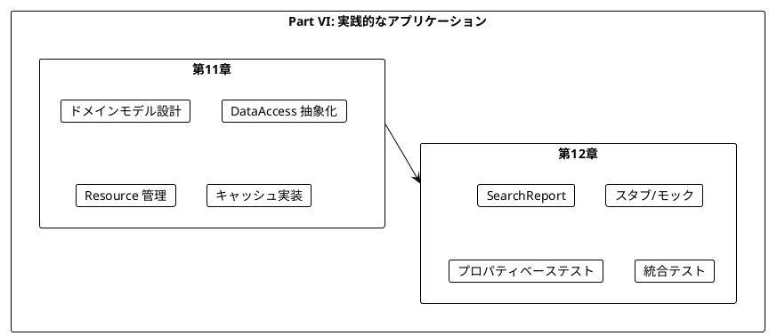

### キーポイント

1. **抽象化の重要性**: DataAccess トレイトで外部依存を抽象化
2. **Resource でリソース管理**: 安全なリソースの取得と解放
3. **Ref でキャッシュ**: スレッドセーフな状態管理
4. **Either でエラー処理**: 明示的なエラーハンドリング
5. **SearchReport**: テスト可能性と可観測性の向上
6. **スタブ**: 外部依存を差し替えてテスト
7. **プロパティベーステスト**: ランダム入力で不変条件を検証

### 学習の総括

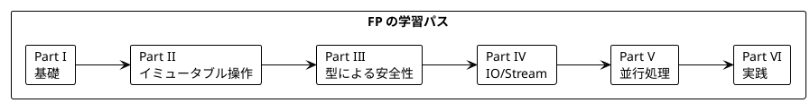

---

## 演習問題

### 問題 1: DataAccess の拡張

以下の要件で `DataAccess` を拡張してください:
- 新しいメソッド `findHotelsNearLocation` を追加
- 戻り値は `IO[Either[String, List[Hotel]]]`

<details>
<summary>解答</summary>

```scala
case class Hotel(name: String, rating: Double, location: Location)

trait DataAccess {
  // 既存のメソッド...

  def findHotelsNearLocation(
      locationId: LocationId,
      limit: Int
  ): IO[Either[String, List[Hotel]]]
}

// テスト用スタブ
val testDataAccess: DataAccess = new DataAccess {
  // 既存の実装...

  def findHotelsNearLocation(
      locationId: LocationId,
      limit: Int
  ): IO[Either[String, List[Hotel]]] =
    IO.pure(Right(List(
      Hotel("Test Hotel", 4.5, testLocation)
    )))
}
```

</details>

### 問題 2: プロパティベーステスト

以下の関数に対するプロパティベーステストを書いてください:

```scala
def filterPopularLocations(
    locations: List[Location],
    minPopulation: Int
): List[Location] =
  locations.filter(_.population >= minPopulation)
```

<details>
<summary>解答</summary>

```scala
import org.scalacheck.Gen
import org.scalacheck.Prop.forAll

val locationGen: Gen[Location] = for {
  id         <- Gen.alphaNumStr.map(LocationId.apply)
  name       <- Gen.alphaStr
  population <- Gen.chooseNum(0, 10000000)
} yield Location(id, name, population)

val locationsGen: Gen[List[Location]] =
  Gen.listOf(locationGen)

// プロパティ1: 結果は入力以下の要素数
property("result size <= input size") =
  forAll(locationsGen, Gen.posNum[Int]) {
    (locations: List[Location], minPop: Int) =>
      filterPopularLocations(locations, minPop).size <= locations.size
  }

// プロパティ2: 結果のすべての要素は条件を満たす
property("all results meet minimum population") =
  forAll(locationsGen, Gen.posNum[Int]) {
    (locations: List[Location], minPop: Int) =>
      filterPopularLocations(locations, minPop)
        .forall(_.population >= minPop)
  }

// プロパティ3: 条件を満たす要素はすべて結果に含まれる
property("all qualifying locations are in result") =
  forAll(locationsGen, Gen.posNum[Int]) {
    (locations: List[Location], minPop: Int) =>
      val result = filterPopularLocations(locations, minPop)
      locations.filter(_.population >= minPop).forall(result.contains)
  }
```

</details>

### 問題 3: Resource の実装

ファイルを安全に読み取る `Resource` を実装してください。

<details>
<summary>解答</summary>

```scala
import cats.effect.{IO, Resource}
import java.io.{BufferedReader, FileReader}

def fileResource(path: String): Resource[IO, BufferedReader] =
  Resource.make(
    IO.blocking(new BufferedReader(new FileReader(path)))
  )(reader => IO.blocking(reader.close()))

def readLines(path: String): IO[List[String]] = {
  fileResource(path).use { reader =>
    IO.blocking {
      Iterator
        .continually(reader.readLine())
        .takeWhile(_ != null)
        .toList
    }
  }
}

// 使用例
val program: IO[Unit] = for {
  lines <- readLines("data.txt")
  _     <- IO.println(s"Read ${lines.size} lines")
} yield ()
```

</details>

---

## シリーズ全体の総括

本シリーズでは、「Grokking Functional Programming」の内容に沿って、関数型プログラミングの基礎から実践的なアプリケーション構築までを学びました。

### 学んだ主な概念

| Part | 章 | 主な概念 |
|------|-----|----------|
| I | 1-2 | 純粋関数、参照透過性 |
| II | 3-5 | イミュータブルデータ、高階関数、flatMap |
| III | 6-7 | Option、Either、ADT |
| IV | 8-9 | IO モナド、Stream |
| V | 10 | 並行処理、Ref、Fiber |
| VI | 11-12 | 実践アプリケーション、テスト |

### 関数型プログラミングの利点

1. **予測可能性**: 純粋関数は同じ入力に対して常に同じ出力
2. **テスト容易性**: 副作用がないためテストが簡単
3. **合成可能性**: 小さな関数を組み合わせて複雑な処理を構築
4. **並行安全性**: イミュータブルデータは競合状態を防ぐ
5. **型安全性**: Option、Either で null や例外を型で表現

### 次のステップ

- Cats Effect のより高度な機能を学ぶ
- fs2 の実践的な使用方法を深める
- ZIO など他の FP ライブラリを探索
- 実際のプロジェクトで FP を適用する
