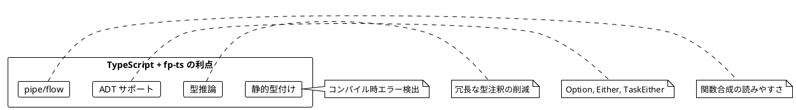
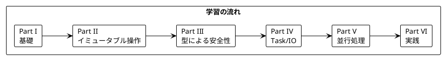

# Grokking Functional Programming - TypeScript fp-ts 版

本シリーズは「Grokking Functional Programming」（Michał Płachta 著）の学習コンパニオンとして、関数型プログラミングの概念を TypeScript と fp-ts を使って解説します。

---

## 対象読者

- JavaScript/TypeScript の経験があり、関数型プログラミングに興味がある開発者
- fp-ts を学びたいが、FP の概念から理解したい方
- 型安全な FP の適用方法を知りたいフロントエンド/バックエンドエンジニア

---

## なぜ TypeScript と fp-ts か？



fp-ts は Haskell や Scala の cats に影響を受けた TypeScript 向け関数型プログラミングライブラリです。

---

## 記事一覧

### [Part I: 関数型プログラミングの基礎](part-1.md)

関数型プログラミングの基本概念を学びます。

| 章 | トピック |
|----|----------|
| 第1章 | 命令型 vs 関数型、TypeScript 基本構文 |
| 第2章 | 純粋関数、副作用の排除、テストの容易さ |

**キーワード**: 純粋関数、参照透過性、副作用、`pipe`

---

### [Part II: 関数型スタイルのプログラミング](part-2.md)

イミュータブルなデータ操作と高階関数を学びます。

| 章 | トピック |
|----|----------|
| 第3章 | イミュータブルデータ、ReadonlyArray |
| 第4章 | 高階関数、fp-ts/Array の map/filter/reduce |
| 第5章 | flatMap、chain、sequenceT |

**キーワード**: イミュータブル、高階関数、`ReadonlyArray`、`chain`

---

### [Part III: エラーハンドリングと Option/Either](part-3.md)

型安全なエラーハンドリングを学びます。

| 章 | トピック |
|----|----------|
| 第6章 | Option 型、some/none |
| 第7章 | Either 型、ADT、パターンマッチング（fold/match） |

**キーワード**: `Option`、`Either`、`fold`、代数的データ型（ADT）

---

### [Part IV: IO と副作用の管理](part-4.md)

IO モナドとストリーム処理を学びます。

| 章 | トピック |
|----|----------|
| 第8章 | Task、TaskEither、IO |
| 第9章 | ストリーム処理、AsyncIterable |

**キーワード**: `Task`、`TaskEither`、`IO`、遅延評価

---

### [Part V: 並行処理](part-5.md)

関数型プログラミングにおける並行処理を学びます。

| 章 | トピック |
|----|----------|
| 第10章 | 並列実行、sequenceT、Promise.all |

**キーワード**: 並行処理、`sequenceT`、`traverseArray`

---

### [Part VI: 実践的なアプリケーション構築とテスト](part-6.md)

実践的なアプリケーション構築とテスト戦略を学びます。

| 章 | トピック |
|----|----------|
| 第11章 | TravelGuide アプリ、Reader、依存性注入 |
| 第12章 | テスト戦略、プロパティベーステスト（fast-check） |

**キーワード**: `Reader`、`ReaderTaskEither`、fast-check

---

## 学習パス



---

## Scala vs TypeScript fp-ts 対応表

| Scala (cats) | TypeScript (fp-ts) | 説明 |
|--------------|-------------------|------|
| `Option[A]` | `Option<A>` | 値の有無を表現 |
| `Either[E, A]` | `Either<E, A>` | 成功/失敗を表現 |
| `IO[A]` | `IO<A>` | 同期的な副作用 |
| `Future[A]` / `IO[A]` | `Task<A>` | 非同期処理 |
| `EitherT[IO, E, A]` | `TaskEither<E, A>` | 非同期 + エラー |
| `Reader[R, A]` | `Reader<R, A>` | 依存性注入 |
| `for 内包表記` | `pipe` + `chain` | モナドの連鎖 |
| `map` | `map` | Functor 操作 |
| `flatMap` | `chain` / `flatMap` | Monad 操作 |
| `traverse` | `traverse` | 効果の反転 |
| `sequence` | `sequence` | 効果のリスト変換 |

---

## 使用ライブラリ

| ライブラリ | 用途 | 対応章 |
|------------|------|--------|
| TypeScript 5.x | 言語 | 全章 |
| fp-ts | 関数型プログラミング基盤 | 全章 |
| io-ts | ランタイム型検証 | Part III |
| fast-check | プロパティベーステスト | Part VI |
| vitest | テストフレームワーク | 全章 |

---

## リポジトリ構成

```
grokkingfp-examples/
├── app/typescript/src/          # TypeScript のサンプルコード
│   ├── ch01_intro.ts
│   ├── ch02_pure_functions.ts
│   ├── ch03_immutable_data.ts
│   ├── ch04_higher_order.ts
│   ├── ch05_flatmap.ts
│   ├── ch06_option.ts
│   ├── ch07_either.ts
│   ├── ch08_io.ts
│   ├── ch09_streams.ts
│   ├── ch10_concurrency.ts
│   ├── ch11_travel_guide.ts
│   └── ch12_testing.ts
├── app/typescript/tests/        # テストコード
└── docs/article/typescript/     # 解説記事（本ディレクトリ）
    ├── index.md                 # この記事
    ├── part-1.md                # Part I
    ├── part-2.md                # Part II
    ├── part-3.md                # Part III
    ├── part-4.md                # Part IV
    ├── part-5.md                # Part V
    └── part-6.md                # Part VI
```

---

## fp-ts の基本パターン

### pipe による関数合成

```typescript
import { pipe } from 'fp-ts/function'
import * as O from 'fp-ts/Option'

const result = pipe(
  O.some(5),
  O.map(x => x * 2),
  O.filter(x => x > 5),
  O.getOrElse(() => 0)
)
// result: 10
```

### chain によるモナド連鎖

```typescript
import { pipe } from 'fp-ts/function'
import * as E from 'fp-ts/Either'

const divide = (a: number, b: number): E.Either<string, number> =>
  b === 0 ? E.left('Division by zero') : E.right(a / b)

const result = pipe(
  E.right(10),
  E.chain(x => divide(x, 2)),
  E.chain(x => divide(x, 0)),
  E.getOrElse(() => -1)
)
// result: -1 (エラー)
```

---

## 関数型プログラミングの利点

本シリーズを通じて、以下の利点を実感できます:

1. **予測可能性** - 純粋関数は同じ入力に対して常に同じ出力
2. **テスト容易性** - 副作用がないためテストが簡単
3. **合成可能性** - pipe で小さな関数を組み合わせて複雑な処理を構築
4. **並行安全性** - イミュータブルデータは競合状態を防ぐ
5. **型安全性** - Option、Either で null や例外を型で表現

---

## 参考資料

- [Grokking Functional Programming](https://www.manning.com/books/grokking-functional-programming) - 原著
- [fp-ts 公式ドキュメント](https://gcanti.github.io/fp-ts/)
- [fp-ts learning resources](https://gcanti.github.io/fp-ts/learning-resources/)
- [io-ts ドキュメント](https://gcanti.github.io/io-ts/)
- [fast-check ドキュメント](https://fast-check.dev/)
