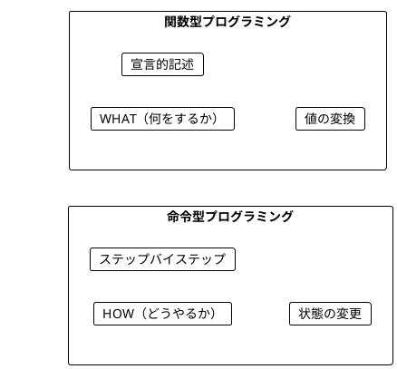
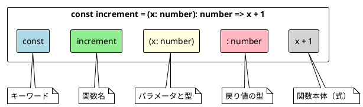
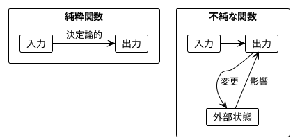
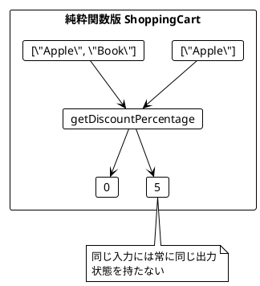
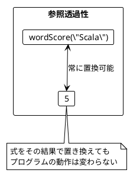
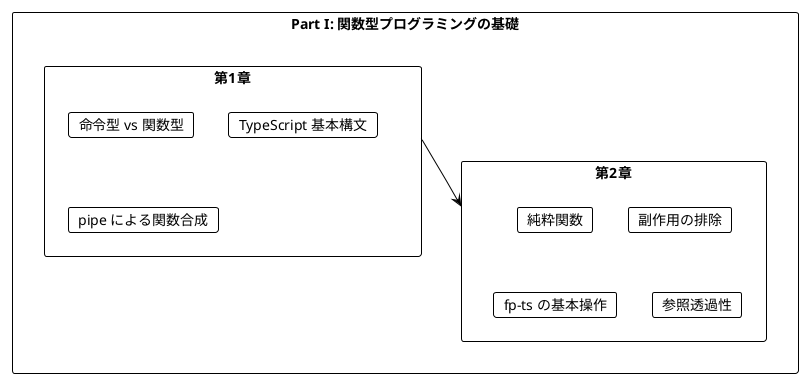

# Part I: 関数型プログラミングの基礎

本章では、関数型プログラミング（FP）の基本概念を TypeScript と fp-ts を使って学びます。命令型プログラミングとの違いを理解し、純粋関数の利点を実感することが目標です。

---

## 第1章: 関数型プログラミング入門

### 1.1 命令型 vs 関数型

プログラミングには大きく分けて2つのパラダイムがあります。



**命令型プログラミング**は「どうやるか」を記述します。

```typescript
// TypeScript: 命令型でワードスコアを計算
const calculateScoreImperative = (word: string): number => {
  let score = 0
  for (const _ of word) {
    score += 1
  }
  return score
}
```

**関数型プログラミング**は「何をするか」を記述します。

```typescript
// TypeScript: 関数型でワードスコアを計算
const wordScore = (word: string): number => word.length
```

### 1.2 TypeScript の基本構文

TypeScript での関数定義の基本形を見てみましょう。

**ソースファイル**: `app/typescript/src/ch01_intro.ts`

```typescript
// アロー関数（推奨）
const increment = (x: number): number => x + 1

const getFirstCharacter = (s: string): string => s.charAt(0)

const wordScore = (word: string): number => word.length
```

### 1.3 関数の構造



### 1.4 fp-ts の pipe を使った関数合成

TypeScript では fp-ts の `pipe` を使って関数を合成できます。

```typescript
import { pipe } from 'fp-ts/function'

// 文字列を大文字にして反転する
const transformString = (s: string): string =>
  pipe(
    s,
    toUppercase,
    reverseString
  )

// 値を2倍にして1増加させる
const transformNumber = (x: number): number =>
  pipe(
    x,
    double,
    increment
  )
```

`pipe` は左から右へデータが流れるように読めるため、可読性が向上します。

### 1.5 学習ポイント

| 概念 | 命令型 | 関数型 |
|------|--------|--------|
| 焦点 | 手順（How） | 結果（What） |
| 状態 | 変更する | 変換する |
| ループ | for/while | map/filter/reduce |
| データ | ミュータブル | イミュータブル |
| 合成 | 手続き呼び出し | pipe/flow |

---

## 第2章: 純粋関数とテスト

### 2.1 純粋関数とは

純粋関数（Pure Function）は以下の特徴を持つ関数です:

1. **同じ入力には常に同じ出力を返す**
2. **副作用がない**（外部状態を変更しない）



### 2.2 純粋関数の例

**ソースファイル**: `app/typescript/src/ch02_pure_functions.ts`

```typescript
// 純粋関数の例
const increment = (x: number): number => x + 1

const add = (a: number, b: number): number => a + b

const getFirstCharacter = (s: string): string => s.charAt(0)
```

**純粋ではない関数の例**:

```typescript
// 不純な関数 - Math.random() は毎回異なる値を返す
const randomPart = (x: number): number => x * Math.random()

// 不純な関数 - 外部状態を変更する
let counter = 0
const incrementCounter = (): number => {
  counter += 1
  return counter
}
```

### 2.3 ショッピングカートの例

状態を持つクラスの問題点を見てみましょう。

#### 問題のあるコード

```typescript
class ShoppingCartBad {
  private items: string[] = []
  private bookAdded = false

  addItem(item: string): void {
    this.items.push(item)
    if (item === 'Book') {
      this.bookAdded = true
    }
  }

  getDiscountPercentage(): number {
    return this.bookAdded ? 5 : 0
  }

  getItems(): string[] {
    return this.items  // 問題: 内部状態への参照を返している
  }
}
```

#### 純粋関数による解決

```typescript
// 純粋関数版
const getDiscountPercentage = (items: readonly string[]): number =>
  items.includes('Book') ? 5 : 0

const calculateFinalPrice = (price: number, items: readonly string[]): number => {
  const discountPercent = getDiscountPercentage(items)
  const discount = (price * discountPercent) / 100
  return price - discount
}
```



### 2.4 チップ計算の例

**ソースファイル**: `app/typescript/src/ch02_pure_functions.ts`

```typescript
const getTipPercentage = (names: readonly string[]): number => {
  const size = names.length
  if (size > 5) return 20
  if (size > 0) return 10
  return 0
}
```

この関数は:
- 6人以上のグループ → 20% のチップ
- 1-5人のグループ → 10% のチップ
- 0人（空リスト） → 0% のチップ

### 2.5 fp-ts を使ったリスト操作

fp-ts の `ReadonlyArray` モジュールを使って、型安全なリスト操作ができます。

```typescript
import { pipe } from 'fp-ts/function'
import * as RA from 'fp-ts/ReadonlyArray'

// 全ての要素を2倍にする
const doubleAll = (numbers: readonly number[]): readonly number[] =>
  pipe(
    numbers,
    RA.map((n) => n * 2)
  )

// 正の数のみをフィルタリング
const filterPositive = (numbers: readonly number[]): readonly number[] =>
  pipe(
    numbers,
    RA.filter((n) => n > 0)
  )

// リストの合計
const sumList = (numbers: readonly number[]): number =>
  pipe(
    numbers,
    RA.reduce(0, (acc, n) => acc + n)
  )
```

### 2.6 Option を使った安全な平均計算

空リストの場合に null/undefined を返す代わりに、`Option` 型を使います。

```typescript
import * as O from 'fp-ts/Option'

const average = (numbers: readonly number[]): O.Option<number> =>
  pipe(
    numbers,
    O.fromPredicate((arr) => arr.length > 0),
    O.map((arr) => sumList(arr) / arr.length)
  )

// 使用例
const result1 = average([1, 2, 3, 4, 5])  // some(3)
const result2 = average([])               // none
```

### 2.7 参照透過性

純粋関数は**参照透過性（Referential Transparency）**を持ちます。

> 式をその評価結果で置き換えても、プログラムの意味が変わらないこと

```typescript
// 参照透過性の例
const score1 = wordScore('Scala')
const score2 = wordScore('Scala')
// score1 と score2 は常に同じ値（5）

// 以下の2つは同等
const total1 = wordScore('Scala') + wordScore('Java')
const total2 = 5 + 4  // wordScore の結果で置き換え可能
```



### 2.8 高階関数の基本

関数を引数として受け取ったり、関数を返す関数を**高階関数**といいます。

```typescript
// 関数を2回適用する
const applyTwice = (f: (x: number) => number, x: number): number => f(f(x))

// 使用例
applyTwice((x) => x + 1, 5)  // => 7
applyTwice((x) => x * 2, 3)  // => 12

// 関数合成
const compose = <A, B, C>(f: (b: B) => C, g: (a: A) => B): ((a: A) => C) =>
  (a) => f(g(a))

// fp-ts の flow を使った関数合成
import { flow } from 'fp-ts/function'

const double = (x: number) => x * 2
const addOne = (x: number) => x + 1
const doubleThenAdd = flow(double, addOne)

doubleThenAdd(5)  // => 11
```

---

## まとめ

### Part I で学んだこと



### キーポイント

1. **関数型プログラミング**は「何をするか」を宣言的に記述する
2. **純粋関数**は同じ入力に対して常に同じ出力を返す
3. **副作用**を避けることでコードの予測可能性が向上する
4. **pipe**を使って関数を読みやすく合成できる
5. **readonly**を使ってイミュータブルなデータを表現する
6. **Option**を使って null/undefined を型安全に扱う

### Scala vs TypeScript fp-ts 比較

| Scala | TypeScript (fp-ts) | 説明 |
|-------|-------------------|------|
| `def f(x: Int): Int` | `const f = (x: number): number =>` | 関数定義 |
| `List(1, 2, 3)` | `[1, 2, 3] as const` | イミュータブルリスト |
| `list.map(f)` | `pipe(list, RA.map(f))` | map 操作 |
| `list.filter(p)` | `pipe(list, RA.filter(p))` | filter 操作 |
| `list.foldLeft(z)(f)` | `pipe(list, RA.reduce(z, f))` | fold/reduce |
| `f andThen g` | `flow(f, g)` | 関数合成（左から右） |
| `f compose g` | `compose(f, g)` | 関数合成（右から左） |

### 次のステップ

Part II では、以下のトピックを学びます:

- イミュータブルなデータ操作（ReadonlyArray）
- 高階関数（関数を値として扱う）
- `chain`（flatMap）とネスト構造の平坦化
- `sequenceT` による複数の効果の合成

---

## 演習問題

### 問題 1: 純粋関数の識別

以下の関数のうち、純粋関数はどれですか?

```typescript
// A
const double = (x: number): number => x * 2

// B
let counter = 0
const incrementCounter = (): number => {
  counter += 1
  return counter
}

// C
const greet = (name: string): string => `Hello, ${name}!`

// D
const currentTime = (): number => Date.now()
```

<details>
<summary>解答</summary>

**A と C は純粋関数**です。

- A: 同じ入力に対して常に同じ出力を返し、副作用がない
- B: 外部変数 `counter` を変更する副作用がある（不純）
- C: 同じ入力に対して常に同じ出力を返し、副作用がない
- D: 呼び出すたびに異なる値を返す（不純）

</details>

### 問題 2: pipe を使った関数合成

以下の関数を `pipe` を使って書き換えてください。

```typescript
const processString = (s: string): number => {
  const upper = s.toUpperCase()
  const reversed = upper.split('').reverse().join('')
  return reversed.length
}
```

<details>
<summary>解答</summary>

```typescript
import { pipe } from 'fp-ts/function'

const toUpper = (s: string): string => s.toUpperCase()
const reverse = (s: string): string => s.split('').reverse().join('')
const length = (s: string): number => s.length

const processString = (s: string): number =>
  pipe(
    s,
    toUpper,
    reverse,
    length
  )
```

</details>

### 問題 3: fp-ts を使ったリスト操作

以下の関数を fp-ts の `ReadonlyArray` モジュールを使って実装してください。

1. リストの全ての要素を3倍にする関数
2. 10より大きい数のみをフィルタリングする関数
3. リストの積（全要素の掛け算）を計算する関数

<details>
<summary>解答</summary>

```typescript
import { pipe } from 'fp-ts/function'
import * as RA from 'fp-ts/ReadonlyArray'

// 1. 全ての要素を3倍にする
const tripleAll = (numbers: readonly number[]): readonly number[] =>
  pipe(
    numbers,
    RA.map((n) => n * 3)
  )

// 2. 10より大きい数のみをフィルタリング
const filterGreaterThanTen = (numbers: readonly number[]): readonly number[] =>
  pipe(
    numbers,
    RA.filter((n) => n > 10)
  )

// 3. リストの積を計算
const product = (numbers: readonly number[]): number =>
  pipe(
    numbers,
    RA.reduce(1, (acc, n) => acc * n)
  )
```

</details>
