# Part II: 関数型スタイルのプログラミング

本章では、関数型プログラミングの核心となるテクニックを学びます。イミュータブルなデータ操作、高階関数、そして `chain`（flatMap）による複雑なデータ変換を習得します。

---

## 第3章: イミュータブルなデータ操作

### 3.1 イミュータブルとは

イミュータブル（不変）とは、一度作成されたデータが変更されないことを意味します。データを「変更」する代わりに、新しいデータを「作成」します。

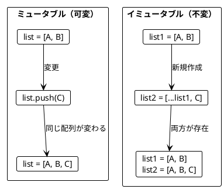

TypeScript では `readonly` 修飾子と fp-ts の `ReadonlyArray` モジュールを使ってイミュータブルなデータを扱います。

### 3.2 配列の基本操作

**ソースファイル**: `app/typescript/src/ch03_immutable_data.ts`

#### appended - 要素の追加

```typescript
// スプレッド演算子を使ったイミュータブルな追加
const appended = <T>(lst: readonly T[], element: T): readonly T[] =>
  [...lst, element]

const appleBook = ['Apple', 'Book'] as const
const appleBookMango = appended(appleBook, 'Mango')

// appleBook.length === 2       // 元のリストは変わらない
// appleBookMango.length === 3  // 新しいリストが作成される
// appleBookMango === ['Apple', 'Book', 'Mango']
```

#### slice - リストの切り出し

```typescript
const firstTwo = <T>(lst: readonly T[]): readonly T[] =>
  lst.slice(0, 2)

const lastTwo = <T>(lst: readonly T[]): readonly T[] =>
  lst.slice(Math.max(0, lst.length - 2))

// firstTwo(['a', 'b', 'c']) === ['a', 'b']
// lastTwo(['a', 'b', 'c']) === ['b', 'c']
```

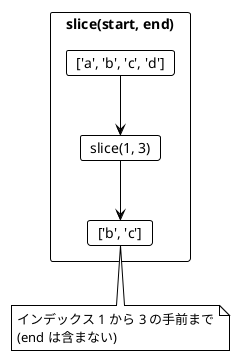

### 3.3 リストの変換例

**ソースファイル**: `app/typescript/src/ch03_immutable_data.ts`

```typescript
// 最初の2要素を末尾に移動
const moveFirstTwoToEnd = <T>(lst: readonly T[]): readonly T[] => {
  const firstTwo = lst.slice(0, 2)
  const withoutFirstTwo = lst.slice(2)
  return [...withoutFirstTwo, ...firstTwo]
}

// moveFirstTwoToEnd(['a', 'b', 'c']) === ['c', 'a', 'b']

// 最後の要素の前に挿入
const insertBeforeLast = <T>(lst: readonly T[], element: T): readonly T[] => {
  if (lst.length === 0) return [element]
  const last = lst.slice(lst.length - 1)
  const withoutLast = lst.slice(0, lst.length - 1)
  return [...withoutLast, element, ...last]
}

// insertBeforeLast(['a', 'b'], 'c') === ['a', 'c', 'b']
```

### 3.4 旅程の再計画

**ソースファイル**: `app/typescript/src/ch03_immutable_data.ts`

旅行の計画変更をイミュータブルに行う例です。

```typescript
const replan = (
  plan: readonly string[],
  newCity: string,
  beforeCity: string
): readonly string[] => {
  const index = plan.indexOf(beforeCity)
  if (index === -1) return [...plan, newCity]
  return [...plan.slice(0, index), newCity, ...plan.slice(index)]
}

const planA = ['Paris', 'Berlin', 'Kraków']
const planB = replan(planA, 'Vienna', 'Kraków')

// planB === ['Paris', 'Berlin', 'Vienna', 'Kraków']
// planA === ['Paris', 'Berlin', 'Kraków']  // 元の計画は変わらない!
```

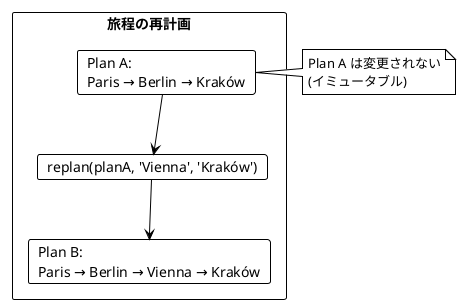

### 3.5 イミュータブルなオブジェクト

TypeScript では `readonly` 修飾子を使ってイミュータブルな型を定義します。

```typescript
interface Point {
  readonly x: number
  readonly y: number
}

const createPoint = (x: number, y: number): Point => ({ x, y })

// スプレッド演算子でコピーしながら更新
const withX = (point: Point, newX: number): Point => ({ ...point, x: newX })
const withY = (point: Point, newY: number): Point => ({ ...point, y: newY })

const p1 = createPoint(1, 2)
const p2 = withX(p1, 10)

// p1.x === 1   // 元のPointは変わらない
// p2.x === 10
// p2.y === 2
```

### 3.6 fp-ts を使ったイミュータブル操作

fp-ts の `ReadonlyArray` モジュールを使うと、より型安全にイミュータブル操作ができます。

```typescript
import { pipe } from 'fp-ts/function'
import * as RA from 'fp-ts/ReadonlyArray'

// append - 要素を追加
const appendWithFpts = <T>(lst: readonly T[], element: T): readonly T[] =>
  pipe(lst, RA.append(element))

// prepend - 先頭に追加
const prependWithFpts = <T>(lst: readonly T[], element: T): readonly T[] =>
  pipe(lst, RA.prepend(element))

// concat - 連結
const concatWithFpts = <T>(
  lst1: readonly T[],
  lst2: readonly T[]
): readonly T[] =>
  pipe(lst1, RA.concat(lst2))
```

---

## 第4章: 関数を値として扱う

### 4.1 高階関数とは

高階関数（Higher-Order Function）とは、以下のいずれかを満たす関数です:

1. 関数を引数として受け取る
2. 関数を戻り値として返す

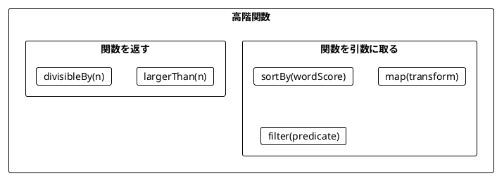

### 4.2 関数を引数として渡す

**ソースファイル**: `app/typescript/src/ch04_higher_order.ts`

#### sortBy - ソート基準を関数で指定

fp-ts の `Ord` を使って型安全にソートできます。

```typescript
import { pipe } from 'fp-ts/function'
import * as RA from 'fp-ts/ReadonlyArray'
import * as Ord from 'fp-ts/Ord'
import * as N from 'fp-ts/number'

const score = (word: string): number => word.replaceAll('a', '').length

// 任意のスコア関数でソート（降順）
const rankedWords = (
  words: readonly string[],
  wordScore: (word: string) => number
): readonly string[] =>
  pipe(
    words,
    RA.sortBy([Ord.reverse(Ord.contramap(wordScore)(N.Ord))])
  )

const words = ['rust', 'java']
const sortedWords = rankedWords(words, score)
// sortedWords === ['rust', 'java']
// rust: 4文字 (r, u, s, t), java: 2文字 (j, v)
```

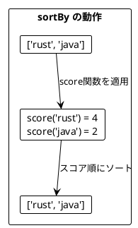

#### map - 各要素を変換

```typescript
const getLengths = (words: readonly string[]): readonly number[] =>
  pipe(
    words,
    RA.map((w) => w.length)
  )

// getLengths(['scala', 'rust', 'ada']) === [5, 4, 3]

const doubleAll = (numbers: readonly number[]): readonly number[] =>
  pipe(
    numbers,
    RA.map((n) => n * 2)
  )

// doubleAll([5, 1, 2, 4, 0]) === [10, 2, 4, 8, 0]
```

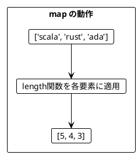

#### filter - 条件に合う要素を抽出

```typescript
const filterOdd = (numbers: readonly number[]): readonly number[] =>
  pipe(
    numbers,
    RA.filter((n) => n % 2 === 1)
  )

// filterOdd([5, 1, 2, 4, 0]) === [5, 1]

const filterLargerThan = (
  numbers: readonly number[],
  threshold: number
): readonly number[] =>
  pipe(
    numbers,
    RA.filter((n) => n > threshold)
  )

// filterLargerThan([5, 1, 2, 4, 0], 4) === [5]
```

#### reduce - 畳み込み

```typescript
const sumAll = (numbers: readonly number[]): number =>
  pipe(
    numbers,
    RA.reduce(0, (acc, n) => acc + n)
  )

// sumAll([5, 1, 2, 4, 100]) === 112

const findMax = (numbers: readonly number[]): number | undefined =>
  pipe(
    numbers,
    RA.reduce(undefined as number | undefined, (max, n) =>
      max === undefined || n > max ? n : max
    )
  )

// findMax([5, 1, 2, 4, 15]) === 15
```

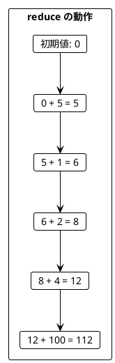

### 4.3 型とインターフェース

**ソースファイル**: `app/typescript/src/ch04_higher_order.ts`

```typescript
interface ProgrammingLanguage {
  readonly name: string
  readonly year: number
}

const createLanguage = (name: string, year: number): ProgrammingLanguage =>
  ({ name, year })

const java = createLanguage('Java', 1995)
const scala = createLanguage('Scala', 2004)
const languages = [java, scala]

// フィールドにアクセス
const getNames = (langs: readonly ProgrammingLanguage[]): readonly string[] =>
  pipe(
    langs,
    RA.map((lang) => lang.name)
  )

// getNames(languages) === ['Java', 'Scala']

// 条件でフィルタ
const filterYoungLanguages = (
  langs: readonly ProgrammingLanguage[],
  afterYear: number
): readonly ProgrammingLanguage[] =>
  pipe(
    langs,
    RA.filter((lang) => lang.year > afterYear)
  )

// filterYoungLanguages(languages, 2000) === [scala]
```

### 4.4 関数を返す関数

**ソースファイル**: `app/typescript/src/ch04_higher_order.ts`

```typescript
const largerThan = (n: number): ((i: number) => boolean) => (i) => i > n

// 使用例
pipe([5, 1, 2, 4, 0], RA.filter(largerThan(4)))
// => [5]

pipe([5, 1, 2, 4, 0], RA.filter(largerThan(1)))
// => [5, 2, 4]
```

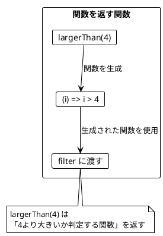

### 4.5 カリー化

カリー化（Currying）は、複数の引数を取る関数を、引数を1つずつ取る関数のチェーンに変換する技法です。

```typescript
// 通常の関数
const largerThanNormal = (n: number, i: number): boolean => i > n

// カリー化された関数
const largerThan = (n: number) => (i: number): boolean => i > n

// 使用例
const isLargerThan4 = largerThan(4)  // 部分適用
isLargerThan4(5)  // => true
isLargerThan4(3)  // => false

// filter に直接渡す
pipe([5, 1, 2, 4, 0], RA.filter(largerThan(4)))
// => [5]
```

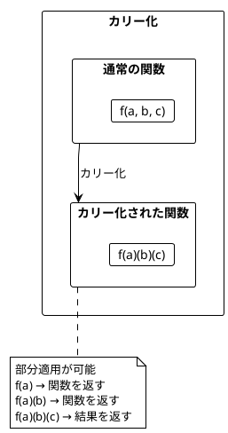

### 4.6 ワードスコアリングの例

**ソースファイル**: `app/typescript/src/ch04_higher_order.ts`

複数のスコアリングロジックを組み合わせる例です。

```typescript
const score = (word: string): number => word.replaceAll('a', '').length
const bonus = (word: string): number => (word.includes('c') ? 5 : 0)
const penalty = (word: string): number => (word.includes('s') ? 7 : 0)

// カリー化された高スコア単語フィルタ
const highScoringWordsWithThreshold =
  (wordScoreFn: (word: string) => number) =>
  (higherThan: number) =>
  (words: readonly string[]): readonly string[] =>
    pipe(
      words,
      RA.filter((word) => wordScoreFn(word) > higherThan)
    )

const words = ['ada', 'haskell', 'scala', 'java', 'rust']
const scorer = highScoringWordsWithThreshold(wordScoreWithBonusAndPenalty)

scorer(1)(words)
// => ['java']

scorer(0)(words)
// => ['ada', 'scala', 'java']
```

---

## 第5章: chain（flatMap）とネスト構造

### 5.1 flatten と flatMap

**ソースファイル**: `app/typescript/src/ch05_flatmap.ts`

#### flatten - ネストしたリストを平坦化

```typescript
import { pipe } from 'fp-ts/function'
import * as RA from 'fp-ts/ReadonlyArray'

interface Book {
  readonly title: string
  readonly authors: readonly string[]
}

const books: readonly Book[] = [
  { title: 'FP in Scala', authors: ['Chiusano', 'Bjarnason'] },
  { title: 'The Hobbit', authors: ['Tolkien'] },
]

// map だけだとネストする
const authorLists = pipe(books, RA.map((book) => book.authors))
// [['Chiusano', 'Bjarnason'], ['Tolkien']]

// flatten で平坦化
const authors = pipe(authorLists, RA.flatten)
// ['Chiusano', 'Bjarnason', 'Tolkien']
```

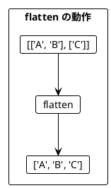

#### chain = map + flatten

fp-ts では `flatMap` は `chain` という名前で提供されています。

```typescript
// map して flatten
const authors1 = pipe(
  books,
  RA.map((book) => book.authors),
  RA.flatten
)

// chain で同じことを1行で
const authors2 = pipe(
  books,
  RA.chain((book) => book.authors)
)

// authors1 === authors2
// ['Chiusano', 'Bjarnason', 'Tolkien']
```

### 5.2 chain によるリストサイズの変化

```typescript
// 要素数が増える
pipe([1, 2, 3], RA.chain((i) => [i, i + 10]))
// [1, 11, 2, 12, 3, 13] - 6要素

// 要素数が同じ
pipe([1, 2, 3], RA.chain((i) => [i * 2]))
// [2, 4, 6] - 3要素

// 要素数が減る（フィルタリング効果）
pipe([1, 2, 3], RA.chain((i) => (i % 2 === 0 ? [i] : [])))
// [2] - 1要素
```

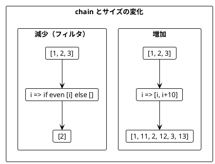

### 5.3 ネストした chain

複数のリストを組み合わせる場合、chain をネストします。

```typescript
interface Book {
  readonly title: string
  readonly authors: readonly string[]
}

interface Movie {
  readonly title: string
}

const bookAdaptations = (author: string): readonly Movie[] => {
  if (author === 'Tolkien') {
    return [
      { title: 'An Unexpected Journey' },
      { title: 'The Desolation of Smaug' },
    ]
  }
  return []
}

const books: readonly Book[] = [
  { title: 'FP in Scala', authors: ['Chiusano', 'Bjarnason'] },
  { title: 'The Hobbit', authors: ['Tolkien'] },
]

// ネストした chain
const recommendations = pipe(
  books,
  RA.chain((book) =>
    pipe(
      book.authors,
      RA.chain((author) =>
        pipe(
          bookAdaptations(author),
          RA.map(
            (movie) =>
              `You may like ${movie.title}, because you liked ${author}'s ${book.title}`
          )
        )
      )
    )
  )
)

// 結果:
// [
//   "You may like An Unexpected Journey, because you liked Tolkien's The Hobbit",
//   "You may like The Desolation of Smaug, because you liked Tolkien's The Hobbit"
// ]
```

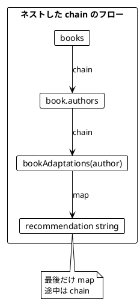

### 5.4 Point の生成例

**ソースファイル**: `app/typescript/src/ch05_flatmap.ts`

```typescript
interface Point {
  readonly x: number
  readonly y: number
}

const createPoint = (x: number, y: number): Point => ({ x, y })

// 全ての (x, y) の組み合わせから Point を生成
const generatePoints = (
  xs: readonly number[],
  ys: readonly number[]
): readonly Point[] =>
  pipe(
    xs,
    RA.chain((x) =>
      pipe(
        ys,
        RA.map((y) => createPoint(x, y))
      )
    )
  )

generatePoints([1], [-2, 7])
// [{ x: 1, y: -2 }, { x: 1, y: 7 }]

generatePoints([1, 2], [-2, 7])
// [{ x: 1, y: -2 }, { x: 1, y: 7 }, { x: 2, y: -2 }, { x: 2, y: 7 }]
```

### 5.5 Option との組み合わせ

**ソースファイル**: `app/typescript/src/ch05_flatmap.ts`

fp-ts の `Option` 型と組み合わせることで、安全なデータ変換ができます。

```typescript
import * as O from 'fp-ts/Option'

// Option のリストから Some の値だけを取り出す
const compactOptions = <T>(options: readonly O.Option<T>[]): readonly T[] =>
  pipe(options, RA.compact)

compactOptions([O.some(1), O.none, O.some(2), O.none, O.some(3)])
// [1, 2, 3]

// filterMap - map と filter を同時に
const filterMapExample = <T, U>(
  func: (item: T) => O.Option<U>,
  lst: readonly T[]
): readonly U[] =>
  pipe(lst, RA.filterMap(func))

filterMapExample(
  (s: string) => (s.length > 2 ? O.some(s.toUpperCase()) : O.none),
  ['a', 'abc', 'de', 'xyz']
)
// ['ABC', 'XYZ']
```

### 5.6 traverse - 効果の反転

**ソースファイル**: `app/typescript/src/ch05_flatmap.ts`

`traverse` は、リストの各要素に `Option` を返す関数を適用し、全てが `Some` なら `Some<配列>` を返し、一つでも `None` なら `None` を返します。

```typescript
const traverseOption = <T, U>(
  func: (item: T) => O.Option<U>,
  lst: readonly T[]
): O.Option<readonly U[]> =>
  pipe(lst, RA.traverse(O.Applicative)(func))

const safeDivide = (n: number): O.Option<number> =>
  n === 0 ? O.none : O.some(10 / n)

traverseOption(safeDivide, [1, 2, 5])
// some([10, 5, 2])

traverseOption(safeDivide, [1, 0, 5])
// none - 0で割る要素があるため全体が失敗
```

### 5.7 円内の点の判定

**ソースファイル**: `app/typescript/src/ch05_flatmap.ts`

chain でフィルタリングも行う例です。

```typescript
interface Point {
  readonly x: number
  readonly y: number
}

const points: readonly Point[] = [
  { x: 5, y: 2 },
  { x: 1, y: 1 },
]
const radiuses = [2, 1]

const isInside = (point: Point, radius: number): boolean =>
  radius * radius >= point.x * point.x + point.y * point.y

// 全組み合わせを生成
const allCombinations = (
  points: readonly Point[],
  radiuses: readonly number[]
): readonly string[] =>
  pipe(
    radiuses,
    RA.chain((r) =>
      pipe(
        points,
        RA.map(
          (point) =>
            `Point(${point.x},${point.y}) is within a radius of ${r}: ${isInside(point, r)}`
        )
      )
    )
  )

// 結果:
// [
//   "Point(5,2) is within a radius of 2: false",
//   "Point(1,1) is within a radius of 2: true",
//   "Point(5,2) is within a radius of 1: false",
//   "Point(1,1) is within a radius of 1: false"
// ]
```

#### chain によるフィルタリング

```typescript
// 円内の点のみを抽出
const insidePoints = (
  points: readonly Point[],
  radiuses: readonly number[]
): readonly string[] =>
  pipe(
    radiuses,
    RA.chain((r) =>
      pipe(
        points,
        RA.filter((point) => isInside(point, r)),
        RA.map(
          (point) => `Point(${point.x},${point.y}) is within a radius of ${r}`
        )
      )
    )
  )

// 結果: ["Point(1,1) is within a radius of 2"]
```

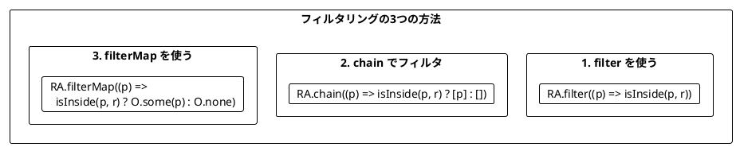

---

## まとめ

### Part II で学んだこと

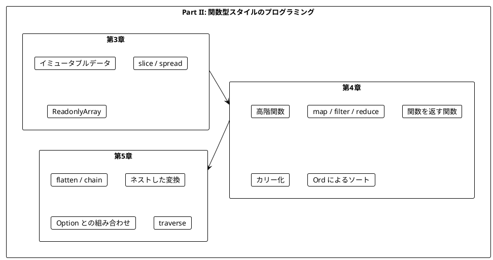

### キーポイント

| 章 | 主要概念 | キー操作 |
|----|----------|----------|
| 第3章 | イミュータブル | `slice`, スプレッド演算子, `readonly` |
| 第4章 | 高階関数 | `RA.map`, `RA.filter`, `RA.reduce`, `RA.sortBy` |
| 第5章 | 平坦化 | `RA.flatten`, `RA.chain`, `RA.traverse` |

### Scala vs TypeScript fp-ts 比較

| Scala | TypeScript (fp-ts) | 説明 |
|-------|-------------------|------|
| `list.appended(x)` | `[...list, x]` | 末尾に追加 |
| `list.slice(a, b)` | `list.slice(a, b)` | スライス |
| `list.map(f)` | `pipe(list, RA.map(f))` | map |
| `list.filter(p)` | `pipe(list, RA.filter(p))` | filter |
| `list.foldLeft(z)(f)` | `pipe(list, RA.reduce(z, f))` | reduce |
| `list.flatMap(f)` | `pipe(list, RA.chain(f))` | flatMap |
| `list.flatten` | `pipe(list, RA.flatten)` | flatten |
| `list.sortBy(f)` | `pipe(list, RA.sortBy([ord]))` | sortBy |

### 重要な法則

1. **イミュータブルデータ**: 元のデータは変更せず、新しいデータを作成する
2. **関数は値**: 関数を引数として渡したり、戻り値として返したりできる
3. **chain パターン**: ネストした構造を平坦化しながら変換する
4. **traverse パターン**: 効果（Option等）を反転させてリスト全体を扱う

### 次のステップ

Part III では、以下のトピックを学びます:

- `Option` 型による安全なエラーハンドリング
- `Either` 型と複合的なエラー処理
- エラー処理のパターン

---

## 演習問題

### 問題 1: イミュータブルな操作

以下の関数を実装してください。リストの中央に要素を挿入する関数です。

```typescript
const insertAtMiddle = <T>(list: readonly T[], element: T): readonly T[] => ???

// 期待される動作
// insertAtMiddle(['a', 'b', 'c', 'd'], 'X') === ['a', 'b', 'X', 'c', 'd']
// insertAtMiddle(['a', 'b'], 'X') === ['a', 'X', 'b']
```

<details>
<summary>解答</summary>

```typescript
const insertAtMiddle = <T>(list: readonly T[], element: T): readonly T[] => {
  const middle = Math.floor(list.length / 2)
  const before = list.slice(0, middle)
  const after = list.slice(middle)
  return [...before, element, ...after]
}
```

</details>

### 問題 2: 高階関数

以下の関数を実装してください。条件を満たす要素の数をカウントする関数です。

```typescript
const countWhere = <T>(
  list: readonly T[],
  predicate: (item: T) => boolean
): number => ???

// 期待される動作
// countWhere([1, 2, 3, 4, 5], (i) => i > 3) === 2
// countWhere(['a', 'bb', 'ccc'], (s) => s.length > 1) === 2
```

<details>
<summary>解答</summary>

```typescript
import { pipe } from 'fp-ts/function'
import * as RA from 'fp-ts/ReadonlyArray'

const countWhere = <T>(
  list: readonly T[],
  predicate: (item: T) => boolean
): number =>
  pipe(
    list,
    RA.filter(predicate),
    (filtered) => filtered.length
  )

// または reduce を使って
const countWhere2 = <T>(
  list: readonly T[],
  predicate: (item: T) => boolean
): number =>
  pipe(
    list,
    RA.reduce(0, (count, elem) => (predicate(elem) ? count + 1 : count))
  )
```

</details>

### 問題 3: chain の活用

以下のネストした配列を chain で平坦化してください。

```typescript
const nested = [[1, 2], [10, 20], [100, 200]]
// それぞれの配列の各要素を足し合わせた全ての組み合わせを生成
// 期待される結果: [111, 211, 121, 221, 112, 212, 122, 222]
```

<details>
<summary>解答</summary>

```typescript
import { pipe } from 'fp-ts/function'
import * as RA from 'fp-ts/ReadonlyArray'

const result = pipe(
  [1, 2],
  RA.chain((x) =>
    pipe(
      [10, 20],
      RA.chain((y) =>
        pipe(
          [100, 200],
          RA.map((z) => x + y + z)
        )
      )
    )
  )
)

// 結果: [111, 211, 121, 221, 112, 212, 122, 222]
```

</details>

### 問題 4: chain によるフィルタリング

filter を使わずに、chain だけで偶数のみを抽出するコードを書いてください。

```typescript
const numbers = [1, 2, 3, 4, 5, 6]
// 偶数のみを抽出: [2, 4, 6]
```

<details>
<summary>解答</summary>

```typescript
import { pipe } from 'fp-ts/function'
import * as RA from 'fp-ts/ReadonlyArray'

const evenNumbers = pipe(
  numbers,
  RA.chain((n) => (n % 2 === 0 ? [n] : []))
)

// または関数に分離
const evenFilter = (n: number): readonly number[] =>
  n % 2 === 0 ? [n] : []

const evenNumbers2 = pipe(numbers, RA.chain(evenFilter))
```

</details>
