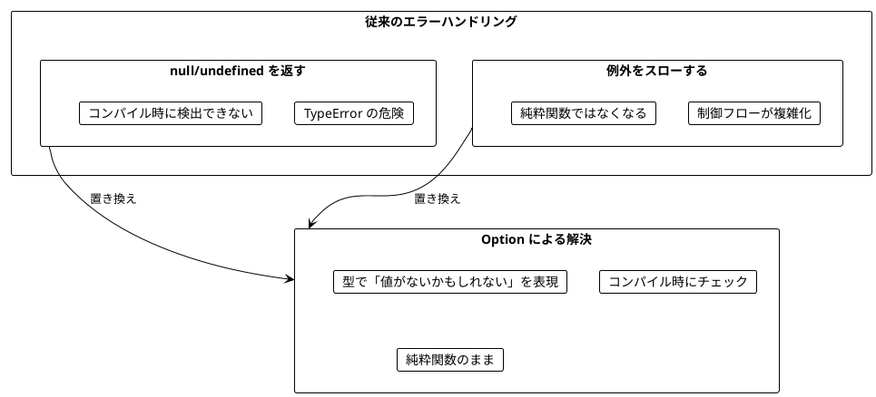
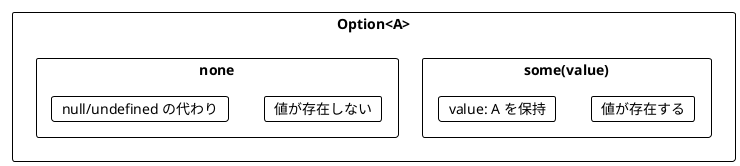
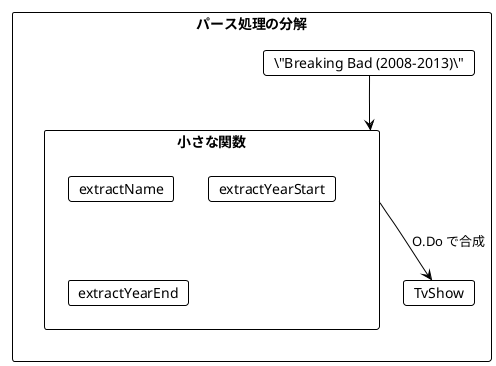
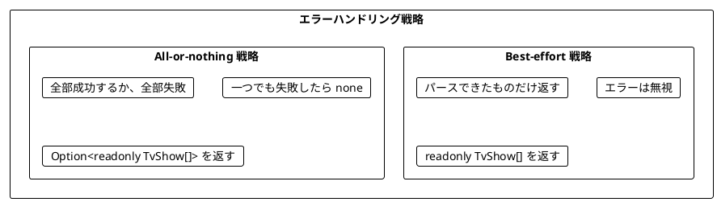
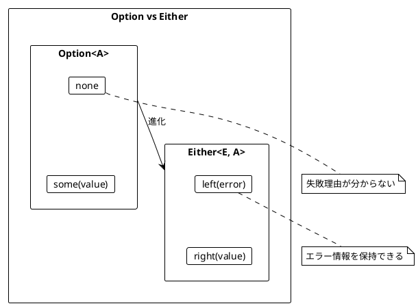
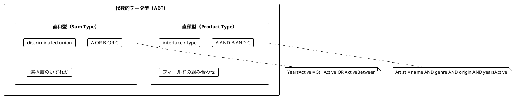
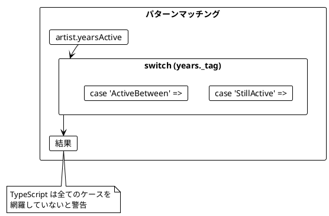
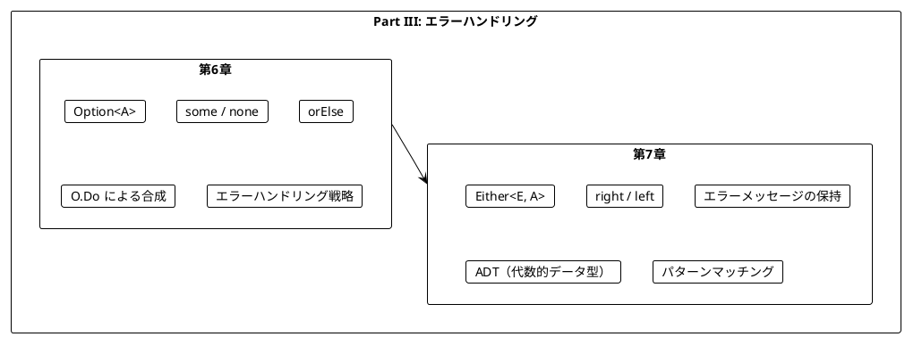

# Part III: エラーハンドリングと Option/Either

本章では、関数型プログラミングにおける安全なエラーハンドリングを学びます。`null` や例外に頼らず、`Option` と `Either` を使って型安全にエラーを扱う方法を習得します。

---

## 第6章: Option 型による安全なエラーハンドリング

### 6.1 なぜ Option が必要か

従来のエラーハンドリングには問題があります。



### 6.2 Option の基本

fp-ts の `Option<A>` は「`A` 型の値があるか、ないか」を表す型です。



**ソースファイル**: `app/typescript/src/ch06_error_handling.ts`

```typescript
import * as O from 'fp-ts/Option'

// 安全な除算
const safeDivide = (a: number, b: number): O.Option<number> =>
  b === 0 ? O.none : O.some(Math.floor(a / b))

safeDivide(10, 2)  // some(5)
safeDivide(10, 0)  // none

// 文字列を数値にパース
const parseNumber = (s: string): O.Option<number> => {
  const n = parseInt(s, 10)
  return isNaN(n) ? O.none : O.some(n)
}

parseNumber("42")   // some(42)
parseNumber("abc")  // none
```

### 6.3 TV番組のパース例

TV番組の文字列をパースする例で Option の使い方を学びます。

```typescript
interface TvShow {
  readonly title: string
  readonly start: number
  readonly end: number
}

// 入力例: "Breaking Bad (2008-2013)"
// 期待する出力: { title: "Breaking Bad", start: 2008, end: 2013 }
```

#### 例外を使う方法（問題あり）

```typescript
// 問題のあるコード - 例外がスローされる可能性
const parseShowUnsafe = (rawShow: string): TvShow => {
  const bracketOpen = rawShow.indexOf('(')
  const bracketClose = rawShow.indexOf(')')
  const dash = rawShow.indexOf('-')

  const name = rawShow.substring(0, bracketOpen).trim()
  const yearStart = parseInt(rawShow.substring(bracketOpen + 1, dash))
  const yearEnd = parseInt(rawShow.substring(dash + 1, bracketClose))

  return { title: name, start: yearStart, end: yearEnd }
}

// 無効な入力で NaN やおかしな結果になる
```

#### Option を使う方法

```typescript
import { pipe } from 'fp-ts/function'
import * as O from 'fp-ts/Option'

const parseShow = (rawShow: string): O.Option<TvShow> =>
  pipe(
    O.Do,
    O.bind('title', () => extractName(rawShow)),
    O.bind('start', () =>
      pipe(
        extractYearStart(rawShow),
        O.orElse(() => extractSingleYear(rawShow))
      )
    ),
    O.bind('end', () =>
      pipe(
        extractYearEnd(rawShow),
        O.orElse(() => extractSingleYear(rawShow))
      )
    ),
    O.map(({ title, start, end }) => ({ title, start, end }))
  )

// 正常ケース
parseShow("Breaking Bad (2008-2013)")
// some({ title: "Breaking Bad", start: 2008, end: 2013 })

// 異常ケース → none が返される（例外なし）
parseShow("The Wire 2002-2008")  // none
```

### 6.4 小さな関数から組み立てる

複雑なパース処理を小さな関数に分解します。

```typescript
// 名前を抽出
const extractName = (rawShow: string): O.Option<string> => {
  const bracketOpen = rawShow.indexOf('(')
  if (bracketOpen > 0) {
    return O.some(rawShow.substring(0, bracketOpen).trim())
  }
  return O.none
}

// 開始年を抽出
const extractYearStart = (rawShow: string): O.Option<number> => {
  const bracketOpen = rawShow.indexOf('(')
  const dash = rawShow.indexOf('-')
  if (bracketOpen !== -1 && dash > bracketOpen + 1) {
    const yearStr = rawShow.substring(bracketOpen + 1, dash)
    return parseNumber(yearStr)
  }
  return O.none
}

// 単年を抽出（"Chernobyl (2019)" のような形式用）
const extractSingleYear = (rawShow: string): O.Option<number> => {
  const dash = rawShow.indexOf('-')
  const bracketOpen = rawShow.indexOf('(')
  const bracketClose = rawShow.indexOf(')')
  if (dash === -1 && bracketOpen !== -1 && bracketClose > bracketOpen + 1) {
    const yearStr = rawShow.substring(bracketOpen + 1, bracketClose)
    return parseNumber(yearStr)
  }
  return O.none
}
```



### 6.5 orElse によるフォールバック

`orElse` を使って、最初の Option が `none` の場合に代替を試すことができます。

```typescript
const seven: O.Option<number> = O.some(7)
const eight: O.Option<number> = O.some(8)
const none: O.Option<number> = O.none

pipe(seven, O.orElse(() => eight))  // some(7) - 最初が some なのでそのまま
pipe(none, O.orElse(() => eight))   // some(8) - 最初が none なので代替を使用
```

#### 単年の番組に対応する

```typescript
// これで単年の番組もパースできる
parseShow("Chernobyl (2019)")
// some({ title: "Chernobyl", start: 2019, end: 2019 })
```

### 6.6 Option の主要メソッド

| メソッド | 説明 | 例 |
|----------|------|-----|
| `O.map` | 値があれば変換 | `pipe(O.some(5), O.map(x => x * 2))` → `some(10)` |
| `O.chain` | 値があれば Option を返す関数を適用 | `pipe(O.some(5), O.chain(x => O.some(x * 2)))` → `some(10)` |
| `O.filter` | 条件を満たさなければ none | `pipe(O.some(5), O.filter(x => x > 10))` → `none` |
| `O.orElse` | none なら代替を使用 | `pipe(O.none, O.orElse(() => O.some(5)))` → `some(5)` |
| `O.getOrElse` | none ならデフォルト値 | `pipe(O.none, O.getOrElse(() => 0))` → `0` |

```typescript
const year: O.Option<number> = O.some(996)
const noYear: O.Option<number> = O.none

// map
pipe(year, O.map(y => y * 2))    // some(1992)
pipe(noYear, O.map(y => y * 2))  // none

// chain
pipe(year, O.chain(y => O.some(y * 2)))  // some(1992)

// filter
pipe(year, O.filter(y => y < 2020))  // some(996)
pipe(year, O.filter(y => y > 2020))  // none

// getOrElse
pipe(year, O.getOrElse(() => 2020))    // 996
pipe(noYear, O.getOrElse(() => 2020))  // 2020
```

### 6.7 エラーハンドリング戦略

複数の要素をパースする場合、2つの戦略があります。



#### Best-effort 戦略

```typescript
import * as RA from 'fp-ts/ReadonlyArray'

const parseShowsBestEffort = (
  rawShows: readonly string[]
): readonly TvShow[] =>
  pipe(
    rawShows,
    RA.map(parseShow),
    RA.compact  // none を除去して some の値だけを抽出
  )

const rawShows = [
  "Breaking Bad (2008-2013)",
  "The Wire 2002 2008",        // 無効な形式
  "Mad Men (2007-2015)"
]

parseShowsBestEffort(rawShows)
// [TvShow("Breaking Bad", ...), TvShow("Mad Men", ...)]
// 無効なものは無視される
```

#### All-or-nothing 戦略

```typescript
const parseShowsAllOrNothing = (
  rawShows: readonly string[]
): O.Option<readonly TvShow[]> =>
  pipe(rawShows, RA.traverse(O.Applicative)(parseShow))

// 全部成功 → some([...])
parseShowsAllOrNothing(["Breaking Bad (2008-2013)", "Mad Men (2007-2015)"])
// some([TvShow(...), TvShow(...)])

// 一つでも失敗 → none
parseShowsAllOrNothing(["Breaking Bad (2008-2013)", "Invalid"])
// none
```

---

## 第7章: Either 型と複合的なエラー処理

### 7.1 Option の限界

`Option` は「値があるかないか」しか表現できません。**なぜ失敗したのか**を伝えられません。



### 7.2 Either の基本

**ソースファイル**: `app/typescript/src/ch07_either.ts`

`Either<E, A>` は「`E` 型のエラーか、`A` 型の成功値か」を表す型です。

- `right(value)`: 成功（慣例的に「正しい」= right）
- `left(error)`: 失敗（エラー情報を保持）

```typescript
import * as E from 'fp-ts/Either'

const safeDivideE = (a: number, b: number): E.Either<string, number> =>
  b === 0 ? E.left('Division by zero') : E.right(Math.floor(a / b))

safeDivideE(10, 2)  // right(5)
safeDivideE(10, 0)  // left("Division by zero")

const parseNumberE = (s: string): E.Either<string, number> => {
  const n = parseInt(s, 10)
  return isNaN(n) ? E.left(`Cannot parse '${s}' as number`) : E.right(n)
}

parseNumberE("42")   // right(42)
parseNumberE("abc")  // left("Cannot parse 'abc' as number")
```

### 7.3 Either を使ったパース

```typescript
const extractNameE = (rawShow: string): E.Either<string, string> => {
  const bracketOpen = rawShow.indexOf('(')
  if (bracketOpen > 0) {
    return E.right(rawShow.substring(0, bracketOpen).trim())
  }
  return E.left(`Can't extract name from ${rawShow}`)
}

extractNameE("The Wire (2002-2008)")  // right("The Wire")
extractNameE("(2022)")                // left("Can't extract name from (2022)")
```

### 7.4 Option から Either への変換

`E.fromOption` で `Option` を `Either` に変換できます。

```typescript
const optionToEither = <E, A>(
  opt: O.Option<A>,
  errorValue: E
): E.Either<E, A> =>
  pipe(opt, E.fromOption(() => errorValue))

optionToEither(O.some(5), "no value")  // right(5)
optionToEither(O.none, "no value")     // left("no value")
```

### 7.5 代数的データ型（ADT）

TypeScript では **discriminated union**（タグ付きユニオン）を使って ADT を表現します。

#### 直和型（Sum Type）

複数の選択肢を **OR** で表す型です。

```typescript
// 活動期間を表す直和型
type YearsActive =
  | { readonly _tag: 'StillActive'; readonly since: number }
  | { readonly _tag: 'ActiveBetween'; readonly start: number; readonly end: number }

// コンストラクタ関数
const stillActive = (since: number): YearsActive => ({
  _tag: 'StillActive',
  since,
})

const activeBetween = (start: number, end: number): YearsActive => ({
  _tag: 'ActiveBetween',
  start,
  end,
})

// 音楽ジャンルを表す直和型
type MusicGenre = 'HeavyMetal' | 'Pop' | 'HardRock' | 'Grunge'
```

#### 直積型（Product Type）

複数のフィールドを **AND** で組み合わせる型です。

```typescript
interface Artist {
  readonly name: string
  readonly genre: MusicGenre
  readonly origin: Location
  readonly yearsActive: YearsActive
}

const metallica = createArtist('Metallica', 'HeavyMetal', 'US', stillActive(1981))
const ledZeppelin = createArtist('Led Zeppelin', 'HardRock', 'England', activeBetween(1968, 1980))
```



### 7.6 パターンマッチング

TypeScript では `switch` 文と `_tag` プロパティで安全にパターンマッチングができます。

```typescript
const wasArtistActive = (
  artist: Artist,
  yearStart: number,
  yearEnd: number
): boolean => {
  const years = artist.yearsActive
  switch (years._tag) {
    case 'StillActive':
      return years.since <= yearEnd
    case 'ActiveBetween':
      return years.start <= yearEnd && years.end >= yearStart
  }
}

const activeLength = (artist: Artist, currentYear: number): number => {
  const years = artist.yearsActive
  switch (years._tag) {
    case 'StillActive':
      return currentYear - years.since
    case 'ActiveBetween':
      return years.end - years.start
  }
}
```



### 7.7 検索条件のモデリング

検索条件も ADT でモデリングできます。

```typescript
type SearchCondition =
  | { readonly _tag: 'SearchByGenre'; readonly genres: readonly MusicGenre[] }
  | { readonly _tag: 'SearchByOrigin'; readonly locations: readonly Location[] }
  | { readonly _tag: 'SearchByActiveYears'; readonly start: number; readonly end: number }

const searchArtists = (
  artists: readonly Artist[],
  conditions: readonly SearchCondition[]
): readonly Artist[] =>
  pipe(
    artists,
    RA.filter((artist) =>
      conditions.every((condition) => matchesCondition(artist, condition))
    )
  )

// 使用例
searchArtists(artists, [
  searchByGenre(['HeavyMetal']),
  searchByOrigin(['US'])
])
```

### 7.8 Either を使ったバリデーション

```typescript
const validateAge = (age: number): E.Either<string, number> => {
  if (age < 0) return E.left('Age cannot be negative')
  if (age > 150) return E.left('Age cannot be greater than 150')
  return E.right(age)
}

const validateUsername = (username: string): E.Either<string, string> => {
  if (username.length === 0) return E.left('Username cannot be empty')
  if (username.length < 3) return E.left('Username must be at least 3 characters')
  return E.right(username)
}

// 複数のバリデーションを組み合わせる
const validateUser = (
  username: string,
  email: string,
  age: number
): E.Either<string, User> =>
  pipe(
    E.Do,
    E.bind('username', () => validateUsername(username)),
    E.bind('email', () => validateEmail(email)),
    E.bind('age', () => validateAge(age))
  )

validateUser('alice', 'alice@example.com', 25)
// right({ username: 'alice', email: 'alice@example.com', age: 25 })

validateUser('', 'alice@example.com', 25)
// left('Username cannot be empty')
```

### 7.9 支払い方法の例（ADT）

```typescript
type PaymentMethod =
  | { readonly _tag: 'CreditCard'; readonly number: string; readonly expiry: string }
  | { readonly _tag: 'BankTransfer'; readonly accountNumber: string }
  | { readonly _tag: 'Cash' }

const describePayment = (method: PaymentMethod): string => {
  switch (method._tag) {
    case 'CreditCard':
      return `Credit card ending in ${method.number}`
    case 'BankTransfer':
      return `Bank transfer to account ${method.accountNumber}`
    case 'Cash':
      return 'Cash payment'
  }
}

describePayment(creditCard('1234', '12/25'))
// "Credit card ending in 1234"
```

---

## まとめ

### Part III で学んだこと



### Option vs Either の使い分け

| 状況 | 使用する型 |
|------|------------|
| 値があるかないかだけが重要 | `Option<A>` |
| 失敗理由を伝える必要がある | `Either<E, A>` |
| 検索結果が見つからない | `Option<A>` |
| バリデーションエラーを伝える | `Either<string, A>` |
| 複数のエラー種別がある | `Either<ErrorType, A>` |

### Scala vs TypeScript fp-ts 比較

| Scala | TypeScript (fp-ts) | 説明 |
|-------|-------------------|------|
| `Some(value)` | `O.some(value)` | Option の some |
| `None` | `O.none` | Option の none |
| `Right(value)` | `E.right(value)` | Either の right |
| `Left(error)` | `E.left(error)` | Either の left |
| `option.map(f)` | `pipe(option, O.map(f))` | Option の map |
| `either.flatMap(f)` | `pipe(either, E.chain(f))` | Either の flatMap |
| `option.toRight(error)` | `E.fromOption(() => error)(option)` | Option → Either |
| `enum` | discriminated union | 直和型 |
| `case class` | `interface` | 直積型 |
| `match { case ... }` | `switch (x._tag)` | パターンマッチング |

### キーポイント

1. **Option**: 値の有無を型で表現する
2. **Either**: 成功/失敗とエラー情報を型で表現する
3. **O.Do / E.Do**: Option/Either を組み合わせて使う
4. **orElse**: フォールバックを提供する
5. **ADT**: 直積型と直和型でドメインを正確にモデリング
6. **discriminated union**: TypeScript で直和型を表現する方法
7. **パターンマッチング**: switch と _tag で安全に処理する

### 次のステップ

Part IV では、以下のトピックを学びます:

- IO モナドの導入
- 副作用の管理
- Task による非同期処理

---

## 演習問題

### 問題 1: Option の基本

以下の関数を実装してください。

```typescript
const safeDivide = (a: number, b: number): O.Option<number> => ???

// 期待される動作
// safeDivide(10, 2) === some(5)
// safeDivide(10, 0) === none
// safeDivide(7, 2) === some(3)
```

<details>
<summary>解答</summary>

```typescript
import * as O from 'fp-ts/Option'

const safeDivide = (a: number, b: number): O.Option<number> =>
  b === 0 ? O.none : O.some(Math.floor(a / b))
```

</details>

### 問題 2: Option の合成

以下の関数を実装してください。2つの数値文字列を受け取り、その合計を返します。

```typescript
const addStrings = (a: string, b: string): O.Option<number> => ???

// 期待される動作
// addStrings("10", "20") === some(30)
// addStrings("10", "abc") === none
// addStrings("xyz", "20") === none
```

<details>
<summary>解答</summary>

```typescript
import { pipe } from 'fp-ts/function'
import * as O from 'fp-ts/Option'

const addStrings = (a: string, b: string): O.Option<number> =>
  pipe(
    O.Do,
    O.bind('x', () => parseNumber(a)),
    O.bind('y', () => parseNumber(b)),
    O.map(({ x, y }) => x + y)
  )
```

</details>

### 問題 3: Either によるバリデーション

以下の関数を実装してください。年齢を検証し、エラーメッセージを返します。

```typescript
const validateAge = (age: number): E.Either<string, number> => ???

// 期待される動作
// validateAge(25) === right(25)
// validateAge(-5) === left("Age cannot be negative")
// validateAge(200) === left("Age cannot be greater than 150")
```

<details>
<summary>解答</summary>

```typescript
import * as E from 'fp-ts/Either'

const validateAge = (age: number): E.Either<string, number> => {
  if (age < 0) return E.left('Age cannot be negative')
  if (age > 150) return E.left('Age cannot be greater than 150')
  return E.right(age)
}
```

</details>

### 問題 4: パターンマッチング

以下の discriminated union とパターンマッチングを使った関数を実装してください。

```typescript
type PaymentMethod =
  | { readonly _tag: 'CreditCard'; readonly number: string; readonly expiry: string }
  | { readonly _tag: 'BankTransfer'; readonly accountNumber: string }
  | { readonly _tag: 'Cash' }

const describePayment = (method: PaymentMethod): string => ???

// 期待される動作
// describePayment(creditCard("1234", "12/25")) === "Credit card ending in 1234"
// describePayment(bankTransfer("9876")) === "Bank transfer to account 9876"
// describePayment(cash()) === "Cash payment"
```

<details>
<summary>解答</summary>

```typescript
const describePayment = (method: PaymentMethod): string => {
  switch (method._tag) {
    case 'CreditCard':
      return `Credit card ending in ${method.number}`
    case 'BankTransfer':
      return `Bank transfer to account ${method.accountNumber}`
    case 'Cash':
      return 'Cash payment'
  }
}
```

</details>
