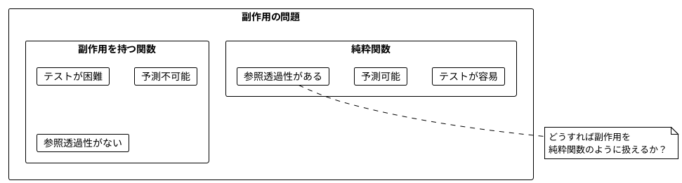
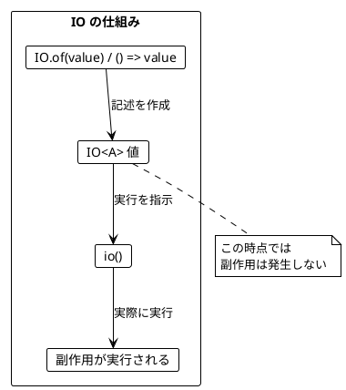
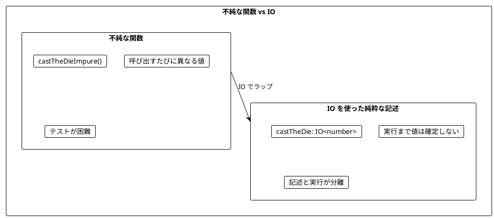
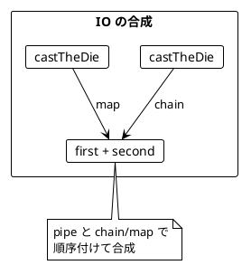
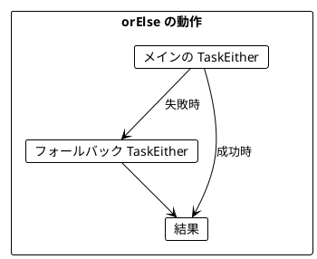
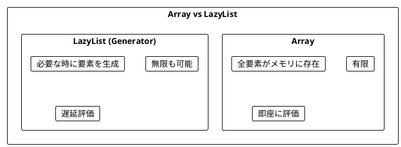
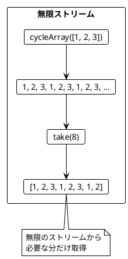
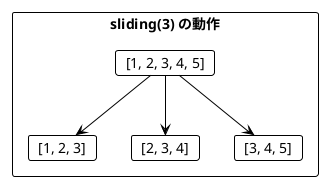
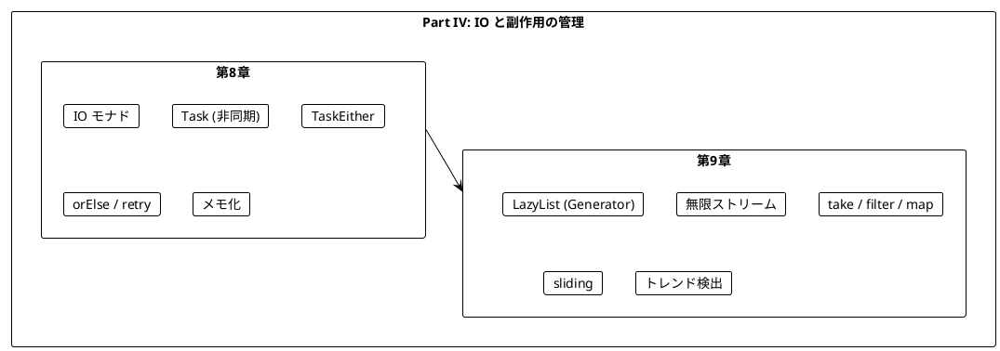

# Part IV: IO と副作用の管理

本章では、関数型プログラミングにおける副作用の扱い方を学びます。IO モナドを使って副作用を純粋関数内で安全に記述し、ストリーム処理で無限のデータを扱う方法を習得します。

---

## 第8章: IO モナドの導入

### 8.1 副作用の問題

純粋関数は副作用を持ちません。しかし、実際のプログラムには副作用が必要です:

- ファイルの読み書き
- ネットワーク通信
- データベースアクセス
- 乱数生成
- 現在時刻の取得



### 8.2 IO モナドとは

**IO モナド**は「副作用を持つ計算の**記述**」を表す型です。

fp-ts では:
- `IO<A>` は「実行すると `A` 型の値を返す同期的な副作用のある計算」
- `Task<A>` は「実行すると `Promise<A>` を返す非同期的な副作用のある計算」
- IO/Task 値を作成しただけでは副作用は発生しない
- `()` で実行すると副作用が発生する



### 8.3 IO の基本

**ソースファイル**: `app/typescript/src/ch08_io.ts`

```typescript
import * as IO from 'fp-ts/IO'

// 純粋な値を IO にラップする
const pureIO = <A>(a: A): IO.IO<A> => IO.of(a)

const io = pureIO(42)
io() // => 42

// 副作用のある計算を IO にラップする
const delayIO = <A>(thunk: () => A): IO.IO<A> => thunk

const log = delayIO(() => console.log("Hello"))
// この時点では何も出力されない
log() // => "Hello" が出力される
```

#### 現在時刻と乱数

```typescript
// 現在時刻を取得する IO
const getCurrentTime: IO.IO<number> = () => Date.now()

// 乱数を生成する IO
const getRandomNumber: IO.IO<number> = () => Math.random()
```

### 8.4 サイコロを振る例



```typescript
// 不純な関数（副作用あり）- 直接乱数を返す
const castTheDieImpure = (): number => Math.floor(Math.random() * 6) + 1

castTheDieImpure() // 3
castTheDieImpure() // 5
castTheDieImpure() // 1

// IO を使った純粋な記述
const castTheDie: IO.IO<number> = () => castTheDieImpure()

// まだ実行されていない
const dieCast = castTheDie
console.log(dieCast) // [Function]

// 実行
dieCast() // 4
```

### 8.5 IO の合成

IO 値は `map` と `chain`（flatMap）で合成できます。

```typescript
import { pipe } from 'fp-ts/function'
import * as IO from 'fp-ts/IO'

// サイコロを2回振って合計を返す
const castTheDieTwice: IO.IO<number> = pipe(
  castTheDie,
  IO.chain((first) =>
    pipe(
      castTheDie,
      IO.map((second) => first + second)
    )
  )
)

// まだ実行されていない
const program = castTheDieTwice

// 実行
const result = program() // 2-12 のランダムな値
```



#### サイコロを n 回振る

```typescript
import * as RA from 'fp-ts/ReadonlyArray'

const castTheDieNTimes = (n: number): IO.IO<number> => {
  if (n <= 0) return IO.of(0)
  const casts = RA.replicate(n, castTheDie)
  return pipe(
    casts,
    IO.sequenceArray,
    IO.map(RA.reduce(0, (acc, val) => acc + val))
  )
}

const threeRolls = castTheDieNTimes(3)
threeRolls() // 3-18 のランダムな値
```

### 8.6 Task（非同期 IO）

`Task<A>` は非同期版の IO です。実行すると `Promise<A>` を返します。

```typescript
import * as T from 'fp-ts/Task'

// 純粋な値を Task にラップする
const pureTask = <A>(a: A): T.Task<A> => T.of(a)

const task = pureTask(42)
await task() // => 42

// 指定ミリ秒後に値を返す Task
const delayedTask = <A>(ms: number, value: A): T.Task<A> =>
  () => new Promise((resolve) => setTimeout(() => resolve(value), ms))

const delayed = delayedTask(1000, "Hello")
await delayed() // 1秒後に "Hello"
```

### 8.7 TaskEither（非同期 + エラーハンドリング）

`TaskEither<E, A>` は「実行すると `Promise<Either<E, A>>` を返す非同期計算」です。

```typescript
import * as TE from 'fp-ts/TaskEither'

// 成功値を TaskEither にラップする
const rightTask = <E, A>(a: A): TE.TaskEither<E, A> => TE.right(a)

// エラー値を TaskEither にラップする
const leftTask = <E, A>(e: E): TE.TaskEither<E, A> => TE.left(e)

// Promise を TaskEither に変換する
const fromPromise = <E, A>(
  promise: () => Promise<A>,
  onRejected: (reason: unknown) => E
): TE.TaskEither<E, A> => TE.tryCatch(promise, onRejected)

const fetchData = fromPromise(
  () => fetch('/api/data').then(r => r.json()),
  (e) => `Fetch error: ${e}`
)
```

### 8.8 ミーティングスケジューリングの例

より実践的な例として、ミーティングのスケジューリングを見てみましょう。

```typescript
interface MeetingTime {
  readonly startHour: number
  readonly endHour: number
}

const createMeetingTime = (
  startHour: number,
  endHour: number
): MeetingTime => ({ startHour, endHour })

// 2つのミーティングが重複しているかを判定する（純粋関数）
const meetingsOverlap = (
  meeting1: MeetingTime,
  meeting2: MeetingTime
): boolean =>
  meeting1.startHour < meeting2.endHour &&
  meeting2.startHour < meeting1.endHour
```

#### 空き時間の計算（純粋関数）

```typescript
const possibleMeetings = (
  existingMeetings: readonly MeetingTime[],
  startHour: number,
  endHour: number,
  lengthHours: number
): readonly MeetingTime[] => {
  const slots = pipe(
    RA.makeBy(endHour - lengthHours - startHour + 1, (i) => startHour + i),
    RA.map((start) => createMeetingTime(start, start + lengthHours))
  )
  return pipe(
    slots,
    RA.filter((slot) =>
      existingMeetings.every((meeting) => !meetingsOverlap(meeting, slot))
    )
  )
}

const existing = [createMeetingTime(9, 10), createMeetingTime(14, 15)]
possibleMeetings(existing, 8, 17, 1)
// => 8-9, 10-11, 11-12, 12-13, 13-14, 15-16, 16-17
```

#### API 呼び出しを TaskEither でラップ

```typescript
// API からカレンダーエントリを取得（シミュレーション）
const calendarEntriesApi = (
  name: string
): TE.TaskEither<string, readonly MeetingTime[]> => {
  const mockData: Record<string, readonly MeetingTime[]> = {
    Alice: [createMeetingTime(9, 10), createMeetingTime(14, 15)],
    Bob: [createMeetingTime(10, 11), createMeetingTime(15, 16)],
  }
  return name in mockData
    ? TE.right(mockData[name])
    : TE.left(`Calendar not found for ${name}`)
}

// 複数の参加者の予定を取得して結合
const scheduledMeetings = (
  attendees: readonly string[]
): TE.TaskEither<string, readonly MeetingTime[]> =>
  pipe(
    attendees,
    RA.traverse(TE.ApplicativeSeq)(calendarEntriesApi),
    TE.map(RA.flatten)
  )
```

### 8.9 orElse によるエラーハンドリング

TaskEither の `orElse` メソッドで、失敗時のフォールバックを指定できます。

```typescript
const orElseTE = <E, A>(
  te: TE.TaskEither<E, A>,
  alternative: (e: E) => TE.TaskEither<E, A>
): TE.TaskEither<E, A> => pipe(te, TE.orElse(alternative))

const year = rightTask<string, number>(996)
const noYear = leftTask<string, number>("no year")

await pipe(year, TE.orElse(() => rightTask(2020)))()    // right(996)
await pipe(noYear, TE.orElse(() => rightTask(2020)))()  // right(2020)
```



#### リトライ戦略

```typescript
// リトライ関数。指定回数まで再試行する
const retry = <E, A>(
  action: TE.TaskEither<E, A>,
  maxRetries: number
): TE.TaskEither<E, A> => {
  if (maxRetries <= 0) return action
  return pipe(
    action,
    TE.orElse(() => retry(action, maxRetries - 1))
  )
}

// リトライしてもダメならデフォルト値を返す
const retryWithDefault = <E, A>(
  action: TE.TaskEither<E, A>,
  maxRetries: number,
  defaultValue: A
): T.Task<A> =>
  pipe(
    retry(action, maxRetries),
    TE.getOrElse(() => T.of(defaultValue))
  )

// 使用例
const result = await retryWithDefault(
  calendarEntriesApi("Unknown"),
  3,
  []
)() // => []
```

### 8.10 IO のユーティリティ

```typescript
// 値をコンソールに出力する IO
const consoleLog = (message: string): IO.IO<void> => () =>
  console.log(message)

// メッセージを出力して同じ値を返す IO（デバッグ用）
const printAndReturn = (message: string): IO.IO<string> => () => {
  console.log(message)
  return message
}

// 複数の IO を順番に実行し、最後の結果を返す
const chainAll = <A>(...ios: readonly IO.IO<A>[]): IO.IO<A> => {
  if (ios.length === 0) throw new Error('At least one IO required')
  return ios.reduce((acc, io) =>
    pipe(acc, IO.chain(() => io))
  )
}
```

### 8.11 IOEither

`IOEither` は同期的だがエラーを返す可能性のある計算を表します。

```typescript
type IOEither<E, A> = IO.IO<E.Either<E, A>>

// 例外をスローする可能性のある関数を IOEither にラップする
const tryCatchIO = <E, A>(
  thunk: () => A,
  onThrow: (error: unknown) => E
): IOEither<E, A> => () => {
  try {
    return E.right(thunk())
  } catch (e) {
    return E.left(onThrow(e))
  }
}

const parseJson = tryCatchIO(
  () => JSON.parse('{"a": 1}'),
  (e) => `Parse error: ${e}`
)
parseJson() // right({ a: 1 })

const parseInvalid = tryCatchIO(
  () => JSON.parse('invalid'),
  (e) => `Parse error: ${e}`
)
parseInvalid() // left("Parse error: ...")
```

### 8.12 メモ化

IO の結果をキャッシュして、2回目以降は同じ値を返すようにできます。

```typescript
import * as O from 'fp-ts/Option'

const memoizeIO = <A>(io: IO.IO<A>): IO.IO<A> => {
  let cached: O.Option<A> = O.none
  return () =>
    pipe(
      cached,
      O.getOrElse(() => {
        const result = io()
        cached = O.some(result)
        return result
      })
    )
}

let count = 0
const io = memoizeIO(() => { count++; return count })
io() // => 1
io() // => 1 (キャッシュされた値)
io() // => 1
```

---

## 第9章: ストリーム処理

### 9.1 ストリームとは

**ストリーム**は、要素の（潜在的に無限の）シーケンスを表します。TypeScript では Generator 関数を使って実装します。



### 9.2 LazyList の基本

**ソースファイル**: `app/typescript/src/ch09_streams.ts`

```typescript
// LazyList は Generator を使って表現
type LazyList<A> = Generator<A, void, undefined>

// 配列から LazyList を作成
function* fromArray<A>(arr: readonly A[]): LazyList<A> {
  for (const item of arr) {
    yield item
  }
}

const list = fromArray([1, 2, 3])
[...list] // => [1, 2, 3]

// 範囲から LazyList を作成
function* range(start: number, end: number): LazyList<number> {
  for (let i = start; i < end; i++) {
    yield i
  }
}

[...range(1, 5)] // => [1, 2, 3, 4]
```

### 9.3 無限ストリーム

```typescript
// 値を無限に繰り返すストリーム
function* repeatValue<A>(value: A): LazyList<A> {
  while (true) {
    yield value
  }
}

// 配列を無限に繰り返すストリーム
function* cycleArray<A>(arr: readonly A[]): LazyList<A> {
  if (arr.length === 0) return
  while (true) {
    for (const item of arr) {
      yield item
    }
  }
}

// 初期値と生成関数から無限ストリームを作成（unfold）
function* iterate<A>(initial: A, fn: (a: A) => A): LazyList<A> {
  let current = initial
  while (true) {
    yield current
    current = fn(current)
  }
}

const powers = iterate(1, n => n * 2)
take(powers, 5) // => [1, 2, 4, 8, 16]
```



### 9.4 ストリームの主要操作

| 操作 | 説明 | 例 |
|------|------|-----|
| `take(n)` | 最初の n 要素を取得 | `take(stream, 3)` |
| `drop(n)` | 最初の n 要素をスキップ | `drop(stream, 2)` |
| `filter(p)` | 条件を満たす要素のみ | `filterStream(stream, x => x > 0)` |
| `map(f)` | 各要素を変換 | `mapStream(stream, x => x * 2)` |
| `takeWhile(p)` | 条件を満たす間取得 | `takeWhile(stream, x => x < 10)` |
| `sliding(n)` | スライディングウィンドウ | `sliding(stream, 3)` |

```typescript
// 最初の n 要素を取得
const take = <A>(gen: LazyList<A>, n: number): readonly A[] => {
  const result: A[] = []
  let count = 0
  for (const item of gen) {
    if (count >= n) break
    result.push(item)
    count++
  }
  return result
}

// 各要素を変換
function* mapStream<A, B>(
  gen: LazyList<A>,
  fn: (a: A) => B
): LazyList<B> {
  for (const item of gen) {
    yield fn(item)
  }
}

// 条件を満たす要素のみ
function* filterStream<A>(
  gen: LazyList<A>,
  predicate: (a: A) => boolean
): LazyList<A> {
  for (const item of gen) {
    if (predicate(item)) {
      yield item
    }
  }
}
```

### 9.5 ストリームの結合

```typescript
// 2つのストリームを結合
function* append<A>(gen1: LazyList<A>, gen2: LazyList<A>): LazyList<A> {
  yield* gen1
  yield* gen2
}

// 2つのストリームをペアにして結合
function* zipStream<A, B>(
  gen1: LazyList<A>,
  gen2: LazyList<B>
): LazyList<readonly [A, B]> {
  const iter1 = gen1[Symbol.iterator]()
  const iter2 = gen2[Symbol.iterator]()
  while (true) {
    const next1 = iter1.next()
    const next2 = iter2.next()
    if (next1.done || next2.done) break
    yield [next1.value, next2.value] as const
  }
}

const list1 = fromArray([1, 2, 3])
const list2 = fromArray(['a', 'b', 'c'])
[...zipStream(list1, list2)] // => [[1, 'a'], [2, 'b'], [3, 'c']]
```

### 9.6 スライディングウィンドウ

`sliding` で連続する要素をグループ化できます。

```typescript
function* sliding<A>(
  gen: LazyList<A>,
  windowSize: number
): LazyList<readonly A[]> {
  const buffer: A[] = []
  for (const item of gen) {
    buffer.push(item)
    if (buffer.length === windowSize) {
      yield [...buffer]
      buffer.shift()
    }
  }
}

const stream = fromArray([1, 2, 3, 4, 5])
[...sliding(stream, 3)]
// => [[1, 2, 3], [2, 3, 4], [3, 4, 5]]
```



### 9.7 トレンド検出（為替レートの例）

為替レートを監視して、上昇トレンドを検出する例です。

#### トレンド判定（純粋関数）

```typescript
const trending = (rates: readonly number[]): boolean => {
  if (rates.length <= 1) return false
  const prev = RA.dropRight(1)(rates)
  const curr = RA.dropLeft(1)(rates)
  return pipe(
    RA.zip(curr)(prev),
    RA.every(([p, c]) => c > p)
  )
}

trending([0.81, 0.82, 0.83]) // true (上昇トレンド)
trending([0.81, 0.84, 0.83]) // false

// 下降トレンドの検出
const downtrending = (rates: readonly number[]): boolean => {
  if (rates.length <= 1) return false
  const prev = RA.dropRight(1)(rates)
  const curr = RA.dropLeft(1)(rates)
  return pipe(
    RA.zip(curr)(prev),
    RA.every(([p, c]) => c < p)
  )
}

// 安定しているかどうか
const isStable = (values: readonly number[]): boolean => {
  if (values.length < 2) return false
  const first = values[0]
  return values.every((v) => v === first)
}
```

#### スライディングウィンドウでトレンドを検出

```typescript
function* detectTrends(
  gen: LazyList<number>,
  windowSize: number
): LazyList<{ window: readonly number[]; trending: boolean }> {
  for (const window of sliding(gen, windowSize)) {
    yield { window, trending: trending(window) }
  }
}

const rates = fromArray([0.80, 0.81, 0.82, 0.83, 0.82])
const trends = [...detectTrends(rates, 3)]
// [
//   { window: [0.80, 0.81, 0.82], trending: true },
//   { window: [0.81, 0.82, 0.83], trending: true },
//   { window: [0.82, 0.83, 0.82], trending: false }
// ]
```

### 9.8 サイコロストリーム

```typescript
// サイコロを振る無限ストリーム
function* dieStream(): LazyList<number> {
  while (true) {
    yield Math.floor(Math.random() * 6) + 1
  }
}

take(dieStream(), 5) // => [3, 1, 6, 2, 4] (ランダム)

// 指定した値が出るまでサイコロを振り続ける
function* dieUntil(target: number): LazyList<number> {
  while (true) {
    const roll = Math.floor(Math.random() * 6) + 1
    yield roll
    if (roll === target) break
  }
}

[...dieUntil(6)] // => [3, 1, 5, 2, 6] (6が出るまで)
```

### 9.9 便利なストリームユーティリティ

```typescript
// フィボナッチ数列
function* fibonacci(): LazyList<number> {
  let [a, b] = [0, 1]
  while (true) {
    yield a
    ;[a, b] = [b, a + b]
  }
}

take(fibonacci(), 10) // => [0, 1, 1, 2, 3, 5, 8, 13, 21, 34]

// 素数
function* primes(): LazyList<number> {
  const sieve: Set<number> = new Set()
  let n = 2
  while (true) {
    if (!sieve.has(n)) {
      yield n
      for (let i = n * n; i < n * n + n * 100; i += n) {
        sieve.add(i)
      }
    }
    n++
  }
}

take(primes(), 10) // => [2, 3, 5, 7, 11, 13, 17, 19, 23, 29]

// 累積和
function* scan<A, B>(
  gen: LazyList<A>,
  initial: B,
  fn: (acc: B, a: A) => B
): LazyList<B> {
  let acc = initial
  yield acc
  for (const item of gen) {
    acc = fn(acc, item)
    yield acc
  }
}

[...scan(fromArray([1, 2, 3, 4]), 0, (a, b) => a + b)]
// => [0, 1, 3, 6, 10]
```

---

## まとめ

### Part IV で学んだこと



### fp-ts の IO 関連型の比較

| 型 | 同期/非同期 | エラー | 用途 |
|------|-------------|--------|------|
| `IO<A>` | 同期 | なし | 単純な同期副作用 |
| `IOEither<E, A>` | 同期 | あり | 失敗する可能性のある同期処理 |
| `Task<A>` | 非同期 | なし | Promise ベースの非同期処理 |
| `TaskEither<E, A>` | 非同期 | あり | 失敗する可能性のある非同期処理 |

### キーポイント

1. **IO モナド**: 副作用を「記述」として扱い、実行を遅延させる
2. **Task**: 非同期処理を純粋な関数として扱う
3. **TaskEither**: 非同期処理とエラーハンドリングを組み合わせる
4. **orElse / retry**: 失敗時のフォールバック戦略
5. **LazyList**: Generator を使った遅延評価のシーケンス
6. **sliding**: 連続する要素をグループ化してパターンを検出

### 次のステップ

Part V では、以下のトピックを学びます:

- 並行・並列処理
- より高度なモナド変換子

---

## 演習問題

### 問題 1: IO の基本

以下の関数を実装してください。

```typescript
import * as IO from 'fp-ts/IO'

const printAndReturn = (message: string): IO.IO<string> => ???

// 期待される動作
// printAndReturn("Hello")() は
// "Hello" をコンソールに出力し、"Hello" を返す
```

<details>
<summary>解答</summary>

```typescript
const printAndReturn = (message: string): IO.IO<string> => () => {
  console.log(message)
  return message
}
```

</details>

### 問題 2: IO の合成

以下の関数を実装してください。2つの IO を順番に実行し、結果を結合します。

```typescript
const combineIO = <A, B, C>(
  io1: IO.IO<A>,
  io2: IO.IO<B>,
  f: (a: A, b: B) => C
): IO.IO<C> => ???

// 期待される動作
const result = combineIO(IO.of(1), IO.of(2), (a, b) => a + b)
result() // 3
```

<details>
<summary>解答</summary>

```typescript
import { pipe } from 'fp-ts/function'

const combineIO = <A, B, C>(
  io1: IO.IO<A>,
  io2: IO.IO<B>,
  f: (a: A, b: B) => C
): IO.IO<C> =>
  pipe(
    io1,
    IO.chain((a) =>
      pipe(
        io2,
        IO.map((b) => f(a, b))
      )
    )
  )
```

</details>

### 問題 3: リトライ

以下の関数を実装してください。指定回数リトライし、全部失敗したらデフォルト値を返します。

```typescript
const retryWithDefault = <E, A>(
  action: TE.TaskEither<E, A>,
  maxRetries: number,
  defaultValue: A
): T.Task<A> => ???
```

<details>
<summary>解答</summary>

```typescript
import { pipe } from 'fp-ts/function'
import * as TE from 'fp-ts/TaskEither'
import * as T from 'fp-ts/Task'

const retry = <E, A>(
  action: TE.TaskEither<E, A>,
  maxRetries: number
): TE.TaskEither<E, A> => {
  if (maxRetries <= 0) return action
  return pipe(
    action,
    TE.orElse(() => retry(action, maxRetries - 1))
  )
}

const retryWithDefault = <E, A>(
  action: TE.TaskEither<E, A>,
  maxRetries: number,
  defaultValue: A
): T.Task<A> =>
  pipe(
    retry(action, maxRetries),
    TE.getOrElse(() => T.of(defaultValue))
  )
```

</details>

### 問題 4: ストリーム操作

以下のストリームを作成してください。

```typescript
// 1. 1から10までの偶数のストリーム
const evens: LazyList<number> = ???

// 2. 無限に交互に true/false を返すストリーム
const alternating: LazyList<boolean> = ???

// 3. 最初の5つの要素の合計を計算
const sum: number = take(range(1, 100), 5).???
```

<details>
<summary>解答</summary>

```typescript
// 1. 1から10までの偶数
const evens = filterStream(rangeInclusive(1, 10), x => x % 2 === 0)
// または
const evens = fromArray([2, 4, 6, 8, 10])

// 2. 無限に交互に true/false
const alternating = cycleArray([true, false])

// 3. 最初の5つの要素の合計
const sum = take(range(1, 100), 5).reduce((a, b) => a + b, 0) // 15
```

</details>

### 問題 5: トレンド検出

以下の関数を実装してください。直近3つの値が全て同じかどうかを判定します。

```typescript
const isStable = (values: readonly number[]): boolean => ???

// 期待される動作
assert(isStable([5, 5, 5]) === true)
assert(isStable([5, 5, 6]) === false)
assert(isStable([5, 6, 5]) === false)
assert(isStable([5]) === false)  // 2つ未満は false
```

<details>
<summary>解答</summary>

```typescript
const isStable = (values: readonly number[]): boolean => {
  if (values.length < 2) return false
  const first = values[0]
  return values.every((v) => v === first)
}
```

</details>
