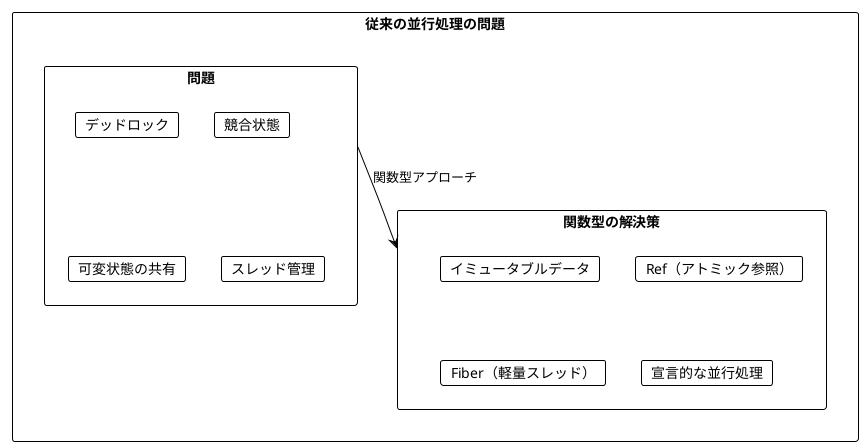
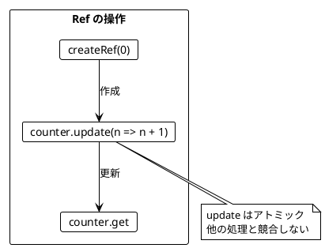
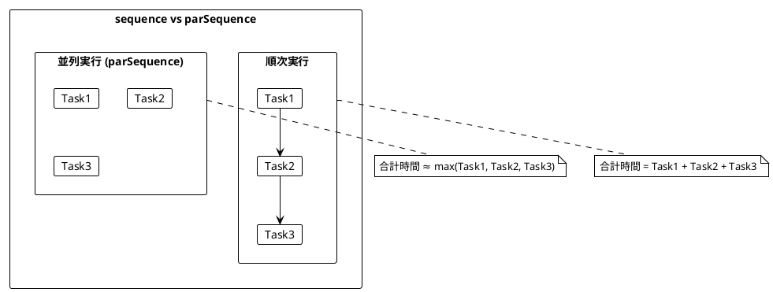
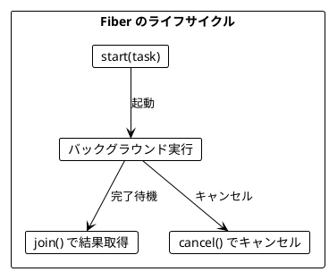
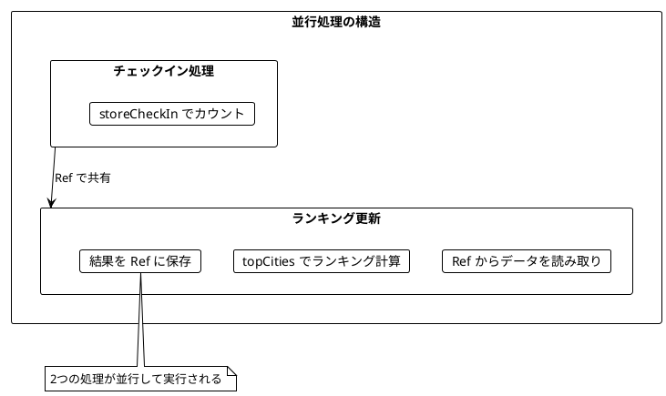
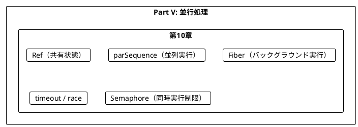
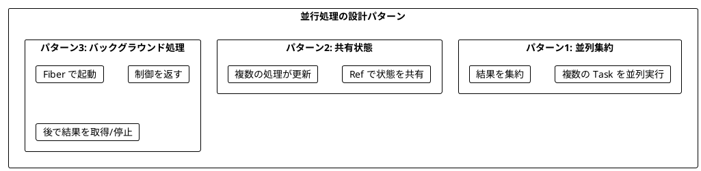

# Part V: 並行処理

本章では、関数型プログラミングにおける並行処理を学びます。Ref による安全な共有状態管理、並列実行パターン、そして Fiber によるバックグラウンド処理の構築方法を習得します。

---

## 第10章: 並行・並列処理

### 10.1 並行処理の課題

従来の並行処理には多くの課題があります:

- デッドロック
- 競合状態（Race Condition）
- 共有状態の管理の複雑さ
- スレッドのオーバーヘッド



### 10.2 Ref - アトミックな共有状態

**ソースファイル**: `app/typescript/src/ch10_concurrent.ts`

**Ref** は、複数の非同期処理から安全にアクセスできる参照です。

```typescript
interface Ref<A> {
  readonly get: Task<A>           // 現在の値を取得
  readonly set: (value: A) => Task<void>  // 値を設定
  readonly update: (f: (a: A) => A) => Task<void>  // アトミックに更新
  readonly getAndUpdate: (f: (a: A) => A) => Task<A>  // 更新前の値を取得
  readonly updateAndGet: (f: (a: A) => A) => Task<A>  // 更新後の値を取得
  readonly modify: <B>(f: (a: A) => readonly [A, B]) => Task<B>  // 更新と結果
}
```

```typescript
import { createRef } from './ch10_concurrent'

// Ref の作成と使用
const counter = createRef(0)

await counter.update(n => n + 1)()  // カウンターを +1
await counter.update(n => n + 1)()  // カウンターを +1
await counter.update(n => n + 1)()  // カウンターを +1

const result = await counter.get()  // 3
```



#### Ref の主要メソッド

| メソッド | 説明 | 例 |
|----------|------|-----|
| `createRef(initial)` | 初期値で Ref を作成 | `createRef(0)` |
| `ref.get` | 現在の値を取得 | `counter.get()` |
| `ref.set(value)` | 値を設定 | `counter.set(10)()` |
| `ref.update(f)` | アトミックに更新 | `counter.update(n => n + 1)()` |
| `ref.modify(f)` | 更新して結果を返す | `counter.modify(n => [n + 1, n])()` |

### 10.3 parSequence - 並列実行

`parSequence` は複数の Task を並列実行します。

```typescript
import { parSequence, delay } from './ch10_concurrent'
import * as T from 'fp-ts/Task'

// 順次実行の場合（合計 3 秒）
const sequential = await delay(1000, 1)()
                  .then(() => delay(1000, 2)())
                  .then(() => delay(1000, 3)())

// 並列実行の場合（合計 約1 秒）
const parallel = await parSequence([
  delay(1000, 1),
  delay(1000, 2),
  delay(1000, 3)
])()  // => [1, 2, 3]
```



#### parTraverse - 配列を並列処理

```typescript
import { parTraverse } from './ch10_concurrent'

// 各要素に対して Task を適用し、並列実行
const result = await parTraverse(
  [1, 2, 3],
  n => T.of(n * 2)
)()  // => [2, 4, 6]
```

### 10.4 遅延とスリープ

```typescript
import { delay, sleep, after } from './ch10_concurrent'

// 指定ミリ秒後に値を返す
const delayedValue = await delay(1000, 42)()  // 1秒後に 42

// 指定ミリ秒スリープ
await sleep(1000)()  // 1秒スリープ

// 指定ミリ秒後に Task を実行
const afterResult = await after(1000, T.of(42))()  // 1秒後に 42
```

### 10.5 Fiber - 軽量スレッドのシミュレーション

**Fiber** はバックグラウンドで実行される計算を表します。

```typescript
interface Fiber<A> {
  readonly join: Task<A>           // 結果を待機して取得
  readonly cancel: Task<void>      // 実行をキャンセル
  readonly isCancelled: IO<boolean>  // キャンセル状態を確認
}
```

```typescript
import { start, delay } from './ch10_concurrent'

// Fiber を起動
const fiber = start(delay(1000, 42))

// バックグラウンドで実行中...

// 結果を待機
const result = await fiber.join()  // 42

// または、キャンセル
await fiber.cancel()
```



### 10.6 永続的な実行

#### repeatN - 指定回数繰り返し

```typescript
import { repeatN } from './ch10_concurrent'

let count = 0
await repeatN(
  async () => { count++ },
  5
)()

console.log(count)  // 5
```

#### startForever - キャンセル可能な永続実行

```typescript
import { startForever, sleep } from './ch10_concurrent'

const { cancel, isCancelled } = startForever(
  async () => {
    console.log('tick')
    await sleep(1000)()
  }
)

// 5秒後にキャンセル
await sleep(5000)()
cancel()

console.log(isCancelled())  // true
```

### 10.7 チェックインのリアルタイム集計

より実践的な例として、都市へのチェックインをリアルタイムで集計する例を見てみましょう。

```typescript
interface City {
  readonly name: string
}

interface CityStats {
  readonly city: City
  readonly checkIns: number
}
```

#### トップ N 都市の計算（純粋関数）

```typescript
import { topCities, createCity } from './ch10_concurrent'

const map = new Map([
  ['Tokyo', 100],
  ['Osaka', 50],
  ['Kyoto', 30],
  ['Yokohama', 80],
])

const top3 = topCities(map, 3)
// [
//   { city: { name: 'Tokyo' }, checkIns: 100 },
//   { city: { name: 'Yokohama' }, checkIns: 80 },
//   { city: { name: 'Osaka' }, checkIns: 50 }
// ]
```

#### チェックインの保存

```typescript
import { createRef, storeCheckIn, createCity } from './ch10_concurrent'

const storedCheckIns = createRef<ReadonlyMap<string, number>>(new Map())
const tokyo = createCity('Tokyo')

await storeCheckIn(storedCheckIns)(tokyo)()
await storeCheckIn(storedCheckIns)(tokyo)()
await storeCheckIn(storedCheckIns)(tokyo)()

const map = await storedCheckIns.get()
console.log(map.get('Tokyo'))  // 3
```

#### バックグラウンドでの処理

```typescript
import { startProcessingCheckIns } from './ch10_concurrent'

// 処理を開始（バックグラウンドでランキングを更新）
const processing = startProcessingCheckIns(3)

// 現在のランキングを取得
const ranking = await processing.currentRanking()

// 処理を停止
processing.stop()
```



### 10.8 並列サイコロ

```typescript
import { castDiceParallel, castDiceParallelSum } from './ch10_concurrent'

// 5個のサイコロを並列に振る
const results = await castDiceParallel(5)()
// => [3, 1, 6, 2, 4] (ランダム)

// 合計を計算
const sum = await castDiceParallelSum(3)()
// => 12 (3-18 のランダム)
```

### 10.9 タイムアウトと競争

#### timeout - タイムアウト設定

```typescript
import { timeout, delay } from './ch10_concurrent'
import * as O from 'fp-ts/Option'

// タイムアウト前に完了
const success = await timeout(delay(10, 42), 100)()
// => some(42)

// タイムアウト
const timedOut = await timeout(delay(100, 42), 10)()
// => none
```

#### race - 最初に完了した方を採用

```typescript
import { race, raceTwo, delay } from './ch10_concurrent'

const result = await raceTwo(
  delay(100, 'slow'),
  delay(10, 'fast')
)()
// => 'fast'
```

### 10.10 並列 Map/Reduce

```typescript
import { parMapReduce, parFilter } from './ch10_concurrent'
import * as T from 'fp-ts/Task'

// 並列に処理して結果を集約
const sum = await parMapReduce(
  [1, 2, 3, 4, 5],
  n => T.of(n * 2),
  0,
  (a, b) => a + b
)()  // => 30

// 並列にフィルタリング
const evens = await parFilter(
  [1, 2, 3, 4, 5],
  n => T.of(n % 2 === 0)
)()  // => [2, 4]
```

### 10.11 Semaphore - 同時実行数の制限

```typescript
import { createSemaphore, parSequenceN, sleep } from './ch10_concurrent'

// 同時に2つまで実行
const sem = createSemaphore(2)

const task = async () => {
  // 重い処理
  await sleep(100)()
}

// セマフォで制御
await Promise.all([
  sem.withPermit(task)(),
  sem.withPermit(task)(),
  sem.withPermit(task)(),  // 前の2つのいずれかが終わるまで待機
])

// または parSequenceN を使用
const tasks = Array.from({ length: 10 }, () => task)
await parSequenceN(tasks, 3)()  // 同時に3つまで実行
```

---

## まとめ

### Part V で学んだこと



### 主要コンポーネント

| コンポーネント | 用途 |
|----------------|------|
| `Ref<A>` | スレッドセーフな共有状態 |
| `parSequence` | Task のリストを並列実行 |
| `Fiber` | バックグラウンド実行単位 |
| `start` | Fiber をバックグラウンドで起動 |
| `timeout` | Task にタイムアウトを設定 |
| `Semaphore` | 同時実行数を制限 |

### キーポイント

1. **Ref**: 複数の非同期処理から安全にアクセスできる参照
2. **parSequence**: Task のリストを並列実行して結果を集約
3. **Fiber**: バックグラウンドで実行し、後で結果を取得またはキャンセル
4. **timeout**: 一定時間内に完了しない場合は諦める
5. **Semaphore**: 同時実行数を制限してリソースを保護

### 設計パターン



### 次のステップ

Part VI では、以下のトピックを学びます:

- 実践的なアプリケーション構築
- 外部 API との連携
- テスト戦略

---

## 演習問題

### 問題 1: Ref の基本

以下のプログラムを実装してください。カウンターを 0 から始めて、3回インクリメントした結果を返します。

```typescript
const incrementThreeTimes = (): Task<number> => ???

// 期待される動作
await incrementThreeTimes()()  // 3
```

<details>
<summary>解答</summary>

```typescript
import { createRef } from './ch10_concurrent'
import * as T from 'fp-ts/Task'

const incrementThreeTimes = (): T.Task<number> => async () => {
  const counter = createRef(0)
  await counter.update(n => n + 1)()
  await counter.update(n => n + 1)()
  await counter.update(n => n + 1)()
  return counter.get()
}
```

</details>

### 問題 2: 並列実行

以下のプログラムを実装してください。3つの Task を並列実行し、結果の合計を返します。

```typescript
const sumParallel = (
  task1: Task<number>,
  task2: Task<number>,
  task3: Task<number>
): Task<number> => ???

// 期待される動作
await sumParallel(T.of(1), T.of(2), T.of(3))()  // 6
```

<details>
<summary>解答</summary>

```typescript
import { parSequence } from './ch10_concurrent'
import { pipe } from 'fp-ts/function'
import * as T from 'fp-ts/Task'

const sumParallel = (
  task1: T.Task<number>,
  task2: T.Task<number>,
  task3: T.Task<number>
): T.Task<number> =>
  pipe(
    parSequence([task1, task2, task3]),
    T.map(results => results.reduce((a, b) => a + b, 0))
  )
```

</details>

### 問題 3: タイムアウト付き実行

以下のプログラムを実装してください。指定時間後にキャンセルし、それまでに蓄積された結果を返します。

```typescript
const collectFor = (durationMs: number): Task<readonly number[]> => ???

// 期待される動作
// 100ms間、ランダムな数を収集
await collectFor(100)()  // [random numbers...]
```

<details>
<summary>解答</summary>

```typescript
import { createRef, sleep, startForever } from './ch10_concurrent'
import * as T from 'fp-ts/Task'

const collectFor = (durationMs: number): T.Task<readonly number[]> => async () => {
  const collected = createRef<readonly number[]>([])

  const { cancel } = startForever(async () => {
    await collected.update(arr => [...arr, Math.random()])()
    await sleep(10)()
  })

  await sleep(durationMs)()
  cancel()

  return collected.get()
}
```

</details>

### 問題 4: 並行カウント

以下のプログラムを実装してください。複数の Task を並行実行し、そのうち偶数を返した回数をカウントします。

```typescript
const countEvens = (tasks: readonly Task<number>[]): Task<number> => ???

// 使用例
const tasks = Array.from({ length: 100 }, () =>
  T.of(Math.floor(Math.random() * 10))
)
await countEvens(tasks)()  // 約50（ランダム）
```

<details>
<summary>解答</summary>

```typescript
import { createRef, parSequence } from './ch10_concurrent'
import * as T from 'fp-ts/Task'

const countEvens = (tasks: readonly T.Task<number>[]): T.Task<number> => async () => {
  const counter = createRef(0)

  await parSequence(
    tasks.map(task => async () => {
      const n = await task()
      if (n % 2 === 0) {
        await counter.update(c => c + 1)()
      }
    })
  )()

  return counter.get()
}
```

</details>

### 問題 5: 並行マップ更新

以下のプログラムを実装してください。複数の更新を並行して Map に適用し、最終的な Map を返します。

```typescript
interface Update {
  readonly key: string
  readonly value: number
}

const applyUpdates = (
  updates: readonly Update[]
): Task<ReadonlyMap<string, number>> => ???

// 期待される動作
const updates = [
  { key: 'a', value: 1 },
  { key: 'b', value: 2 },
  { key: 'a', value: 3 },  // "a" を上書き
  { key: 'c', value: 4 }
]
await applyUpdates(updates)()  // Map { 'a' => 3, 'b' => 2, 'c' => 4 }
```

<details>
<summary>解答</summary>

```typescript
import { createRef, parSequence } from './ch10_concurrent'
import * as T from 'fp-ts/Task'

interface Update {
  readonly key: string
  readonly value: number
}

const applyUpdates = (
  updates: readonly Update[]
): T.Task<ReadonlyMap<string, number>> => async () => {
  const mapRef = createRef<ReadonlyMap<string, number>>(new Map())

  await parSequence(
    updates.map(update =>
      mapRef.update(map => new Map([...map, [update.key, update.value]]))
    )
  )()

  return mapRef.get()
}
```

注意: 並行実行なので、同じキーへの複数の更新がある場合、最終的な値は実行順序に依存します。

</details>
