# Part VI: 実践的なアプリケーション構築とテスト

本章では、これまで学んだ関数型プログラミングの概念を統合し、実践的なアプリケーションを構築します。また、関数型プログラミングにおけるテスト戦略についても学びます。

---

## 第11章: 実践的なアプリケーション構築

### 11.1 TravelGuide アプリケーション

旅行ガイドアプリケーションを例に、実践的な FP アプリケーションの構築方法を学びます。

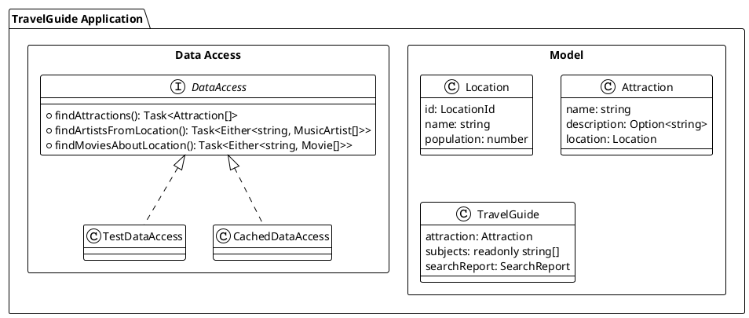

### 11.2 ドメインモデルの定義

**ソースファイル**: `app/typescript/src/ch11_application.ts`

#### ブランド型による型安全性

```typescript
// LocationId - ブランド型で型安全な識別子
type LocationId = string & { readonly _brand: unique symbol }

const LocationId = {
  of: (value: string): LocationId => value as LocationId,
  value: (id: LocationId): string => id,
}
```

```typescript
// ロケーション
interface Location {
  readonly id: LocationId
  readonly name: string
  readonly population: number
}

// アトラクション（観光地）
interface Attraction {
  readonly name: string
  readonly description: Option<string>
  readonly location: Location
}

// 旅行ガイド
interface TravelGuide {
  readonly attraction: Attraction
  readonly subjects: readonly string[]
  readonly searchReport: SearchReport
}
```

```typescript
import { createLocation, createAttraction, LocationId } from './ch11_application'
import * as O from 'fp-ts/Option'

// ロケーションの作成
const paris = createLocation('Q90', 'Paris', 2161000)

// アトラクションの作成
const eiffelTower = createAttraction(
  'Eiffel Tower',
  O.some('Iconic iron lattice tower on the Champ de Mars'),
  paris
)
```

### 11.3 SearchReport - 可観測性のための構造

テスト可能性と可観測性を高めるため、`SearchReport` を導入します。

```typescript
interface SearchReport {
  readonly attractionsSearched: number
  readonly artistsFound: number
  readonly moviesFound: number
  readonly errors: readonly string[]
}
```

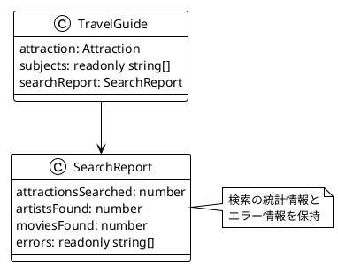

```typescript
import { createSearchReport, combineSearchReports, emptySearchReport } from './ch11_application'

// 空のレポート
const empty = emptySearchReport
// { attractionsSearched: 0, artistsFound: 0, moviesFound: 0, errors: [] }

// レポートの作成
const report1 = createSearchReport(3, 2, 1, ['Error A'])
const report2 = createSearchReport(2, 1, 1, ['Error B'])

// レポートの合成
const combined = combineSearchReports(report1, report2)
// { attractionsSearched: 5, artistsFound: 3, moviesFound: 2, errors: ['Error A', 'Error B'] }
```

### 11.4 DataAccess インターフェース

外部データソースへのアクセスをインターフェースで抽象化します。

```typescript
interface DataAccess {
  readonly findAttractions: (
    name: string,
    ordering: AttractionOrdering,
    limit: number
  ) => Task<readonly Attraction[]>

  readonly findArtistsFromLocation: (
    locationId: LocationId,
    limit: number
  ) => Task<Either<string, readonly MusicArtist[]>>

  readonly findMoviesAboutLocation: (
    locationId: LocationId,
    limit: number
  ) => Task<Either<string, readonly Movie[]>>

  readonly findHotelsNearLocation: (
    locationId: LocationId,
    limit: number
  ) => Task<Either<string, readonly Hotel[]>>
}
```

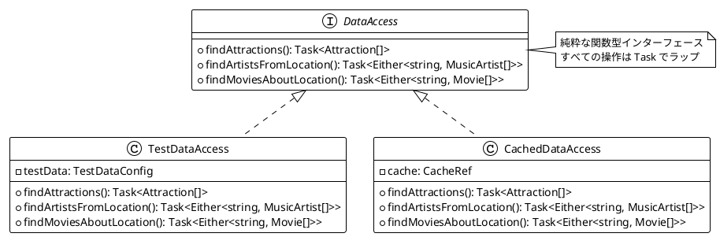

### 11.5 Resource パターン

リソースの安全な取得と解放を保証する Resource パターン:

```typescript
interface Resource<A> {
  readonly use: <B>(f: (a: A) => Task<B>) => Task<B>
}

const makeResource = <A>(
  acquire: Task<A>,
  release: (a: A) => Task<void>
): Resource<A>
```

```typescript
import { makeResource, bracket } from './ch11_application'

// ファイルリソースの例
const fileResource = makeResource(
  () => Promise.resolve({ content: 'file data' }),
  (file) => () => {
    console.log('File released')
    return Promise.resolve()
  }
)

// use 内で例外が発生しても release は必ず呼ばれる
const result = await fileResource.use((file) => () =>
  Promise.resolve(file.content.toUpperCase())
)()

// bracket パターン
const bracketResult = await bracket(
  () => Promise.resolve('resource'),
  (r) => () => Promise.resolve(r + '-used'),
  () => () => Promise.resolve()
)()
```

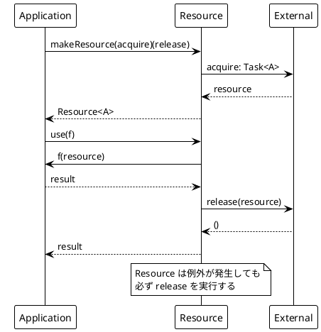

### 11.6 CacheRef - Ref を使ったキャッシュ

`CacheRef` は Ref を使用したスレッドセーフなキャッシュの実装です:

```typescript
interface CacheRef<K, V> {
  readonly get: (key: K) => Task<Option<V>>
  readonly set: (key: K, value: V) => Task<void>
  readonly getOrCompute: (key: K, compute: Task<V>) => Task<V>
  readonly clear: () => Task<void>
  readonly size: () => Task<number>
}
```

```typescript
import { createCacheRef } from './ch11_application'

// キャッシュの作成
const cache = createCacheRef<string, number>()

// 値の設定と取得
await cache.set('key1', 100)()
const value = await cache.get('key1')()  // some(100)

// getOrCompute: キャッシュにあれば返し、なければ計算してキャッシュ
const computed = await cache.getOrCompute(
  'key2',
  async () => {
    console.log('Computing...')
    return 42
  }
)()

// 2回目の呼び出しでは 'Computing...' は出力されない
const cached = await cache.getOrCompute('key2', async () => 999)()
// cached === 42 (キャッシュから取得)
```

#### cachedDataAccess - DataAccess のキャッシュ化

```typescript
import { cachedDataAccess, createTestDataAccess } from './ch11_application'

const dataAccess = createTestDataAccess({ attractions: [...] })

// キャッシュ付き DataAccess を作成
const cached = await cachedDataAccess(dataAccess)()

// 同じクエリは1回だけ実行される
await cached.findAttractions('Eiffel', ByLocationPopulation, 1)()
await cached.findAttractions('Eiffel', ByLocationPopulation, 1)()  // キャッシュから
```

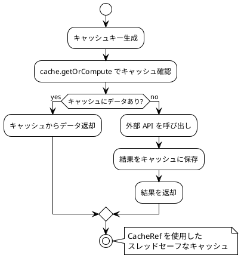

### 11.7 アプリケーションの組み立て

すべてのコンポーネントを組み合わせてアプリケーションを構築します。

```typescript
import { travelGuide, travelGuides, sampleDataAccess } from './ch11_application'
import * as O from 'fp-ts/Option'

// 単一のガイドを取得
const guide = await travelGuide(sampleDataAccess, 'Eiffel')()

if (O.isSome(guide)) {
  console.log(guide.value.attraction.name)  // 'Eiffel Tower'
  console.log(guide.value.subjects)          // ['Édith Piaf', 'Midnight in Paris', ...]
  console.log(guide.value.searchReport)      // { attractionsSearched: 1, ... }
}

// 複数のガイドを取得
const guides = await travelGuides(sampleDataAccess, '', 3)()
console.log(guides.length)  // 3
```

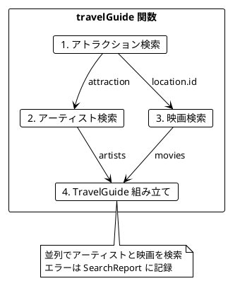

---

## 第12章: テスト戦略

### 12.1 関数型プログラミングのテスト

関数型プログラミングでは、純粋関数のおかげでテストが非常に簡単になります。

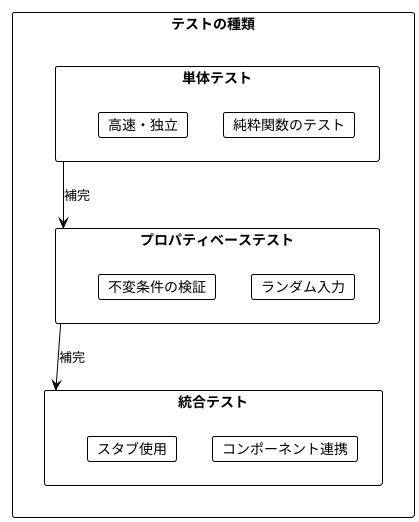

### 12.2 スタブを使用したテスト

**ソースファイル**: `app/typescript/src/ch11_application.ts`

```typescript
import { createTestDataAccess, travelGuide, sampleAttraction1, sampleArtist1, sampleMovie1 } from './ch11_application'
import * as O from 'fp-ts/Option'

// テスト用のスタブ実装
const testDataAccess = createTestDataAccess({
  attractions: [sampleAttraction1],
  artists: [sampleArtist1],
  movies: [sampleMovie1],
})

// テスト実行
const result = await travelGuide(testDataAccess, 'Eiffel')()

expect(O.isSome(result)).toBe(true)
if (O.isSome(result)) {
  expect(result.value.attraction.name).toBe('Eiffel Tower')
  expect(result.value.subjects.length).toBe(2)
  expect(result.value.searchReport.errors.length).toBe(0)
}
```

#### エラーケースのテスト

```typescript
// エラーを返すスタブ
const failingDataAccess = createTestDataAccess({
  attractions: [sampleAttraction1],
  artistsError: 'Network error',
  moviesError: 'Timeout',
})

const result = await travelGuide(failingDataAccess, 'Eiffel')()

expect(O.isSome(result)).toBe(true)
if (O.isSome(result)) {
  expect(result.value.searchReport.errors.length).toBe(2)
  expect(result.value.subjects.length).toBe(0)  // エラーでもクラッシュしない
}
```

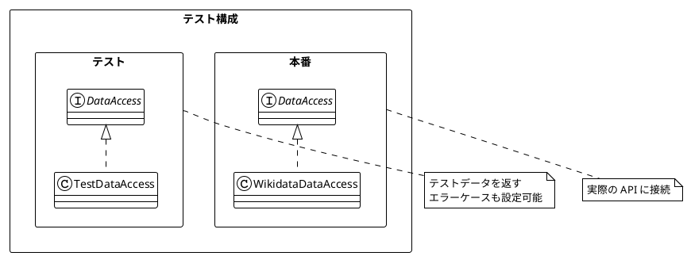

### 12.3 プロパティベーステスト

プロパティベーステストでは、ランダムな入力で不変条件を検証します。

```typescript
import { Gen, forAll, forAll2, filterPopularLocations } from './ch11_application'

// ジェネレータの使用
const locationGen = Gen.location()
const location = locationGen()  // ランダムな Location を生成

// プロパティテスト: 結果のサイズは入力以下
const property1 = forAll2(
  Gen.list(Gen.location(), 20),
  Gen.posInt(10000000),
  (locations, minPop) =>
    filterPopularLocations(locations, minPop).length <= locations.length
)
expect(property1).toBe(true)

// プロパティテスト: 結果はすべて条件を満たす
const property2 = forAll2(
  Gen.list(Gen.location(), 20),
  Gen.posInt(10000000),
  (locations, minPop) =>
    filterPopularLocations(locations, minPop).every(
      l => l.population >= minPop
    )
)
expect(property2).toBe(true)
```

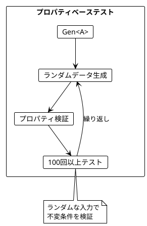

#### 提供されているジェネレータ

| ジェネレータ | 説明 | 例 |
|--------------|------|-----|
| `Gen.int(min, max)` | 範囲内の整数 | `Gen.int(1, 10)` |
| `Gen.posInt(max)` | 正の整数 | `Gen.posInt(1000)` |
| `Gen.alphaNumStr(maxLen)` | 英数字文字列 | `Gen.alphaNumStr(10)` |
| `Gen.option(gen)` | Option でラップ | `Gen.option(Gen.int(1, 10))` |
| `Gen.list(gen, maxSize)` | 配列を生成 | `Gen.list(Gen.int(1, 10), 5)` |
| `Gen.location()` | Location を生成 | `Gen.location()` |
| `Gen.attraction()` | Attraction を生成 | `Gen.attraction()` |

### 12.4 バリデーション

関数型プログラミングでは、バリデーションも Either を使って表現します。

```typescript
import { validateAttractionName, validateLimit, validatePopulation, validateRating } from './ch11_application'
import * as E from 'fp-ts/Either'

// 成功ケース
expect(validateAttractionName('Eiffel Tower')).toEqual(E.right('Eiffel Tower'))
expect(validateLimit(10)).toEqual(E.right(10))
expect(validatePopulation(1000000)).toEqual(E.right(1000000))
expect(validateRating(4.5)).toEqual(E.right(4.5))

// 失敗ケース
expect(E.isLeft(validateAttractionName(''))).toBe(true)
expect(E.isLeft(validateLimit(0))).toBe(true)
expect(E.isLeft(validatePopulation(-1))).toBe(true)
expect(E.isLeft(validateRating(6))).toBe(true)
```

### 12.5 Location フィルタリング

純粋関数で Location をフィルタリング・ソート:

```typescript
import {
  filterPopularLocations,
  sortLocationsByPopulation,
  topPopularLocations,
  sampleLocation1,
  sampleLocation2,
  sampleLocation3,
} from './ch11_application'

const locations = [sampleLocation1, sampleLocation2, sampleLocation3]

// 人口でフィルタリング
const popular = filterPopularLocations(locations, 5000000)
// London, New York City (Paris は人口が少ないため除外)

// 人口でソート
const sorted = sortLocationsByPopulation(locations)
// [London, New York City, Paris]

// トップ N を取得
const top2 = topPopularLocations(locations, 2)
// [London, New York City]
```

### 12.6 テストピラミッド

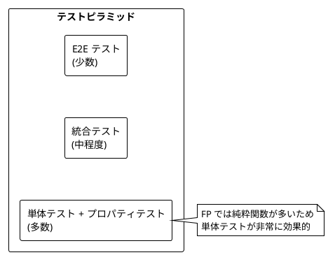

---

## まとめ

### Part VI で学んだこと

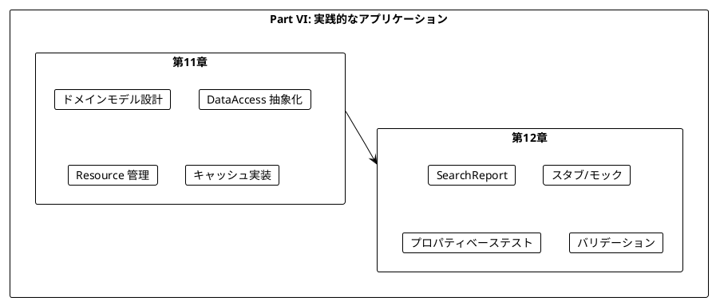

### 主要コンポーネント

| コンポーネント | 用途 |
|----------------|------|
| `LocationId` | ブランド型による型安全な識別子 |
| `DataAccess` | 外部データソースへの抽象化インターフェース |
| `Resource<A>` | リソースの安全な取得と解放 |
| `CacheRef<K, V>` | スレッドセーフなキャッシュ |
| `SearchReport` | 検索統計とエラー追跡 |
| `Gen` | プロパティベーステスト用ジェネレータ |

### キーポイント

1. **抽象化の重要性**: DataAccess インターフェースで外部依存を抽象化
2. **Resource でリソース管理**: 安全なリソースの取得と解放
3. **CacheRef でキャッシュ**: スレッドセーフな状態管理
4. **Either でエラー処理**: 明示的なエラーハンドリング
5. **SearchReport**: テスト可能性と可観測性の向上
6. **スタブ**: 外部依存を差し替えてテスト
7. **プロパティベーステスト**: ランダム入力で不変条件を検証

### 学習の総括

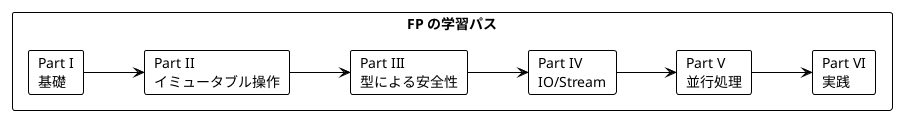

---

## 演習問題

### 問題 1: DataAccess の拡張

以下の要件で `DataAccess` を拡張してください:
- 新しいメソッド `findRestaurantsNearLocation` を追加
- 戻り値は `Task<Either<string, readonly Restaurant[]>>`

<details>
<summary>解答</summary>

```typescript
interface Restaurant {
  readonly name: string
  readonly cuisine: string
  readonly rating: number
}

interface ExtendedDataAccess extends DataAccess {
  readonly findRestaurantsNearLocation: (
    locationId: LocationId,
    limit: number
  ) => Task<Either<string, readonly Restaurant[]>>
}

// テスト用スタブ
const createExtendedTestDataAccess = (
  config: TestDataConfig & { restaurants?: readonly Restaurant[] }
): ExtendedDataAccess => {
  const base = createTestDataAccess(config)
  return {
    ...base,
    findRestaurantsNearLocation: (_locationId, limit) => async () =>
      E.right((config.restaurants ?? []).slice(0, limit)),
  }
}
```

</details>

### 問題 2: プロパティベーステスト

以下の関数に対するプロパティベーステストを書いてください:

```typescript
const sortByRating = (hotels: readonly Hotel[]): readonly Hotel[] =>
  [...hotels].sort((a, b) => b.rating - a.rating)
```

<details>
<summary>解答</summary>

```typescript
import { Gen, forAll } from './ch11_application'

const hotelGen: Generator<Hotel> = () => ({
  name: Gen.alphaNumStr(20)(),
  rating: Math.random() * 5,
  location: Gen.location()(),
})

// プロパティ1: 結果のサイズは入力と同じ
const property1 = forAll(Gen.list(hotelGen, 20), (hotels) =>
  sortByRating(hotels).length === hotels.length
)

// プロパティ2: 結果は降順にソートされている
const property2 = forAll(Gen.list(hotelGen, 20), (hotels) => {
  const sorted = sortByRating(hotels)
  for (let i = 0; i < sorted.length - 1; i++) {
    if (sorted[i].rating < sorted[i + 1].rating) return false
  }
  return true
})

// プロパティ3: 入力の要素がすべて結果に含まれる
const property3 = forAll(Gen.list(hotelGen, 20), (hotels) => {
  const sorted = sortByRating(hotels)
  return hotels.every((h) =>
    sorted.some((s) => s.name === h.name && s.rating === h.rating)
  )
})
```

</details>

### 問題 3: Resource の実装

HTTP クライアントを安全に管理する `Resource` を実装してください。

<details>
<summary>解答</summary>

```typescript
interface HttpClient {
  readonly get: (url: string) => Promise<string>
  readonly close: () => Promise<void>
}

const createHttpClient = (): Promise<HttpClient> =>
  Promise.resolve({
    get: async (url: string) => `Response from ${url}`,
    close: async () => console.log('Client closed'),
  })

const httpClientResource: Resource<HttpClient> = makeResource(
  () => createHttpClient(),
  (client) => () => client.close()
)

// 使用例
const fetchData = async (url: string): Promise<string> => {
  return httpClientResource.use((client) => () => client.get(url))()
}

// テスト
const result = await fetchData('https://api.example.com/data')
// 結果取得後、client.close() が自動的に呼ばれる
```

</details>

### 問題 4: 複合バリデーション

複数のバリデーションを組み合わせて、Attraction を検証する関数を実装してください。

<details>
<summary>解答</summary>

```typescript
import * as E from 'fp-ts/Either'
import { pipe } from 'fp-ts/function'
import * as A from 'fp-ts/Apply'

interface AttractionInput {
  readonly name: string
  readonly locationName: string
  readonly population: number
}

const validateAttractionInput = (
  input: AttractionInput
): E.Either<readonly string[], Attraction> =>
  pipe(
    E.Do,
    E.bind('name', () =>
      pipe(
        validateAttractionName(input.name),
        E.mapLeft((e) => [e])
      )
    ),
    E.bind('location', () =>
      pipe(
        validatePopulation(input.population),
        E.map((pop) =>
          createLocation(
            LocationId.of(`Q${Math.random()}`),
            input.locationName,
            pop
          )
        ),
        E.mapLeft((e) => [e])
      )
    ),
    E.map(({ name, location }) =>
      createAttraction(name, O.none, location)
    )
  )

// 使用例
const validInput: AttractionInput = {
  name: 'Eiffel Tower',
  locationName: 'Paris',
  population: 2161000,
}

const result = validateAttractionInput(validInput)
// => Right(Attraction)

const invalidInput: AttractionInput = {
  name: '',
  locationName: 'Paris',
  population: -1,
}

const errorResult = validateAttractionInput(invalidInput)
// => Left(['Attraction name cannot be empty'])
```

</details>

---

## シリーズ全体の総括

本シリーズでは、「Grokking Functional Programming」の内容に沿って、関数型プログラミングの基礎から実践的なアプリケーション構築までを学びました。

### 学んだ主な概念

| Part | 章 | 主な概念 |
|------|-----|----------|
| I | 1-2 | 純粋関数、参照透過性 |
| II | 3-5 | イミュータブルデータ、高階関数、flatMap |
| III | 6-7 | Option、Either、ADT |
| IV | 8-9 | IO モナド、Stream |
| V | 10 | 並行処理、Ref、Fiber |
| VI | 11-12 | 実践アプリケーション、テスト |

### 関数型プログラミングの利点

1. **予測可能性**: 純粋関数は同じ入力に対して常に同じ出力
2. **テスト容易性**: 副作用がないためテストが簡単
3. **合成可能性**: 小さな関数を組み合わせて複雑な処理を構築
4. **並行安全性**: イミュータブルデータは競合状態を防ぐ
5. **型安全性**: Option、Either で null や例外を型で表現

### 次のステップ

- Effect などの FP ライブラリを探索
- 実際のプロジェクトで FP を適用する
- 型レベルプログラミングを学ぶ
